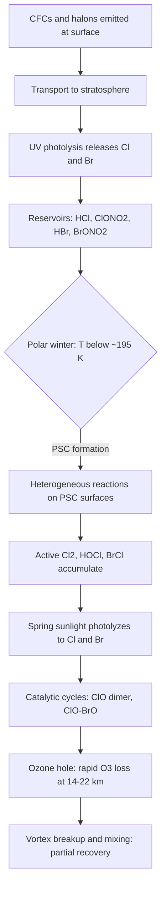

## Atmospheric Chemistry and Air Pollution

Atmospheric chemistry studies the composition of Earth's atmosphere and the chemical, photochemical, and physical processes that govern the sources, transformations, transport, and removal of trace gases and particles. Air pollution is the presence of substances in the atmosphere at concentrations that harm human health, ecosystems, materials, or climate. This reference covers atmospheric structure and composition, photochemistry and radical chemistry, stratospheric ozone, tropospheric ozone and smog, acid deposition, particulate matter, criteria and hazardous pollutants, indoor air, climate interactions, measurement techniques, modeling, and control strategies.

### 1. Structure and Composition of the Atmosphere

#### 1.1 Vertical Structure

| Layer | Approximate Altitude | Temperature Trend | Key Chemistry |
| --- | --- | --- | --- |
| Troposphere | 0-8 km (poles) to 0-18 km (tropics) | Decreases with height (~6.5 K/km) | Weather, pollution, oxidation by OH, ozone formation |
| Stratosphere | ~12-50 km | Increases with height (ozone absorbs UV) | Ozone layer, Chapman cycle, halogen chemistry |
| Mesosphere | ~50-85 km | Decreases with height | Meteor ablation, metal chemistry |
| Thermosphere | ~85-600 km | Increases with height | Ionization, atomic oxygen, auroral chemistry |
| Exosphere | >600 km | Merges with space | Atmospheric escape |

Boundaries between layers are the tropopause, stratopause, and mesopause. Altitudes vary with latitude and season.

#### 1.2 Composition of Dry Air

| Species | Approximate Mixing Ratio (dry air) |
| --- | --- |
| N₂ | 78.08% |
| O₂ | 20.95% |
| Ar | 0.93% |
| CO₂ | ~420 ppm (rising; value depends on year) |
| Ne, He, CH₄, Kr, H₂, N₂O, CO, O₃ | ppm to ppb (variable) |
| Water vapor | Highly variable, ~0.1-4% by volume |

Trace gases have outsized chemical and radiative importance despite low abundance.

#### 1.3 Concentration Units

Mixing ratios are dimensionless ratios of moles (or volume) of a species to total moles of air:

$$\text{ppm} = 10^{-6}, \quad \text{ppb} = 10^{-9}, \quad \text{ppt} = 10^{-12}$$

Conversion between mixing ratio and mass concentration at temperature $T$ and pressure $P$:

$$C\ (\mu\text{g/m}^3) = \frac{\chi \times M \times P}{R \times T} \times 10^{6}$$

where $\chi$ is the mole fraction (dimensionless), $M$ is molar mass (g/mol), $P$ is pressure (Pa), $R = 8.314\ \text{J mol}^{-1}\text{K}^{-1}$, and $T$ is temperature (K). At 298 K and 1 atm, one mole of an ideal gas occupies about 24.45 L, so:

$$C\ (\mu\text{g/m}^3) \approx \frac{M}{24.45} \times \text{ppb}$$

**Example**

Convert 50 ppb of ozone ($M = 48\ \text{g/mol}$) at 298 K and 1 atm:

$$C \approx \frac{48}{24.45} \times 50 \approx 98\ \mu\text{g/m}^3$$

#### 1.4 Atmospheric Lifetime

For a species removed by first-order processes, the lifetime is:

$$\tau = \frac{1}{k}$$

For a species in steady state with source strength $S$ and burden $B$:

$$\tau = \frac{B}{S}$$

Lifetimes determine spatial scales: short-lived species (seconds to days, e.g., OH, NO₂) are local or regional; long-lived species (years to centuries, e.g., CFCs, CO₂, N₂O) are globally mixed.

### 2. Fundamental Processes in Atmospheric Chemistry

#### 2.1 Photochemistry

A molecule absorbing a photon of energy $E = h\nu = hc/\lambda$ may dissociate if the energy exceeds the bond dissociation energy. The photolysis rate constant (photolysis frequency) is:

$$J = \int \sigma(\lambda)\, \phi(\lambda)\, F(\lambda)\, d\lambda$$

where $\sigma(\lambda)$ is the absorption cross-section, $\phi(\lambda)$ is the quantum yield of the photolysis channel, and $F(\lambda)$ is the actinic flux.

Key photolysis reactions:

$$\text{NO}_2 + h\nu\ (\lambda < 420\ \text{nm}) \rightarrow \text{NO} + \text{O}(^3P)$$

$$\text{O}_3 + h\nu\ (\lambda < 340\ \text{nm}) \rightarrow \text{O}_2 + \text{O}(^1D)$$

$$\text{HCHO} + h\nu \rightarrow \text{H} + \text{HCO}\quad \text{or}\quad \text{H}_2 + \text{CO}$$

#### 2.2 Gas-Phase Kinetics

Bimolecular rate law:

$$\frac{d[A]}{dt} = -k[A][B]$$

The temperature dependence follows the Arrhenius expression:

$$k(T) = A\, e^{-E_a/RT}$$

Termolecular (pressure-dependent) reactions, such as radical recombination, follow the Troe fall-off form, with low-pressure and high-pressure limiting rate constants $k_0[M]$ and $k_\infty$:

$$k = \frac{k_0[M]\,k_\infty}{k_0[M] + k_\infty}\, F_c^{\left\{1 + \left[\log_{10}\left(k_0[M]/k_\infty\right)\right]^2\right\}^{-1}}$$

where $F_c$ is the broadening factor.

#### 2.3 The Hydroxyl Radical (OH), the "Detergent" of the Atmosphere

OH initiates the oxidation of most reduced trace gases (CO, CH₄, VOCs, SO₂, NO₂). Its primary source in the troposphere:

$$\text{O}_3 + h\nu \rightarrow \text{O}_2 + \text{O}(^1D)$$

$$\text{O}(^1D) + \text{H}_2\text{O} \rightarrow 2\,\text{OH}$$

Global mean daytime OH concentrations are on the order of $10^{6}$ molecules cm⁻³, with a lifetime of about one second. OH is regenerated in HOx cycling (e.g., HO₂ + NO → OH + NO₂).

Key OH sinks and reactions:

$$\text{OH} + \text{CO} \rightarrow \text{H} + \text{CO}_2 \quad (\text{then H} + \text{O}_2 + M \rightarrow \text{HO}_2 + M)$$

$$\text{OH} + \text{CH}_4 \rightarrow \text{CH}_3 + \text{H}_2\text{O}$$

$$\text{OH} + \text{NO}_2 + M \rightarrow \text{HNO}_3 + M$$

#### 2.4 Other Oxidants

- **Ozone (O₃):** important oxidant, especially toward alkenes.
- **Nitrate radical (NO₃):** dominant nighttime oxidant, formed by $\text{NO}_2 + \text{O}_3 \rightarrow \text{NO}_3 + \text{O}_2$.
- **Halogen atoms (Cl, Br) and their oxides:** significant in the marine boundary layer, polar regions, and the stratosphere.
- **Criegee intermediates:** produced by ozonolysis of alkenes; can oxidize SO₂ and NO₂.

### 3. Stratospheric Ozone Chemistry

#### 3.1 The Chapman Mechanism (1930)

$$\text{O}_2 + h\nu\ (\lambda < 242\ \text{nm}) \rightarrow 2\,\text{O}$$

$$\text{O} + \text{O}_2 + M \rightarrow \text{O}_3 + M$$

$$\text{O}_3 + h\nu\ (\lambda < 320\ \text{nm, main UV-B/UV-C band}) \rightarrow \text{O}_2 + \text{O}$$

$$\text{O} + \text{O}_3 \rightarrow 2\,\text{O}_2$$

The Chapman mechanism alone overpredicts stratospheric ozone; catalytic cycles involving NOx, HOx, ClOx, and BrOx account for the remainder of the loss.

#### 3.2 Catalytic Ozone Destruction

General form, with catalyst X (X = NO, OH, Cl, Br):

$$\text{X} + \text{O}_3 \rightarrow \text{XO} + \text{O}_2$$

$$\text{XO} + \text{O} \rightarrow \text{X} + \text{O}_2$$

$$\text{Net: O} + \text{O}_3 \rightarrow 2\,\text{O}_2$$

**Chlorine cycle** (from chlorofluorocarbons and other halocarbons):

$$\text{CFCl}_3 + h\nu \rightarrow \text{CFCl}_2 + \text{Cl}$$

$$\text{Cl} + \text{O}_3 \rightarrow \text{ClO} + \text{O}_2$$

$$\text{ClO} + \text{O} \rightarrow \text{Cl} + \text{O}_2$$

A single chlorine atom can destroy on the order of $10^{4}$-$10^{5}$ ozone molecules before removal into a reservoir species. [Inference] This chain length is an estimate that varies with altitude and conditions.

**Reservoir species** temporarily sequester active halogens:

$$\text{ClO} + \text{NO}_2 + M \rightarrow \text{ClONO}_2 + M$$

$$\text{Cl} + \text{CH}_4 \rightarrow \text{HCl} + \text{CH}_3$$

#### 3.3 Polar Ozone Depletion (The Antarctic Ozone Hole)

Key ingredients:

1. **Polar vortex:** isolates cold air over the polar winter and spring.
2. **Polar stratospheric clouds (PSCs):** form below about 195 K (Type I: nitric acid trihydrate or supercooled ternary solutions; Type II: water ice) and provide surfaces for heterogeneous reactions.
3. **Heterogeneous conversion of reservoirs to active chlorine:**

$$\text{ClONO}_2 + \text{HCl} \xrightarrow{\text{PSC surface}} \text{Cl}_2 + \text{HNO}_3$$

$$\text{ClONO}_2 + \text{H}_2\text{O} \xrightarrow{\text{PSC surface}} \text{HOCl} + \text{HNO}_3$$

4. **Denitrification and dehydration:** sedimentation of PSC particles removes NOy, prolonging chlorine activation.
5. **Return of sunlight in spring:** photolysis of Cl₂ releases Cl atoms.

**Dominant cycles at polar vortex conditions**

ClO dimer cycle (Molina-Molina):

$$\text{ClO} + \text{ClO} + M \rightarrow \text{Cl}_2\text{O}_2 + M$$

$$\text{Cl}_2\text{O}_2 + h\nu \rightarrow \text{Cl} + \text{ClOO}$$

$$\text{ClOO} + M \rightarrow \text{Cl} + \text{O}_2 + M$$

$$2\,(\text{Cl} + \text{O}_3 \rightarrow \text{ClO} + \text{O}_2)$$

$$\text{Net: 2 O}_3 \rightarrow 3\,\text{O}_2$$

ClO-BrO cycle:

$$\text{ClO} + \text{BrO} \rightarrow \text{Cl} + \text{Br} + \text{O}_2\ (\text{or } \text{BrCl} + \text{O}_2)$$

$$\text{Cl} + \text{O}_3 \rightarrow \text{ClO} + \text{O}_2, \qquad \text{Br} + \text{O}_3 \rightarrow \text{BrO} + \text{O}_2$$

#### 3.4 Regulation: The Montreal Protocol

The Montreal Protocol (1987) and its amendments phase out ozone-depleting substances (CFCs, halons, carbon tetrachloride, methyl chloroform, HCFCs, methyl bromide). Stratospheric halogen loading has declined, and observations show early signs of ozone recovery. Full recovery of Antarctic ozone is projected around the middle of the century, subject to the influence of climate change and continued emissions compliance. The Kigali Amendment addresses hydrofluorocarbons (HFCs), which do not deplete ozone but are potent greenhouse gases.

**Ozone depletion potential (ODP)** is defined relative to CFC-11 (ODP = 1):

$$\text{ODP}_i = \frac{\text{global ozone loss per unit mass emitted of } i}{\text{global ozone loss per unit mass emitted of CFC-11}}$$

**Dobson unit (DU):** the thickness (in units of 0.01 mm) of the ozone column if compressed to standard temperature and pressure. Global mean total column ozone is about 300 DU; the ozone hole is commonly defined by values below 220 DU.

### 4. Tropospheric Chemistry and Photochemical Smog

#### 4.1 Nitrogen Oxides and the Photostationary State

NO₂ photolysis, O₃ formation, and NO titration form a null cycle in the absence of VOCs:

$$\text{NO}_2 + h\nu \rightarrow \text{NO} + \text{O}(^3P)$$

$$\text{O}(^3P) + \text{O}_2 + M \rightarrow \text{O}_3 + M$$

$$\text{NO} + \text{O}_3 \rightarrow \text{NO}_2 + \text{O}_2$$

The photostationary state (Leighton) relationship:

$$[\text{O}_3] = \frac{J_{\text{NO}_2}\,[\text{NO}_2]}{k_{\text{NO+O}_3}\,[\text{NO}]}$$

This relationship describes a steady state; net ozone accumulation requires peroxy radicals (from VOC and CO oxidation) that convert NO to NO₂ without consuming ozone.

#### 4.2 Net Ozone Production

Organic peroxy radicals ($\text{RO}_2$) and hydroperoxyl ($\text{HO}_2$) oxidize NO:

$$\text{RO}_2 + \text{NO} \rightarrow \text{RO} + \text{NO}_2$$

$$\text{HO}_2 + \text{NO} \rightarrow \text{OH} + \text{NO}_2$$

Each NO₂ produced this way photolyzes to yield an ozone molecule without a corresponding ozone consumption step.

**VOC oxidation example (generic):**

$$\text{RH} + \text{OH} \rightarrow \text{R} + \text{H}_2\text{O}$$

$$\text{R} + \text{O}_2 + M \rightarrow \text{RO}_2 + M$$

$$\text{RO}_2 + \text{NO} \rightarrow \text{RO} + \text{NO}_2$$

$$\text{RO} + \text{O}_2 \rightarrow \text{R'CHO} + \text{HO}_2$$

$$\text{HO}_2 + \text{NO} \rightarrow \text{OH} + \text{NO}_2$$

The net result is conversion of a VOC and NO into a carbonyl, more NO₂, and regenerated OH, so the chain continues.

#### 4.3 NOx-Limited versus VOC-Limited Regimes

Ozone production efficiency depends on the ratio of VOC reactivity to NOx:

| Regime | Condition | Response to Emission Controls |
| --- | --- | --- |
| NOx-limited | Low NOx, high VOC (rural, biogenic-rich areas) | O₃ decreases with NOx reductions; VOC controls have little effect |
| VOC-limited (NOx-saturated) | High NOx, relatively low VOC (urban cores) | O₃ may *increase* when NOx is reduced (less NO titration and less OH scavenging by NO₂); VOC controls effective |
| Transition | Intermediate | Depends on both |

This nonlinear behavior is often illustrated with **ozone isopleth diagrams** (EKMA: Empirical Kinetic Modeling Approach), which plot peak ozone against VOC and NOx initial concentrations.

#### 4.4 Classical and Photochemical Smog

| Feature | Classical (London-type) Smog | Photochemical (Los Angeles-type) Smog |
| --- | --- | --- |
| Primary pollutants | SO₂, particulates (from coal combustion) | NOx, VOCs |
| Conditions | Cool, humid, winter, temperature inversion | Warm, sunny, stagnant |
| Nature | Reducing | Oxidizing |
| Key secondary products | Sulfuric acid, sulfates | O₃, PAN, aldehydes, secondary organic aerosol |
| Major sources | Coal and heavy-oil burning | Vehicles, industrial VOC, solvents |

#### 4.5 Peroxyacyl Nitrates (PANs)

Formed from acetyl peroxy radicals and NO₂:

$$\text{CH}_3\text{C(O)OO} + \text{NO}_2 + M \rightleftharpoons \text{CH}_3\text{C(O)OONO}_2\ (\text{PAN}) + M$$

PAN is a lachrymator and phytotoxin. Its thermal decomposition is strongly temperature dependent, so PAN acts as a reservoir that transports NOx to remote regions.

#### 4.6 Biogenic VOCs

- **Isoprene** (C₅H₈) from vegetation is the most abundant non-methane biogenic VOC, emitted in sunlight and heat.
- **Monoterpenes** (e.g., α-pinene, limonene) are important precursors of secondary organic aerosol.
- Biogenic-anthropogenic interactions (e.g., NOx enhancing ozone from isoprene; anthropogenic sulfate affecting isoprene-derived SOA formation) complicate control strategies.

#### 4.7 Nighttime Chemistry

$$\text{NO}_2 + \text{O}_3 \rightarrow \text{NO}_3 + \text{O}_2$$

$$\text{NO}_3 + \text{NO}_2 + M \rightleftharpoons \text{N}_2\text{O}_5 + M$$

$$\text{N}_2\text{O}_5 + \text{H}_2\text{O}\ (\text{aerosol surface}) \rightarrow 2\,\text{HNO}_3$$

Heterogeneous hydrolysis of N₂O₅ is a major nighttime sink of NOx and a source of particulate nitrate.

### 5. Sulfur Chemistry and Acid Deposition

#### 5.1 Sulfur Dioxide Oxidation

**Gas-phase:**

$$\text{SO}_2 + \text{OH} + M \rightarrow \text{HOSO}_2 + M$$

$$\text{HOSO}_2 + \text{O}_2 \rightarrow \text{HO}_2 + \text{SO}_3$$

$$\text{SO}_3 + \text{H}_2\text{O} \rightarrow \text{H}_2\text{SO}_4$$

**Aqueous-phase (in cloud and fog droplets)**, generally faster and dominant globally:

$$\text{SO}_2(g) \rightleftharpoons \text{SO}_2\cdot\text{H}_2\text{O} \rightleftharpoons \text{HSO}_3^- + \text{H}^+ \rightleftharpoons \text{SO}_3^{2-} + 2\text{H}^+$$

- Oxidation by H₂O₂: $\text{HSO}_3^- + \text{H}_2\text{O}_2 \rightarrow \text{SO}_4^{2-} + \text{H}^+ + \text{H}_2\text{O}$ (rate nearly independent of pH for pH below ~5).
- Oxidation by O₃: increases strongly with pH (dominates at higher pH).
- Oxidation by O₂ catalyzed by Fe(III) and Mn(II): significant in polluted, haze conditions.
- Oxidation by NO₂ at high pH: important in some haze episodes [Inference: relative contribution varies with region and conditions].

#### 5.2 Nitrogen Oxide Oxidation to Nitric Acid

$$\text{NO}_2 + \text{OH} + M \rightarrow \text{HNO}_3 + M$$

Nitric acid partitions between the gas phase and particulate nitrate, driven by ammonia availability:

$$\text{HNO}_3(g) + \text{NH}_3(g) \rightleftharpoons \text{NH}_4\text{NO}_3(s/aq)$$

#### 5.3 Acid Rain

Clean rain is naturally slightly acidic (pH about 5.6) due to dissolved CO₂:

$$\text{CO}_2 + \text{H}_2\text{O} \rightleftharpoons \text{H}^+ + \text{HCO}_3^-$$

$$[\text{H}^+] = \sqrt{K_{a1}\, K_H\, P_{\text{CO}_2}}$$

With $K_H \approx 3.4\times10^{-2}$ mol L⁻¹ atm⁻¹, $K_{a1} \approx 4.5\times10^{-7}$, and $P_{\text{CO}_2} \approx 4.2\times10^{-4}$ atm:

$$[\text{H}^+] \approx \sqrt{(4.5\times10^{-7})(3.4\times10^{-2})(4.2\times10^{-4})} \approx 2.5\times10^{-6}\ \text{M}$$

$$\text{pH} = -\log_{10}[\text{H}^+] \approx 5.6$$

Acid rain is defined as precipitation with pH below about 5.6, though definitions vary. Dominant acids are H₂SO₄ and HNO₃.

**Effects**

- Acidification of lakes and streams, mobilization of aluminum (toxic to fish).
- Leaching of base cations (Ca²⁺, Mg²⁺) from soils; forest decline in sensitive regions.
- Corrosion of metals and dissolution of carbonate stone (e.g., $\text{CaCO}_3 + \text{H}_2\text{SO}_4 \rightarrow \text{CaSO}_4 + \text{H}_2\text{O} + \text{CO}_2$).
- **Buffering capacity** (alkalinity) of the receiving system determines vulnerability; carbonate-rich soils buffer effectively, granitic terrains do not.

**Control strategies:** flue gas desulfurization (scrubbers), low-sulfur fuels, selective catalytic reduction (SCR) of NOx, and cap-and-trade programs (e.g., the U.S. Acid Rain Program).

### 6. Atmospheric Aerosols and Particulate Matter

#### 6.1 Definitions and Size Classes

| Term | Definition |
| --- | --- |
| PM₁₀ | Particles with aerodynamic diameter ≤ 10 µm |
| PM₂.₅ (fine) | Aerodynamic diameter ≤ 2.5 µm |
| PM₀.₁ (ultrafine) | Diameter ≤ 0.1 µm |
| Coarse mode | ~2.5-10 µm, mechanically generated (dust, sea salt, pollen) |

**Aerodynamic diameter** is the diameter of a unit-density sphere with the same settling velocity as the particle.

#### 6.2 Modes of the Size Distribution

- **Nucleation mode** (< ~20 nm): newly formed particles from gas-to-particle conversion.
- **Aitken mode** (~20-100 nm): growth by condensation and coagulation.
- **Accumulation mode** (~0.1-1 µm): long-lived (days to weeks), dominant for mass, light scattering, and cloud condensation nuclei.
- **Coarse mode** (> ~1-2.5 µm): short-lived; removed by sedimentation.

Size distributions are often represented by lognormal functions:

$$\frac{dN}{d\ln D_p} = \frac{N}{\sqrt{2\pi}\,\ln\sigma_g}\exp\left[-\frac{(\ln D_p - \ln D_{g})^2}{2(\ln\sigma_g)^2}\right]$$

where $D_g$ is the geometric median diameter and $\sigma_g$ is the geometric standard deviation.

#### 6.3 Sources

| Category | Examples |
| --- | --- |
| Primary natural | Sea salt, mineral dust, volcanic ash, pollen, biomass burning (wildfires) |
| Primary anthropogenic | Diesel soot (black carbon), fly ash, road dust, tire and brake wear, cooking |
| Secondary inorganic | Sulfate, nitrate, ammonium (from SO₂, NOx, NH₃) |
| Secondary organic aerosol (SOA) | Condensation of oxidized VOC products (from isoprene, terpenes, aromatics, alkanes) |

#### 6.4 Formation and Growth Processes

- **Nucleation:** homogeneous (e.g., sulfuric acid-water-ammonia-amine clusters; highly oxygenated organic molecules) and heterogeneous.
- **Condensation:** low-volatility vapors add mass to existing particles.
- **Coagulation:** collisions merge particles (important for ultrafine loss).
- **Cloud processing:** aqueous chemistry in droplets forms sulfate and SOA, and particles that survive evaporation are larger.

The Kelvin equation describes the increased equilibrium vapor pressure over a curved surface:

$$\ln\frac{p}{p_0} = \frac{4\,\sigma\, M}{R\, T\, \rho\, D_p}$$

where $\sigma$ is surface tension, $M$ is molar mass, $\rho$ is density, and $D_p$ is droplet diameter. Small particles need higher supersaturation to grow, which limits nucleation without sufficient vapor concentrations.

#### 6.5 Health Effects

Fine particles penetrate deep into the respiratory tract and, for the smallest fractions, may enter the bloodstream. Epidemiological associations link PM₂.₅ exposure to cardiovascular disease, respiratory disease, lung cancer, and premature mortality. Toxicity depends on composition (e.g., transition metals, PAHs, oxidative potential), not just mass. The World Health Organization's air quality guidelines (2021 update) set an annual PM₂.₅ guideline of 5 µg/m³ and a 24-hour guideline of 15 µg/m³; national standards are typically higher and vary by country.

#### 6.6 Climate Effects of Aerosols

- **Direct effect:** scattering (sulfate, nitrate, organic) cools; absorption (black carbon, brown carbon, dust) warms the atmosphere and can reduce surface radiation.
- **Indirect effects:** aerosols act as cloud condensation nuclei (CCN) and ice nuclei, altering cloud droplet number, size, albedo (Twomey effect), and lifetime (Albrecht effect).
- Aerosol radiative forcing remains the largest uncertainty in anthropogenic radiative forcing estimates.

#### 6.7 Haze and Visibility

Visibility is governed by light extinction, with the Koschmieder relation connecting visual range $L_v$ to the extinction coefficient $b_{ext}$:

$$L_v = \frac{3.912}{b_{ext}}$$

The extinction coefficient sums contributions from scattering and absorption by particles and gases:

$$b_{ext} = b_{sp} + b_{ap} + b_{sg} + b_{ag}$$

### 7. Criteria Pollutants and Hazardous Air Pollutants

#### 7.1 Criteria Air Pollutants (US EPA framework)

| Pollutant | Primary Sources | Main Health / Environmental Effects |
| --- | --- | --- |
| Ozone (O₃, ground-level) | Secondary; NOx + VOC + sunlight | Respiratory irritation, reduced lung function, crop damage |
| Particulate matter (PM₁₀, PM₂.₅) | Combustion, dust, secondary formation | Cardiopulmonary disease, mortality, visibility loss |
| Carbon monoxide (CO) | Incomplete combustion (vehicles, heating) | Binds hemoglobin (carboxyhemoglobin), reduces O₂ delivery |
| Sulfur dioxide (SO₂) | Coal and oil combustion, smelting | Bronchoconstriction, acid deposition, sulfate PM |
| Nitrogen dioxide (NO₂) | Combustion (vehicles, power plants) | Airway inflammation, precursor to O₃ and PM |
| Lead (Pb) | Historic leaded gasoline, smelters, battery recycling | Neurotoxicity, developmental effects |

CO binds hemoglobin roughly 200-250 times more strongly than O₂:

$$\text{Hb} + \text{CO} \rightleftharpoons \text{HbCO}$$

#### 7.2 Air Quality Index (AQI)

An AQI converts pollutant concentrations to a dimensionless index by piecewise-linear interpolation between breakpoints:

$$I_p = \frac{I_{Hi} - I_{Lo}}{BP_{Hi} - BP_{Lo}}\,(C_p - BP_{Lo}) + I_{Lo}$$

where $C_p$ is the pollutant concentration, $BP_{Hi}$ and $BP_{Lo}$ are the concentration breakpoints bracketing $C_p$, and $I_{Hi}$ and $I_{Lo}$ are the corresponding index values. The overall AQI is the maximum of the individual pollutant indices. Breakpoint tables differ between countries and are revised periodically.

#### 7.3 Hazardous Air Pollutants (HAPs) and Persistent Organics

- **Volatile organics:** benzene (carcinogen), formaldehyde, 1,3-butadiene, toluene.
- **Polycyclic aromatic hydrocarbons (PAHs):** formed by incomplete combustion; benzo[a]pyrene is a well-known carcinogen.
- **Heavy metals:** mercury (long-range transport of Hg⁰, deposition as Hg²⁺), cadmium, arsenic.
- **Persistent organic pollutants (POPs):** dioxins, furans, PCBs, some pesticides; undergo long-range transport ("grasshopper effect") and bioaccumulate.
- **Halogenated solvents and carbonyl compounds.**

### 8. Greenhouse Gases and Radiative Forcing (Overview)

Greenhouse gases absorb infrared radiation emitted by Earth's surface and re-emit it, warming the lower atmosphere. Major long-lived greenhouse gases: CO₂, CH₄, N₂O, and halocarbons (CFCs, HCFCs, HFCs, SF₆). Tropospheric ozone and water vapor are also radiatively active.

**Radiative forcing** for CO₂ is approximately logarithmic in concentration:

$$\Delta F = 5.35\,\ln\!\left(\frac{C}{C_0}\right)\ \text{W m}^{-2}$$

**Global warming potential (GWP)** compares the integrated radiative forcing of a pulse emission of a gas to that of CO₂ over a time horizon $H$ (commonly 20 or 100 years):

$$\text{GWP}_i(H) = \frac{\int_0^H a_i\, [x_i(t)]\, dt}{\int_0^H a_{\text{CO}_2}\, [x_{\text{CO}_2}(t)]\, dt}$$

where $a$ is the radiative efficiency and $x(t)$ is the decay of the pulse. Values are revised in successive IPCC assessments; for example, methane's 100-year GWP is on the order of 27-30 in recent assessments (for fossil methane), while its 20-year value is around 80.

**Methane chemistry:** methane is removed mainly by OH, so its lifetime (~9-12 years) depends on OH concentrations, and methane oxidation influences tropospheric ozone and stratospheric water vapor. **Nitrous oxide** is chemically stable in the troposphere and is destroyed in the stratosphere, where it is also the main source of stratospheric NOx.

### 9. Indoor Air Quality

People spend the majority of their time indoors, and indoor concentrations of some pollutants exceed outdoor levels.

| Pollutant | Indoor Sources |
| --- | --- |
| Radon (²²²Rn) | Soil gas seeping through foundations (decay chain gives alpha emitters; a leading cause of lung cancer in non-smokers) |
| Formaldehyde and VOCs | Building materials, furniture, adhesives, cleaning products |
| CO and NO₂ | Unvented gas or kerosene appliances, tobacco smoke |
| PM₂.₅ | Cooking, candles, smoking, infiltration |
| Biological | Mold, dust mite allergens, bacteria, viruses |
| Ozone-initiated chemistry | Reaction of infiltrated ozone with terpenes from cleaning products forms secondary organic aerosol and formaldehyde |

The steady-state indoor concentration $C_{in}$ from a mass-balance model:

$$C_{in} = \frac{\lambda\, P\, C_{out} + S/V}{\lambda + k}$$

where $\lambda$ is the air exchange rate (h⁻¹), $P$ is the penetration factor, $C_{out}$ is the outdoor concentration, $S$ is the indoor source emission rate, $V$ is room volume, and $k$ is the indoor loss rate (deposition and removal). Ventilation and filtration (e.g., HEPA) change $\lambda$ and $k$.

### 10. Meteorology and Transport

Pollutant concentrations depend on emissions, chemistry, and dispersion.

- **Temperature inversions:** a stable layer where temperature increases with height traps pollutants near the ground (radiation inversions at night; subsidence inversions in high-pressure systems, as in Los Angeles).
- **Mixing height (boundary layer depth):** limits the volume into which pollutants disperse.
- **Atmospheric stability:** the environmental lapse rate compared to the adiabatic lapse rate (~9.8 K/km dry) determines vertical mixing.
- **Wind speed and direction:** determine transport and dilution.
- **Long-range transport:** ozone, PM, PAN, mercury, and dust cross continents and oceans over days to weeks.

The **Gaussian plume model** estimates the concentration downwind of a continuous point source at height $H$ (effective stack height), with ground reflection:

$$C(x,y,z) = \frac{Q}{2\pi\, u\, \sigma_y\, \sigma_z}\exp\!\left(-\frac{y^2}{2\sigma_y^2}\right)\left[\exp\!\left(-\frac{(z-H)^2}{2\sigma_z^2}\right)+\exp\!\left(-\frac{(z+H)^2}{2\sigma_z^2}\right)\right]$$

where $Q$ is emission rate, $u$ is mean wind speed, and $\sigma_y$, $\sigma_z$ are dispersion coefficients that depend on downwind distance $x$ and atmospheric stability class (Pasquill-Gifford categories A-F). Peak ground-level concentration occurs where the plume centerline meets the surface, and results carry substantial uncertainty in complex terrain or unsteady conditions.

**Example**

For $Q = 100\ \text{g/s}$, $u = 5\ \text{m/s}$, $H = 50\ \text{m}$, and at a location with $\sigma_y = 40\ \text{m}$, $\sigma_z = 20\ \text{m}$, the centerline ground-level ($y=0$, $z=0$) concentration is:

$$C = \frac{100}{2\pi (5)(40)(20)}\cdot 2\exp\!\left(-\frac{50^2}{2\cdot 20^2}\right)$$

$$C \approx \frac{100}{25{,}133}\times 2\times e^{-3.125} \approx 0.003979\times 2\times 0.04394 \approx 3.5\times10^{-4}\ \text{g/m}^3 = 350\ \mu\text{g/m}^3$$

### 11. Measurement Techniques

#### 11.1 Gas-Phase Measurements

| Technique | Principle | Typical Targets |
| --- | --- | --- |
| Chemiluminescence | NO + O₃ → NO₂* → light; NO₂ measured after conversion (molybdenum or photolytic) | NO, NO₂, NOy |
| UV photometry | Absorption at 254 nm (Beer-Lambert) | O₃ |
| Non-dispersive infrared (NDIR) | IR absorption | CO, CO₂ |
| UV fluorescence | SO₂ excited by UV, emits fluorescence | SO₂ |
| Gas chromatography (FID, MS) | Separation and detection of individual VOCs | VOCs, halocarbons |
| PTR-MS (proton-transfer-reaction MS) | Soft chemical ionization via H₃O⁺ | Real-time VOCs |
| Cavity ring-down spectroscopy (CRDS) | Ring-down time depends on absorption | CO₂, CH₄, N₂O, H₂O, isotopologues |
| FTIR and open-path DOAS | Long-path absorption spectroscopy | Multi-species column or path measurements |
| Laser-induced fluorescence (LIF) | Resonant fluorescence | OH, HO₂ radicals |

The Beer-Lambert law underlies absorption-based methods:

$$I = I_0\, e^{-\sigma\, n\, L}\quad\Rightarrow\quad n = \frac{1}{\sigma L}\ln\frac{I_0}{I}$$

where $\sigma$ is the absorption cross-section, $n$ is the number density, and $L$ is the path length.

#### 11.2 Particulate Measurements

- **Gravimetric filter sampling:** mass by weighing; composition by ion chromatography (ions), thermal-optical analysis (organic and elemental carbon), and ICP-MS or XRF (elements).
- **Beta attenuation and TEOM (tapered element oscillating microbalance):** continuous mass monitors.
- **Optical particle counters and low-cost sensors:** light scattering; sensitive to humidity and composition, and require calibration.
- **Scanning mobility particle sizer (SMPS):** size distribution from ~10 nm to ~1 µm.
- **Aerosol mass spectrometry (AMS):** quantitative non-refractory composition (organics, sulfate, nitrate, ammonium) with size information.
- **Aethalometer and photoacoustic soot spectrometers:** black carbon and light absorption.

#### 11.3 Remote Sensing

- **Satellite instruments** (e.g., TROPOMI, OMI, MODIS, TEMPO, MOPITT) retrieve column amounts of NO₂, SO₂, HCHO, CO, O₃, and aerosol optical depth.
- **Lidar:** profiles of aerosol backscatter and some gases.
- **Ozone sondes and Dobson/Brewer spectrophotometers:** vertical profiles and total column.
- **Surface networks:** national regulatory monitoring networks and global programs (e.g., AERONET for aerosol optical depth, NDACC for stratospheric composition).

### 12. Modeling of Atmospheric Chemistry and Air Quality

| Model Type | Description | Examples |
| --- | --- | --- |
| Box models | Zero-dimensional; detailed chemistry for a well-mixed volume | Master Chemical Mechanism (MCM) box model |
| Gaussian plume/puff | Steady-state dispersion from sources | AERMOD |
| Eulerian chemical transport models (CTMs) | 3D gridded solution of advection, diffusion, chemistry, emissions, deposition | CMAQ, CAMx, WRF-Chem |
| Global chemistry-climate models | Coupled transport, chemistry, and radiation | GEOS-Chem, CESM-WACCM, UKCA |
| Lagrangian models | Track air parcels or particles | HYSPLIT, FLEXPART |
| Receptor models | Infer source contributions from measured composition | Positive Matrix Factorization (PMF), Chemical Mass Balance (CMB) |

The continuity equation solved by chemical transport models for species $i$:

$$\frac{\partial c_i}{\partial t} = -\nabla\cdot(\mathbf{u}\,c_i) + \nabla\cdot(K\nabla c_i) + R_i(\mathbf{c},T) + E_i - D_i$$

where $\mathbf{u}$ is the wind vector, $K$ is the turbulent diffusion tensor, $R_i$ is the net chemical production rate, $E_i$ is emissions, and $D_i$ is deposition.

**Key Points**

- Chemical mechanisms range from condensed schemes (tens of species) to explicit mechanisms (thousands of species and reactions).
- Numerical stiffness (wide range of reaction timescales) requires implicit solvers (e.g., Rosenbrock, Gear).
- Model evaluation against observations, data assimilation, and ensemble approaches quantify uncertainty; results depend on emission inventories, meteorology, and chemical mechanism accuracy.

### 13. Sources and Emission Inventories

| Sector | Major Pollutants |
| --- | --- |
| Power generation | SO₂, NOx, PM, CO₂, Hg |
| Transportation | NOx, CO, VOC, PM (diesel), CO₂ |
| Industry | SO₂, NOx, VOC, PM, metals, HAPs |
| Residential (heating, cooking) | PM, CO, PAHs, black carbon |
| Agriculture | NH₃ (fertilizers, manure), CH₄, N₂O |
| Biomass burning | PM, CO, VOC, NOx, black carbon |
| Biogenic | Isoprene, monoterpenes, soil NOx |
| Natural | Volcanic SO₂, sea salt, dust, lightning NOx |

**Emission estimation** commonly uses activity data multiplied by emission factors:

$$E = A \times EF \times (1 - \eta)$$

where $A$ is activity level (e.g., fuel consumed), $EF$ is the emission factor, and $\eta$ is the control efficiency.

### 14. Control Technologies and Policy

#### 14.1 Technical Controls

| Target | Technology | Principle |
| --- | --- | --- |
| Particulates | Electrostatic precipitator (ESP), fabric filter (baghouse), cyclone, wet scrubber | Charging and collection; filtration; inertial separation |
| SO₂ | Flue gas desulfurization (wet limestone scrubber): $\text{SO}_2 + \text{CaCO}_3 + \tfrac{1}{2}\text{O}_2 + 2\text{H}_2\text{O} \rightarrow \text{CaSO}_4\cdot 2\text{H}_2\text{O} + \text{CO}_2$ | Absorption and oxidation to gypsum |
| NOx (stationary) | Selective catalytic reduction: $4\,\text{NO} + 4\,\text{NH}_3 + \text{O}_2 \rightarrow 4\,\text{N}_2 + 6\,\text{H}_2\text{O}$ | Catalytic reduction with ammonia or urea |
| NOx (combustion) | Low-NOx burners, staged combustion, flue gas recirculation | Lower peak flame temperature (limits thermal NO) |
| Vehicles | Three-way catalytic converter (Pt/Pd/Rh) | Oxidize CO and HC, reduce NOx simultaneously |
| Diesel | Diesel particulate filter (DPF), diesel oxidation catalyst, SCR with urea (AdBlue/DEF) | Filter soot; oxidize CO/HC; reduce NOx |
| VOCs | Thermal or catalytic oxidizers, carbon adsorption, condensation | Destruction or capture |
| Mercury | Activated carbon injection | Adsorption |

Thermal NO formation (Zeldovich mechanism) at combustion temperatures above ~1800 K:

$$\text{O} + \text{N}_2 \rightarrow \text{NO} + \text{N}$$

$$\text{N} + \text{O}_2 \rightarrow \text{NO} + \text{O}$$

The three-way catalyst works within a narrow air-fuel ratio window near stoichiometric ($\lambda \approx 1$):

$$2\,\text{CO} + 2\,\text{NO} \rightarrow 2\,\text{CO}_2 + \text{N}_2$$

$$\text{C}_x\text{H}_y + \left(2x + \tfrac{y}{2}\right)\text{NO} \rightarrow x\,\text{CO}_2 + \tfrac{y}{2}\,\text{H}_2\text{O} + \left(x + \tfrac{y}{4}\right)\text{N}_2$$

#### 14.2 Policy Instruments

- **Ambient air quality standards** (e.g., US National Ambient Air Quality Standards, EU Air Quality Directives, WHO guidelines).
- **Emission standards** for vehicles (e.g., Euro 1-6, Tier 3) and stationary sources.
- **Market-based approaches:** cap-and-trade, emissions trading, taxes.
- **Fuel quality regulations:** lead phase-out, sulfur reduction.
- **International agreements:** Montreal Protocol (ozone layer), Convention on Long-Range Transboundary Air Pollution (CLRTAP) and its protocols (e.g., Gothenburg Protocol), Minamata Convention (mercury), Stockholm Convention (POPs).

### 15. Illustration: Ozone Production Regimes

<svg xmlns="http://www.w3.org/2000/svg" viewBox="0 0 640 400" width="640" height="400" font-family="Arial, Helvetica, sans-serif">
<title>Ozone Isopleth Regimes, Schematic (svg_diagram)</title>
<text x="320" y="24" text-anchor="middle" font-size="16" font-weight="bold">Ozone Isopleth Regimes, Schematic (svg_diagram)</text>
<line x1="80" y1="340" x2="600" y2="340" stroke="#333" stroke-width="1.5" />
<line x1="80" y1="340" x2="80" y2="50" stroke="#333" stroke-width="1.5" />
<text x="340" y="378" text-anchor="middle" font-size="13">NOx concentration (increasing)</text>
<text x="26" y="195" text-anchor="middle" font-size="13" transform="rotate(-90 26 195)">VOC concentration (increasing)</text>
<path d="M 90 330 Q 200 300 320 250 Q 440 190 590 70" fill="none" stroke="#c0392b" stroke-width="2.5" stroke-dasharray="6,4" />
<text x="470" y="120" font-size="12" fill="#c0392b" transform="rotate(-27 470 120)">Ridge line (max O3 production)</text>
<path d="M 100 300 Q 220 285 320 240 Q 400 200 470 170" fill="none" stroke="#2c5f8a" stroke-width="1.5" />
<path d="M 100 260 Q 220 245 320 200 Q 410 160 500 110" fill="none" stroke="#2c5f8a" stroke-width="1.5" />
<path d="M 100 215 Q 220 200 330 150 Q 430 110 540 70" fill="none" stroke="#2c5f8a" stroke-width="1.5" />

<text x="460" y="300" font-size="13" font-weight="bold" fill="`#8a2c2c`">VOC-limited</text>

<text x="460" y="318" font-size="11" fill="`#8a2c2c`">(NOx-saturated)</text>

<text x="460" y="334" font-size="11" fill="`#8a2c2c`">Cutting NOx may raise O3</text>

<text x="110" y="85" font-size="13" font-weight="bold" fill="`#3a7d2c`">NOx-limited</text>

<text x="110" y="103" font-size="11" fill="`#3a7d2c`">Cutting NOx lowers O3</text>

<text x="105" y="290" font-size="10" fill="`#2c5f8a`">low O3</text>

<text x="530" y="90" font-size="10" fill="`#2c5f8a`">high O3</text>

</svg>

### 16. Worked Example: Photostationary State

**Example**

Given $J_{\text{NO}_2} = 8\times10^{-3}\ \text{s}^{-1}$, $[\text{NO}_2] = 20\ \text{ppb}$, $[\text{NO}] = 5\ \text{ppb}$, and $k_{\text{NO+O}_3} = 1.8\times10^{-14}\ \text{cm}^3\,\text{molecule}^{-1}\,\text{s}^{-1}$ at 298 K. Air number density $M \approx 2.46\times10^{19}\ \text{molecule cm}^{-3}$.

Convert to number densities:

$$[\text{NO}_2] = 20\times10^{-9}\times 2.46\times10^{19} = 4.92\times10^{11}\ \text{molecule cm}^{-3}$$

$$[\text{NO}] = 5\times10^{-9}\times 2.46\times10^{19} = 1.23\times10^{11}\ \text{molecule cm}^{-3}$$

Apply the photostationary relation:

$$[\text{O}_3] = \frac{(8\times10^{-3})(4.92\times10^{11})}{(1.8\times10^{-14})(1.23\times10^{11})} = \frac{3.936\times10^{9}}{2.214\times10^{-3}} \approx 1.78\times10^{12}\ \text{molecule cm}^{-3}$$

Convert back to mixing ratio:

$$\chi_{\text{O}_3} = \frac{1.78\times10^{12}}{2.46\times10^{19}} \approx 7.2\times10^{-8} = 72\ \text{ppb}$$

**Output**

The photostationary state predicts about 72 ppb of ozone for these inputs. In real atmospheres, measured ozone often exceeds this value because peroxy radicals convert NO to NO₂ without consuming ozone, so the deviation from the Leighton ratio serves as a diagnostic of peroxy radical concentrations.

### 17. Emerging Issues and Research Directions

- **Wildfire smoke:** increasing frequency and intensity of fires affect regional PM₂.₅, brown carbon, and ozone; smoke plume chemistry is complex and evolves with aging.
- **Methane emissions:** detection and mitigation of super-emitters (oil and gas, landfills, agriculture) using satellites and aerial surveys.
- **Secondary organic aerosol formation:** roles of highly oxygenated organic molecules (HOMs), autoxidation, and organic nitrate chemistry.
- **New particle formation:** cluster-level mechanisms studied in chamber experiments (e.g., CLOUD at CERN).
- **Emerging pollutants and volatile chemical products:** consumer products, solvents, and coatings are an increasingly important VOC source in urban areas as vehicle emissions decline.
- **Ammonia:** growing importance for secondary PM formation as SO₂ and NOx are controlled.
- **Ozone-climate interactions:** climate change alters temperature, humidity, biogenic emissions, and circulation, which in turn modify ozone and PM (the "climate penalty").
- **Low-cost sensor networks and machine learning:** improve spatial coverage, source attribution, and forecasting; data quality and calibration remain active concerns.
- **Geoengineering-related atmospheric chemistry:** proposed stratospheric aerosol injection would alter stratospheric chemistry and ozone; effects remain uncertain.
- **Health-based standards and environmental justice:** disparities in exposure across communities.

### 18. Conclusion

**Conclusion**

Atmospheric chemistry links emissions, photochemistry, transport, and deposition into a coupled system that controls air quality, stratospheric ozone, and climate forcing. The hydroxyl radical drives the oxidative capacity of the troposphere; NOx-VOC-sunlight chemistry produces ozone and secondary aerosol; sulfur and nitrogen oxidation leads to acid deposition; and halogen catalysis governs stratospheric ozone. Effective control depends on understanding nonlinear chemistry (e.g., NOx-VOC regimes), multiphase and heterogeneous processes, and meteorological influences. Progress in measurement, modeling, and international policy has reduced many legacy pollutants and begun restoring the ozone layer, while wildfire smoke, methane, secondary aerosol, and climate interactions define current challenges.

**Related Topics**

- Radical chemistry: HOx and NOx cycles, radical budgets
- Mechanism development: Master Chemical Mechanism, SAPRC, CB6
- Secondary organic aerosol formation and volatility basis set
- Heterogeneous and multiphase atmospheric chemistry
- Stratospheric chemistry, PSCs, and ozone recovery projections
- Atmospheric mercury cycling and deposition
- Greenhouse gas budgets and radiative forcing
- Aerosol-cloud interactions and climate
- Air quality modeling: CMAQ, WRF-Chem, GEOS-Chem
- Source apportionment: PMF and receptor modeling
- Atmospheric remote sensing and satellite retrievals
- Indoor air chemistry and exposure science
- Air pollution epidemiology and health impact assessment
- Wet and dry deposition processes
- Air pollution control engineering: scrubbers, SCR, catalytic converters