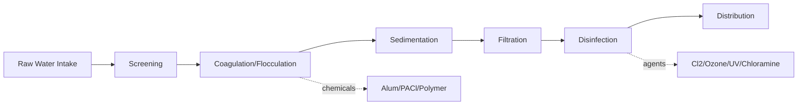

## Water Chemistry and Treatment

### Overview

Water chemistry encompasses the physical, chemical, and biological properties of water systems, while water treatment applies these principles to render water safe for consumption, industrial use, or environmental discharge. This field integrates acid-base equilibria, coordination chemistry, redox reactions, colloidal chemistry, and microbiology.

### Fundamental Properties of Water

#### Molecular Structure and Anomalous Properties

Water's bent molecular geometry (104.5° bond angle) and polarity give rise to extensive hydrogen bonding, producing several anomalous properties:

- High specific heat capacity ($4.184\text{ J/g·°C}$)
- High surface tension ($72.8\text{ mN/m}$ at 20°C)
- Density maximum at 4°C (ice is less dense than liquid water)
- High dielectric constant ($\epsilon_r\approx80$), enabling ionic dissolution

#### Water Quality Parameters

**Key Points**

- **pH**: Measures hydrogen ion activity; natural waters typically range 6.5–8.5
- **Alkalinity**: Buffering capacity from $\text{HCO}_3^-$, $\text{CO}_3^{2-}$, and $\text{OH}^-$; expressed as mg/L CaCO₃ equivalent
- **Hardness**: Concentration of divalent cations, primarily $\text{Ca}^{2+}$ and $\text{Mg}^{2+}$
- **Turbidity**: Optical clarity, measured in NTU (Nephelometric Turbidity Units)
- **Total Dissolved Solids (TDS)**: Sum of all dissolved inorganic and organic substances
- **Dissolved Oxygen (DO)**: Critical for aquatic ecosystem health and corrosion behavior
- **Conductivity**: Proxy measurement correlating with ionic strength

### The Carbonate Equilibrium System

Water's buffering capacity centers on the carbonate system, governed by three coupled equilibria:

$$\text{CO}_2(g) \rightleftharpoons \text{CO}_2(aq)$$

$$\text{CO}_2(aq) + \text{H}_2\text{O} \rightleftharpoons \text{H}_2\text{CO}_3 \rightleftharpoons \text{H}^+ + \text{HCO}_3^-$$

$$\text{HCO}_3^- \rightleftharpoons \text{H}^+ + \text{CO}_3^{2-}$$

The equilibrium constants at 25°C:

- $K_{a1}=4.3\times10^{-7}$ (pKa1 ≈ 6.35)
- $K_{a2}=4.8\times10^{-11}$ (pKa2 ≈ 10.33)

This system explains why most natural waters sit near neutral-to-slightly-alkaline pH, and it underlies the Langelier Saturation Index (LSI), used to predict calcium carbonate scaling or corrosion tendency:

$$LSI = pH - pH_s$$

where $pH_s$ is the pH at calcium carbonate saturation. Positive LSI indicates scaling potential; negative indicates corrosive (aggressive) water.

### Hardness Chemistry

Water hardness derives primarily from dissolution of carbonate rock formations:

$$\text{CaCO}_3(s) + \text{CO}_2(aq) + \text{H}_2\text{O} \rightleftharpoons \text{Ca}^{2+} + 2\text{HCO}_3^-$$

**Classification (as mg/L CaCO₃):**

| Category | Range |
| --- | --- |
| Soft | 0–60 |
| Moderately hard | 61–120 |
| Hard | 121–180 |
| Very hard | >180 |

Hardness is subdivided into **temporary hardness** (carbonate/bicarbonate-associated, removable by boiling) and **permanent hardness** (associated with sulfates, chlorides — requires chemical treatment).

### Water Treatment Process Train

#### Stage 1: Coagulation and Flocculation

Colloidal particles (0.001–1 μm) remain suspended due to electrostatic repulsion (negative zeta potential from surface charges). Coagulation neutralizes this repulsion.

**Common coagulants:**

- Aluminum sulfate (alum): $\text{Al}_2(\text{SO}_4)_3\cdot14\text{H}_2\text{O}$
- Ferric chloride: $\text{FeCl}_3$
- Polyaluminum chloride (PACl)

The hydrolysis reaction for alum:

$$\text{Al}_2(\text{SO}_4)_3 + 6\text{HCO}_3^- \rightarrow 2\text{Al(OH)}_3(s) + 3\text{SO}_4^{2-} + 6\text{CO}_2$$

This consumes alkalinity and produces gelatinous $\text{Al(OH)}_3$ floc that sweeps and entraps colloidal particles (charge neutralization + sweep flocculation mechanisms). Gentle mixing (flocculation, G-value ~20–70 s⁻¹) then aggregates microflocs into settleable particles.

#### Stage 2: Sedimentation

Flocs settle under gravity per Stokes' Law for laminar settling:

$$v_s = \frac{g(\rho_p-\rho_f)d^2}{18\mu}$$

where $v_s$ is settling velocity, $\rho_p$ and $\rho_f$ are particle and fluid density, $d$ is particle diameter, and $\mu$ is dynamic viscosity.

#### Stage 3: Filtration

Rapid sand filtration removes remaining particulates through:

- **Straining**: Physical size exclusion
- **Sedimentation**: Within pore spaces
- **Adsorption**: Van der Waals and electrostatic attraction to media surface

Multi-media filters (anthracite over sand over garnet) exploit decreasing grain size with depth for depth filtration.

#### Stage 4: Disinfection

**Chlorination** is the dominant method:

$$\text{Cl}_2 + \text{H}_2\text{O} \rightleftharpoons \text{HOCl} + \text{H}^+ + \text{Cl}^-$$

$$\text{HOCl} \rightleftharpoons \text{H}^+ + \text{OCl}^-$$

Hypochlorous acid ($\text{HOCl}$) is the more effective disinfectant (~80x more biocidal than $\text{OCl}^-$) because its neutral charge allows diffusion through microbial cell membranes. The HOCl/OCl⁻ distribution is pH-dependent, favoring HOCl below pH 7.5.

**Breakpoint chlorination**: As chlorine dose increases, free chlorine initially reacts with reducing agents and ammonia (forming chloramines), then combined chlorine residual decreases at the "breakpoint" as chloramines oxidize to $\text{N}_2$, after which free chlorine residual rises linearly.

**Alternative disinfectants:**

- **Ozone** ($\text{O}_3$): Strong oxidant (E° = 2.07 V), effective against *Cryptosporidium*, leaves no residual, produces bromate as DBP with bromide-containing waters
- **UV irradiation**: Damages microbial DNA/RNA (thymine dimer formation); no chemical residual; ineffective against biofilm regrowth
- **Chloramines** ($\text{NH}_2\text{Cl}$): Formed via $\text{NH}_3 + \text{HOCl}\rightarrow\text{NH}_2\text{Cl}+\text{H}_2\text{O}$; weaker but more persistent disinfectant, reduces trihalomethane formation

### Disinfection Byproducts (DBPs)

Chlorination of natural organic matter (NOM) generates regulated DBPs:

- **Trihalomethanes (THMs)**: chloroform ($\text{CHCl}_3$), bromodichloromethane, etc.
- **Haloacetic acids (HAA5)**: dichloroacetic acid, trichloroacetic acid

[Inference] Formation is influenced by NOM concentration, bromide levels, pH, temperature, and contact time — exact speciation is water-matrix dependent.

### Advanced Treatment Processes

**Softening (Lime-Soda Process):**

$$\text{Ca(OH)}_2 + \text{Ca(HCO}_3)_2 \rightarrow 2\text{CaCO}_3(s) + 2\text{H}_2\text{O}$$

$$\text{Ca(OH)}_2 + \text{Mg(HCO}_3)_2 \rightarrow \text{CaCO}_3(s) + \text{Mg(OH)}_2(s) + 2\text{H}_2\text{O}$$

**Ion Exchange Softening:**

$$\text{Ca}^{2+} + \text{Na}_2\text{R} \rightarrow \text{CaR} + 2\text{Na}^+$$

where R represents the resin matrix (typically sulfonated polystyrene).

**Reverse Osmosis (RO):** Applies pressure exceeding osmotic pressure ($\pi = iMRT$, van't Hoff equation) to force water through semipermeable membranes, rejecting dissolved ions, used for desalination and TDS reduction.

**Activated Carbon Adsorption:** Removes organic contaminants, taste/odor compounds (geosmin, 2-MIB) via van der Waals adsorption onto high-surface-area carbon (500–1500 m²/g).

### Wastewater Treatment Chemistry

**Key Points**

- **Primary treatment**: Physical settling of solids
- **Secondary treatment**: Biological oxidation of organics via activated sludge (aerobic heterotrophic bacteria)
- **Nitrification**: $\text{NH}_4^+ + 2\text{O}_2 \rightarrow \text{NO}_3^- + \text{H}_2\text{O} + 2\text{H}^+$ (via *Nitrosomonas*, *Nitrobacter*)
- **Denitrification**: $2\text{NO}_3^- + 10\text{e}^- + 12\text{H}^+ \rightarrow \text{N}_2 + 6\text{H}_2\text{O}$ (anoxic, heterotrophic)
- **Tertiary treatment**: Phosphorus removal via chemical precipitation ($\text{Al}^{3+}$ or $\text{Fe}^{3+}$ salts forming $\text{AlPO}_4$/$\text{FePO}_4$)

Biochemical Oxygen Demand (BOD) and Chemical Oxygen Demand (COD) quantify organic pollution load, with COD measured via dichromate oxidation:

$$\text{Cr}_2\text{O}_7^{2-} + 14\text{H}^+ + 6\text{e}^- \rightarrow 2\text{Cr}^{3+} + 7\text{H}_2\text{O}$$

### Corrosion Chemistry in Distribution Systems

Distribution pipe corrosion follows electrochemical principles:

**Anodic reaction:** $\text{Fe} \rightarrow \text{Fe}^{2+} + 2e^-$

**Cathodic reaction:** $\text{O}_2 + 2\text{H}_2\text{O} + 4e^- \rightarrow 4\text{OH}^-$

This is governed by the Langelier and Ryznar indices, dissolved oxygen content, chloride-to-sulfate mass ratio (CSMR, relevant to lead leaching), and pH/alkalinity balance. Corrosion control often involves orthophosphate dosing to form protective $\text{FePO}_4$ or lead-phosphate scale layers. [Inference] Optimal corrosion control strategy is highly site-specific and depends on existing pipe material and water chemistry history.

### Regulatory Framework Reference

Behavior of specific contaminant removal technologies may vary with influent water matrix, temperature, and system design; treatment efficacy figures cited in literature should be verified against site-specific pilot testing.

**Related Topics**

- Acid-base equilibria and buffer systems
- Colloidal chemistry and zeta potential
- Redox chemistry and electrochemical series
- Membrane separation processes
- Microbial ecology in engineered systems
- Trace metal speciation and bioavailability
- Eutrophication and nutrient cycling