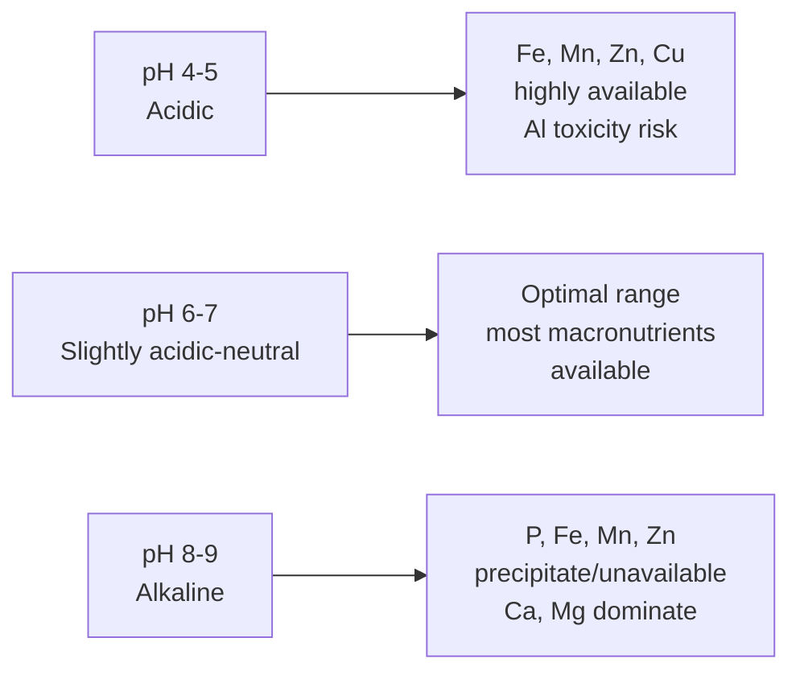

## Soil Chemistry

### Overview

Soil chemistry examines the composition, reactions, and transformations of chemical constituents in the pedosphere — the solid mineral/organic matrix, soil solution, and gas phase, and their interactions with plant roots, microorganisms, and contaminants. Core themes include cation exchange, pH buffering, redox dynamics, and nutrient cycling.

### Soil Composition

**Key Points**

- **Mineral fraction** (45–49% by volume typical): Primary minerals (quartz, feldspar) and secondary clay minerals
- **Organic matter** (1–5%): Humus, decomposing residues
- **Soil solution** (~25%): Water with dissolved ions, gases, organic solutes
- **Soil air** (~25%): $\text{O}_2$, $\text{CO}_2$, $\text{N}_2$ in pore spaces

#### Clay Mineralogy

Clay minerals are layered aluminosilicates classified by tetrahedral (Si) and octahedral (Al/Mg) sheet arrangements:

- **1:1 clays** (e.g., kaolinite): One tetrahedral + one octahedral sheet; low CEC (~3–15 cmol/kg), low shrink-swell
- **2:1 clays** (e.g., montmorillonite, illite, vermiculite): Two tetrahedral sheets sandwiching one octahedral sheet; higher CEC (montmorillonite: 80–150 cmol/kg), expansive

Isomorphic substitution (e.g., $\text{Al}^{3+}$ replacing $\text{Si}^{4+}$, or $\text{Mg}^{2+}$ replacing $\text{Al}^{3+}$) generates permanent negative layer charge, the basis of cation exchange capacity.

### Cation Exchange Capacity (CEC)

CEC quantifies a soil's capacity to hold and exchange positively charged ions, expressed in cmol(+)/kg (centimoles of charge per kilogram):

$$CEC = \sum[\text{Ca}^{2+}] + [\text{Mg}^{2+}] + [\text{K}^+] + [\text{Na}^+] + [\text{Al}^{3+}] + [\text{H}^+]$$

**Sources of charge:**

- **Permanent charge**: From isomorphic substitution in 2:1 clays (pH-independent)
- **Variable (pH-dependent) charge**: From protonation/deprotonation of hydroxyl groups on organic matter, Fe/Al oxides, and clay edges

$$\equiv\text{Al-OH} + \text{H}^+ \rightleftharpoons \equiv\text{Al-OH}_2^+ \quad\text{(low pH, positive charge)}$$

$$\equiv\text{Al-OH} \rightleftharpoons \equiv\text{Al-O}^- + \text{H}^+ \quad\text{(high pH, negative charge)}$$

**Base Saturation Percentage:**

$$BS\% = \frac{\sum\text{basic cations }(\text{Ca}^{2+},\text{Mg}^{2+},\text{K}^+,\text{Na}^+)}{CEC}\times100$$

Higher base saturation generally correlates with higher soil pH and fertility.

### Soil pH and Buffering

Soil pH governs nutrient availability, microbial activity, and metal solubility. Three pH pools exist:

- **Active acidity**: $\text{H}^+$ in soil solution (measured directly)
- **Exchangeable (reserve) acidity**: $\text{H}^+$/$\text{Al}^{3+}$ on exchange sites
- **Residual acidity**: Bound within organic matter/mineral structures

Aluminum hydrolysis is the dominant acidifying mechanism in acid soils:

$$\text{Al}^{3+} + \text{H}_2\text{O} \rightleftharpoons \text{Al(OH)}^{2+} + \text{H}^+$$

**Nutrient Availability by pH:**

**Liming (acid soil correction):**

$$\text{CaCO}_3 + 2\text{H}^+ \rightarrow \text{Ca}^{2+} + \text{H}_2\text{O} + \text{CO}_2$$

**Acidification (alkaline soil correction):** Elemental sulfur oxidation via *Thiobacillus*:

$$2\text{S} + 3\text{O}_2 + 2\text{H}_2\text{O} \rightarrow 2\text{H}_2\text{SO}_4$$

### Redox Chemistry in Soils

Soil redox potential ($E_h$) determines the oxidation state of key elements and controls flooded/waterlogged soil chemistry.

| $E_h$ Range (mV) | Dominant Process | Example |
| --- | --- | --- |
| >400 | $\text{O}_2$ reduction | Aerobic respiration |
| 200–400 | $\text{NO}_3^-$ reduction | Denitrification |
| 100–200 | $\text{Mn}^{4+}$ reduction | $\text{Mn}^{4+}\rightarrow\text{Mn}^{2+}$ |
| 0–100 | $\text{Fe}^{3+}$ reduction | $\text{Fe}^{3+}\rightarrow\text{Fe}^{2+}$ (gleying) |
| -100–0 | $\text{SO}_4^{2-}$ reduction | $\text{H}_2\text{S}$ production |
| <-100 | $\text{CO}_2$ reduction | $\text{CH}_4$ (methanogenesis) |

This sequence follows the thermodynamic ordering of electron acceptors by decreasing free energy yield, mediated by facultative and obligate anaerobic microorganisms.

### Nutrient Cycling

#### Nitrogen Cycle

$$\text{N}_2 \xrightarrow{\text{fixation}} \text{NH}_3/\text{NH}_4^+ \xrightarrow{\text{nitrification}} \text{NO}_2^- \rightarrow \text{NO}_3^- \xrightarrow{\text{denitrification}} \text{N}_2/\text{N}_2\text{O}$$

- **Mineralization**: Organic N → $\text{NH}_4^+$ (ammonification)
- **Immobilization**: Inorganic N incorporated into microbial biomass (reverse process)
- **Nitrification**: $\text{NH}_4^+ + 2\text{O}_2 \rightarrow \text{NO}_3^- + \text{H}_2\text{O} + 2\text{H}^+$ (acidifying)

#### Phosphorus Chemistry

Phosphorus availability is strongly pH-dependent due to precipitation reactions:

- **Acid soils**: $\text{Fe}^{3+} + \text{H}_2\text{PO}_4^- \rightarrow \text{FePO}_4 + 2\text{H}^+$ (strengite formation)
- **Alkaline soils**: $\text{Ca}^{2+} + \text{HPO}_4^{2-} \rightarrow \text{CaHPO}_4$ (eventually forming apatite)

Maximum P availability typically occurs at pH 6.0–7.0, where these competing precipitation pathways are minimized.

#### Potassium, Calcium, Magnesium

These base cations occupy exchange sites and are released via mineral weathering (feldspars, micas) or held as exchangeable/fixed forms (K⁺ fixation between mica interlayers).

### Soil Organic Matter and Humus Chemistry

Humus consists of humic substances formed through microbial decomposition and condensation reactions:

- **Fulvic acids**: Lower molecular weight, soluble across all pH, higher O content
- **Humic acids**: Higher molecular weight, insoluble below pH 2, contain carboxyl (-COOH) and phenolic (-OH) functional groups providing pH-dependent CEC
- **Humin**: Insoluble at any pH, tightly bound to mineral matrix

Functional group dissociation contributes significantly to variable-charge CEC:

$$\text{R-COOH} \rightleftharpoons \text{R-COO}^- + \text{H}^+ \quad (pK_a\approx4-6)$$

### Soil Salinity and Sodicity

**Key Points**

- **Electrical Conductivity (EC)**: Measures total soluble salts; saline soil defined as EC > 4 dS/m
- **Sodium Adsorption Ratio (SAR)**: $SAR=\dfrac{[\text{Na}^+]}{\sqrt{([\text{Ca}^{2+}]+[\text{Mg}^{2+}])/2}}$
- **Exchangeable Sodium Percentage (ESP)**: Sodic soils defined as ESP > 15%, causing clay dispersion and poor structure
- Reclamation typically applies gypsum ($\text{CaSO}_4$) to displace exchangeable $\text{Na}^+$: $\text{Na-Clay} + \text{Ca}^{2+} \rightarrow \text{Ca-Clay} + 2\text{Na}^+$ (leached)

### Heavy Metal and Contaminant Chemistry

Metal mobility and bioavailability in soil depend on speciation, governed by pH, redox, organic matter complexation, and mineral sorption:

- Cationic metals ($\text{Pb}^{2+}$, $\text{Cd}^{2+}$, $\text{Zn}^{2+}$) generally become **more mobile at low pH**
- Oxyanions (arsenate $\text{AsO}_4^{3-}$, chromate $\text{CrO}_4^{2-}$) generally become **more mobile at high pH**
- Fe/Mn oxide surfaces provide specific adsorption sites via inner-sphere complexation
- Organic matter forms stable metal-humate complexes, influencing mobility and phytoavailability

[Inference] Precise mobility thresholds are contaminant- and soil-matrix specific; site remediation typically requires empirical sequential extraction testing rather than generalized pH-mobility rules alone.

### Analytical and Reference Methods

Common soil chemical characterization techniques include: 1:1 or 1:2 soil-water pH measurement, ammonium acetate extraction for exchangeable cations, Mehlich-3 or Olsen extraction for available phosphorus, Walkley-Black or loss-on-ignition for organic carbon, and saturated paste extraction for salinity assessment. Specific extraction method choice affects results and should match regional calibration standards; behavior of extraction reagents may vary with soil mineralogy.

**Related Topics**

- Clay mineral structure and identification (XRD methods)
- Soil microbial ecology and biogeochemical cycling
- Water chemistry and treatment
- Adsorption isotherms (Langmuir, Freundlich)
- Plant nutrient uptake mechanisms
- Soil remediation techniques (phytoremediation, chemical immobilization)
- Greenhouse gas flux from soils (N₂O, CH₄)