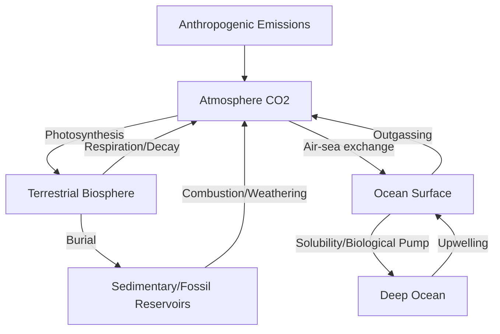

## Greenhouse Gases and Climate Chemistry

### Overview

Climate chemistry examines the radiative, photochemical, and biogeochemical processes governing atmospheric greenhouse gases (GHGs) — their molecular basis for infrared absorption, atmospheric residence times, sources and sinks, and coupled feedback mechanisms driving global climate forcing.

### Radiative Physics of Greenhouse Gases

#### Molecular Basis for IR Absorption

Greenhouse gases absorb infrared radiation through vibrational mode transitions that produce a **changing dipole moment**. Symmetric diatomic molecules ($\text{N}_2$, $\text{O}_2$) have zero dipole moment change and are radiatively inactive; polyatomic/asymmetric molecules are IR-active.

**Key vibrational modes:**

- $\text{CO}_2$: Asymmetric stretch (2349 cm⁻¹) and bending modes (667 cm⁻¹) are IR-active; symmetric stretch is not
- $\text{H}_2\text{O}$: Bent geometry gives permanent dipole; strong absorption bands throughout IR
- $\text{CH}_4$: Tetrahedral symmetry breaks during vibration, activating IR absorption
- $\text{N}_2\text{O}$: Linear asymmetric molecule, multiple active vibrational modes

#### Radiative Forcing

Radiative forcing (RF) quantifies the change in net irradiance (W/m²) at the tropopause due to a perturbation. For $\text{CO}_2$, forcing follows a logarithmic relationship (saturating absorption bands):

$$\Delta F = \alpha\ln\left(\frac{C}{C_0}\right)$$

where $\alpha\approx5.35\text{ W/m}^2$ for $\text{CO}_2$, $C$ is current concentration, $C_0$ is reference concentration. This logarithmic (rather than linear) dependence occurs because core absorption bands are already near-saturated; additional forcing comes primarily from band broadening and edge effects.

By contrast, less abundant gases like $\text{CH}_4$ and $\text{N}_2\text{O}$ exhibit near-square-root or linear forcing relationships since their absorption bands remain unsaturated.

### Global Warming Potential (GWP)

GWP compares a gas's time-integrated radiative forcing relative to $\text{CO}_2$ over a specified time horizon (commonly 100 years):

$$GWP_x = \frac{\int_0^{TH}RF_x(t)\,dt}{\int_0^{TH}RF_{CO_2}(t)\,dt}$$

**Approximate 100-year GWP values:**

| Gas | GWP-100 | Atmospheric Lifetime |
| --- | --- | --- |
| $\text{CO}_2$ | 1 | Variable (see below) |
| $\text{CH}_4$ | ~28–36 | ~12 years |
| $\text{N}_2\text{O}$ | ~265–298 | ~114 years |
| $\text{SF}_6$ | ~23,500 | ~3,200 years |
| HFC-134a | ~1,430 | ~14 years |

[Inference] GWP values are periodically revised in IPCC assessment reports as understanding of indirect effects and atmospheric chemistry improves; cited figures represent commonly referenced AR5/AR6-era estimates.

$\text{CO}_2$ lacks a single atmospheric lifetime because it partitions among atmosphere, ocean, and terrestrial reservoirs via multiple processes with different characteristic timescales (years to millennia) — commonly represented by multi-exponential decay models (e.g., Bern carbon cycle model).

### The Carbon Cycle

#### Ocean-Atmosphere CO₂ Exchange

Air-sea $\text{CO}_2$ flux follows Henry's Law equilibrium, complicated by seawater carbonate chemistry:

$$\text{CO}_2(g) \rightleftharpoons \text{CO}_2(aq)$$

$$\text{CO}_2(aq) + \text{H}_2\text{O} \rightleftharpoons \text{H}^+ + \text{HCO}_3^-$$

$$\text{HCO}_3^- \rightleftharpoons \text{H}^+ + \text{CO}_3^{2-}$$

The **Revelle factor** (buffer factor) describes seawater's reduced capacity to absorb additional $\text{CO}_2$ as it acidifies:

$$R=\frac{\Delta[\text{CO}_2]/[\text{CO}_2]}{\Delta DIC/DIC}$$

Typical ocean surface Revelle factors are ~8–15, meaning a given fractional increase in atmospheric $\text{CO}_2$ produces a much smaller fractional increase in dissolved inorganic carbon (DIC) — the ocean's buffering capacity is finite and declining as more carbon is absorbed.

#### Ocean Acidification

$$\text{CO}_2 + \text{H}_2\text{O} + \text{CO}_3^{2-} \rightarrow 2\text{HCO}_3^-$$

This net reaction consumes carbonate ion, lowering the saturation state ($\Omega$) for calcium carbonate biominerals:

$$\Omega_{arag/calcite}=\frac{[\text{Ca}^{2+}][\text{CO}_3^{2-}]}{K_{sp}}$$

$\Omega<1$ indicates thermodynamically favorable dissolution conditions for that mineral phase, threatening calcifying organisms (corals, pteropods, some plankton).

### Methane Chemistry

#### Sources and Sinks

**Key Points**

- **Biogenic sources**: Wetlands, rice paddies, ruminant livestock (methanogenesis via *Archaea*: $\text{CO}_2+4\text{H}_2\rightarrow\text{CH}_4+2\text{H}_2\text{O}$)
- **Thermogenic sources**: Fossil fuel extraction, natural gas leakage
- **Pyrogenic sources**: Biomass burning
- **Primary sink**: Tropospheric oxidation by hydroxyl radical

The dominant atmospheric methane removal pathway:

$$\text{CH}_4 + \text{OH}^\bullet \rightarrow \text{CH}_3^\bullet + \text{H}_2\text{O}$$

This reaction with the hydroxyl radical ("atmospheric detergent") governs $\text{CH}_4$'s relatively short ~12-year lifetime and links methane chemistry to tropospheric oxidative capacity, which itself depends on $\text{NO}_x$, CO, and VOC concentrations.

### Nitrous Oxide Chemistry

$\text{N}_2\text{O}$ arises predominantly from microbial nitrification and denitrification in soils and agricultural systems (fertilizer-driven), and is removed primarily via stratospheric photolysis:

$$\text{N}_2\text{O} + h\nu \rightarrow \text{N}_2 + \text{O}(^1D)$$

$$\text{N}_2\text{O} + \text{O}(^1D) \rightarrow 2\text{NO}$$

The second reaction is significant because it represents $\text{N}_2\text{O}$'s role as the dominant anthropogenic source of stratospheric $\text{NO}_x$, linking it to ozone layer chemistry.

### Stratospheric Ozone Chemistry (Related System)

While not a greenhouse gas in the same forcing sense, stratospheric ozone chemistry is chemically coupled to climate systems via the Chapman cycle:

$$\text{O}_2 + h\nu \rightarrow 2\text{O}$$

$$\text{O} + \text{O}_2 + M \rightarrow \text{O}_3 + M$$

$$\text{O}_3 + h\nu \rightarrow \text{O}_2 + \text{O}$$

$$\text{O} + \text{O}_3 \rightarrow 2\text{O}_2$$

Catalytic destruction cycles (involving $\text{Cl}^\bullet$, $\text{Br}^\bullet$, $\text{NO}_x$ radicals) accelerate net ozone loss beyond the Chapman mechanism alone, historically driven by anthropogenic CFCs:

$$\text{Cl}^\bullet + \text{O}_3 \rightarrow \text{ClO}^\bullet + \text{O}_2$$

$$\text{ClO}^\bullet + \text{O} \rightarrow \text{Cl}^\bullet + \text{O}_2$$

### Climate Feedback Mechanisms

| Feedback | Type | Mechanism |
| --- | --- | --- |
| Water vapor | Positive | Warming increases atmospheric $\text{H}_2\text{O}$ (Clausius-Clapeyron), amplifying forcing |
| Ice-albedo | Positive | Melting ice/snow reduces surface reflectivity |
| Cloud feedback | Uncertain sign | Depends on cloud altitude, type, optical depth |
| Permafrost carbon | Positive | Thaw releases stored $\text{CH}_4$/$\text{CO}_2$ |
| Lapse rate | Negative | Upper troposphere warms faster, increases outgoing IR |
| Carbon cycle (ocean/land sink saturation) | Positive | Reduced Revelle buffering, terrestrial sink limits |

[Inference] Cloud feedback magnitude and sign remain among the largest sources of uncertainty in climate sensitivity estimates, as noted across IPCC assessment cycles.

### Equilibrium Climate Sensitivity (ECS)

ECS quantifies equilibrium global mean temperature change per doubling of $\text{CO}_2$:

$$\Delta T=\lambda\Delta F_{2\times CO_2}$$

where $\lambda$ is the climate feedback parameter (K per W/m²) aggregating all feedback contributions. Current assessed likely ranges cluster around 2.5–4°C per doubling, though behavior of the coupled climate-carbon system involves substantial uncertainty and may vary based on emissions pathway and feedback interactions not fully resolved in current models.

### Aerosols and Indirect Forcing

Atmospheric aerosols (sulfate, black carbon, organic carbon) produce competing effects:

- **Direct effect**: Scattering (cooling, sulfates) or absorption (warming, black carbon) of solar radiation
- **Indirect effect**: Aerosols act as cloud condensation nuclei (CCN), altering cloud droplet number, albedo, and lifetime (Twomey effect)

Sulfate aerosol forcing is negative (cooling) and has historically offset a portion of GHG warming, though this remains an active area of quantitative refinement.

**Related Topics**

- Atmospheric photochemistry and tropospheric ozone formation
- Carbon capture and sequestration chemistry
- Isotopic tracers in carbon cycle research (δ¹³C, Δ¹⁴C)
- Water chemistry and treatment
- Soil chemistry (N₂O and CH₄ flux sources)
- Energy chemistry and combustion emissions
- Paleoclimate proxy chemistry (ice cores, sediment records)