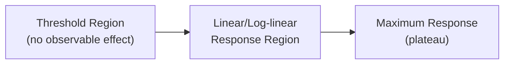

## Basics of Toxicology

### Overview

Toxicology is the study of adverse effects of chemical, physical, or biological agents on living organisms, integrating chemistry, biochemistry, physiology, and epidemiology to characterize dose-response relationships, mechanisms of toxic action, and exposure risk.

### Fundamental Principles

#### The Dose-Response Concept

The foundational principle of toxicology, attributed to Paracelsus: *"the dose makes the poison"* — any substance can be toxic at sufficient dose, and dose-response quantification is central to hazard assessment.

**Key dose-response parameters:**

- **LD50**: Dose lethal to 50% of a test population (mg/kg body weight)
- **LC50**: Concentration lethal to 50% of a test population (typically inhalation/aquatic exposure)
- **ED50**: Dose producing a defined effect in 50% of subjects
- **NOAEL**: No-Observed-Adverse-Effect-Level — highest dose with no detectable adverse effect
- **LOAEL**: Lowest-Observed-Adverse-Effect-Level

#### The Dose-Response Curve

Dose-response curves are typically sigmoidal when plotted against log-dose, described mathematically by models such as the Hill equation:

$$E=E_{max}\cdot\frac{D^n}{ED_{50}^n+D^n}$$

where $E$ is effect magnitude, $D$ is dose, $n$ is the Hill coefficient (slope steepness), and $ED_{50}$ is the dose producing half-maximal effect.

[Inference] Whether a true threshold exists (particularly for genotoxic carcinogens) remains a debated regulatory and scientific question; linear no-threshold (LNT) models are often applied conservatively for carcinogen risk assessment in the absence of consensus.

### Toxicokinetics (ADME)

Toxicokinetics describes the time-course of a substance through the body via four processes:

**Absorption**: Entry into systemic circulation via oral (GI tract), inhalation (alveolar), dermal, or parenteral routes. Governed by physicochemical properties — lipophilicity (log P), molecular size, ionization state (pKa relative to local pH).

**Distribution**: Movement throughout body compartments, described by volume of distribution:

$$V_d=\frac{\text{Dose}}{C_0}$$

where $C_0$ is initial plasma concentration. High $V_d$ indicates extensive tissue distribution (often lipophilic compounds); low $V_d$ indicates confinement to plasma/blood compartment.

**Metabolism (Biotransformation)**: Enzymatic conversion, primarily hepatic, occurring in two phases:

- **Phase I** (functionalization): Oxidation, reduction, hydrolysis — predominantly via cytochrome P450 (CYP450) enzyme superfamily

  $$\text{R-H} + \text{O}_2 + \text{NADPH} \xrightarrow{\text{CYP450}} \text{R-OH} + \text{H}_2\text{O} + \text{NADP}^+$$
- **Phase II** (conjugation): Addition of polar moieties (glucuronic acid, sulfate, glutathione) to increase water solubility for excretion

Metabolism can produce either detoxification (reduced toxicity) or **bioactivation** (metabolite more toxic than parent compound) — a critical toxicological concept. Example: benzo[a]pyrene is bioactivated by CYP450 to a diol epoxide that forms DNA adducts.

**Excretion**: Primarily renal (urine) and hepatobiliary (feces); also pulmonary (volatile compounds) and minor routes (sweat, breast milk).

**Half-life** ($t_{1/2}$) for first-order elimination kinetics:

$$t_{1/2}=\frac{0.693}{k_e}$$

where $k_e$ is the elimination rate constant.

### Mechanisms of Toxic Action

**Key Points**

- **Receptor-mediated toxicity**: Agonism/antagonism at biological receptors (e.g., organophosphates inhibiting acetylcholinesterase)
- **Reactive oxygen species (ROS) generation**: Oxidative stress damaging lipids, proteins, DNA
- **Covalent binding**: Electrophilic metabolites binding macromolecules (DNA adducts, protein adducts)
- **Enzyme inhibition**: Direct interference with catalytic function
- **Membrane disruption**: Lipophilic compounds disrupting membrane integrity/fluidity
- **Interference with energy metabolism**: e.g., cyanide inhibiting cytochrome c oxidase, blocking oxidative phosphorylation

#### Example: Acetylcholinesterase Inhibition

Organophosphate pesticides phosphorylate the serine hydroxyl group at the AChE active site:

$$\text{AChE-OH} + \text{OP} \rightarrow \text{AChE-O-P} + \text{leaving group}$$

This prevents acetylcholine hydrolysis, causing cholinergic crisis (excess neurotransmitter accumulation at synapses) — the basis for organophosphate pesticide and nerve agent toxicity.

### Types of Toxicity by Exposure Duration

| Type | Exposure Pattern | Example Endpoint |
| --- | --- | --- |
| Acute | Single or short-term (<24h) | Lethality, immediate organ damage |
| Subacute | Repeated, <1 month | Early cumulative effects |
| Subchronic | Repeated, 1–3 months | Organ-specific pathology |
| Chronic | Repeated, >3 months–lifetime | Cancer, degenerative disease |

### Target Organ Toxicity

**Hepatotoxicity**: Liver as primary metabolic organ is highly exposed to reactive intermediates; mechanisms include direct hepatocyte necrosis, cholestasis, and idiosyncratic immune-mediated injury (e.g., acetaminophen overdose depleting glutathione reserves, allowing NAPQI accumulation).

**Nephrotoxicity**: Kidneys concentrate toxicants during filtration; heavy metals (cadmium, mercury) accumulate in proximal tubule cells via metallothionein binding.

**Neurotoxicity**: Lipophilic compounds cross the blood-brain barrier; mechanisms include axonal transport disruption, neurotransmitter interference, and myelin damage.

**Genotoxicity/Carcinogenicity**: DNA damage via direct adduct formation, ROS-mediated oxidative DNA lesions, or epigenetic mechanisms; classified by IARC/EPA weight-of-evidence frameworks.

**Teratogenicity**: Developmental toxicity during critical embryonic windows; classic example is thalidomide.

### Dose-Response Relationships and Risk Assessment

**Reference Dose (RfD)** for non-carcinogens, incorporating uncertainty factors:

$$RfD=\frac{NOAEL}{UF_1\times UF_2\times\cdots\times MF}$$

where uncertainty factors (typically 10-fold each) account for interspecies extrapolation, intraspecies variability, subchronic-to-chronic extrapolation, and database limitations.

**Margin of Exposure (MOE)**:

$$MOE=\frac{NOAEL\text{ or }BMDL}{\text{Estimated human exposure}}$$

Larger MOE values indicate greater safety margin.

**Benchmark Dose (BMD)** approaches increasingly supplement NOAEL/LOAEL methods, using statistical modeling of the full dose-response curve to derive a dose corresponding to a defined benchmark response level (e.g., BMDL10 = lower confidence bound on dose causing 10% response).

### Factors Modifying Toxicity

- **Species/genetic variation**: Polymorphisms in metabolizing enzymes (e.g., CYP2D6 poor vs. extensive metabolizers)
- **Age**: Neonates/elderly often show altered ADME and organ sensitivity
- **Route of exposure**: First-pass hepatic metabolism affects oral vs. IV bioavailability
- **Chemical interactions**: Synergism, antagonism, potentiation between co-exposed substances
- **Nutritional/health status**: Glutathione depletion, existing organ dysfunction

### Toxicological Testing Framework

Standard testing hierarchy includes: acute toxicity studies, repeated-dose subchronic/chronic studies, genotoxicity batteries (Ames test, chromosomal aberration assays, micronucleus assays), reproductive/developmental toxicity studies, and carcinogenicity bioassays — typically following OECD or equivalent regulatory testing guidelines. Specific study design and endpoint selection may vary by regulatory jurisdiction and chemical class.

**Related Topics**

- Environmental fate and transport of contaminants
- Endocrine-disrupting chemicals
- Ecotoxicology and bioaccumulation/biomagnification
- Risk assessment and regulatory toxicology frameworks
- Heavy metal toxicity mechanisms
- Pharmacokinetics/pharmacodynamics (clinical parallel)
- Water chemistry and treatment (contaminant exposure pathways)