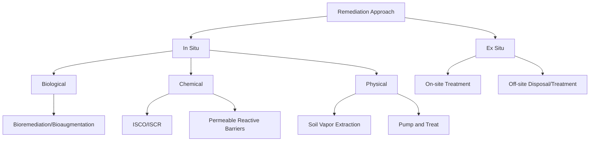
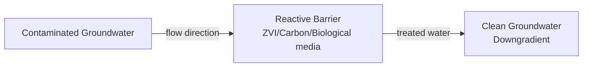

## Environmental Remediation Techniques

### Overview

Environmental remediation encompasses the chemical, physical, and biological processes applied to remove, degrade, immobilize, or contain contaminants in soil, groundwater, sediment, and air. Technique selection depends on contaminant class, matrix properties, site hydrogeology, and remediation goals (removal vs. containment vs. destruction).

### Remediation Strategy Classification

**Key Points**

- **In situ**: Treatment without excavation/extraction; lower cost, less disruption, longer timeframes, harder to verify uniformity
- **Ex situ**: Requires excavation or extraction; higher cost, faster, more controllable/verifiable treatment conditions

### Bioremediation

Bioremediation exploits microbial (and occasionally plant) metabolism to degrade or transform contaminants, typically organic pollutants, into less toxic products (ideally $\text{CO}_2$, $\text{H}_2\text{O}$, and biomass).

#### Aerobic Biodegradation

Applicable to many petroleum hydrocarbons and some chlorinated solvents:

$$\text{C}_x\text{H}_y + \text{O}_2 \xrightarrow{\text{microbial}} \text{CO}_2 + \text{H}_2\text{O} + \text{biomass}$$

Enhanced via **biostimulation** (adding oxygen, nutrients — N, P) or **bioaugmentation** (introducing specialized microbial consortia).

#### Anaerobic Reductive Dechlorination

Critical for chlorinated solvent plumes (e.g., PCE, TCE — common groundwater contaminants):

$$\text{PCE} \rightarrow \text{TCE} \rightarrow \text{cis-DCE} \rightarrow \text{VC} \rightarrow \text{Ethene}$$

Each step is a reductive dehalogenation requiring an electron donor (often supplied as substrate, e.g., lactate, molasses, vegetable oil) and specific dechlorinating microorganisms (notably *Dehalococcoides* spp., the only genus known to completely dechlorinate to ethene). [Inference] Incomplete dechlorination stalling at vinyl chloride (a known human carcinogen, more toxic than parent PCE/TCE) is a recognized risk requiring appropriate microbial community characterization before relying on natural attenuation.

#### Phytoremediation

Plant-based remediation mechanisms:

| Mechanism | Process | Target Contaminants |
| --- | --- | --- |
| Phytoextraction | Root uptake, translocation to shoots | Heavy metals (Cd, Ni, Zn) |
| Phytodegradation | Plant/associated enzyme breakdown | Organics |
| Rhizodegradation | Root-zone microbial stimulation | Organics |
| Phytostabilization | Root immobilization, reduced mobility | Metals |
| Phytovolatilization | Uptake and volatilization | Se, Hg, some VOCs |

Hyperaccumulator species (e.g., *Thlaspi caerulescens* for Zn/Cd) can concentrate metals to >1% dry weight in shoot tissue, though field-scale timeframes are typically long (years).

### In Situ Chemical Oxidation (ISCO)

ISCO delivers strong oxidants to the subsurface to chemically destroy organic contaminants via oxidative degradation to $\text{CO}_2$, $\text{H}_2\text{O}$, and inorganic byproducts.

**Common oxidants:**

- **Permanganate** ($\text{MnO}_4^-$): 

  $$\text{C}_2\text{Cl}_4 + 2\text{MnO}_4^- \rightarrow 2\text{CO}_2 + 2\text{MnO}_2(s) + 4\text{Cl}^-$$

  Effective against alkenes (PCE, TCE); persistent (weeks-months); produces $\text{MnO}_2$ precipitate which can reduce aquifer permeability.
- **Fenton's Reagent** ($\text{H}_2\text{O}_2$ + $\text{Fe}^{2+}$): Generates hydroxyl radicals:

  $$\text{Fe}^{2+} + \text{H}_2\text{O}_2 \rightarrow \text{Fe}^{3+} + \text{OH}^- + \text{OH}^\bullet$$

  $\text{OH}^\bullet$ is a powerful, non-selective oxidant (E° = 2.8 V) effective against a broad contaminant range; short-lived, exothermic reaction requiring careful dosing control.
- **Persulfate** ($\text{S}_2\text{O}_8^{2-}$): Activated by heat, Fe²⁺, or base to generate sulfate radicals ($\text{SO}_4^{\bullet-}$), offering longer persistence than Fenton's reagent.
- **Ozone** ($\text{O}_3$): Strong direct oxidant, can be combined with $\text{H}_2\text{O}_2$ (peroxone process) to enhance $\text{OH}^\bullet$ generation.

### In Situ Chemical Reduction (ISCR)

Applied primarily to reduce mobile, oxidized contaminants to less soluble/less toxic reduced forms.

**Zero-Valent Iron (ZVI)** for chlorinated solvents and metals:

$$\text{Fe}^0 + \text{C}_2\text{Cl}_4 + \text{H}^+ \rightarrow \text{Fe}^{2+} + \text{C}_2\text{H}_3\text{Cl} + \text{Cl}^-$$

$$\text{Fe}^0 + \text{Cr}^{6+} \rightarrow \text{Fe}^{3+} + \text{Cr}^{3+}$$

ZVI reduces hexavalent chromium (soluble, toxic, carcinogenic) to trivalent chromium (relatively insoluble, less mobile, less toxic) — a widely applied immobilization strategy.

### Permeable Reactive Barriers (PRBs)

PRBs are subsurface reactive zones installed perpendicular to groundwater flow, allowing water to pass through while contaminants react with the barrier medium (commonly granular ZVI, activated carbon, or biological amendments):

Passive, long-term treatment requiring minimal energy input, though barrier longevity and permeability loss (mineral precipitation, biofouling) require periodic monitoring.

### Physical/Extraction Technologies

**Soil Vapor Extraction (SVE)**: Applies vacuum to unsaturated zone wells to volatilize and extract VOCs, governed by Raoult's Law and Henry's Law partitioning between soil, water, and vapor phases. Effective for volatile compounds with sufficiently high vapor pressure; limited for low-volatility or strongly sorbed contaminants.

**Air Sparging**: Injects air below the water table to volatilize dissolved-phase contaminants, typically paired with SVE to capture vapors migrating to the unsaturated zone.

**Pump and Treat**: Extracts contaminated groundwater for above-ground treatment (air stripping, activated carbon, advanced oxidation) then reinjection or discharge. [Inference] Often criticized in remediation literature for slow mass removal due to diffusion-limited desorption from low-permeability zones ("tailing" and "rebound" effects), though it remains widely used for plume containment.

**Excavation and Off-Site Disposal**: Direct removal to permitted landfill/treatment facility; fastest but most disruptive and costly for large volumes.

### Solidification/Stabilization (S/S)

Immobilizes contaminants (particularly metals) within a solid matrix, typically using cement, lime, or pozzolanic binders:

$$\text{Pb}^{2+} + \text{SiO}_2\cdot\text{cement matrix} \rightarrow \text{immobilized silicate/hydroxide complex}$$

Reduces leachability (often verified via TCLP — Toxicity Characteristic Leaching Procedure) without necessarily reducing total contaminant mass; commonly used ex situ or in situ (soil mixing) for metal-contaminated sites.

### Monitored Natural Attenuation (MNA)

MNA relies on naturally occurring physical, chemical, and biological processes (biodegradation, dispersion, dilution, sorption, volatilization) to reduce contaminant mass/concentration without active intervention, requiring rigorous long-term monitoring to demonstrate attenuation is occurring at a protective rate. Typically applied where source removal has occurred and attenuation processes can be documented via geochemical indicator parameters (dissolved oxygen, ORP, daughter product ratios).

### Selecting Remediation Technology

**Key Points**

- **Contaminant properties**: Volatility, water solubility, sorption ($K_{oc}$), density (LNAPL vs. DNAPL behavior)
- **Site hydrogeology**: Permeability, heterogeneity, groundwater flow rate
- **Regulatory cleanup goals**: Risk-based vs. concentration-based standards
- **Timeframe and cost constraints**
- **Presence of DNAPL source zones**: Often require combined technologies (source treatment + plume management)

Technology effectiveness at a given site depends heavily on site-specific hydrogeological heterogeneity, contaminant distribution, and source-zone architecture; pilot testing is standard practice before full-scale implementation, and actual field performance may vary from bench-scale or literature-reported results.

**Related Topics**

- Soil chemistry (sorption, cation exchange relevance to remediation)
- Water chemistry and treatment
- Contaminant fate and transport modeling
- Basics of toxicology (risk-based cleanup goals)
- Advanced oxidation processes
- Groundwater hydrogeology fundamentals
- Green and sustainable remediation practices