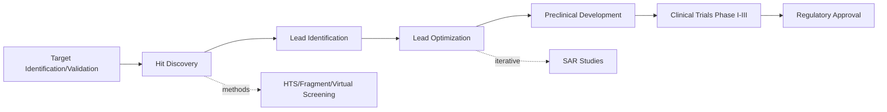

## Principles of Drug Design

### Overview

Drug design is the process of discovering and optimizing chemical entities that bind selectively to biological targets to produce a desired therapeutic effect while minimizing toxicity. It integrates medicinal chemistry, structural biology, pharmacology, and computational methods across target identification, lead discovery, and lead optimization stages.

### Drug Discovery Pipeline

### Drug-Target Interactions

#### Molecular Recognition Principles

Drug binding to biological targets (enzymes, receptors, ion channels, nucleic acids) follows the same non-covalent interaction principles governing biomolecular recognition:

- **Hydrogen bonding**: Directional, distance-dependent (~2.5–3.5 Å), significant contribution to binding specificity
- **Electrostatic (ionic) interactions**: Between charged groups, strength governed by Coulomb's law, modulated by dielectric environment
- **Van der Waals forces**: Short-range, additive over molecular contact surface, important for shape complementarity
- **Hydrophobic interactions**: Entropically driven exclusion of water from nonpolar contact surfaces
- **π-π stacking**: Between aromatic rings (drug aromatic systems and protein aromatic residues — Phe, Tyr, Trp)
- **Halogen bonding**: Directional interaction between halogen σ-hole and electron-rich acceptor

#### Binding Affinity Thermodynamics

Binding affinity relates to free energy change:

$$\Delta G=\Delta H-T\Delta S=-RT\ln K_a$$

where $K_a$ is the association constant. The dissociation constant $K_d$ (more commonly reported) is its inverse, with lower $K_d$ indicating tighter binding.

**Ligand efficiency** metrics normalize potency by molecular size, useful for lead optimization prioritization:

$$LE=\frac{-RT\ln K_d}{\text{heavy atom count}}$$

### Structure-Activity Relationships (SAR)

SAR studies systematically vary molecular structure and correlate changes with biological activity to identify pharmacophoric requirements.

**Key Points**

- **Pharmacophore**: The minimal 3D arrangement of steric and electronic features necessary for target recognition and biological activity
- **Bioisosterism**: Replacing a functional group with another of similar physicochemical properties to modulate potency, selectivity, or ADMET properties while retaining biological activity
- **Scaffold hopping**: Replacing a core molecular framework while preserving pharmacophore geometry
- **QSAR (Quantitative SAR)**: Statistical/computational models correlating molecular descriptors with biological activity, e.g., the Hansch equation:

$$\log(1/C)=a\pi+b\sigma+c\text{ES}+d$$

relating potency to hydrophobicity ($\pi$), electronic effects (Hammett $\sigma$), and steric parameters (ES).

#### Common Bioisosteric Replacements

| Original Group | Bioisostere | Rationale |
| --- | --- | --- |
| Carboxylic acid | Tetrazole | Similar acidity, improved metabolic stability |
| Amide | Sulfonamide, ester | Modulate H-bonding, metabolic lability |
| Phenyl | Thiophene, pyridine | Alter electronics, solubility |
| Hydroxyl | Fluorine | Block metabolic oxidation, retain H-bond acceptor character |

### Lipinski's Rule of Five (Drug-Likeness)

A heuristic filter for oral bioavailability, predicting poor absorption/permeation when a compound violates more than one criterion:

- Molecular weight ≤ 500 Da
- $\log P$ (octanol-water partition coefficient) ≤ 5
- Hydrogen bond donors ≤ 5
- Hydrogen bond acceptors ≤ 10

[Inference] These are empirically-derived guidelines rather than strict physicochemical laws; numerous approved drugs (particularly natural products, macrocycles, and biologics) violate one or more criteria while retaining good oral bioavailability, so Ro5 functions as a filtering heuristic rather than an absolute rule.

### Pharmacokinetic Considerations (ADMET)

Drug design must optimize not only target potency but also ADMET properties:

- **Absorption**: Influenced by solubility, permeability (often assessed via Caco-2 cell models), and formulation
- **Distribution**: Plasma protein binding, tissue partitioning, blood-brain barrier penetration (relevant log P/log D and polar surface area thresholds)
- **Metabolism**: CYP450-mediated biotransformation; medicinal chemists design to minimize unwanted metabolic soft spots or exploit prodrug strategies
- **Excretion**: Renal/biliary clearance rates influencing dosing frequency
- **Toxicity**: Off-target activity, reactive metabolite formation, structural alerts for genotoxicity

**Polar Surface Area (PSA)** correlates with membrane permeability and blood-brain barrier penetration; CNS-active drugs typically require PSA < 90 Ų.

### Enzyme Inhibition Design Strategies

**Competitive inhibitors**: Bind the active site, compete with substrate; design often mimics transition-state or substrate geometry.

**Transition-state analogs**: Exploit the principle that enzymes bind transition states more tightly than substrates/products (Pauling's hypothesis), designing inhibitors that mimic the high-energy transition-state geometry for substantially enhanced affinity.

**Covalent inhibitors**: Form irreversible or slowly-reversible covalent bonds with target residues (commonly nucleophilic cysteine), offering prolonged target engagement but requiring careful selectivity design to avoid off-target covalent modification.

$$\text{E-Nu:} + \text{Drug-electrophile} \rightarrow \text{E-Nu-Drug (covalent adduct)}$$

### Receptor Pharmacology in Design

Drug action at receptors is characterized by:

- **Agonists**: Bind and activate receptor, producing physiological response
- **Antagonists**: Bind without activating, blocking endogenous ligand action
- **Partial agonists**: Produce submaximal response even at full receptor occupancy
- **Inverse agonists**: Reduce constitutive receptor activity below basal level

Occupancy-response relationships often follow the same sigmoidal Hill-type equations used in toxicology dose-response modeling.

### Computational Drug Design Methods

**Structure-Based Drug Design (SBDD)**: Utilizes 3D target structures (X-ray crystallography, cryo-EM, homology models) for:

- Molecular docking: Predicting ligand binding pose and estimating affinity via scoring functions
- Molecular dynamics simulations: Modeling binding site flexibility and solvation effects over time
- Free energy perturbation (FEP): Rigorous computational estimation of relative binding free energies between analogs

**Ligand-Based Drug Design (LBDD)**: Applied when target structure is unavailable, relying on known active/inactive ligand sets for:

- Pharmacophore modeling
- 3D-QSAR (e.g., CoMFA, CoMSIA)
- Similarity searching and machine learning-based activity prediction

[Inference] Computational binding affinity predictions (docking scores, FEP estimates) carry inherent model-dependent uncertainty and are typically used to prioritize compounds for synthesis rather than as definitive affinity values; experimental validation remains standard practice.

### Prodrug Design

Prodrugs are inactive or less active precursors metabolized in vivo to the active drug, employed to improve:

- Oral bioavailability (e.g., ester prodrugs improving membrane permeability, hydrolyzed by esterases)
- Aqueous solubility for parenteral formulation
- Tissue/organ targeting
- Reduced first-pass metabolism or toxicity

$$\text{Prodrug} \xrightarrow{\text{enzymatic/chemical activation}} \text{Active Drug}$$

### Selectivity and Polypharmacology

Modern drug design increasingly balances target selectivity (minimizing off-target effects and toxicity) against intentional polypharmacology (engaging multiple targets deliberately, as in some kinase inhibitors or CNS drugs), requiring multiparameter optimization across potency, selectivity, and ADMET simultaneously — often visualized via multidimensional optimization ("radar plots") during lead optimization campaigns.

**Related Topics**

- Pharmacokinetics and pharmacodynamics
- Basics of toxicology
- Enzyme kinetics and inhibition mechanisms
- Combinatorial chemistry and high-throughput screening
- Stereochemistry in drug action
- Drug metabolism and CYP450 enzymology
- Natural product-derived drug discovery