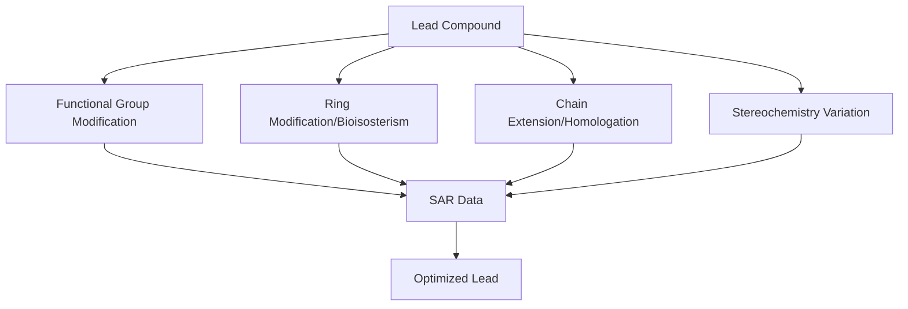

## Structure-Activity Relationships

### Overview

Structure-activity relationship (SAR) analysis systematically correlates chemical structural features with biological activity, forming the empirical and predictive foundation of medicinal chemistry lead optimization. SAR guides rational modification of a lead compound to improve potency, selectivity, and drug-like properties.

### Foundational Concepts

#### The Pharmacophore

A pharmacophore is the ensemble of steric and electronic features necessary for optimal supramolecular interactions with a specific biological target, necessary to trigger (or block) its biological response. Pharmacophore elements typically include:

- Hydrogen bond donor/acceptor positions
- Positively/negatively ionizable centers
- Hydrophobic/aromatic regions
- Defined 3D spatial relationships between these features

Critically, a pharmacophore is an abstract pattern, not a specific functional group — multiple distinct chemical scaffolds can satisfy the same pharmacophore ("scaffold hopping").

#### SAR vs. SPR

- **SAR (Structure-Activity Relationship)**: Correlates structure with a specific biological activity/potency
- **SPR (Structure-Property Relationship)**: Correlates structure with physicochemical properties (solubility, log P, metabolic stability) rather than direct biological activity

Both are integrated during optimization, since potent compounds with poor ADMET properties fail as viable drugs.

### Classical SAR Modification Strategies

**Key Points**

- **Substituent variation**: Systematic addition/removal/replacement of substituents at defined positions to probe steric and electronic tolerance
- **Homologation**: Extending alkyl chains to probe hydrophobic pocket size and optimal chain length
- **Ring contraction/expansion**: Altering ring size to modify geometry and rigidity
- **Bioisosteric replacement**: Substituting groups with similar physicochemical/steric properties to modulate potency, metabolic stability, or physicochemical profile
- **Rigidification**: Constraining conformationally flexible molecules (e.g., via ring fusion) to reduce entropic binding penalty and improve selectivity

### Quantitative SAR (QSAR)

QSAR applies statistical/mathematical modeling to correlate quantifiable molecular descriptors with biological activity, enabling predictive rather than purely empirical structure optimization.

#### The Hansch Approach

The foundational Hansch equation correlates potency with hydrophobic, electronic, and steric parameters:

$$\log(1/C)=a\pi+b\sigma+c\text{E}_s+k$$

where:

- $C$ = molar concentration for equivalent biological response
- $\pi$ = Hansch hydrophobicity substituent constant (analogous to log P contribution)
- $\sigma$ = Hammett electronic substituent constant
- $E_s$ = Taft steric parameter
- $a,b,c,k$ = regression-derived coefficients

**Hammett constants** ($\sigma$) quantify electron-withdrawing/donating character of substituents relative to unsubstituted benzene, derived originally from benzoic acid ionization equilibria:

$$\sigma=\log\left(\frac{K_X}{K_H}\right)$$

Positive $\sigma$ indicates electron-withdrawing substituents; negative indicates electron-donating.

**Hansch hydrophobicity constant** ($\pi$):

$$\pi_X=\log P_X-\log P_H$$

comparing the partition coefficient of a substituted compound to the parent (unsubstituted) compound.

#### 3D-QSAR Methods

- **CoMFA (Comparative Molecular Field Analysis)**: Aligns molecules in 3D space and calculates steric/electrostatic field values at surrounding grid points, correlating field patterns with activity via partial least squares regression
- **CoMSIA (Comparative Molecular Similarity Indices Analysis)**: Extends CoMFA with additional similarity fields (hydrophobic, H-bond donor/acceptor)

[Inference] 3D-QSAR model predictive reliability depends heavily on training set quality, molecular alignment accuracy, and applicability domain — extrapolation beyond the chemical space of the training set often produces unreliable predictions.

### Bioisosterism in SAR

Bioisosteres are substituents or groups possessing similar physical/chemical properties that produce broadly similar biological effects, used to fine-tune SAR profiles.

**Classical bioisosteres** (similar valence/size):

| Group | Common Bioisosteres |
| --- | --- |
| -OH | -NH₂, -SH, -F |
| -COOH | -SO₃H, -PO₃H₂, tetrazole |
| C=O | C=S, C=NH |

**Non-classical bioisosteres** (functionally similar, different valence/structure):

| Group | Bioisostere | Purpose |
| --- | --- | --- |
| Amide (-CONH-) | Sulfonamide, alkene | Metabolic stability, geometry |
| Carboxylic acid | Acyl sulfonamide, tetrazole | Retain acidity, improve permeability |
| Aromatic ring | Saturated ring/heterocycle | 3D character, reduce metabolic liability |

### SAR and Stereochemistry

Since biological targets are inherently chiral (proteins composed of L-amino acids), enantiomers frequently exhibit dramatically different biological activities — a critical SAR consideration:

$$\text{Eudismic ratio}=\frac{\text{activity of eutomer}}{\text{activity of distomer}}$$

where the eutomer is the more active enantiomer and distomer the less active one. A high eudismic ratio indicates strong stereoselectivity in target binding, implying a well-defined, sterically demanding binding pocket.

[Inference] Historical cases of dramatically divergent enantiomer toxicity/activity (e.g., thalidomide) underscore why stereochemical SAR characterization is now standard practice, though the specific mechanistic basis for enantiomer-dependent toxicity can be compound-specific and not always fully elucidated.

### Matched Molecular Pair Analysis (MMPA)

A modern computational SAR technique that identifies pairs of compounds differing by a single, well-defined structural transformation (e.g., H → F substitution) across large datasets, statistically quantifying the average property/activity change attributable to that specific transformation. This provides a data-driven complement to traditional single-series SAR analysis, particularly valuable when mining large historical medicinal chemistry datasets.

### Free-Wilson Analysis

An alternative additive SAR model (complementary to Hansch analysis) that treats each substituent's contribution as an independent additive term without requiring physicochemical descriptor parameterization:

$$\text{Activity}=\sum_i a_iX_i+\mu$$

where $X_i$ indicates presence/absence of substituent $i$ at a given position, $a_i$ is its activity contribution, and $\mu$ is the reference activity. Useful when a congeneric series shares a common core scaffold with defined substitution positions.

### Activity Cliffs

An "activity cliff" describes cases where a minor structural change produces a disproportionately large change in biological activity, violating the general SAR assumption of smooth structure-activity continuity. These are of particular interest because they often reveal critical, highly specific binding interactions (e.g., a single hydrogen bond or steric clash) and can pose challenges for QSAR model predictive accuracy near such discontinuities.

### Practical SAR Workflow in Lead Optimization

**Key Points**

- **Analog synthesis**: Iterative synthesis of structural analogs guided by prior SAR data
- **Biological testing**: Consistent assay conditions essential for comparable SAR data across analog series
- **SAR table construction**: Systematic tabulation of structural variants against potency/selectivity/ADMET data
- **Design-Make-Test-Analyze (DMTA) cycle**: Iterative optimization loop central to modern medicinal chemistry practice
- **Multiparameter optimization**: Balancing potency SAR against selectivity, solubility, and metabolic stability SAR simultaneously

SAR trends derived from a given congeneric series and assay system may not directly translate to structurally distinct scaffolds or different biological assay formats; care is generally warranted when extrapolating SAR conclusions across different chemical series or experimental conditions.

**Related Topics**

- Principles of drug design
- Bioisosterism and scaffold hopping strategies
- Computational/structure-based drug design methods
- Stereochemistry in pharmaceutical chemistry
- Enzyme kinetics and inhibition
- Basics of toxicology
- Combinatorial chemistry and high-throughput screening