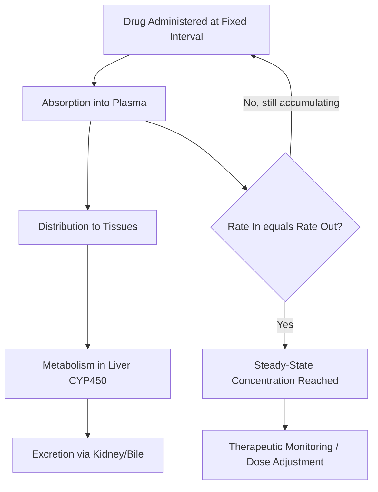

## Basics of Pharmacokinetics and Pharmacodynamics

### Overview

Pharmacokinetics (PK) and pharmacodynamics (PD) are the two complementary disciplines that describe how the body handles a drug and how the drug affects the body, respectively. PK is often summarized as "what the body does to the drug," while PD is "what the drug does to the body." Together they underpin dosing, efficacy, and toxicity in drug design and clinical use.

### Pharmacokinetics (PK)

Pharmacokinetics describes the time-course of drug concentration in the body through four core processes, commonly abbreviated **ADME**.

#### 1. Absorption

The process by which a drug enters systemic circulation from its site of administration.

**Key Points**

- Route of administration (oral, IV, IM, subcutaneous, transdermal, inhalation) strongly affects rate and extent of absorption.
- **Bioavailability ($F$)**: The fraction of an administered dose that reaches systemic circulation unchanged. IV administration has $F = 1$ (100%) by definition.
- **First-pass metabolism**: Oral drugs pass through the liver via the hepatic portal vein before reaching systemic circulation, and may be extensively metabolized before exerting effect, reducing bioavailability.
- Factors affecting absorption: lipid solubility, ionization state (pH-partition hypothesis), particle size, gastric emptying rate, food interactions.

$$F = \frac{AUC_{oral}}{AUC_{IV}} \times \frac{Dose_{IV}}{Dose_{oral}}$$

where $AUC$ is the area under the plasma concentration-time curve.

#### 2. Distribution

The reversible transfer of drug between the bloodstream and body tissues.

- **Volume of distribution ($V_d$)**: A theoretical volume that relates the total amount of drug in the body to the plasma concentration. It does not correspond to a real physiological volume.

$$V_d = \frac{\text{Amount of drug in body}}{\text{Plasma drug concentration}}$$

- A low $V_d$ (~ plasma volume, 3–5 L) suggests the drug remains largely in the vascular compartment (e.g., highly protein-bound drugs).
- A high $V_d$ (> total body water, tens to hundreds of L) suggests extensive tissue distribution (e.g., lipophilic drugs sequestered in fat).
- **Plasma protein binding** (albumin, $\alpha_1$-acid glycoprotein) affects the free (active) fraction of drug available to act and to be eliminated.
- **Blood-brain barrier** and **placental barrier** are selective distribution barriers relevant to CNS drugs and drug safety in pregnancy.

#### 3. Metabolism (Biotransformation)

Chemical modification of a drug, primarily in the liver, to facilitate elimination.

- **Phase I reactions**: Oxidation, reduction, hydrolysis — commonly mediated by **cytochrome P450 (CYP450)** enzymes, introducing or exposing a functional group.
- **Phase II reactions**: Conjugation reactions (glucuronidation, sulfation, acetylation, glutathione conjugation) that increase water solubility for excretion.
- Metabolites may be **inactive**, **active** (contributing to therapeutic effect), or occasionally **toxic** (e.g., reactive intermediates).
- **Prodrugs**: Inactive compounds that require metabolic conversion to become pharmacologically active (e.g., enzymatic activation in vivo).
- **First-order kinetics**: Most drugs are eliminated at a rate proportional to their concentration (constant fraction eliminated per unit time).
- **Zero-order kinetics**: A constant amount is eliminated per unit time, occurring when metabolic enzymes become saturated (e.g., high-dose ethanol, phenytoin at therapeutic doses) — this can lead to disproportionate increases in plasma concentration with small dose increases.

#### 4. Excretion

Removal of drug or metabolites from the body, primarily via the kidneys (renal excretion), and secondarily via bile/feces, lungs, or sweat/saliva.

- **Renal clearance** involves glomerular filtration, active tubular secretion, and passive tubular reabsorption.
- **Clearance ($CL$)**: The volume of plasma from which drug is completely removed per unit time.

$$CL = \frac{\text{Rate of elimination}}{\text{Plasma concentration}}$$

### Key PK Parameters Summary

| Parameter | Symbol | Definition |
| --- | --- | --- |
| Bioavailability | $F$ | Fraction of dose reaching systemic circulation |
| Volume of distribution | $V_d$ | Apparent volume relating dose to plasma concentration |
| Clearance | $CL$ | Volume of plasma cleared of drug per unit time |
| Half-life | $t_{1/2}$ | Time for plasma concentration to reduce by half |
| Elimination rate constant | $k_e$ | First-order rate constant for drug elimination |

**Half-life for first-order elimination:**

$$t_{1/2} = \frac{0.693}{k_e}$$

**First-order elimination equation:**

$$C_t = C_0 \, e^{-k_e t}$$

where $C_t$ is plasma concentration at time $t$, and $C_0$ is initial concentration.

**Relationship between clearance, volume of distribution, and half-life:**

$$t_{1/2} = \frac{0.693 \times V_d}{CL}$$

### Plasma Concentration-Time Curve (svg_diagram)

<svg xmlns="http://www.w3.org/2000/svg" viewBox="0 0 500 320" font-family="sans-serif">
\<style\>
.axis{stroke:#333;stroke-width:2;}
.curve{fill:none;stroke:#33557a;stroke-width:2.5;}
.txt{font-size:12px;fill:#1a1a1a;}
.title{font-size:14px;font-weight:bold;fill:#1a1a1a;text-anchor:middle;}
.dash{stroke:#c0392b;stroke-width:1.5;stroke-dasharray:4,3;}
\</style\>
<text x="250" y="20" class="title">Plasma Concentration vs Time (Oral Dose) (svg_diagram)</text>
<line x1="60" y1="270" x2="460" y2="270" class="axis" />
<line x1="60" y1="270" x2="60" y2="40" class="axis" />
<text x="260" y="300" class="txt">Time</text>
<text x="20" y="150" class="txt" transform="rotate(-90 20,150)">Plasma Conc.</text>
<path d="M 60 270 Q 110 60, 160 90 T 260 160 T 360 210 T 460 245" class="curve" />
<line x1="60" y1="180" x2="460" y2="180" class="dash" />
<text x="465" y="184" class="txt" fill="#c0392b">MEC</text>
<line x1="60" y1="90" x2="460" y2="90" class="dash" />
<text x="465" y="94" class="txt" fill="#c0392b">MTC</text>
<text x="150" y="55" class="txt">Cmax</text>
<line x1="160" y1="90" x2="160" y2="270" stroke="#888" stroke-width="1" stroke-dasharray="2,2" />
<text x="200" y="290" class="txt">Tmax</text>
</svg>

*MEC = Minimum Effective Concentration; MTC = Minimum Toxic Concentration; the region between them is the therapeutic window (therapeutic index range).*

### Pharmacodynamics (PD)

Pharmacodynamics describes the relationship between drug concentration at the site of action and the magnitude of biological response.

#### Drug-Receptor Interactions

**Key Points**

- Most drugs act by binding to specific **receptors** (proteins, enzymes, ion channels, transporters) to produce an effect.
- **Agonist**: Binds a receptor and activates it, producing a biological response.
- **Antagonist**: Binds a receptor without activating it, blocking the action of agonists (competitive or non-competitive).
- **Partial agonist**: Binds and activates a receptor but produces a submaximal response even at full receptor occupancy.
- **Affinity**: The strength of binding between drug and receptor.
- **Efficacy (intrinsic activity)**: The ability of a bound drug to produce a biological response.

#### Dose-Response Relationship

The dose-response curve typically follows a sigmoidal shape when plotted against log(dose).

- **Potency**: Reflected by $EC_{50}$ (concentration producing 50% of maximal effect) — a lower $EC_{50}$ indicates higher potency.
- **Efficacy ($E_{max}$)**: The maximum effect achievable, regardless of further dose increase.
- **Therapeutic index (TI)**: A measure of drug safety margin.

$$TI = \frac{TD_{50}}{ED_{50}}$$

where $TD_{50}$ is the dose toxic to 50% of the population and $ED_{50}$ is the dose effective in 50% of the population. A higher TI indicates a wider (safer) margin between effective and toxic doses.

### Dose-Response Curve (svg_diagram)

<svg xmlns="http://www.w3.org/2000/svg" viewBox="0 0 480 300" font-family="sans-serif">
\<style\>
.axis{stroke:#333;stroke-width:2;}
.curveA{fill:none;stroke:#2e7d32;stroke-width:2.5;}
.curveB{fill:none;stroke:#c0392b;stroke-width:2.5;}
.txt{font-size:12px;fill:#1a1a1a;}
.title{font-size:14px;font-weight:bold;fill:#1a1a1a;text-anchor:middle;}
\</style\>
<text x="240" y="20" class="title">Dose-Response Curves: ED50 vs TD50 (svg_diagram)</text>
<line x1="50" y1="260" x2="450" y2="260" class="axis" />
<line x1="50" y1="260" x2="50" y2="40" class="axis" />
<text x="240" y="285" class="txt">Log Dose</text>
<text x="15" y="150" class="txt" transform="rotate(-90 15,150)">% Response</text>
<path d="M 60 255 C 120 255, 140 60, 220 55" class="curveA" />
<path d="M 90 255 C 160 255, 200 60, 300 55" class="curveB" />
<text x="140" y="45" class="txt" fill="#2e7d32">Efficacy curve (ED50)</text>
<text x="290" y="45" class="txt" fill="#c0392b">Toxicity curve (TD50)</text>
</svg>

### Types of Receptor Antagonism

| Type | Mechanism | Effect on Dose-Response Curve |
| --- | --- | --- |
| Competitive (reversible) | Binds same site as agonist, displaceable with excess agonist | Shifts curve right, $E_{max}$ unchanged |
| Competitive (irreversible) | Binds same site, covalently/permanently | Shifts curve right, reduces $E_{max}$ at high antagonist levels |
| Non-competitive | Binds allosteric site, not displaceable by agonist | Reduces $E_{max}$, $EC_{50}$ largely unchanged |
| Physiological | Acts on different receptor, opposing physiological effect | Depends on pathway |

### Integration of PK and PD

**Key Points**

- **PK/PD modeling** links the time-course of drug concentration (PK) to the time-course of effect (PD), essential for rational dosing regimens.
- A drug with a narrow therapeutic index (e.g., warfarin, digoxin, lithium) requires careful monitoring since small PK variations can cause toxicity or therapeutic failure.
- **Steady-state concentration** is reached after approximately 4–5 half-lives of repeated dosing at a fixed interval, where the rate of drug administration equals the rate of elimination.
- Loading doses may be used to rapidly achieve therapeutic plasma concentrations, followed by lower maintenance doses to sustain steady-state.

$$\text{Loading Dose} = \frac{C_{target} \times V_d}{F}$$

$$\text{Maintenance Dose Rate} = CL \times C_{target}$$

### Steady-State Accumulation Flow

### Worked Example

**Problem**: A drug has a clearance of 5 L/h and a volume of distribution of 50 L. Calculate its half-life and the maintenance dose rate needed to sustain a target plasma concentration of 10 mg/L, assuming 100% bioavailability.

**Solution**:

Half-life:

$$t_{1/2} = \frac{0.693 \times V_d}{CL} = \frac{0.693 \times 50}{5} = 6.93 \, \text{hours}$$

Maintenance dose rate:

$$\text{Dose Rate} = CL \times C_{target} = 5 \, L/h \times 10 \, mg/L = 50 \, mg/h$$

**Conclusion**

Pharmacokinetics and pharmacodynamics together form the quantitative foundation of rational drug therapy: PK determines how much drug reaches and persists at the site of action, while PD determines the magnitude and nature of the resulting biological effect. Both are essential to designing safe and effective dosing regimens, particularly for drugs with narrow therapeutic windows.

- [Inference] Specific numeric parameters (half-lives, therapeutic indices, $EC_{50}$ values) vary by individual drug, patient population, and formulation, and should be verified against current pharmacological references rather than generalized.

**Next Steps**

- Drug metabolism enzymes in detail (CYP450 isoforms, genetic polymorphisms, drug-drug interactions)
- Receptor theory and signal transduction pathways (GPCRs, ion channels, enzyme-linked receptors)
- Therapeutic drug monitoring (TDM) and clinical dosing adjustment strategies
- Drug design principles: structure-activity relationships (SAR) and lead optimization
- Toxicokinetics and mechanisms of drug-induced toxicity
- Biopharmaceutics classification system (BCS) and formulation strategies