## The Drug Discovery and Development Pipeline

### Overview

The drug discovery and development pipeline is the sequence of scientific, regulatory, and commercial stages that transform a biological insight into an approved, marketed medicine. The process typically spans 10–15 years and costs on the order of hundreds of millions to billions of dollars per approved drug, with attrition occurring at nearly every stage. [Inference] Published industry cost estimates vary widely by methodology and are debated in the literature.

### Stage 1: Target Identification and Validation

**Key Points**

- A "target" is typically a biomolecule (enzyme, receptor, ion channel, transporter, nucleic acid) implicated in a disease pathway.
- Target identification uses genomics, proteomics, bioinformatics, and disease-model studies to find molecules whose modulation is expected to alter disease outcome.
- Target validation confirms causality using techniques such as gene knockout/knockdown (siRNA, CRISPR-Cas9), transgenic animal models, and correlation of target expression with disease state.
- A validated target should be: (1) linked mechanistically to disease, (2) "druggable" (able to bind a small molecule or biologic with high affinity/selectivity), and (3) accessible (tissue distribution, safety of modulation).

**Example**

The discovery that HMG-CoA reductase controls the rate-limiting step of cholesterol biosynthesis validated it as a target, leading to the statin drug class.

### Stage 2: Hit Identification

**Key Points**

- A "hit" is a compound showing reproducible activity against the target above a defined threshold (e.g., percent inhibition or an initial $IC_{50}$).
- Common approaches:
  - **High-throughput screening (HTS):** automated testing of large compound libraries (10⁴–10⁶ compounds) against the target in biochemical or cell-based assays.
  - **Fragment-based drug discovery (FBDD):** screening small, low-molecular-weight fragments (<300 Da) that bind weakly but efficiently; fragments are then grown/linked into larger leads.
  - **Virtual/in silico screening:** docking compound libraries computationally against a target's 3D structure.
  - **Phenotypic screening:** testing compounds for a desired cellular/organismal effect without a predefined molecular target.
  - **Natural product screening** and **rational/structure-based design** using known ligands or target crystal structures.

### Stage 3: Hit-to-Lead and Lead Optimization

**Key Points**

- Hits are chemically modified to improve potency, selectivity, and drug-like properties, generating "lead compounds."
- **Structure–activity relationship (SAR)** studies systematically vary substituents to map which structural features drive potency and selectivity.
- Optimization simultaneously balances:
  - Potency ($IC_{50}$/$K_i$ against target)
  - Selectivity (versus off-target proteins, related isoforms)
  - **ADMET** properties — Absorption, Distribution, Metabolism, Excretion, Toxicity
  - Physicochemical properties governed by heuristics such as **Lipinski's Rule of Five** (molecular weight ≤ 500 Da, $\log P \leq 5$, ≤ 5 hydrogen bond donors, ≤ 10 hydrogen bond acceptors), used to flag compounds with likely poor oral bioavailability.
- Medicinal chemistry techniques include bioisosteric replacement, scaffold hopping, prodrug design, and stereochemical optimization.

**Example**

$$IC_{50} \text{ (nM)} = \frac{[\text{Inhibitor}]}{\left(\dfrac{V_0}{V_i} - 1\right)}$$

where $V_0$ is uninhibited reaction velocity and $V_i$ is velocity in the presence of inhibitor concentration $[\text{Inhibitor}]$; this relation underlies dose-response curve fitting used to rank lead compounds during optimization.

### Stage 4: Preclinical Development

**Key Points**

- Conducted before human testing, combining in vitro and in vivo studies to establish a safety and pharmacology baseline.
- **Pharmacokinetics (PK):** absorption, distribution, metabolism, excretion — often summarized by parameters such as $C_{max}$, $T_{max}$, half-life ($t_{1/2}$), clearance, and bioavailability ($F$).
- **Pharmacodynamics (PD):** relationship between drug concentration and effect, often modeled using the Hill equation:

  $$E = E_{max} \cdot \frac{[D]^n}{EC_{50}^n + [D]^n}$$

  where $E$ is effect, $[D]$ is drug concentration, $EC_{50}$ is the concentration producing half-maximal effect, and $n$ is the Hill coefficient.
- **Toxicology studies** (GLP-compliant) assess acute, sub-chronic, and chronic toxicity, genotoxicity, carcinogenicity potential, and reproductive toxicity, typically in two species (one rodent, one non-rodent).
- Formulation chemistry and manufacturing process development (CMC — Chemistry, Manufacturing, and Controls) begin in parallel to support later clinical supply.
- Data package is compiled into an **Investigational New Drug (IND)** application (US) or **Clinical Trial Application (CTA)** (EU/other regions) submitted to regulators before human trials can begin.

### Stage 5: Clinical Development

**Phase 0 (Exploratory, optional)**

Microdosing studies in a small number of human subjects to gather preliminary PK data using sub-therapeutic doses.

**Phase I**

- Tests safety, tolerability, PK, and PD in a small cohort (20–100), usually healthy volunteers (oncology trials often use patients instead).
- Establishes maximum tolerated dose (MTD) and dose-limiting toxicities (DLTs).

**Phase II**

- Evaluates efficacy and further safety in a larger patient cohort (100s), often divided into Phase IIa (dose-ranging/proof of concept) and Phase IIb (efficacy confirmation).
- Frequently uses randomized, controlled, sometimes double-blind designs.

**Phase III**

- Large-scale (often 1,000–3,000+ patients), randomized, controlled, typically multi-center and multi-national trials confirming efficacy and monitoring adverse events versus standard of care or placebo.
- Statistical endpoints are pre-specified (primary and secondary endpoints), with significance thresholds (commonly $\alpha = 0.05$) set in advance.

**Key Points**

- Attrition is steep: [Inference] published aggregate industry analyses generally report that only a minority of compounds entering Phase I eventually reach approval, though exact probabilities vary by therapeutic area and dataset.
- Adaptive trial designs, biomarker-driven patient stratification, and surrogate endpoints are increasingly used to improve efficiency.

### Stage 6: Regulatory Review and Approval

**Key Points**

- Sponsor compiles all preclinical and clinical data into a **New Drug Application (NDA)** (small molecules) or **Biologics License Application (BLA)** (biologics) in the US, or a **Marketing Authorization Application (MAA)** in the EU.
- Regulatory bodies (FDA, EMA, PMDA, and others) review efficacy, safety, manufacturing quality, and labeling.
- Expedited pathways exist for high-need therapies: e.g., FDA's Priority Review, Accelerated Approval (based on surrogate endpoints), Breakthrough Therapy Designation, and Fast Track.
- Post-approval, **Phase IV (post-marketing surveillance)** studies monitor long-term safety, rare adverse events, and real-world effectiveness through pharmacovigilance systems.

### Stage 7: Manufacturing and Life-Cycle Management

**Key Points**

- Scale-up from lab to commercial manufacturing requires validated, reproducible synthetic routes compliant with **Good Manufacturing Practice (GMP)**.
- Life-cycle management includes new formulations, new indications, combination products, and generic/biosimilar competition after patent expiry.

### Pipeline Flow Diagram

```mermaid
flowchart LR
    A[Target Identification and Validation] --> B[Hit Identification: HTS, FBDD, Virtual Screening]
    B --> C[Hit-to-Lead and Lead Optimization: SAR, ADMET]
    C --> D[Preclinical Development: PK/PD, Toxicology, IND Filing]
    D --> E[Phase I: Safety, PK, MTD]
    E --> F[Phase II: Efficacy, Dose-ranging]
    F --> G[Phase III: Large-scale Confirmatory Trials]
    G --> H[Regulatory Review: NDA/BLA/MAA]
    H --> I[Approval and Manufacturing Scale-up]
    I --> J[Phase IV: Post-marketing Surveillance]
```

### Attrition Funnel (svg_diagram)

<svg xmlns="http://www.w3.org/2000/svg" viewBox="0 0 700 420">
\<style\>
.stage-text { font-family: sans-serif; font-size: 13px; fill: #1a1a1a; }
.label-text { font-family: sans-serif; font-size: 12px; fill: #ffffff; font-weight: bold; }
.title-text { font-family: sans-serif; font-size: 15px; fill: #1a1a1a; font-weight: bold; }
\</style\>
<text x="350" y="25" text-anchor="middle" class="title-text">Drug Development Attrition Funnel (svg_diagram)</text>
<polygon points="50,45 650,45 590,105 110,105" fill="#4a6fa5" />
<text x="350" y="80" text-anchor="middle" class="label-text">Preclinical Candidates</text>
<polygon points="110,110 590,110 520,170 180,170" fill="#5b7fb5" />
<text x="350" y="145" text-anchor="middle" class="label-text">Phase I</text>
<polygon points="180,175 520,175 460,235 240,235" fill="#6c8fc5" />
<text x="350" y="210" text-anchor="middle" class="label-text">Phase II</text>
<polygon points="240,240 460,240 410,300 290,300" fill="#7d9fd5" />
<text x="350" y="275" text-anchor="middle" class="label-text">Phase III</text>
<polygon points="290,305 410,305 380,365 320,365" fill="#8eafe5" />
<text x="350" y="340" text-anchor="middle" class="label-text">Approval</text>
<text x="660" y="80" text-anchor="end" class="stage-text">Largest pool</text>
<text x="660" y="340" text-anchor="end" class="stage-text">Smallest pool</text>
<text x="350" y="400" text-anchor="middle" class="stage-text">Width is illustrative, not to a specific statistical scale</text>
</svg>

### Common ADMET Screening Parameters

| Parameter | What It Measures | Typical Method |
| --- | --- | --- |
| $\log P$ / $\log D$ | Lipophilicity | Shake-flask, chromatographic |
| Aqueous solubility | Dissolution potential | Kinetic/thermodynamic solubility assay |
| Caco-2 permeability | Intestinal absorption | Cell monolayer transport assay |
| Plasma protein binding | Fraction unbound in circulation | Equilibrium dialysis |
| Microsomal stability | Metabolic clearance | Liver microsome incubation |
| CYP450 inhibition | Drug–drug interaction risk | Isoform-specific fluorogenic assay |
| hERG binding | Cardiotoxicity risk | Patch-clamp electrophysiology |
| Ames test | Mutagenicity | Bacterial reverse mutation assay |

### Worked Example: Lipinski Rule of Five Check

For a candidate compound with MW = 410 Da, $\log P = 3.2$, 2 H-bond donors, 6 H-bond acceptors:

- MW ≤ 500: Pass
- $\log P \leq 5$: Pass
- HBD ≤ 5: Pass
- HBA ≤ 10: Pass

All four criteria are satisfied, so the compound is flagged as having favorable oral drug-likeness by this heuristic. [Note: Ro5 is a screening heuristic, not a guarantee of oral bioavailability; several approved drugs, particularly biologics and some natural-product-derived agents, violate it.]

**Conclusion**

The pipeline functions as a risk-filtering cascade: each stage exists to eliminate compounds likely to fail later, more expensive stages, on the basis of potency, selectivity, safety, or manufacturability. Medicinal chemistry principles (SAR, ADMET optimization) are most heavily applied in the hit-to-lead and lead optimization stages, which bridge basic biology and clinical testing.

**Related Topics**

- Structure-based drug design and molecular docking
- Pharmacokinetic/pharmacodynamic (PK/PD) modeling
- Combinatorial chemistry and HTS library design
- Biologics and monoclonal antibody development pipelines
- Regulatory pathways: orphan drug designation, accelerated approval
- Patent law and market exclusivity in pharmaceuticals
- Personalized medicine and pharmacogenomics in trial design