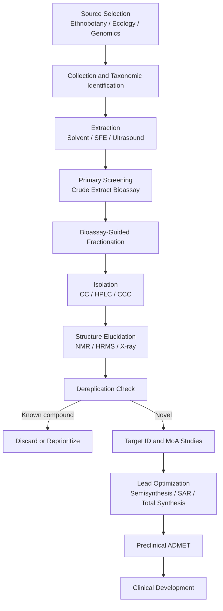

## Natural Products in Drug Discovery

Natural products (NPs) are secondary metabolites produced by plants, microorganisms, marine organisms, and animals. They have been the most productive single source of drug leads in history. Their structural complexity, stereochemical richness, and evolutionary optimization for biological interaction give them chemical space that synthetic libraries often fail to cover. This reference covers the historical context, sources, isolation and characterization workflows, structural features, representative drug classes, modern discovery technologies, optimization strategies, and the challenges of NP-based drug development.

### 1. Historical and Statistical Context

Traditional medicine systems (Ayurveda, Traditional Chinese Medicine, Greco-Arabic medicine, indigenous pharmacopoeias) provided the first empirical leads. The isolation of morphine from *Papaver somniferum* (Sertürner, ~1804) marked the beginning of NP-based pharmaceutical chemistry.

**Key Points**

- Newman and Cragg's periodic reviews (*J. Nat. Prod.*) classify approved small-molecule drugs by origin: unaltered natural product (N), natural product-derived (ND), synthetic with NP pharmacophore (S*), synthetic (S), and biologicals (B, V).
- Across roughly four decades of approvals, a large fraction (frequently cited as around 50-60%) of small-molecule drugs are NPs, NP-derived, or NP-inspired. This share is higher in anti-infective and anticancer therapeutic areas. Exact percentages vary by review period and classification scheme.
- Landmark NP-derived drugs: penicillin (antibacterial), artemisinin (antimalarial), paclitaxel (anticancer), lovastatin (cholesterol-lowering), cyclosporine (immunosuppressant), ivermectin (antiparasitic), and vincristine (anticancer).

### 2. Sources of Natural Products

| Source | Examples | Representative Compounds |
| --- | --- | --- |
| Terrestrial plants | *Taxus brevifolia*, *Artemisia annua*, *Catharanthus roseus*, *Papaver somniferum* | Paclitaxel, artemisinin, vinblastine, morphine |
| Microorganisms (bacteria) | *Streptomyces*, *Actinomycetes*, *Myxobacteria* | Streptomycin, erythromycin, vancomycin, epothilone |
| Fungi | *Penicillium*, *Aspergillus*, *Tolypocladium* | Penicillin, lovastatin, cyclosporine |
| Marine organisms | Sponges, tunicates, cone snails, cyanobacteria | Trabectedin, ziconotide, eribulin (from halichondrin B) |
| Animals | Snakes, frogs, insects | Captopril (from viper venom peptide), exenatide (from Gila monster) |
| Symbionts and endophytes | Plant endophytic fungi, insect-associated bacteria | Taxol-producing endophytes, various antibiotics |
| Human microbiome | Gut and skin commensals | Emerging: lugdunin (from *Staphylococcus lugdunensis*) |

### 3. Structural and Physicochemical Characteristics

NPs differ systematically from typical synthetic screening compounds:

- Higher fraction of sp³-hybridized carbons ($Fsp^3$) and more stereogenic centers.
- Greater oxygen content, lower nitrogen and halogen content (with exceptions such as marine halogenated metabolites).
- More rigid, often polycyclic scaffolds with defined three-dimensional shapes.
- Many violate Lipinski's Rule of Five yet remain orally bioavailable (the "beyond Rule of 5" space), often via active transport or conformational masking (e.g., cyclosporine).

Lipinski's Rule of Five criteria for reference:

$$MW \le 500,\quad \log P \le 5,\quad HBD \le 5,\quad HBA \le 10$$

Fraction of sp³ carbons:

$$Fsp^3 = \frac{\text{number of } sp^3 \text{ carbons}}{\text{total carbon count}}$$

**Key Points**

- Natural products are often described as "privileged structures" because scaffolds evolved to bind protein families (e.g., kinases, tubulin, ribosomal RNA).
- Pseudo-natural products (fragment combinations of NP fragments in non-natural arrangements) aim to retain biological relevance while exploring new chemical space.

### 4. Biosynthetic Origins

Understanding biosynthesis explains scaffold diversity and enables engineering.

| Pathway | Building Blocks | Product Classes |
| --- | --- | --- |
| Polyketide (PKS) | Acetyl-CoA, malonyl-CoA, methylmalonyl-CoA | Macrolides, tetracyclines, polyethers, statins |
| Non-ribosomal peptide (NRPS) | Proteinogenic and non-proteinogenic amino acids | Vancomycin, cyclosporine, daptomycin |
| Terpenoid | Isopentenyl diphosphate (IPP), dimethylallyl diphosphate (DMAPP) via MVA or MEP pathways | Paclitaxel, artemisinin, cannabinoids |
| Alkaloid | Amino acids (Trp, Tyr, Orn, Lys) | Morphine, vinca alkaloids, quinine |
| Shikimate/phenylpropanoid | Chorismate-derived aromatics | Flavonoids, lignans, podophyllotoxin |
| Ribosomally synthesized and post-translationally modified peptides (RiPPs) | Ribosomal precursor peptides | Nisin, thiopeptides, lasso peptides |
| Hybrid PKS-NRPS | Mixed | Epothilone, rapamycin, bleomycin |

Biosynthetic genes are typically clustered in a **biosynthetic gene cluster (BGC)** on the genome, which enables genome-mining approaches.

### 5. Discovery Workflow

The classical pipeline proceeds from source to lead:

1. Source selection (ethnobotanical, chemotaxonomic, ecological, or random collection)
2. Extraction
3. Bioassay-guided fractionation
4. Isolation and purification
5. Structure elucidation
6. Biological characterization and target identification
7. Lead optimization (semisynthesis, total synthesis, SAR)
8. Preclinical and clinical development

### 6. Extraction Techniques

| Technique | Principle | Typical Use |
| --- | --- | --- |
| Maceration | Soaking in solvent at room temperature | Thermolabile compounds |
| Soxhlet extraction | Continuous hot solvent percolation | Stable, low-polarity compounds |
| Ultrasound-assisted extraction (UAE) | Cavitation disrupts cell walls | Faster extraction, lower solvent use |
| Microwave-assisted extraction (MAE) | Dielectric heating | Rapid extraction of polar compounds |
| Supercritical fluid extraction (SFE) | Supercritical CO₂ as solvent, often with co-solvent | Lipophilic compounds, "green" extraction |
| Liquid-liquid partitioning | Differential solubility (e.g., hexane / EtOAc / n-BuOH / water) | Crude fractionation by polarity |
| Acid-base extraction | pH-dependent ionization | Alkaloid enrichment |

**Example: Acid-Base Alkaloid Extraction**

1. Macerate plant material in acidified water (e.g., 1-5% HCl or H₂SO₄); alkaloids form water-soluble salts.
2. Filter and wash the aqueous phase with a nonpolar solvent to remove neutrals and fats.
3. Basify the aqueous phase (e.g., NH₄OH to pH 9-10) to liberate free-base alkaloids.
4. Extract with an organic solvent (e.g., CH₂Cl₂ or CHCl₃).
5. Dry over anhydrous Na₂SO₄ and concentrate under reduced pressure.

### 7. Separation and Purification

**Chromatographic methods**

- **Vacuum liquid chromatography (VLC) and flash chromatography:** initial coarse fractionation on silica or C18.
- **Size-exclusion chromatography (Sephadex LH-20):** separates by molecular size and adsorption; widely used for polyphenols.
- **Preparative and semi-preparative HPLC:** reversed-phase (C18) with gradients of water/acetonitrile or water/methanol, often with 0.1% formic acid.
- **Counter-current chromatography (CCC, HSCCC):** liquid-liquid partition without a solid support; avoids irreversible adsorption.
- **Supercritical fluid chromatography (SFC):** useful for chiral and lipophilic compounds.

The chromatographic resolution between two peaks is:

$$R_s = \frac{2(t_{R2} - t_{R1})}{w_1 + w_2}$$

where $t_R$ are retention times and $w$ are baseline peak widths. $R_s \ge 1.5$ indicates baseline separation.

### 8. Structure Elucidation

| Technique | Information Obtained |
| --- | --- |
| HRMS (ESI-TOF, Orbitrap) | Exact mass and molecular formula; isotope patterns (e.g., Cl, Br) |
| MS/MS | Fragmentation patterns, substructure information |
| 1D NMR (¹H, ¹³C, DEPT) | Proton environments, carbon types |
| 2D NMR (COSY, TOCSY, HSQC, HMBC, NOESY/ROESY) | Connectivity, long-range correlations, relative stereochemistry |
| X-ray crystallography | Absolute configuration (with anomalous scattering), 3D structure |
| Microcrystal electron diffraction (MicroED) | Structures from nanocrystals |
| ECD/VCD and quantum-chemical calculation | Absolute configuration of non-crystalline samples |
| Chemical derivatization (e.g., Mosher's method) | Absolute configuration of secondary alcohols and amines |

Degrees of unsaturation from the molecular formula $C_cH_hN_nX_x$:

$$DBE = c - \frac{h + x}{2} + \frac{n}{2} + 1$$

**Key Points**

- Computational NMR prediction (DP4+, machine-learning-based CASE tools) increasingly supports or corrects assigned structures.
- Structural misassignments in the literature are documented and have been corrected by total synthesis, which remains a definitive proof of structure.

### 9. Dereplication

Dereplication is the rapid identification of known compounds to avoid re-isolating them.

- LC-HRMS with database matching (e.g., Dictionary of Natural Products, COCONUT, NP Atlas, MarinLit, AntiBase).
- **GNPS (Global Natural Products Social Molecular Networking):** groups MS/MS spectra by fragmentation similarity into molecular networks, which visualizes chemical families and highlights novel nodes.
- LC-UV-NMR and LC-SPE-NMR hyphenation.
- Genomic dereplication: comparing BGCs against MIBiG and antiSMASH databases.

### 10. Screening Strategies

**Bioassay types**

- **Target-based screens:** enzyme inhibition, receptor binding (biochemical, high throughput).
- **Phenotypic (cell-based) screens:** cytotoxicity, antimicrobial minimum inhibitory concentration (MIC), reporter gene assays, high-content imaging.
- **In vivo models:** zebrafish, *C. elegans*, murine infection models.

Potency is commonly reported as $IC_{50}$, $EC_{50}$, or MIC. For a dose-response curve, the Hill equation applies:

$$E = E_{max} \frac{[D]^n}{EC_{50}^n + [D]^n}$$

Assay quality is assessed with the Z'-factor:

$$Z' = 1 - \frac{3(\sigma_{p} + \sigma_{n})}{|\mu_{p} - \mu_{n}|}$$

where $\mu$ and $\sigma$ are the means and standard deviations of positive (p) and negative (n) controls. $Z' > 0.5$ indicates an excellent assay.

**Common screening pitfalls with NP extracts**

- Pan-assay interference compounds (PAINS), such as catechols, quinones, and rhodanines, produce false positives.
- Tannins and saponins nonspecifically precipitate proteins or lyse membranes.
- Fluorescent or colored compounds interfere with optical readouts.
- Prefractionated NP libraries reduce interference and improve hit rates compared with crude extracts.

### 11. Target Identification and Mechanism of Action

| Approach | Description |
| --- | --- |
| Affinity chromatography / pull-down | Immobilized NP captures binding proteins from lysate |
| Activity-based protein profiling (ABPP) | Covalent probes reveal enzyme targets |
| Cellular thermal shift assay (CETSA), thermal proteome profiling | Ligand binding alters protein thermal stability |
| Drug affinity responsive target stability (DARTS) | Ligand binding protects against proteolysis |
| Chemical genetics / resistance mutations | Sequencing resistant mutants points to target |
| Transcriptional and morphological profiling | Compare signatures with reference compounds (e.g., Cell Painting) |
| CRISPR screens | Genetic modifiers of NP sensitivity |
| Computational inverse docking and similarity ensemble approaches | In silico target prediction |

### 12. Representative Drug Classes and Case Studies

#### 12.1 Anticancer Agents

- **Paclitaxel (Taxol):** diterpenoid from *Taxus brevifolia*; stabilizes microtubules by binding β-tubulin, arresting mitosis. Supply was initially limited by low bark yield; solved through semisynthesis from 10-deacetylbaccatin III (from needles of *Taxus baccata*) and plant cell fermentation.
- **Vinca alkaloids (vincristine, vinblastine):** from *Catharanthus roseus*; inhibit microtubule polymerization. Semisynthetic derivatives include vinorelbine.
- **Camptothecin:** quinoline alkaloid from *Camptotheca acuminata*; inhibits topoisomerase I. Derivatives: topotecan, irinotecan.
- **Podophyllotoxin:** lignan; derivatives etoposide and teniposide inhibit topoisomerase II.
- **Anthracyclines (doxorubicin):** from *Streptomyces peucetius*; DNA intercalation and topoisomerase II poisoning.
- **Trabectedin:** from the tunicate *Ecteinascidia turbinata*; DNA minor-groove alkylator. Now produced semisynthetically from safracin B.
- **Eribulin:** fully synthetic macrocyclic ketone analog of halichondrin B (from the sponge *Halichondria okadai*).
- **Epothilones (ixabepilone):** myxobacterial polyketides that stabilize microtubules; active in some taxane-resistant contexts.

#### 12.2 Anti-Infectives

- **β-Lactams (penicillins, cephalosporins, carbapenems):** inhibit penicillin-binding proteins (transpeptidases) in cell wall synthesis.
- **Aminoglycosides (streptomycin, gentamicin):** bind the 30S ribosomal subunit.
- **Macrolides (erythromycin, azithromycin):** bind the 50S subunit; azithromycin is semisynthetic.
- **Tetracyclines:** 30S subunit inhibitors; polyketide origin.
- **Glycopeptides (vancomycin):** bind D-Ala-D-Ala termini of lipid II, blocking cell wall cross-linking.
- **Daptomycin:** cyclic lipopeptide that disrupts membrane function in Gram-positive bacteria.
- **Artemisinin:** sesquiterpene lactone endoperoxide from *Artemisia annua*; iron-mediated activation produces radicals that damage parasite proteins. Derivatives: artesunate, artemether. Semi-synthetic production uses engineered yeast producing artemisinic acid.
- **Ivermectin:** avermectin macrocyclic lactone from *Streptomyces avermitilis*; targets glutamate-gated chloride channels in invertebrates.

#### 12.3 Cardiovascular and Metabolic Agents

- **Statins (lovastatin, simvastatin, pravastatin):** fungal polyketide-derived HMG-CoA reductase inhibitors. Lovastatin was isolated from *Aspergillus terreus*.
- **Digoxin:** cardiac glycoside from *Digitalis lanata*; inhibits Na⁺/K⁺-ATPase.
- **Captopril:** designed from the structure of a peptide in *Bothrops jararaca* venom; an angiotensin-converting enzyme (ACE) inhibitor.
- **Metformin (NP-inspired):** derived from guanidine-rich *Galega officinalis* (French lilac).
- **GLP-1 receptor agonists (exenatide):** derived from exendin-4, a peptide in Gila monster saliva.

#### 12.4 Immunosuppressants

- **Cyclosporine A:** cyclic undecapeptide from *Tolypocladium inflatum*; complexes with cyclophilin and inhibits calcineurin.
- **Tacrolimus (FK506) and sirolimus (rapamycin):** macrolides from *Streptomyces*; bind FKBP12. The tacrolimus complex inhibits calcineurin, while the sirolimus complex inhibits mTOR.

#### 12.5 Analgesics and CNS Agents

- **Morphine and codeine:** opium alkaloids acting on μ-opioid receptors.
- **Ziconotide:** synthetic version of ω-conotoxin MVIIA from *Conus magus*; N-type calcium channel blocker for severe chronic pain.
- **Galantamine:** Amaryllidaceae alkaloid; acetylcholinesterase inhibitor.
- **Physostigmine and derivatives (rivastigmine):** cholinesterase inhibitors.

### 13. Lead Optimization of Natural Products

**Strategies**

| Strategy | Description | Example |
| --- | --- | --- |
| Semisynthesis | Chemical modification of an isolated NP | Azithromycin from erythromycin; docetaxel from 10-deacetylbaccatin III |
| Total synthesis | Complete laboratory construction | Eribulin |
| Diverted total synthesis (DTS) | Modify the synthetic route to make analogs inaccessible from the natural material | Discodermolide, bryostatin analogs |
| Function-oriented synthesis (FOS) | Design simpler scaffolds retaining the pharmacophore | Bryostatin analogs (bryologs) |
| Biosynthetic engineering | Modify PKS/NRPS modules, swap domains, precursor-directed biosynthesis | Novel erythromycin and rapamycin analogs |
| Mutasynthesis | Blocked-mutant strain fed with unnatural starter units | Analog libraries of ansamitocin |
| Prodrug strategies | Improve solubility or delivery | Water-soluble irinotecan (prodrug of SN-38) |
| Antibody-drug conjugates (ADCs) | NP cytotoxin as payload | Monomethyl auristatin E (from dolastatin 10) in brentuximab vedotin; maytansinoids in trastuzumab emtansine |

**Key Points**

- Structure-activity relationship (SAR) analysis identifies the pharmacophore (essential for activity) versus modifiable positions (for improving ADMET).
- Ligand efficiency and lipophilic efficiency guide optimization:

$$LE = \frac{-\Delta G}{N_{heavy}} \approx \frac{1.37 \cdot pIC_{50}}{N_{heavy}} \quad (\text{kcal/mol per heavy atom, at 298 K})$$

$$LLE = pIC_{50} - \log P$$

### 14. Modern Technologies Revitalizing NP Discovery

#### 14.1 Genome Mining

- Sequencing reveals that microbial genomes encode far more BGCs than the number of metabolites observed under lab conditions ("cryptic" or "silent" clusters).
- **Tools:** antiSMASH (BGC detection and annotation), PRISM, BiG-SCAPE (BGC networking), MIBiG (curated reference BGC repository), DeepBGC (machine-learning detection).
- **Activation of silent clusters:** OSMAC (One Strain Many Compounds) cultivation variation, co-culture, epigenetic modifiers (HDAC inhibitors, DNA methyltransferase inhibitors), promoter replacement, ribosome engineering, and CRISPR-based activation.
- **Heterologous expression:** cloning BGCs into tractable hosts (*Streptomyces coelicolor*, *S. albus*, *Aspergillus nidulans*, *E. coli*, *Saccharomyces cerevisiae*).

#### 14.2 Metagenomics

Environmental DNA (eDNA) from soil and marine sediments captures the ~99% of microbes that are uncultured. Functional metagenomics expresses eDNA libraries in surrogate hosts; sequence-based approaches locate BGCs directly.

#### 14.3 Synthetic Biology and Metabolic Engineering

- Engineered yeast produces artemisinic acid; engineered microbes produce opioid precursors and other alkaloids.
- Plant cell culture and hairy root cultures produce paclitaxel and other metabolites.
- Plant biosynthetic pathway elucidation increasingly uses transcriptomics, co-expression analysis, and transient expression in *Nicotiana benthamiana*.

#### 14.4 Metabolomics and Molecular Networking

- LC-MS/MS-based untargeted metabolomics, combined with GNPS, prioritizes novel chemistry.
- Feature-based molecular networking (FBMN) and ion identity molecular networking link chemical features across samples.
- Integrating metabolomic and genomic data (e.g., paired omics, NPLinker) links BGCs to their products.

#### 14.5 Computational and AI Approaches

- Virtual screening of NP databases (COCONUT, ZINC NP subsets, NPASS).
- Machine learning for bioactivity prediction, retrosynthesis, and NMR-based structure prediction.
- Chemoinformatic descriptors capture NP-likeness scores to prioritize NP-like scaffolds in libraries.
- [Inference] Deep-learning models trained on BGC-to-structure data are likely to improve automated prediction of products from genomic sequence, although accuracy remains variable across compound classes.

#### 14.6 Prefractionated Libraries and DNA-Encoded Approaches

- NCI Natural Products Repository and similar prefractionated libraries reduce complexity for high-throughput screening.
- Diversity-oriented synthesis and biology-oriented synthesis build NP-inspired libraries.

### 15. Illustrative Workflow Example

**Example: Bioassay-guided isolation of an antibacterial compound from an actinomycete**

1. **Cultivation:** ferment *Streptomyces* sp. in multiple media (OSMAC) for 7-14 days.
2. **Extraction:** extract broth with ethyl acetate; extract mycelium with methanol.
3. **Primary screen:** test crude extracts against *Staphylococcus aureus* (including MRSA) using broth microdilution.
4. **Dereplication:** LC-HRMS/MS profile submitted to GNPS; match against known antibiotics.
5. **Fractionation:** C18 flash chromatography (water/MeOH gradient), then semi-preparative HPLC of active fractions.
6. **Structure elucidation:** HRMS gives molecular formula; 1D/2D NMR resolves connectivity; ECD or X-ray defines absolute stereochemistry.
7. **Genome mining:** sequence the strain, use antiSMASH to locate the BGC responsible; confirm by gene knockout.
8. **Mechanism studies:** resistant-mutant sequencing; macromolecular synthesis assays (DNA, RNA, protein, cell wall incorporation of radiolabeled precursors).
9. **Optimization:** semisynthetic modification at tolerant positions; ADMET profiling.

**Output** (illustrative, hypothetical data)

| Compound | MIC vs MSSA (µg/mL) | MIC vs MRSA (µg/mL) | HepG2 CC₅₀ (µg/mL) | Selectivity Index |
| --- | --- | --- | --- | --- |
| Crude extract | 32 | 32 | 100 | ~3 |
| Fraction F4 | 4 | 4 | >100 | >25 |
| Pure compound 1 | 0.5 | 1 | >100 | >100 |

The selectivity index is:

$$SI = \frac{CC_{50}}{MIC}$$

### 16. Illustration: Sources-to-Drug Landscape

<svg xmlns="http://www.w3.org/2000/svg" viewBox="0 0 720 360" width="720" height="360" font-family="Arial, Helvetica, sans-serif">
<title>Natural Product Sources to Drug Classes (svg_diagram)</title>
<text x="360" y="24" text-anchor="middle" font-size="16" font-weight="bold">Natural Product Sources to Drug Classes (svg_diagram)</text>
<rect x="20" y="50" width="150" height="45" rx="8" fill="#d8f0d0" stroke="#3a7d2c" />
<text x="95" y="77" text-anchor="middle" font-size="13">Plants</text>
<rect x="20" y="115" width="150" height="45" rx="8" fill="#d0e4f5" stroke="#2c5f8a" />
<text x="95" y="142" text-anchor="middle" font-size="13">Bacteria / Actinomycetes</text>
<rect x="20" y="180" width="150" height="45" rx="8" fill="#f5e6c8" stroke="#8a6a2c" />
<text x="95" y="207" text-anchor="middle" font-size="13">Fungi</text>
<rect x="20" y="245" width="150" height="45" rx="8" fill="#e6d0f0" stroke="#6a2c8a" />
<text x="95" y="272" text-anchor="middle" font-size="13">Marine Organisms</text>
<rect x="20" y="310" width="150" height="40" rx="8" fill="#f5d0d0" stroke="#8a2c2c" />
<text x="95" y="335" text-anchor="middle" font-size="13">Animals / Venoms</text>
<rect x="290" y="50" width="140" height="300" rx="10" fill="#f2f2f2" stroke="#666" />
<text x="360" y="80" text-anchor="middle" font-size="13" font-weight="bold">Discovery Engine</text>
<text x="360" y="110" text-anchor="middle" font-size="11">Extraction</text>
<text x="360" y="140" text-anchor="middle" font-size="11">Fractionation</text>
<text x="360" y="170" text-anchor="middle" font-size="11">Bioassay</text>
<text x="360" y="200" text-anchor="middle" font-size="11">Dereplication</text>
<text x="360" y="230" text-anchor="middle" font-size="11">Genome Mining</text>
<text x="360" y="260" text-anchor="middle" font-size="11">Structure Elucidation</text>
<text x="360" y="290" text-anchor="middle" font-size="11">Optimization</text>
<rect x="550" y="50" width="150" height="45" rx="8" fill="#fff" stroke="#333" />
<text x="625" y="77" text-anchor="middle" font-size="12">Anticancer (paclitaxel)</text>
<rect x="550" y="115" width="150" height="45" rx="8" fill="#fff" stroke="#333" />
<text x="625" y="142" text-anchor="middle" font-size="12">Anti-infective (penicillin)</text>
<rect x="550" y="180" width="150" height="45" rx="8" fill="#fff" stroke="#333" />
<text x="625" y="207" text-anchor="middle" font-size="12">Cardiovascular (statins)</text>
<rect x="550" y="245" width="150" height="45" rx="8" fill="#fff" stroke="#333" />
<text x="625" y="272" text-anchor="middle" font-size="12">Immunosuppressant (CsA)</text>
<rect x="550" y="310" width="150" height="40" rx="8" fill="#fff" stroke="#333" />
<text x="625" y="335" text-anchor="middle" font-size="12">Analgesic (morphine)</text>
<line x1="170" y1="72" x2="290" y2="150" stroke="#555" stroke-width="1.5" />
<line x1="170" y1="137" x2="290" y2="170" stroke="#555" stroke-width="1.5" />
<line x1="170" y1="202" x2="290" y2="190" stroke="#555" stroke-width="1.5" />
<line x1="170" y1="267" x2="290" y2="210" stroke="#555" stroke-width="1.5" />
<line x1="170" y1="330" x2="290" y2="230" stroke="#555" stroke-width="1.5" />
<line x1="430" y1="150" x2="550" y2="72" stroke="#555" stroke-width="1.5" />
<line x1="430" y1="170" x2="550" y2="137" stroke="#555" stroke-width="1.5" />
<line x1="430" y1="190" x2="550" y2="202" stroke="#555" stroke-width="1.5" />
<line x1="430" y1="210" x2="550" y2="267" stroke="#555" stroke-width="1.5" />
<line x1="430" y1="230" x2="550" y2="332" stroke="#555" stroke-width="1.5" />
</svg>

### 17. Challenges and Limitations

| Challenge | Description | Mitigation |
| --- | --- | --- |
| Supply and sustainability | Low natural abundance, overharvesting (e.g., *Taxus* bark) | Semisynthesis, cell culture, synthetic biology, total synthesis |
| Rediscovery | High frequency of known compounds | Dereplication, genome mining, unexplored ecological niches |
| Structural complexity | Difficult synthesis and analoging | DTS, FOS, biosynthetic engineering |
| Screening compatibility | Extract interference, PAINS | Prefractionation, orthogonal assays |
| ADMET liabilities | Poor solubility, metabolic instability, toxicity | Prodrugs, formulation, targeted delivery (ADCs, nanoparticles) |
| Access and benefit sharing | Legal obligations regarding genetic resources | Compliance with the Convention on Biological Diversity and the Nagoya Protocol |
| Intellectual property | Prior art from traditional knowledge, patentability of unmodified NPs | Documentation, benefit-sharing agreements; patent-eligibility rules vary by jurisdiction |
| Time and resources | Slower than combinatorial library screening in some cases | Automation, integrated omics workflows |

### 18. Ethical and Regulatory Considerations

- **Nagoya Protocol (2010):** governs access to genetic resources and fair sharing of benefits.
- **Traditional knowledge:** research based on ethnopharmacological leads should involve prior informed consent and benefit sharing with source communities.
- **Regulatory pathway:** NPs follow standard drug approval routes; botanical drugs and herbal products follow separate frameworks (e.g., FDA Botanical Drug guidance, EMA herbal medicinal product regulations), and requirements vary by jurisdiction.
- **Standardization and quality control:** for herbal preparations, chemical fingerprinting (HPLC, HPTLC) and marker-compound quantification ensure batch consistency.

### 19. Conclusion

**Conclusion**

Natural products remain a central pillar of drug discovery because evolution has selected them for biological relevance, delivering scaffolds with high stereochemical and functional complexity that occupy regions of chemical space poorly accessed by conventional libraries. Historical limitations, notably rediscovery, supply, and screening incompatibility, are increasingly addressed by genome mining, metabolomics-guided dereplication, synthetic biology, function-oriented synthesis, and computational methods. The integration of these tools is expected to sustain NPs as a leading source of novel antibiotics, anticancer agents, immunomodulators, and other therapeutics.

**Related Topics**

- Semisynthesis of paclitaxel and docetaxel
- Polyketide synthase (PKS) and non-ribosomal peptide synthetase (NRPS) enzymology
- Molecular networking with GNPS
- antiSMASH and BiG-SCAPE workflows for genome mining
- Total synthesis of complex natural products
- Antibiotic resistance and novel antibacterial discovery
- Antibody-drug conjugate payloads derived from natural products
- Pseudo-natural products and biology-oriented synthesis
- Ethnopharmacology and traditional medicine validation
- Marine natural products chemistry
- Peptide and RiPP natural products
- Structure-activity relationships and pharmacophore modeling