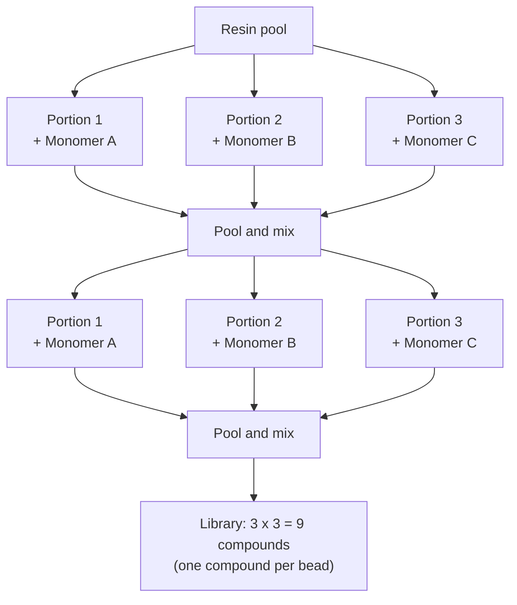

## Combinatorial Chemistry

Combinatorial chemistry is the systematic, parallel synthesis of large numbers of structurally related compounds (a **library**) from a defined set of building blocks, followed by high-throughput screening (HTS) to identify hits. It emerged in the late 1980s and 1990s in response to the need to feed HTS campaigns with far more compounds than traditional one-at-a-time medicinal chemistry could deliver. This reference covers the theoretical basis, solid-phase and solution-phase methodologies, library design, encoding and deconvolution strategies, dynamic and DNA-encoded approaches, analytical and screening considerations, case studies, and the historical lessons that shaped modern practice.

### 1. Conceptual Foundations

The central idea is that the number of products grows multiplicatively with the number of building blocks. For a library built from $n$ diversity positions (points of variation), with $b_i$ building blocks available at position $i$:

$$N_{\text{library}} = \prod_{i=1}^{n} b_i$$

**Example**

A three-component library with 20 amines, 30 acids, and 40 aldehydes yields:

$$N = 20 \times 30 \times 40 = 24{,}000 \text{ compounds}$$

while requiring only $20 + 30 + 40 = 90$ building blocks in stock. This is the economy of the combinatorial approach.

**Key Points**

- **Library:** a collection of compounds sharing a common scaffold or reaction type, varied at defined positions.
- **Building block (monomer):** a reagent contributing a variable fragment (e.g., amino acids, amines, carboxylic acids, aldehydes, boronic acids).
- **Scaffold (core):** the constant structural framework that carries the diversity elements.
- **Diversity elements (R-groups):** the variable substituents introduced at each position.
- **Hit:** a library member showing activity above a defined threshold in a screen.
- **Deconvolution:** identification of the active structure(s) from a mixture or pool.

### 2. Historical Development

| Period | Milestone |
| --- | --- |
| 1963 | Merrifield introduces solid-phase peptide synthesis (SPPS), the technical foundation for solid-supported library synthesis |
| 1984 | Geysen develops multipin peptide synthesis for epitope mapping (parallel synthesis) |
| 1985 | Houghten's "tea-bag" method for parallel peptide synthesis |
| 1991 | Split-mix (split-and-pool) synthesis introduced (Furka; Lam et al.; Houghten et al.) |
| 1992 | Bunin and Ellman report solid-phase synthesis of benzodiazepine libraries, extending combinatorial methods to small molecules |
| 1993-1995 | Encoded libraries (Brenner-Lerner DNA encoding; Still's chemical tags) |
| Late 1990s | Rise of automated parallel synthesizers, commercial library vendors, and "make everything" strategies |
| 2000s | Shift toward focused, drug-like, and diversity-oriented libraries; integration with virtual screening |
| 2009-present | DNA-encoded libraries (DELs) revive large-scale combinatorial approaches with billions of members |

### 3. Core Methodologies

#### 3.1 Solid-Phase Synthesis

The substrate is attached to an insoluble polymeric support (bead), enabling excess reagents and by-products to be removed by simple filtration and washing.

**Components of the solid-phase system**

- **Resin:** polystyrene cross-linked with divinylbenzene (1-2% DVB, gel-type), PEG-grafted polystyrene (TentaGel, ArgoGel), polyacrylamide-based, or controlled-pore glass.
- **Linker:** a cleavable bridge between the resin and the substrate. The linker dictates the cleavage conditions and the C-terminal functionality of the product.
- **Protecting groups:** temporary (e.g., Fmoc, base-labile) and permanent (e.g., tBu, Boc, Trt, acid-labile) protection schemes that are orthogonal.

| Linker | Cleavage Condition | Product Functionality |
| --- | --- | --- |
| Wang | TFA (50-95%) | Carboxylic acid |
| Rink amide | TFA (~95%) | Primary amide |
| 2-Chlorotrityl | Dilute TFA or AcOH/TFE/DCM (very mild) | Protected acid |
| Merrifield (chloromethyl) | HF or strong acid | Carboxylic acid |
| Sasrin | 1% TFA | Acid |
| Photolabile (o-nitrobenzyl) | UV irradiation (~350 nm) | Acid, amide |
| Safety-catch (e.g., Kenner sulfonamide) | Activation (alkylation), then nucleophilic displacement | Acid derivatives, esters, amides |
| Traceless (e.g., silyl, germanium linkers) | Specific cleavage leaves no linker residue (C-H) | Unfunctionalized product |

**Advantages**

- Excess reagents drive reactions to completion; purification reduces to washing.
- Amenable to automation.
- Enables split-and-pool synthesis.

**Limitations**

- Reaction development and optimization on resin are slower than in solution.
- Limited to reactions compatible with the support and linker.
- Difficult direct reaction monitoring (requires cleavage of test aliquots, or on-bead IR/gel-phase NMR/magic angle spinning NMR).
- Limited loading capacity (typically 0.2-1.5 mmol/g).

#### 3.2 Solution-Phase Combinatorial Synthesis

Reactions are run in solution, often in multi-well plates, with parallel purification strategies.

**Purification and workup strategies**

- **Polymer-supported reagents:** e.g., polymer-bound carbodiimide, borohydride, or triphenylphosphine, removed by filtration.
- **Scavenger resins:** e.g., isocyanate resin to scavenge excess amine; trisamine resin to scavenge excess electrophile; sulfonic acid resins (SCX) for amines.
- **Catch-and-release:** the product is captured selectively on a resin (e.g., SCX for basic amines), impurities are washed away, and the product is released.
- **Liquid-liquid extraction (LLE) and solid-phase extraction (SPE).**
- **Fluorous synthesis:** a perfluoroalkyl tag enables separation by fluorous solid-phase extraction.
- **Multi-component reactions (MCRs):** e.g., Ugi, Passerini, Biginelli, Hantzsch, Gewald, and Petasis reactions, which combine three or more components in one pot and are naturally suited to library synthesis.

**Example: Ugi Four-Component Reaction (Ugi-4CR)**

$$R^1\text{CHO} + R^2\text{NH}_2 + R^3\text{COOH} + R^4\text{NC} \longrightarrow R^3\text{C(=O)N}(R^2)\text{CH}(R^1)\text{C(=O)NHR}^4$$

With 50 aldehydes, 50 amines, 50 acids, and 50 isocyanides, the accessible library size is $50^4 = 6.25 \times 10^6$ compounds.

#### 3.3 Parallel Synthesis

Each compound is synthesized in a separate, spatially addressed vessel (well, tube, pin, tea-bag). Identity is known from position, so no encoding or deconvolution is required.

- **Formats:** 96-well and 384-well plates, reactor blocks, multipin crowns, automated synthesizers.
- **Output:** typically one discrete compound per well in milligram to sub-milligram quantities, enabling direct IC₅₀ determination.
- **Best suited for:** focused libraries and lead optimization (tens to thousands of compounds).

#### 3.4 Split-and-Pool (Split-Mix) Synthesis

This method generates enormous one-bead-one-compound (OBOC) libraries.

**Procedure**

1. **Split:** divide the resin into $b$ equal portions.
2. **Couple:** react each portion with a different building block.
3. **Pool:** combine all portions and mix thoroughly.
4. Repeat for each subsequent diversity position.

After $n$ cycles with $b$ building blocks per cycle, the library contains $b^n$ distinct compounds, but only $b \times n$ coupling reactions are performed.

$$N = b^{n}, \qquad \text{reactions performed} = b \cdot n$$

**Example**

Using 20 amino acids over 5 positions gives $20^5 = 3.2 \times 10^6$ pentapeptides via only $20 \times 5 = 100$ coupling operations.

**Key Points**

- Each bead carries many copies of a single compound (roughly $10^{13}$ molecules per 100 µm bead, depending on loading), sufficient for screening but typically insufficient for full characterization.
- Statistical sampling matters: to cover a library of $N$ members with probability $P$, the number of beads screened must exceed approximately $N \ln\left(\frac{1}{1-P}\right)$. For 95% coverage, roughly $3N$ beads are required.

$$n_{\text{beads}} \approx N \cdot \ln\!\left(\frac{1}{1 - P}\right)$$

#### 3.5 Mixture Libraries (Pooled Synthesis in Solution)

Compounds are made and tested as mixtures. Two classical deconvolution schemes exist:

- **Iterative deconvolution (Houghten):** active mixtures are resynthesized with one defined position at a time; the process repeats until a single active compound is identified.
- **Positional scanning:** separate sublibraries with one position fixed (each monomer in turn) and the others randomized; activity at each position identifies the best monomer independently. Requires a single round of synthesis and screening but assumes additivity of contributions.

**Key Points**

- Mixture screening risks false negatives (antagonistic effects, low concentration of individual actives) and false positives (synergistic or additive weak binders).
- Mixtures declined in favor of single-compound libraries as quality expectations rose.

### 4. Encoding and Deconvolution Strategies

In split-and-pool libraries, the structure of a hit bead is not evident, so encoding schemes record synthetic history.

| Method | Principle |
| --- | --- |
| Direct sequencing | Peptide or oligomer libraries: Edman degradation or MS/MS sequencing of the hit bead |
| Chemical (molecular) tagging (Still) | Halogenated aromatic tags attached in binary code; read by electron-capture gas chromatography |
| Oligonucleotide tags (Brenner-Lerner) | DNA barcodes appended in parallel with each coupling; amplified by PCR and sequenced |
| Peptide tags | Sequenceable peptide co-synthesized as a code |
| Radio-frequency encoding | Microreactors containing RF tags that record reaction history (e.g., IRORI Kans) |
| Optical encoding (color/fluorescence) | Color-coded or spectrally barcoded beads |
| Photolithographic spatial addressing | Light-directed synthesis on a chip; location identifies structure (Affymax, Fodor) |
| Mass spectrometry-based decoding | Ladder synthesis with capping, or MS-encoded fragments (e.g., MALDI-TOF of a single bead with topologically segregated tag) |

**Binary encoding capacity**

With $k$ distinct tags used in a binary code, up to $2^{k}$ distinct synthetic histories can be encoded:

$$N_{\text{encodable}} = 2^{k}$$

### 5. DNA-Encoded Libraries (DELs)

DELs attach each small molecule covalently to a unique DNA barcode that records its synthetic history. The entire pooled library is screened by affinity selection against an immobilized or labeled target; the binders are amplified by PCR and identified by next-generation sequencing.

**Workflow**

1. Start with a DNA headpiece bearing a functional handle.
2. **Split:** distribute across wells.
3. **Chemistry:** react a building block onto the scaffold in each well.
4. **Encode:** enzymatically ligate a cycle-specific DNA tag (T4 DNA ligase).
5. **Pool:** combine all wells.
6. Repeat for further cycles.
7. **Selection:** incubate the library with the target protein; wash away non-binders.
8. **Elute, amplify (PCR), and sequence** to obtain read counts per barcode.
9. **Off-DNA resynthesis:** synthesize hit structures without the DNA tag for validation.

```mermaid
flowchart LR
    A[DNA headpiece] --> B[Split into wells]
    B --> C[Chemistry cycle 1<br/>+ ligate tag 1]
    C --> D[Pool]
    D --> E[Split]
    E --> F[Chemistry cycle 2<br/>+ ligate tag 2]
    F --> G[Pool]
    G --> H[Affinity selection<br/>against target]
    H --> I[Wash, elute, PCR]
    I --> J[NGS sequencing]
    J --> K[Enrichment analysis]
    K --> L[Off-DNA resynthesis<br/>and validation]
```

**Key Points**

- Library sizes reach $10^{8}$-$10^{12}$ or more members, with minimal material per member (femtomole scale).
- **Constraints:** chemistry must be DNA-compatible (typically aqueous or mixed aqueous-organic solvent, mild pH, no conditions that degrade DNA such as strong acid or prolonged high temperature).
- **Limitations:** selections identify binders, not necessarily functional modulators; DNA-attached hits may show artifacts that fail to reproduce off-DNA; only targets that can be immobilized or tagged are readily selectable.
- Enrichment is often analyzed with statistical models (e.g., Poisson-based enrichment scores) to distinguish real binders from noise.
- **Success examples:** DEL-derived inhibitors of soluble epoxide hydrolase, receptor-interacting protein 1 (RIP1) kinase (GSK2982772, reported to enter clinical trials), and others have been published. [Inference] DEL success rates are target- and library-dependent, and broad performance claims should be treated cautiously.

### 6. Dynamic Combinatorial Chemistry (DCC)

In DCC, library members interconvert through reversible bonds under thermodynamic control. Adding a target biomolecule (template) shifts the equilibrium, amplifying the best binder ("self-screening" and "self-assembling" libraries).

**Reversible reactions commonly used**

- Imine and hydrazone formation/exchange (acid or aniline catalysis)
- Disulfide exchange (thiol-disulfide interchange at mildly basic pH)
- Boronate ester formation
- Thioester exchange
- Olefin metathesis (reversible under catalysis)
- Acyl hydrazone and oxime exchange

For a system at equilibrium, the distribution follows the relative free energies of the components:

$$\frac{[\text{A}]}{[\text{B}]} = e^{-\Delta\Delta G / RT}$$

When a template binds species A with association constant $K_A$, the population of A is amplified in proportion to $K_A$ relative to non-binders.

**Key Points**

- Amplification is typically detected by comparing HPLC/LC-MS traces with and without the template.
- The reversible reaction must be compatible with the biological target's conditions, and the library must be "frozen" (e.g., by reduction of imines) for analysis.

### 7. Library Design

Library design balances **size**, **diversity**, and **drug-likeness**. Poorly designed early libraries yielded large numbers of compounds with unfavorable properties, contributing to disillusionment with the field.

#### 7.1 Types of Libraries

| Library Type | Purpose | Typical Size |
| --- | --- | --- |
| Diverse (discovery) library | Broad coverage of chemical space for HTS hit finding | $10^{5}$-$10^{6}$+ |
| Focused (targeted) library | Directed at a target class (kinases, GPCRs, proteases) or a known pharmacophore | $10^{2}$-$10^{4}$ |
| Fragment library | Low molecular weight (~$\le 300$ Da) compounds for fragment-based drug design | $10^{3}$-$10^{4}$ |
| Lead-optimization (SAR) library | Analogs around a validated hit | $10^{1}$-$10^{3}$ |
| Natural product-like library | Scaffolds and stereochemical complexity inspired by NPs | Variable |
| Diversity-oriented synthesis (DOS) library | Skeletal and stereochemical diversity from a common intermediate | Variable |

#### 7.2 Drug-Likeness Filters

Lipinski's Rule of Five is a commonly applied filter for oral drug-likeness:

$$MW \le 500,\quad \log P \le 5,\quad HBD \le 5,\quad HBA \le 10$$

Related guidelines and filters:

- **Veber rules:** rotatable bonds $\le 10$ and polar surface area (PSA) $\le 140\ \text{Å}^2$ favor oral bioavailability.
- **Rule of Three (fragments):** $MW \le 300$, $\log P \le 3$, $HBD \le 3$, $HBA \le 3$, rotatable bonds $\le 3$.
- **Lead-likeness:** smaller, less lipophilic starting points allow growth during optimization (commonly $MW$ ~200-350, $\log P \le 3$).
- **PAINS and reactive-group filters:** exclude known assay interference substructures and reactive functionalities.

#### 7.3 Diversity Metrics

**Similarity** between two compounds represented by binary fingerprints is commonly measured with the Tanimoto coefficient:

$$T_c(A,B) = \frac{c}{a + b - c}$$

where $a$ and $b$ are the numbers of bits set in fingerprints A and B, and $c$ is the number of bits set in both.

**Diversity selection algorithms**

- Maximum dissimilarity selection (MaxMin)
- Clustering-based selection (Butina, Jarvis-Patrick, hierarchical, k-means)
- Cell-based partitioning of descriptor space
- Sphere-exclusion algorithms
- Optimization-based selection (genetic algorithms, simulated annealing)

**Key Points**

- **Product-based design** (enumerating and selecting final products) generally outperforms **reagent-based design** (selecting building blocks independently), because it accounts for the properties of the assembled compounds.
- **Descriptor spaces:** 2D fingerprints (ECFP/Morgan, MACCS keys), 3D pharmacophore fingerprints, BCUT descriptors, and physicochemical property vectors.
- Coverage of "biologically relevant" chemical space is more important than raw numerical diversity.

#### 7.4 Diversity-Oriented Synthesis (DOS)

DOS (Schreiber) aims to generate structurally diverse (skeletal, appendage, stereochemical) small molecules, often with complexity resembling natural products, using **build/couple/pair** strategies: build chiral building blocks, couple them, then pair functionalities intramolecularly to form varied ring systems.

### 8. Representative Reactions on Solid and Solution Phase

**Peptide bond formation (SPPS, Fmoc chemistry)**

1. Swell resin in DMF/DCM.
2. Deprotect Fmoc with 20% piperidine in DMF.
3. Couple the next Fmoc-amino acid using an activator (e.g., HBTU/HOBt/DIPEA or DIC/Oxyma).
4. Repeat cycles.
5. Cleave and globally deprotect with TFA/scavengers (e.g., TFA/TIS/H₂O 95:2.5:2.5).

**Peptidomimetics and small-molecule scaffolds**

- 1,4-Benzodiazepines (Ellman): solid-phase assembly from 2-aminobenzophenones, Fmoc amino acids, and alkylating agents.
- Hydantoins, diketopiperazines, thiazolidinones, and pyrrolidines built on solid supports.
- Suzuki-Miyaura and Heck cross-couplings on resin-bound aryl halides.
- Heterocycle libraries by cyclization (e.g., Paal-Knorr, Hantzsch, Fischer indole, and benzimidazole formations).
- Click chemistry (Cu(I)-catalyzed azide-alkyne cycloaddition) for triazole libraries and for DEL and bioconjugation contexts.
- Reductive amination with polymer-supported borohydride.

**Peptoids (N-substituted glycines)**

Synthesized by the submonomer method: acylation with bromoacetic acid (activated with DIC), followed by displacement with a primary amine. This provides access to thousands of side-chain diversities without needing protected monomers.

### 9. Analytical Considerations and Quality Control

Library quality depends on purity, identity, and quantity of each member.

| Technique | Role |
| --- | --- |
| LC-MS (ESI, APCI) | High-throughput identity (m/z) and purity (UV, ELSD, CAD) checks |
| Flow-injection MS | Rapid identity verification |
| ELSD/CAD/CLND detection | Mass-based quantitation independent of chromophore |
| NMR (¹H, gel-phase, HR-MAS) | Structural verification; on-bead reaction monitoring |
| FT-IR (single bead) | Qualitative monitoring of functional-group conversion |
| Colorimetric on-bead tests | Kaiser (ninhydrin) test for primary amines, chloranil test for secondary amines, bromophenol blue for basic groups |
| Preparative HPLC or mass-directed purification | Purification of hits and libraries to a target purity (commonly $\ge 85$-$95\%$) |

**Key Points**

- Overall yield across $n$ steps on resin compounds quickly:

$$Y_{\text{overall}} = \prod_{i=1}^{n} y_i$$

For a 5-step synthesis with 90% yield per step, $Y_{\text{overall}} = 0.9^{5} \approx 0.59$, and at 80% per step, $0.8^{5} \approx 0.33$. Deletion sequences and truncated products accumulate, which is why high per-step efficiency and capping strategies are critical.

- Capping (e.g., acetic anhydride) blocks unreacted sites and prevents formation of deletion products.

### 10. Screening of Combinatorial Libraries

**Assay formats**

- **Bead-based (OBOC):** on-bead binding assays with labeled targets (fluorescent, enzyme-linked colorimetric), with hits picked manually or by bead sorters (e.g., COPAS, FACS-adapted approaches).
- **Solution-phase (plate-based):** compounds are cleaved from beads or synthesized in solution and screened in microtiter plates.
- **Affinity selection-mass spectrometry (AS-MS):** target-ligand complexes are separated (e.g., by size exclusion) and ligands are identified by MS.
- **Affinity selection (DELs):** described above.

**Hit qualification steps**

1. Resynthesis and confirmation of activity with an independently prepared, purified sample.
2. Dose-response curves (IC₅₀/EC₅₀).
3. Counter-screens and orthogonal assays to rule out artifacts.
4. Selectivity profiling.
5. Early ADMET assessment.

### 11. Case Studies and Applications

| Area | Example |
| --- | --- |
| Peptide epitope mapping | Geysen's multipin method mapped antigenic determinants |
| Small-molecule libraries | Ellman's benzodiazepine libraries demonstrated feasibility of solid-phase small-molecule combinatorial synthesis |
| Kinase inhibitors | Focused libraries around ATP-competitive hinge-binding scaffolds |
| Protease inhibitors | Libraries designed around transition-state mimics |
| Sorafenib | Frequently cited as a marketed drug whose discovery involved combinatorial or parallel chemistry in lead identification (a kinase inhibitor developed from screening and optimization of a urea-based series) |
| DEL-derived clinical candidates | RIP1 kinase inhibitor GSK2982772 and others reported from DEL screening |
| Peptidomimetic ligands | OBOC libraries used to identify ligands for integrins, cell-surface receptors, and cancer-targeting peptides |
| Materials and catalysts | Combinatorial approaches also apply to catalyst discovery, polymers, and materials science |

**Key Points**

- Combinatorial methods more frequently contributed to **lead optimization** (through parallel analog synthesis) than to direct discovery of clinical candidates from pure random libraries.
- Sorafenib is often cited as the first approved drug with combinatorial chemistry involvement in its discovery, but attribution of drug origins to specific methodologies is not always definitive [Unverified as a universally accepted characterization].

### 12. Strengths, Limitations, and Lessons Learned

| Strengths | Limitations |
| --- | --- |
| Rapid generation of large analog sets | Early libraries were often large but chemically poor (low diversity, non-drug-like properties) |
| Efficient SAR exploration | Limited scaffold and stereochemical complexity relative to natural products |
| Amenable to automation | Purity and identity variability in high-throughput libraries |
| Building-block economy | Reaction scope constraints on solid phase and DNA-compatible chemistry |
| Miniaturization, material efficiency | Hit-to-lead conversion rates lower than initially expected for pure "numbers" libraries |

**Lessons that reshaped the field**

- **Quality over quantity:** moderately sized, well-designed, drug-like libraries with confirmed purity outperform enormous unfocused ones.
- **Integration with structure-based and ligand-based design:** libraries are now typically designed with target information or privileged-scaffold knowledge.
- **Convergence with other strategies:** natural product-inspired synthesis, fragment-based drug discovery, DELs, DOS, and virtual screening complement or supersede classical combinatorial approaches.
- **Data science:** cheminformatics and machine learning (e.g., activity cliffs and enrichment modeling of DEL selection data) now play a large role in library design and data interpretation.

### 13. Illustration: Library Size and Reaction Economy

<svg xmlns="http://www.w3.org/2000/svg" viewBox="0 0 700 320" width="700" height="320" font-family="Arial, Helvetica, sans-serif">
<title>Split-and-Pool Library Growth (svg_diagram)</title>
<text x="350" y="24" text-anchor="middle" font-size="16" font-weight="bold">Split-and-Pool Library Growth (svg_diagram)</text>
<line x1="70" y1="270" x2="650" y2="270" stroke="#333" stroke-width="1.5" />
<line x1="70" y1="270" x2="70" y2="50" stroke="#333" stroke-width="1.5" />
<text x="360" y="305" text-anchor="middle" font-size="12">Number of synthetic cycles (n), with b = 10 building blocks per cycle</text>
<text x="22" y="160" text-anchor="middle" font-size="12" transform="rotate(-90 22 160)">Compounds (log scale)</text>

<text x="60" y="274" text-anchor="end" font-size="10">10^1</text>

<text x="60" y="230" text-anchor="end" font-size="10">10^2</text>

<text x="60" y="186" text-anchor="end" font-size="10">10^3</text>

<text x="60" y="142" text-anchor="end" font-size="10">10^4</text>

<text x="60" y="98" text-anchor="end" font-size="10">10^5</text>

<text x="60" y="54" text-anchor="end" font-size="10">10^6</text>

<rect x="110" y="270" width="0" height="0" fill="none" />
<rect x="130" y="270" width="60" height="0" fill="#4a90d9" />
<rect x="130" y="270" width="60" height="0.1" fill="#4a90d9" />
<rect x="130" y="226" width="60" height="44" fill="#4a90d9" />
<text x="160" y="290" text-anchor="middle" font-size="11">n = 2</text>
<text x="160" y="218" text-anchor="middle" font-size="11">100</text>
<rect x="240" y="182" width="60" height="88" fill="#4a90d9" />
<text x="270" y="290" text-anchor="middle" font-size="11">n = 3</text>
<text x="270" y="174" text-anchor="middle" font-size="11">1,000</text>
<rect x="350" y="138" width="60" height="132" fill="#4a90d9" />
<text x="380" y="290" text-anchor="middle" font-size="11">n = 4</text>
<text x="380" y="130" text-anchor="middle" font-size="11">10,000</text>
<rect x="460" y="94" width="60" height="176" fill="#4a90d9" />
<text x="490" y="290" text-anchor="middle" font-size="11">n = 5</text>
<text x="490" y="86" text-anchor="middle" font-size="11">100,000</text>
<rect x="570" y="50" width="60" height="220" fill="#4a90d9" />
<text x="600" y="290" text-anchor="middle" font-size="11">n = 6</text>
<text x="600" y="42" text-anchor="middle" font-size="11">1,000,000</text>
</svg>

The number of coupling operations grows only linearly ($b \times n = 10n$), from 20 at $n=2$ to 60 at $n=6$, while the library grows exponentially.

### 14. Practical Protocol Example

**Example: Solid-Phase Parallel Synthesis of an Amide Library on Rink Amide Resin**

1. **Resin loading:** swell Rink amide resin (0.5 mmol/g) in DMF, remove Fmoc with 20% piperidine/DMF (2 × 10 min), wash with DMF and DCM.
2. **Coupling of Diversity Element 1:** add Fmoc-amino acid (3 equiv), HBTU (3 equiv), HOBt (3 equiv), and DIPEA (6 equiv) in DMF; agitate for 1-2 h. Monitor with the Kaiser test (negative = complete).
3. **Fmoc removal:** 20% piperidine/DMF.
4. **Diversity Element 2:** acylate the free amine with a carboxylic acid (3 equiv) using DIC/HOBt; or perform reductive amination with an aldehyde and NaBH(OAc)₃.
5. **Wash:** DMF, MeOH, DCM cycles.
6. **Cleavage:** treat with TFA/TIS/H₂O (95:2.5:2.5) for 2 h, filter, and concentrate under nitrogen or vacuum.
7. **Analysis and purification:** LC-MS for identity and purity; precipitate in cold diethyl ether or purify by preparative HPLC.

**Output** (illustrative, hypothetical data)

| Well | Building Blocks | Expected [M+H]⁺ | Observed [M+H]⁺ | Purity (UV 254 nm) |
| --- | --- | --- | --- | --- |
| A1 | Phe / benzoic acid | 297.1 | 297.2 | 92% |
| A2 | Phe / 4-chlorobenzoic acid | 331.1 | 331.1 | 89% |
| A3 | Leu / benzoic acid | 263.2 | 263.2 | 94% |

Behavior of specific reactions, yields, and purities varies with substrate, resin, reagent quality, and conditions.

### 15. Conclusion

**Conclusion**

Combinatorial chemistry transformed medicinal chemistry by introducing parallel and pooled synthesis, automation, and high-throughput screening as routine components of drug discovery. Its initial emphasis on sheer library size gave way to a more mature paradigm emphasizing library quality, design, and integration with structural knowledge, fragment-based methods, and natural product-inspired synthesis. Modern incarnations, particularly DNA-encoded libraries, dynamic combinatorial chemistry, and computationally designed focused libraries, continue to extend the reach of the underlying principle: exploring large regions of chemical space efficiently through systematic assembly of building blocks.

**Related Topics**

- Solid-phase organic synthesis (SPOS) reaction development
- Multi-component reactions (Ugi, Passerini, Biginelli) in library synthesis
- DNA-encoded library (DEL) chemistry and selection data analysis
- Dynamic combinatorial chemistry and systems chemistry
- Diversity-oriented synthesis and natural product-like libraries
- Fragment-based drug discovery
- Cheminformatics: fingerprints, similarity, and diversity analysis
- High-throughput screening assay design and hit triage
- Structure-activity relationship (SAR) analysis and QSAR
- Virtual screening and machine learning for library design
- Peptoid and peptidomimetic libraries
- Lipinski's Rule of Five and lead-likeness criteria