## Principles of Green Chemistry

### Overview

Green chemistry (sustainable chemistry) is the design of chemical products and processes that reduce or eliminate the use and generation of hazardous substances. It was formalized by Paul Anastas and John Warner in their 1998 framework of **Twelve Principles**, which guide molecular and process design toward inherently safer, more resource-efficient chemistry rather than relying solely on end-of-pipe waste treatment.

### The Twelve Principles

**1. Prevention**

It is better to prevent waste than to treat or clean it up after it is formed. Waste prevention is evaluated using **atom economy** and **E-factor**, addressed below.

**2. Atom Economy**

Synthetic methods should maximize incorporation of all starting materials into the final product.

$$\text{Atom Economy (\%)} = \frac{\text{MW of desired product}}{\text{sum of MW of all reactants}} \times 100$$

**3. Less Hazardous Chemical Syntheses**

Synthetic routes should use and generate substances with little or no toxicity to human health and the environment where practicable.

**4. Designing Safer Chemicals**

Chemical products should be designed to preserve efficacy while reducing toxicity, achieved through structure-toxicity relationship analysis during molecular design.

**5. Safer Solvents and Auxiliaries**

Auxiliary substances (solvents, separation agents) should be avoided where possible, and innocuous when used. Solvent selection guides rank solvents by health, safety, and environmental (HSE) criteria; common green alternatives include water, supercritical $CO_2$, ionic liquids, and bio-derived solvents (e.g., 2-methyltetrahydrofuran, ethyl lactate).

**6. Design for Energy Efficiency**

Energy requirements should be minimized; synthesis should be conducted at ambient temperature and pressure when possible. Techniques include microwave-assisted synthesis, flow chemistry, and catalytic (versus stoichiometric) activation.

**7. Use of Renewable Feedstocks**

Raw materials should be renewable rather than depleting, where technically and economically practicable (e.g., biomass-derived platform chemicals versus petroleum feedstocks).

**8. Reduce Derivatives**

Unnecessary derivatization (protecting groups, temporary modification) should be minimized or avoided, as each additional step requires extra reagents and generates additional waste.

**9. Catalysis**

Catalytic reagents (as selective as possible) are superior to stoichiometric reagents, since catalysts are used in sub-stoichiometric amounts and can be recovered/reused, improving atom economy and reducing waste.

**10. Design for Degradation**

Chemical products should be designed to break down into innocuous degradation products after use, avoiding environmental persistence (relevant to pharmaceuticals, pesticides, and polymers).

**11. Real-Time Pollution Prevention Analysis**

In-process, real-time monitoring and control should be developed to prevent formation of hazardous substances (e.g., inline spectroscopy, process analytical technology/PAT).

**12. Inherently Safer Chemistry for Accident Prevention**

Substances and process conditions should be chosen to minimize risk of chemical accidents, including explosions, fires, and releases.

### Quantitative Green Metrics

**Key Points**

Beyond the twelve qualitative principles, several quantitative metrics assess "greenness" of a process:

| Metric | Formula | Interpretation |
| --- | --- | --- |
| Atom Economy | $\dfrac{MW_{product}}{\sum MW_{reactants}} \times 100\%$ | Higher is better; theoretical maximum efficiency |
| E-factor | $\dfrac{\text{mass of waste (kg)}}{\text{mass of product (kg)}}$ | Lower is better; actual waste generated |
| Process Mass Intensity (PMI) | $\dfrac{\text{total mass of materials used}}{\text{mass of product}}$ | Lower is better; includes solvents/water |
| Reaction Mass Efficiency (RME) | $\dfrac{\text{mass of product}}{\text{mass of all reactants}} \times 100\%$ | Accounts for yield and stoichiometry, not just theoretical atom use |
| Carbon Efficiency | $\dfrac{\text{moles C in product}}{\text{moles C in reactants}} \times 100\%$ | Tracks carbon atom utilization |

**Example**

For the synthesis of aspirin (acetylsalicylic acid, $C_9H_8O_4$, MW = 180.16 g/mol) from salicylic acid ($C_7H_6O_3$, MW = 138.12 g/mol) and acetic anhydride ($C_4H_6O_3$, MW = 102.09 g/mol):

$$\text{Atom Economy} = \frac{180.16}{138.12 + 102.09} \times 100\% \approx 75.0\%$$

The by-product, acetic acid (MW = 60.05 g/mol), accounts for the remaining mass and is not incorporated into the target product, lowering atom economy below 100%.

If a real synthesis using 100 g salicylic acid produces 105 g of aspirin product (including solvent residues and purification losses) alongside 40 kg total waste (solvents, aqueous washes, unreacted material):

$$E\text{-factor} = \frac{40}{0.105} \approx 381$$

[Inference] E-factor values vary enormously by industry sector; pharmaceutical manufacturing typically reports substantially higher E-factors than bulk chemicals due to multi-step synthesis and purification-intensive processes, though exact benchmark figures depend on the specific process and reporting methodology.

### Comparison: Traditional vs. Green Synthetic Approach

```mermaid
flowchart TD
    subgraph Traditional["Traditional Route"]
        A1[Stoichiometric Reagent] --> A2[Reaction in Halogenated Solvent]
        A2 --> A3[Multiple Protection/Deprotection Steps]
        A3 --> A4[High Energy Input: Reflux]
        A4 --> A5[Large Volume Waste Stream]
    end
    subgraph Green["Green Chemistry Route"]
        B1[Catalytic Reagent, Recoverable] --> B2[Aqueous or Bio-based Solvent]
        B2 --> B3[Minimal Derivatization]
        B3 --> B4[Ambient or Microwave-Assisted Conditions]
        B4 --> B5[Reduced Waste, Higher Atom Economy]
    end
```

### Twelve Principles Radial Map (svg_diagram)

<svg xmlns="http://www.w3.org/2000/svg" viewBox="0 0 600 600">
\<style\>
.center-text { font-family: sans-serif; font-size: 14px; fill: #ffffff; font-weight: bold; }
.spoke-text { font-family: sans-serif; font-size: 10px; fill: #1a1a1a; }
.title-text { font-family: sans-serif; font-size: 15px; fill: #1a1a1a; font-weight: bold; }
\</style\>
<text x="300" y="25" text-anchor="middle" class="title-text">Twelve Principles of Green Chemistry (svg_diagram)</text>
<circle cx="300" cy="310" r="70" fill="#2e7d4f" />
<text x="300" y="315" text-anchor="middle" class="center-text">Green</text>
<text x="300" y="330" text-anchor="middle" class="center-text">Chemistry</text>
<g>
<circle cx="300" cy="120" r="45" fill="#5a9e78" />
<text x="300" y="118" text-anchor="middle" class="spoke-text">1. Prevention</text>
<text x="300" y="130" text-anchor="middle" class="spoke-text">of Waste</text>
<circle cx="450" cy="165" r="45" fill="#5a9e78" />
<text x="450" y="163" text-anchor="middle" class="spoke-text">2. Atom</text>
<text x="450" y="175" text-anchor="middle" class="spoke-text">Economy</text>
<circle cx="510" cy="310" r="45" fill="#5a9e78" />
<text x="510" y="305" text-anchor="middle" class="spoke-text">3. Safer</text>
<text x="510" y="317" text-anchor="middle" class="spoke-text">Synthesis</text>
<circle cx="450" cy="455" r="45" fill="#5a9e78" />
<text x="450" y="450" text-anchor="middle" class="spoke-text">4. Safer</text>
<text x="450" y="462" text-anchor="middle" class="spoke-text">Chemicals</text>
<circle cx="300" cy="500" r="45" fill="#5a9e78" />
<text x="300" y="495" text-anchor="middle" class="spoke-text">5. Safer</text>
<text x="300" y="507" text-anchor="middle" class="spoke-text">Solvents</text>
<circle cx="150" cy="455" r="45" fill="#5a9e78" />
<text x="150" y="450" text-anchor="middle" class="spoke-text">6. Energy</text>
<text x="150" y="462" text-anchor="middle" class="spoke-text">Efficiency</text>
<circle cx="90" cy="310" r="45" fill="#5a9e78" />
<text x="90" y="305" text-anchor="middle" class="spoke-text">7. Renewable</text>
<text x="90" y="317" text-anchor="middle" class="spoke-text">Feedstocks</text>
<circle cx="150" cy="165" r="45" fill="#5a9e78" />
<text x="150" y="163" text-anchor="middle" class="spoke-text">8. Reduce</text>
<text x="150" y="175" text-anchor="middle" class="spoke-text">Derivatives</text>
</g>
<text x="300" y="565" text-anchor="middle" class="spoke-text">9. Catalysis · 10. Design for Degradation · 11. Real-Time Analysis · 12. Accident Prevention (outer ring, not spatially mapped)</text>
</svg>

### Applied Examples by Principle

**Example**

- **Catalysis (Principle 9):** Replacing stoichiometric $AlCl_3$ in Friedel-Crafts acylation with recyclable solid acid catalysts (zeolites) reduces metal waste and enables catalyst recovery.
- **Renewable feedstocks (Principle 7):** Production of succinic acid via microbial fermentation of glucose instead of petrochemical maleic anhydride hydrogenation.
- **Safer solvents (Principle 5):** Replacing dichloromethane (DCM) with 2-methyltetrahydrofuran (2-MeTHF), derived from renewable biomass, in extraction steps.
- **Energy efficiency (Principle 6):** Microwave-assisted organic synthesis (MAOS) reducing reaction times from hours under reflux to minutes.

**Conclusion**

The Twelve Principles function as a design heuristic framework applied at the molecular (safer chemicals, degradation), reaction (atom economy, catalysis, solvent choice), and process (energy, real-time monitoring, accident prevention) levels simultaneously. Quantitative metrics such as atom economy, E-factor, and PMI provide measurable benchmarks to compare synthetic routes objectively rather than relying on qualitative "green" claims alone.

**Related Topics**

- Biocatalysis and enzymatic synthesis
- Green solvent selection guides (CHEM21, GSK, Pfizer)
- Life cycle assessment (LCA) in chemical manufacturing
- Flow chemistry and continuous processing
- Green metrics in pharmaceutical process chemistry
- Renewable feedstock platform chemicals (biomass-derived building blocks)
- Circular economy principles applied to polymer chemistry