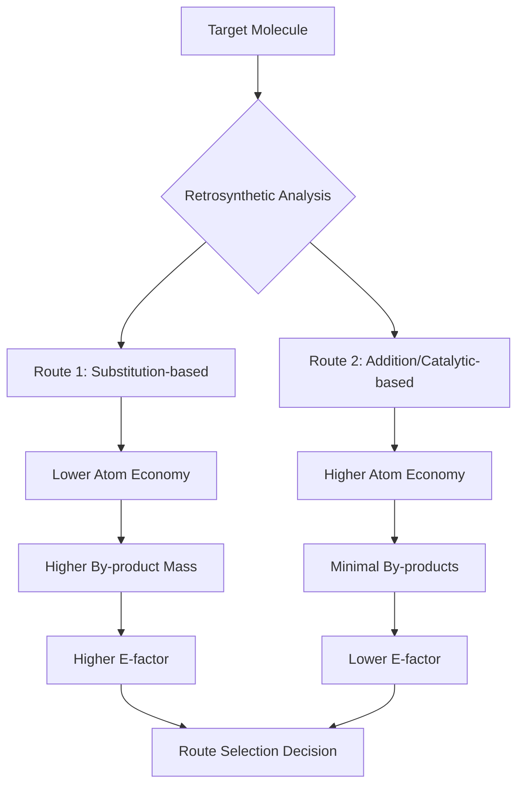

## Atom Economy and Waste Reduction

### Overview

Atom economy is a quantitative measure, introduced by Barry Trost in 1991, of how efficiently a chemical reaction incorporates the atoms of starting materials into the final desired product. It complements percent yield by evaluating the theoretical efficiency of a reaction's stoichiometry, independent of how well the reaction actually performs in practice, and serves as one of the foundational quantitative tools for waste reduction under green chemistry principle 2.

### Atom Economy: Definition and Calculation

**Key Points**

$$\text{Atom Economy (\%)} = \frac{MW_{desired\ product}}{\sum MW_{all\ reactants}} \times 100$$

- Calculated from the balanced stoichiometric equation, using molecular weights, not actual experimental masses.
- A reaction with 100% atom economy incorporates every atom from every reactant into the product, with no by-products (e.g., addition and rearrangement reactions).
- Substitution, elimination, and condensation reactions typically have atom economy below 100%, since a portion of reactant mass leaves as a by-product (e.g., $HCl$, $H_2O$, salts).

**Example**

Diels-Alder cycloaddition (addition reaction, 100% atom economy):

$$\text{Diene} + \text{Dienophile} \rightarrow \text{Cyclohexene product}$$

No by-product is formed; all atoms from both reactants appear in the product.

Nucleophilic substitution (lower atom economy):

$$R\text{-}Br + NaOH \rightarrow R\text{-}OH + NaBr$$

$NaBr$ is generated as stoichiometric waste, lowering atom economy relative to the theoretical product mass.

### Reaction Class Comparison

| Reaction Type | Typical Atom Economy | Example |
| --- | --- | --- |
| Addition (Diels-Alder, hydrogenation) | Often ~100% | Alkene + $H_2 \rightarrow$ alkane |
| Rearrangement | Often ~100% | Claisen rearrangement |
| Substitution | Moderate | Grignard reactions, halogenations |
| Elimination | Lower | Dehydrohalogenation ($HX$ lost) |
| Condensation (Wittig) | Lower | $Ph_3P=O$ generated as by-product |

[Inference] These are general tendencies based on reaction mechanism class; actual atom economy for any specific reaction depends on the exact reagents and stoichiometry involved and should be calculated directly.

### Worked Example: Wittig Reaction

For the Wittig olefination of benzaldehyde ($C_7H_6O$, MW = 106.12) with methylenetriphenylphosphorane ($C_{19}H_{17}P$, MW = 276.32) to form styrene ($C_8H_8$, MW = 104.15) and triphenylphosphine oxide ($C_{18}H_{15}OP$, MW = 278.29, by-product):

$$\text{Atom Economy} = \frac{104.15}{106.12 + 276.32} \times 100\% \approx 27.2\%$$

Nearly three-quarters of the combined reactant mass is lost as triphenylphosphine oxide by-product, illustrating why Wittig chemistry, despite its synthetic utility, is considered atom-inefficient and has motivated development of greener olefination alternatives (e.g., Horner-Wadsworth-Emmons variants with water-soluble phosphonates, or catalytic olefin metathesis).

### Distinguishing Atom Economy from Percent Yield

**Key Points**

- **Atom economy** is a theoretical, stoichiometry-based measure calculated before running the reaction; it reflects the reaction's inherent design efficiency.
- **Percent yield** is an experimental measure of how much product was actually isolated relative to the theoretical maximum:

  $$\% \text{Yield} = \frac{\text{actual mass of product obtained}}{\text{theoretical mass of product}} \times 100$$
- A reaction can have high atom economy but low yield (e.g., side reactions, incomplete conversion), or low atom economy but high yield (e.g., a substitution reaction that proceeds nearly quantitatively but still discards stoichiometric by-product mass).
- Both metrics are necessary; atom economy alone does not capture real-world waste, since solvents, catalysts, workup reagents, and purification losses are excluded from its calculation.

### Beyond Atom Economy: Comprehensive Waste Metrics

**Key Points**

Because atom economy ignores solvents, auxiliaries, and actual reaction performance, additional metrics are used for holistic waste assessment:

$$E\text{-factor} = \frac{\text{total mass of waste (kg)}}{\text{mass of product (kg)}}$$

$$\text{Process Mass Intensity (PMI)} = \frac{\text{total mass of all materials input}}{\text{mass of product output}}$$

$$\text{Reaction Mass Efficiency (RME)} = \frac{\text{mass of isolated product}}{\text{total mass of all reactants}} \times 100\%$$

RME combines atom economy, stoichiometry (excess reagent use), and yield into a single practical efficiency figure, making it more representative of real waste generation than atom economy alone.

| Sector | Typical E-factor Range |
| --- | --- |
| Bulk/commodity chemicals | ~1–5 |
| Fine chemicals | ~5–50 |
| Pharmaceuticals | ~25–100+ |

[Inference] These ranges reflect commonly cited industry generalizations (originating from Sheldon's comparative analyses); actual values vary by specific process, product complexity, and how comprehensively waste is measured (e.g., whether water is included).

### Strategies for Improving Atom Economy and Reducing Waste

**Key Points**

1. **Favor addition/rearrangement over substitution/elimination** where synthetically feasible, since these mechanisms avoid generating stoichiometric by-products.
2. **Use catalytic rather than stoichiometric reagents** (Principle 9) — a catalyst is regenerated and does not appear in mass-balance waste calculations at high turnover numbers.
3. **Telescope reaction steps** to avoid isolating and purifying intermediates, reducing solvent-driven PMI.
4. **Select convergent over linear synthesis routes** — convergent routes combine advanced intermediates late-stage, reducing cumulative step count and compounding yield losses.
5. **Recover and recycle by-products** (e.g., converting $NaBr$ waste back to $Br_2$/$NaOH$ via electrolysis in some industrial processes).
6. **Redesign the retrosynthesis** around atom-economical disconnections from the outset, rather than optimizing an already-chosen low-atom-economy route.

### Route Comparison Flow

### Atom Economy Mass Balance (svg_diagram)

<svg xmlns="http://www.w3.org/2000/svg" viewBox="0 0 650 350">
\<style\>
.bar-text { font-family: sans-serif; font-size: 12px; fill: #ffffff; font-weight: bold; }
.axis-text { font-family: sans-serif; font-size: 11px; fill: #1a1a1a; }
.title-text { font-family: sans-serif; font-size: 15px; fill: #1a1a1a; font-weight: bold; }
\</style\>
<text x="325" y="25" text-anchor="middle" class="title-text">Reactant Mass Fate: High vs Low Atom Economy (svg_diagram)</text>
<text x="130" y="55" text-anchor="middle" class="axis-text">Addition Reaction (~100% AE)</text>
<rect x="40" y="70" width="180" height="50" fill="#2e7d4f" />
<text x="130" y="100" text-anchor="middle" class="bar-text">100% Incorporated into Product</text>
<text x="480" y="55" text-anchor="middle" class="axis-text">Substitution Reaction (~40% AE)</text>
<rect x="390" y="70" width="72" height="50" fill="#2e7d4f" />
<text x="426" y="100" text-anchor="middle" class="bar-text" font-size="10">40%</text>
<rect x="462" y="70" width="108" height="50" fill="#c0392b" />
<text x="516" y="100" text-anchor="middle" class="bar-text" font-size="10">60% Waste</text>
<rect x="40" y="150" width="180" height="30" fill="#2e7d4f" />
<text x="130" y="170" text-anchor="middle" class="bar-text">Product Mass</text>
<rect x="390" y="150" width="72" height="30" fill="#2e7d4f" />
<rect x="462" y="150" width="108" height="30" fill="#c0392b" />
<text x="325" y="220" text-anchor="middle" class="axis-text">Green = mass retained in product; Red = mass lost as by-product/waste</text>
<text x="325" y="245" text-anchor="middle" class="axis-text">Proportions are illustrative, not derived from a specific dataset</text>
</svg>

**Conclusion**

Atom economy provides a fast, calculation-only screen for evaluating the inherent waste-generating potential of a proposed synthetic route before any experimental work begins, making it a key tool in early-stage green process design. However, it must be paired with experimental metrics (E-factor, PMI, RME) to capture solvent use, auxiliary materials, and actual reaction performance, since a stoichiometrically elegant reaction can still be wasteful in practice if it requires large solvent volumes or extensive purification.

**Related Topics**

- Reaction Mass Efficiency (RME) and comprehensive green metrics
- Catalytic versus stoichiometric reagent design
- Convergent versus linear retrosynthetic strategy
- E-factor benchmarking across chemical industry sectors
- Life cycle assessment (LCA) of synthetic routes
- Solvent-free and mechanochemical synthesis methods