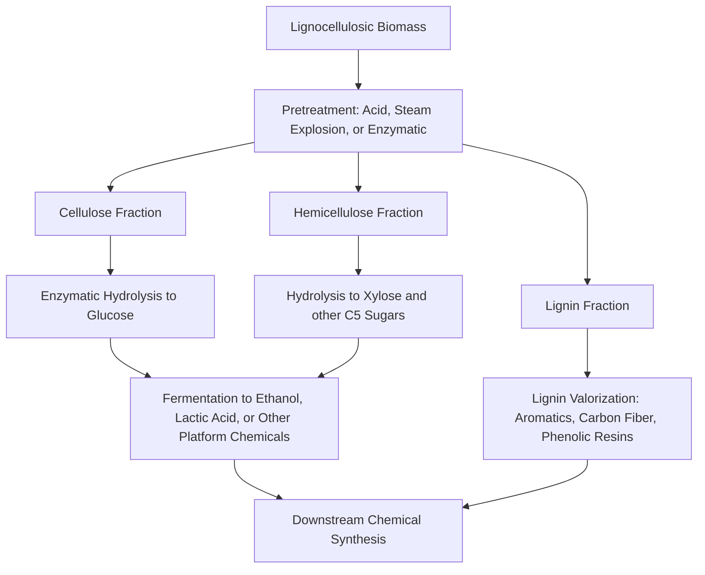

## Renewable Feedstocks

### Overview

Renewable feedstocks are raw materials for chemical synthesis derived from biological or otherwise rapidly replenishable sources — biomass, agricultural residues, algae, captured $CO_2$ — rather than finite petroleum, natural gas, or coal reserves. Their use corresponds to Principle 7 of the Twelve Principles of Green Chemistry and addresses both resource depletion and, in many cases, net carbon footprint reduction across a chemical's life cycle.

### Categories of Renewable Feedstocks

**Key Points**

- **First-generation biomass:** food-crop-derived sugars, starches, and oils (corn, sugarcane, soybean, palm oil). Efficient but raises food-versus-fuel/chemical land-use competition concerns.
- **Second-generation (lignocellulosic) biomass:** non-food plant matter — agricultural residues (corn stover, wheat straw), forestry waste, and dedicated energy crops (switchgrass, miscanthus). Composed of cellulose, hemicellulose, and lignin, requiring more intensive pretreatment to access fermentable sugars.
- **Third-generation biomass:** algae and cyanobacteria, which can be cultivated on non-arable land/water and have high lipid or carbohydrate content per unit area.
- **Waste-derived feedstocks:** municipal solid waste, used cooking oil, food waste, and captured industrial off-gases.
- **$CO_2$ as a feedstock:** carbon capture and utilization (CCU) routes convert atmospheric or flue-gas $CO_2$ into methanol, formic acid, or polymer building blocks (e.g., polycarbonate via $CO_2$-epoxide copolymerization).

### Platform Chemicals from Biomass

**Key Points**

Biomass is broken down (via fermentation, hydrolysis, pyrolysis, or catalytic conversion) into a small set of "platform chemicals" that serve as building blocks for downstream synthesis, analogous to how petroleum refining produces ethylene, propylene, and BTX (benzene, toluene, xylene) as petrochemical platforms.

| Platform Chemical | Derived From | Downstream Products |
| --- | --- | --- |
| Bioethanol | Corn/sugarcane fermentation | Ethylene (via dehydration), bioplastics, solvents |
| Lactic acid | Fermentation of sugars | Polylactic acid (PLA) bioplastic |
| Succinic acid | Fermentation of glucose | Polyesters, polyurethanes, solvents (replacing petrochemical maleic anhydride route) |
| 5-Hydroxymethylfurfural (HMF) | Dehydration of fructose/glucose | 2,5-furandicarboxylic acid (FDCA), a bio-based terephthalic acid substitute |
| Glycerol | By-product of biodiesel transesterification | Propylene glycol, epichlorohydrin, 1,3-propanediol |
| Isoprene / farnesene | Engineered microbial fermentation | Synthetic rubber, biofuels, fragrances |
| Levulinic acid | Acid-catalyzed cellulose degradation | Gamma-valerolactone (GVL, a green solvent), resins |

### Worked Example: PLA vs. Petroleum-Based Polyester

Polylactic acid is synthesized from lactic acid, itself produced by fermenting corn- or sugarcane-derived glucose using bacteria such as *Lactobacillus*:

$$C_6H_{12}O_6 \xrightarrow{\text{fermentation}} 2\, CH_3CH(OH)COOH \quad (\text{lactic acid})$$

Lactic acid is then converted via ring-opening polymerization of the cyclic lactide dimer:

$$n\,(\text{lactide}) \xrightarrow{\text{catalyst, ROP}} [\text{-O-CH(CH}_3\text{)-CO-}]_n \quad (\text{PLA})$$

PLA is biodegradable under industrial composting conditions, contrasting with conventional petroleum-derived polyethylene terephthalate (PET), which persists in the environment over much longer timescales. [Inference] Comparative life-cycle carbon footprint outcomes between PLA and PET depend heavily on feedstock sourcing, cultivation practices, and end-of-life disposal method, and published LCA figures vary by study.

### Lignocellulosic Biomass Processing Pathway

Lignocellulosic biomass presents a greater processing challenge than starch/sugar crops because cellulose is tightly bound with hemicellulose and lignin in a rigid structural matrix.

### Biomass Composition Breakdown (svg_diagram)

<svg xmlns="http://www.w3.org/2000/svg" viewBox="0 0 600 350">
\<style\>
.slice-text { font-family: sans-serif; font-size: 12px; fill: #ffffff; font-weight: bold; }
.legend-text { font-family: sans-serif; font-size: 12px; fill: #1a1a1a; }
.title-text { font-family: sans-serif; font-size: 15px; fill: #1a1a1a; font-weight: bold; }
\</style\>
<text x="300" y="25" text-anchor="middle" class="title-text">Typical Lignocellulosic Biomass Composition (svg_diagram)</text>
<circle cx="220" cy="180" r="120" fill="#2e7d4f" />
<path d="M 220 180 L 220 60 A 120 120 0 0 1 328 240 Z" fill="#5a9e78" />
<path d="M 220 180 L 328 240 A 120 120 0 0 1 155 292 Z" fill="#8fbc9f" />
<text x="180" y="130" class="slice-text">Cellulose</text>
<text x="180" y="145" class="slice-text">~40-50%</text>
<text x="280" y="210" class="slice-text">Hemi-</text>
<text x="280" y="225" class="slice-text">cellulose</text>
<text x="280" y="240" class="slice-text">~20-30%</text>
<text x="170" y="255" class="slice-text">Lignin</text>
<text x="170" y="270" class="slice-text">~15-25%</text>
<rect x="400" y="100" width="15" height="15" fill="#2e7d4f" />
<text x="425" y="112" class="legend-text">Cellulose (glucose polymer)</text>
<rect x="400" y="130" width="15" height="15" fill="#5a9e78" />
<text x="425" y="142" class="legend-text">Hemicellulose (C5/C6 sugars)</text>
<rect x="400" y="160" width="15" height="15" fill="#8fbc9f" />
<text x="425" y="172" class="legend-text">Lignin (aromatic polymer)</text>
<text x="300" y="330" text-anchor="middle" class="legend-text">Approximate ranges; composition varies by feedstock species</text>
</svg>

### Carbon Capture and Utilization (CCU) as a Feedstock Route

**Key Points**

- Converts waste $CO_2$ (from flue gas or direct air capture) into chemical products, closing part of the carbon cycle rather than extracting new fossil carbon.
- Established industrial example: copolymerization of $CO_2$ with propylene oxide or cyclohexene oxide to form polycarbonate polyols, replacing a portion of petroleum-derived polyol content.
- Methanol synthesis from captured $CO_2$ and green hydrogen ($CO_2 + 3H_2 \rightarrow CH_3OH + H_2O$) is an active industrial and research pathway, sometimes termed "power-to-X" chemistry when paired with renewable electricity-derived hydrogen.
- [Speculation] The overall carbon-neutrality of any specific CCU route depends on the source of both the $CO_2$ and the energy/hydrogen input, and general characterizations should not be assumed to apply uniformly across all CCU processes without a process-specific life-cycle assessment.

### Sustainability Considerations and Trade-offs

**Key Points**

- **Land use and food security:** first-generation feedstocks compete with food production; second- and third-generation feedstocks aim to mitigate this by using non-food biomass or non-arable cultivation.
- **Water and fertilizer inputs:** agricultural feedstock cultivation carries its own resource footprint that must be included in full life-cycle assessment (LCA), not just the chemical conversion step.
- **Net carbon accounting:** "renewable" does not automatically mean "carbon-neutral" or "lower-impact" — cultivation, transport, and processing energy sources all factor into the net footprint, and results are process- and region-specific.
- **Feedstock flexibility of existing infrastructure:** many "drop-in" bio-based chemicals (bio-ethylene, bio-succinic acid) are chosen specifically because they are chemically identical to their petrochemical counterparts, allowing use of existing downstream manufacturing infrastructure.

**Conclusion**

Renewable feedstocks shift the starting point of chemical synthesis from finite fossil carbon to biological or captured-carbon sources, primarily through fermentation-derived platform chemicals (lactic acid, succinic acid, ethanol) and emerging $CO_2$-utilization routes. Realizing genuine sustainability benefits requires pairing feedstock choice with full life-cycle assessment, since cultivation, processing energy, and land-use impacts can offset the advantage of a non-fossil carbon source if not carefully managed.

**Related Topics**

- Biorefinery concept and integrated biomass valorization
- Life cycle assessment (LCA) methodology for bio-based chemicals
- Fermentation engineering and metabolic pathway design
- Carbon capture and utilization (CCU) technologies
- Bioplastics: PLA, PHA, and bio-based polyethylene
- Lignin valorization strategies
- Techno-economic analysis of biomass-to-chemical processes