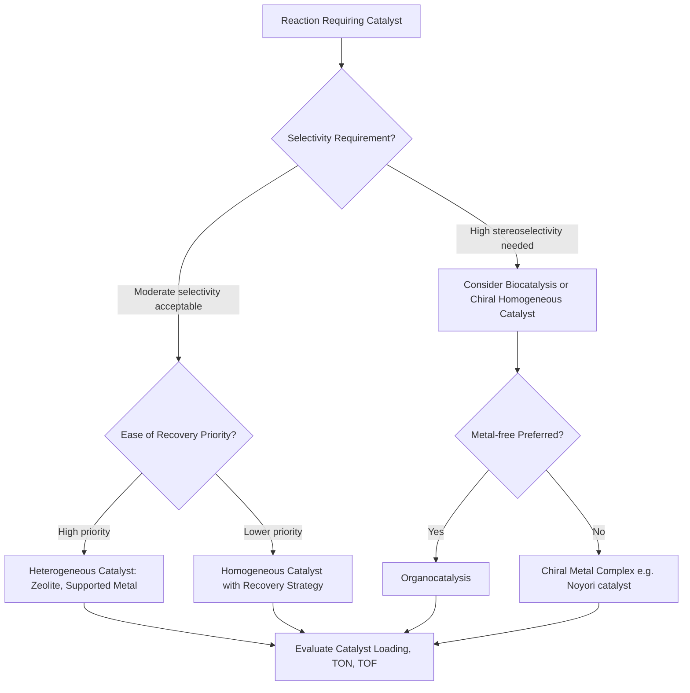

## Green Solvents and Catalysts

### Overview

Green solvents and catalysts address two adjacent principles of green chemistry: Principle 5 (safer solvents and auxiliaries) and Principle 9 (catalysis). Solvents typically constitute the largest mass fraction of material used in a chemical process, making solvent choice a dominant contributor to Process Mass Intensity (PMI) and overall environmental footprint, while catalysis improves atom economy and energy efficiency by enabling selective transformations at lower stoichiometric burden.

### Part 1: Green Solvents

**Key Points**

- Solvent "greenness" is evaluated across multiple axes: health hazard (toxicity, carcinogenicity), safety hazard (flammability, explosivity), and environmental hazard (persistence, aquatic toxicity, ozone depletion potential), not a single property.
- Solvent selection guides (e.g., CHEM21, GSK, Pfizer, Sanofi guides) rank common solvents from "preferred" through "problematic" to "hazardous" based on aggregated HSE (health, safety, environment) data.
- No solvent is universally "green"; selection is context-dependent on the reaction chemistry, downstream purification, and required physical properties (boiling point, polarity, water miscibility).

### Categories of Green Solvent Alternatives

| Category | Examples | Notes |
| --- | --- | --- |
| Water | $H_2O$ | Non-toxic, non-flammable; limited by substrate solubility |
| Bio-derived solvents | 2-Methyltetrahydrofuran (2-MeTHF), ethyl lactate, Cyrene | Derived from renewable feedstocks; often replace THF, DMF, NMP |
| Supercritical fluids | Supercritical $CO_2$ (scCO$_2$) | Tunable density/polarity; easily removed by depressurization; non-flammable |
| Ionic liquids | Imidazolium/pyridinium salts | Negligible vapor pressure; tunable properties; recyclable |
| Deep eutectic solvents (DES) | Choline chloride/urea mixtures | Low-cost, biodegradable, simple preparation from inexpensive components |
| Solvent-free / neat conditions | Mechanochemistry (ball milling) | Eliminates solvent entirely; often improves atom/energy economy |

### Solvents to Avoid and Their Green Replacements

**Example**

| Problematic Solvent | Concern | Common Green Replacement |
| --- | --- | --- |
| Dichloromethane (DCM) | Suspected carcinogen, ozone-depleting potential | 2-MeTHF, ethyl acetate |
| N,N-Dimethylformamide (DMF) | Reproductive toxicity | Cyrene, dimethyl carbonate |
| Benzene | Carcinogen | Toluene (with caution) or non-aromatic alternatives |
| Chloroform | Hepatotoxic, ozone-depleting | Dichloromethane alternatives or solvent-free routes |
| Hexane | Neurotoxic, VOC | Heptane, 2-MeTHF |

### Supercritical CO2 as a Solvent

**Key Points**

- Above its critical point ($T_c = 31.1\,°C$, $P_c = 73.8$ bar), $CO_2$ exists as a supercritical fluid combining liquid-like solvating power with gas-like diffusivity.
- Non-flammable, non-toxic, and inexpensive; simply depressurizes to gas upon completion, leaving no solvent residue and simplifying product isolation.
- Widely used industrially for decaffeination of coffee and extraction of natural products, and as a polymerization medium (e.g., fluoropolymer synthesis).
- Limitation: poor solvating power for polar/ionic compounds without co-solvents ("modifiers" such as ethanol).

### Part 2: Green Catalysis

**Key Points**

Catalysts lower activation energy without being consumed, allowing sub-stoichiometric loading, improved selectivity, and milder reaction conditions — directly supporting Principles 6 (energy efficiency) and 9 (catalysis).

$$\Delta G^{\ddagger}_{catalyzed} < \Delta G^{\ddagger}_{uncatalyzed}$$

$$k = A\, e^{-E_a/RT}$$

A catalyst lowers $E_a$, increasing rate constant $k$ at a given temperature $T$, which can allow the same conversion to be achieved under milder conditions than the uncatalyzed pathway.

### Categories of Green Catalysis

**1. Heterogeneous Catalysis**

- Solid catalysts (zeolites, supported metal nanoparticles, metal oxides) in a different phase from reactants.
- Advantage: easily separated by filtration and reused across multiple batches, reducing metal waste and catalyst-related E-factor contribution.
- Example: zeolite-catalyzed Friedel-Crafts acylation replacing stoichiometric $AlCl_3$, avoiding aqueous aluminum waste.

**2. Homogeneous Catalysis**

- Catalyst is dissolved in the same phase as reactants (e.g., transition metal complexes), often giving higher activity/selectivity than heterogeneous analogs.
- Challenge: separation and recovery from product stream is harder, sometimes offsetting green benefits unless recovery methods (biphasic systems, immobilization) are used.
- Example: asymmetric hydrogenation using chiral Rh or Ru complexes (Noyori catalysts) for enantioselective synthesis, replacing resolution-based routes that waste half the material.

**3. Biocatalysis (Enzymatic Catalysis)**

- Enzymes operate under mild aqueous conditions (ambient temperature, neutral pH), offering high chemo-, regio-, and stereoselectivity.
- Reduces need for protecting groups (supporting Principle 8) since enzymes act selectively on specific functional groups.
- Example: lipase-catalyzed transesterification in biodiesel production; ketoreductases in pharmaceutical chiral alcohol synthesis.

**4. Photocatalysis and Electrocatalysis**

- Use light or electrical energy, respectively, to drive redox transformations, often at ambient temperature, replacing thermal activation and stoichiometric oxidants/reductants.
- Example: visible-light-mediated radical reactions using organic photocatalysts (e.g., eosin Y) instead of toxic heavy-metal photocatalysts or stoichiometric peroxides.

**5. Organocatalysis**

- Small organic molecules (proline derivatives, cinchona alkaloids) catalyze reactions without requiring transition metals, avoiding heavy-metal contamination of products (particularly relevant to pharmaceutical synthesis).

### Catalyst Selection Decision Flow

### Solvent HSE Ranking Visualization (svg_diagram)

<svg xmlns="http://www.w3.org/2000/svg" viewBox="0 0 650 380">
\<style\>
.bar-label { font-family: sans-serif; font-size: 11px; fill: #1a1a1a; }
.axis-label { font-family: sans-serif; font-size: 11px; fill: #1a1a1a; }
.title-text { font-family: sans-serif; font-size: 15px; fill: #1a1a1a; font-weight: bold; }
\</style\>
<text x="325" y="25" text-anchor="middle" class="title-text">Illustrative Solvent Preference Ranking (svg_diagram)</text>
<line x1="180" y1="50" x2="180" y2="330" stroke="#333" stroke-width="1" />
<text x="80" y="45" class="axis-label">Preferred</text>
<text x="550" y="45" class="axis-label">Hazardous</text>
<rect x="185" y="55" width="60" height="25" fill="#2e7d4f" />
<text x="250" y="73" class="bar-label">Water</text>
<rect x="185" y="90" width="90" height="25" fill="#2e7d4f" />
<text x="280" y="108" class="bar-label">Ethanol</text>
<rect x="185" y="125" width="120" height="25" fill="#5a9e78" />
<text x="310" y="143" class="bar-label">2-MeTHF</text>
<rect x="185" y="160" width="150" height="25" fill="#5a9e78" />
<text x="340" y="178" class="bar-label">Ethyl Acetate</text>
<rect x="185" y="195" width="220" height="25" fill="#d4a72c" />
<text x="410" y="213" class="bar-label">Toluene (caution)</text>
<rect x="185" y="230" width="320" height="25" fill="#c0392b" />
<text x="510" y="248" class="bar-label">DMF</text>
<rect x="185" y="265" width="350" height="25" fill="#c0392b" />
<text x="540" y="283" class="bar-label">DCM</text>
<rect x="185" y="300" width="380" height="25" fill="#8b0000" />
<text x="570" y="318" class="bar-label">Benzene</text>
<text x="325" y="360" text-anchor="middle" class="axis-label">Illustrative ranking based on general HSE guide trends, not a specific numeric dataset</text>
</svg>

### Catalyst Performance Metrics

**Key Points**

$$\text{Turnover Number (TON)} = \frac{\text{moles of product formed}}{\text{moles of catalyst}}$$

$$\text{Turnover Frequency (TOF)} = \frac{TON}{\text{time}}$$

Higher TON indicates a catalyst can be used at lower loading relative to product output, directly reducing catalyst-related waste and cost; TOF captures catalytic efficiency per unit time, relevant to process throughput.

**Example**

An industrial hydrogenation catalyst achieving $TON = 50{,}000$ over 10 hours has $TOF = 5{,}000\ h^{-1}$, indicating the catalyst can be used at very low loading (as little as 0.002 mol%) relative to substrate, minimizing heavy-metal residue in the final product — a critical consideration for pharmaceutical manufacturing where metal contamination limits are strictly regulated.

**Conclusion**

Green solvent and catalyst selection are interdependent design choices made early in process development: solvent choice affects reaction rate, catalyst stability, and downstream separation, while catalyst choice determines whether stoichiometric waste-generating reagents can be avoided entirely. Together, they represent two of the highest-leverage points for reducing a synthetic route's overall E-factor and PMI, since solvents dominate process mass and catalysts determine atom-economical reagent use.

**Related Topics**

- Solvent selection guides (CHEM21, GSK, Pfizer methodologies)
- Biocatalysis and directed enzyme evolution
- Asymmetric catalysis and chiral ligand design
- Mechanochemistry and solvent-free synthesis
- Catalyst recovery and immobilization strategies
- Photoredox catalysis in organic synthesis
- Ionic liquids and deep eutectic solvents as reaction media