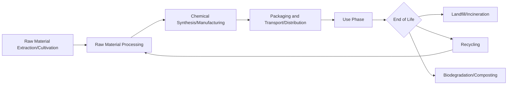

## Life Cycle Assessment

### Overview

Life cycle assessment (LCA) is a standardized methodology for quantifying the environmental impacts of a product, process, or service across its entire life span — from raw material extraction through manufacturing, use, and end-of-life disposal or recycling ("cradle-to-grave"). In green and sustainable chemistry, LCA provides the quantitative framework needed to verify whether a "greener" synthetic route, solvent, or feedstock choice produces a genuine net environmental benefit rather than merely shifting impact to another life cycle stage.

### Standardized Framework: ISO 14040/14044

**Key Points**

LCA methodology is codified in the ISO 14040 and 14044 standards, which define four iterative phases:

**1. Goal and Scope Definition**

Establishes the purpose of the study, the **functional unit** (a quantified reference basis for comparison, e.g., "1 kg of active pharmaceutical ingredient produced"), and system boundaries (which life cycle stages are included/excluded).

**2. Life Cycle Inventory (LCI)**

Compilation of all material and energy inputs/outputs across the system boundary — raw material extraction, transport, energy consumption, emissions to air/water/soil, and waste generation — organized into a quantitative inventory table.

**3. Life Cycle Impact Assessment (LCIA)**

Inventory data is translated into impact category indicators (e.g., kg $CO_2$-equivalent for global warming potential) using characterization factors, allowing disparate emissions to be aggregated into comparable scores per impact category.

**4. Interpretation**

Results are analyzed for significance, consistency, and sensitivity, leading to conclusions and recommendations; this phase loops back to refine goal/scope or inventory data as needed.

### System Boundary Definitions

| Boundary Type | Scope | Common Use |
| --- | --- | --- |
| Cradle-to-gate | Raw material extraction through factory gate (excludes use/disposal) | Comparing intermediate chemical production routes |
| Cradle-to-grave | Full life cycle including use phase and end-of-life | Comprehensive product comparisons (e.g., PLA vs. PET) |
| Gate-to-gate | Single process step only | Internal process optimization within a facility |
| Cradle-to-cradle | Full life cycle plus recycling back into new production | Circular economy analyses |

### Common Impact Categories

**Key Points**

| Impact Category | Unit | What It Measures |
| --- | --- | --- |
| Global Warming Potential (GWP) | kg $CO_2$-eq | Greenhouse gas contribution to climate change |
| Acidification Potential | kg $SO_2$-eq | Acid rain-forming emissions ($SO_2$, $NO_x$) |
| Eutrophication Potential | kg $PO_4^{3-}$-eq | Nutrient loading in water bodies |
| Ozone Depletion Potential | kg CFC-11-eq | Stratospheric ozone layer impact |
| Human Toxicity Potential | Comparative toxic units (CTUh) | Health impact of chemical emissions |
| Cumulative Energy Demand (CED) | MJ | Total primary energy consumed across life cycle |
| Water Scarcity Footprint | m³ water-eq | Water consumption weighted by regional scarcity |
| Abiotic Resource Depletion | kg Sb-eq | Depletion of non-renewable mineral/fossil resources |

### Life Cycle Stages for a Chemical Product

### Worked Example: Comparing Two Solvent Sourcing Routes

**Example**

Consider an LCA comparing two routes to produce a solvent, using the functional unit "1 kg of solvent delivered to a manufacturing site":

| Life Cycle Stage | Route A: Petrochemical-derived | Route B: Bio-derived (agricultural feedstock) |
| --- | --- | --- |
| Feedstock extraction/cultivation | Crude oil extraction, moderate GWP | Crop cultivation: fertilizer $N_2O$ emissions, land-use change potential |
| Processing/conversion | Refining and cracking, high energy input | Fermentation, lower thermal energy but process water intensive |
| Transport | Established pipeline/tanker infrastructure | Potentially longer/more distributed supply chain |
| End-of-life | Non-biodegradable in some environments | Biodegradable under specific conditions |

[Inference] Without running the actual inventory and impact assessment calculations for specific, defined processes, the net comparative outcome (which route has lower GWP or overall impact) cannot be generalized — real LCA studies on bio-based versus petrochemical solvents have reached mixed and context-dependent conclusions across the published literature, depending heavily on regional agricultural practices, energy grid mix, and system boundary choices. This is precisely why formal LCA is required rather than relying on the intuitive assumption that "bio-based" automatically means "lower impact."

### Impact Category Comparison Chart (svg_diagram)

<svg xmlns="http://www.w3.org/2000/svg" viewBox="0 0 650 400">
\<style\>
.bar-label { font-family: sans-serif; font-size: 11px; fill: #1a1a1a; }
.axis-label { font-family: sans-serif; font-size: 12px; fill: #1a1a1a; }
.title-text { font-family: sans-serif; font-size: 15px; fill: #1a1a1a; font-weight: bold; }
\</style\>
<text x="325" y="25" text-anchor="middle" class="title-text">Illustrative Multi-Category LCA Comparison (svg_diagram)</text>
<text x="60" y="60" class="axis-label">GWP</text>
<rect x="120" y="45" width="200" height="22" fill="#4a6fa5" />
<text x="330" y="61" class="bar-label">Route A</text>
<rect x="120" y="70" width="140" height="22" fill="#5a9e78" />
<text x="270" y="86" class="bar-label">Route B</text>
<text x="60" y="130" class="axis-label">Eutrophication</text>
<rect x="120" y="115" width="90" height="22" fill="#4a6fa5" />
<text x="220" y="131" class="bar-label">Route A</text>
<rect x="120" y="140" width="180" height="22" fill="#5a9e78" />
<text x="310" y="156" class="bar-label">Route B</text>
<text x="60" y="200" class="axis-label">Energy Demand</text>
<rect x="120" y="185" width="240" height="22" fill="#4a6fa5" />
<text x="370" y="201" class="bar-label">Route A</text>
<rect x="120" y="210" width="160" height="22" fill="#5a9e78" />
<text x="290" y="226" class="bar-label">Route B</text>
<text x="60" y="270" class="axis-label">Water Use</text>
<rect x="120" y="255" width="80" height="22" fill="#4a6fa5" />
<text x="210" y="271" class="bar-label">Route A</text>
<rect x="120" y="280" width="220" height="22" fill="#5a9e78" />
<text x="350" y="296" class="bar-label">Route B</text>
<rect x="120" y="330" width="15" height="15" fill="#4a6fa5" />
<text x="145" y="342" class="axis-label">Route A (Petrochemical)</text>
<rect x="320" y="330" width="15" height="15" fill="#5a9e78" />
<text x="345" y="342" class="axis-label">Route B (Bio-derived)</text>
<text x="325" y="380" text-anchor="middle" class="axis-label">Hypothetical values for illustration only — not derived from a specific study</text>
</svg>

### Allocation Methods for Co-Products

**Key Points**

Many chemical processes generate multiple co-products (e.g., biodiesel production also yields glycerol), requiring rules to allocate shared environmental burden:

- **Mass allocation:** burden divided proportionally to output mass.
- **Economic allocation:** burden divided proportionally to market value of each co-product.
- **System expansion/substitution:** the co-product is credited with avoiding the impact of the conventional product it displaces (e.g., glycerol credited for displacing petrochemical glycerol production).

Choice of allocation method can significantly shift LCA results and is a common source of divergent conclusions between studies on the same process.

### Limitations and Common Pitfalls

**Key Points**

- **Data quality and availability:** LCA relies on inventory databases (e.g., ecoinvent, GaBi) that may use regional averages not representative of a specific facility or supply chain.
- **Boundary selection bias:** narrowing system boundaries (e.g., cradle-to-gate instead of cradle-to-grave) can make a product appear more favorable by excluding impactful downstream stages such as use-phase energy consumption or disposal.
- **Single-indicator oversimplification:** reporting only GWP while ignoring eutrophication, toxicity, or resource depletion can obscure genuine trade-offs (a product might reduce carbon footprint while increasing water pollution).
- **Temporal and geographic specificity:** impact factors (e.g., grid carbon intensity) change over time and vary by region, so results may not generalize across locations or remain valid indefinitely.
- LCA quantifies environmental burden shifting; a result should be read as "lower impact in category X, under these boundaries and assumptions" rather than an absolute, universal "greener" verdict.

**Conclusion**

LCA is the methodological backbone that allows green chemistry design choices — solvent substitution, renewable feedstock adoption, catalytic route redesign — to be validated with quantitative evidence rather than qualitative assumption. Because outcomes are highly sensitive to functional unit definition, system boundaries, and allocation method, rigorous LCA practice requires transparent reporting of these choices, and results should always be interpreted within the specific scope defined by the study rather than generalized beyond it.

**Related Topics**

- ISO 14040/14044 standard methodology in depth
- Life Cycle Inventory (LCI) databases (ecoinvent, GaBi, USLCI)
- Carbon footprinting and Scope 1/2/3 emissions accounting
- Techno-economic analysis (TEA) paired with LCA
- Circular economy and cradle-to-cradle design
- Green metrics (E-factor, PMI) versus full LCA scope
- Social life cycle assessment (S-LCA) as a complementary framework