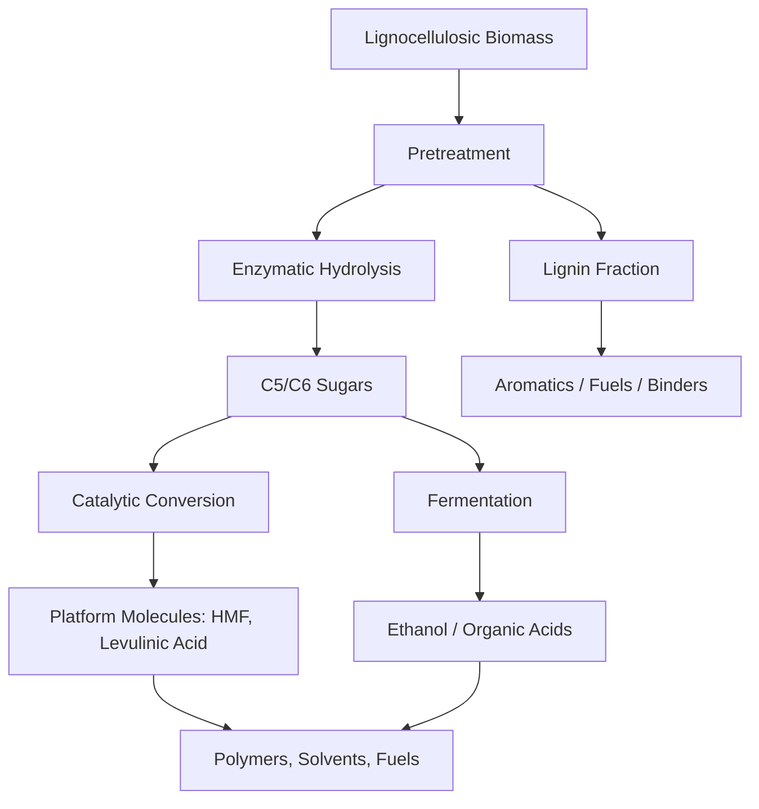
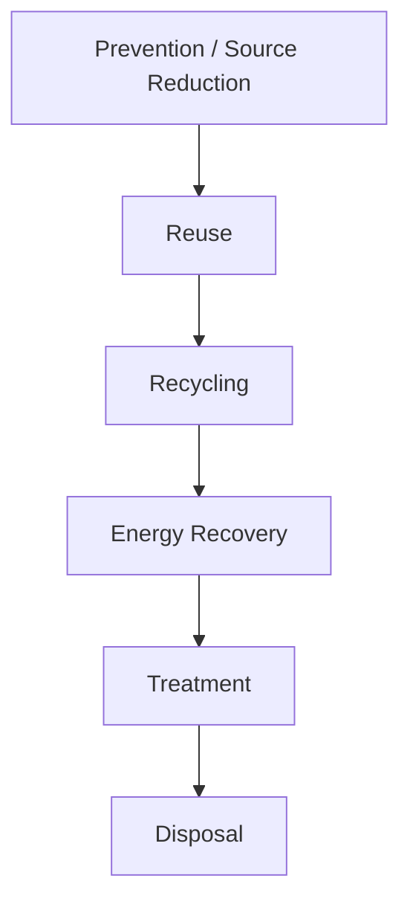
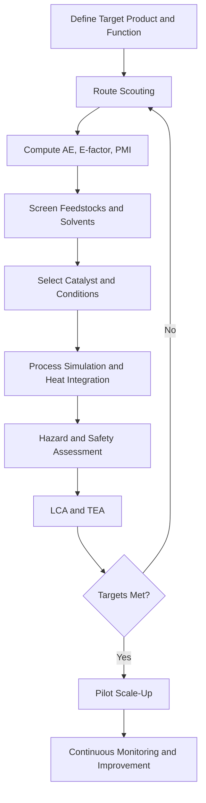

## Sustainable Industrial Processes

### Overview

Sustainable industrial processes apply the principles of green chemistry, process intensification, and life-cycle thinking to manufacture chemicals, materials, and energy carriers while minimizing resource depletion, waste, energy consumption, and hazard. The objective is to decouple economic output from environmental burden by redesigning reaction pathways, separations, feedstocks, and energy systems rather than relying on end-of-pipe treatment.

**Key Points**

- Sustainability is assessed quantitatively (mass metrics, energy metrics, LCA), not qualitatively.
- The hierarchy is: prevent waste > reduce > reuse > recycle > recover energy > treat > dispose.
- Catalysis, solvent selection, feedstock choice, and energy integration are the dominant levers.
- Industrial sustainability must hold across the whole life cycle: cradle-to-gate at minimum, cradle-to-grave or cradle-to-cradle ideally.

### Foundational Frameworks

#### The 12 Principles of Green Chemistry (Anastas and Warner)

| # | Principle | Industrial implication |
| --- | --- | --- |
| 1 | Prevent waste | Design routes that avoid by-product formation |
| 2 | Atom economy | Maximize incorporation of reactant atoms into product |
| 3 | Less hazardous synthesis | Avoid toxic reagents/intermediates (e.g., phosgene, cyanide) |
| 4 | Design safer chemicals | Retain function, reduce toxicity |
| 5 | Safer solvents/auxiliaries | Water, scCO$_2$, ionic liquids, solvent-free |
| 6 | Energy efficiency | Ambient T/P, heat integration, alternative activation |
| 7 | Renewable feedstocks | Biomass, CO$_2$, waste streams |
| 8 | Reduce derivatives | Avoid protecting groups, blocking steps |
| 9 | Catalysis | Catalytic over stoichiometric reagents |
| 10 | Design for degradation | Biodegradable products, no persistence |
| 11 | Real-time analysis | In-line monitoring (PAT) to prevent by-products |
| 12 | Inherently safer chemistry | Minimize accident potential (explosion, fire, release) |

#### The 12 Principles of Green Engineering

Complementary principles emphasize inherent rather than circumstantial hazard reduction, minimization of material diversity, integration of material and energy flows, "output-pulled" rather than "input-pushed" design, and conservation of complexity and embedded value.

#### Circular Economy Model (svg_diagram)

<svg xmlns="http://www.w3.org/2000/svg" viewBox="0 0 640 360" width="640" height="360" font-family="sans-serif" font-size="13">
<title>Circular Industrial Material Flow (svg_diagram)</title>
<text x="320" y="24" text-anchor="middle" font-size="15" font-weight="bold">Circular Industrial Material Flow (svg_diagram)</text>
<rect x="30" y="150" width="120" height="50" rx="8" fill="#d8f0d8" stroke="#333" />
<text x="90" y="180" text-anchor="middle">Renewable Feedstock</text>
<rect x="200" y="60" width="120" height="50" rx="8" fill="#d8e8f8" stroke="#333" />
<text x="260" y="90" text-anchor="middle">Green Synthesis</text>
<rect x="380" y="60" width="120" height="50" rx="8" fill="#d8e8f8" stroke="#333" />
<text x="440" y="90" text-anchor="middle">Manufacturing</text>
<rect x="500" y="150" width="110" height="50" rx="8" fill="#f8ecd0" stroke="#333" />
<text x="555" y="180" text-anchor="middle">Product Use</text>
<rect x="380" y="260" width="120" height="50" rx="8" fill="#f0d8d8" stroke="#333" />
<text x="440" y="290" text-anchor="middle">Collection/Sorting</text>
<rect x="200" y="260" width="120" height="50" rx="8" fill="#f0d8d8" stroke="#333" />
<text x="260" y="290" text-anchor="middle">Recycling/Recovery</text>
<line x1="150" y1="165" x2="200" y2="95" stroke="#333" marker-end="url(#arr)" />
<line x1="320" y1="85" x2="380" y2="85" stroke="#333" marker-end="url(#arr)" />
<line x1="500" y1="95" x2="540" y2="150" stroke="#333" marker-end="url(#arr)" />
<line x1="555" y1="200" x2="500" y2="275" stroke="#333" marker-end="url(#arr)" />
<line x1="380" y1="285" x2="320" y2="285" stroke="#333" marker-end="url(#arr)" />
<line x1="230" y1="260" x2="120" y2="200" stroke="#333" marker-end="url(#arr)" />
<line x1="290" y1="260" x2="290" y2="110" stroke="#333" stroke-dasharray="5,3" marker-end="url(#arr)" />
<text x="300" y="190" font-size="11">re-entry</text>
</svg>

### Quantitative Sustainability Metrics

#### Atom Economy

$$\text{AE} (\%) = \frac{M_{\text{desired product}}}{\sum M_{\text{reactants}}} \times 100$$

**Example**: Ibuprofen synthesis.

- Brown–Hoechst–Celanese (BHC) route: 3 steps, atom economy ≈ 77% (with acetic acid by-product recoverable, effective ≈ 99%).
- Original Boots route: 6 steps, atom economy ≈ 40%.

#### Environmental Factor (E-factor)

$$E = \frac{\text{mass of total waste}}{\text{mass of product}}$$

Water is conventionally excluded (some variants include it). Typical E-factors by industry sector:

| Sector | Annual tonnage | E-factor (kg waste/kg product) |
| --- | --- | --- |
| Oil refining | $10^6$–$10^8$ | < 0.1 |
| Bulk chemicals | $10^4$–$10^6$ | < 1–5 |
| Fine chemicals | $10^2$–$10^4$ | 5 to > 50 |
| Pharmaceuticals | $10$–$10^3$ | 25 to > 100 |

#### Process Mass Intensity (PMI)

$$\text{PMI} = \frac{\text{total mass of inputs (kg)}}{\text{mass of product (kg)}} = E + 1$$

PMI is the preferred metric of the ACS Green Chemistry Institute Pharmaceutical Roundtable and includes water, solvents, reagents, and process aids.

#### Reaction Mass Efficiency

$$\text{RME} (\%) = \frac{\text{mass of isolated product}}{\text{total mass of reactants}} \times 100 = \text{AE} \times \text{yield} \times \frac{1}{\text{SF}}$$

where SF is the stoichiometric factor (excess reagent correction).

#### Carbon Efficiency and Effective Mass Yield

$$\text{CE} (\%) = \frac{\text{carbon in product}}{\text{carbon in reactants}} \times 100$$

$$\text{EMY} (\%) = \frac{\text{mass of product}}{\text{mass of non-benign reagents}} \times 100$$

#### Energy Metrics

- **Specific energy consumption (SEC)**: MJ or kWh per kg product.
- **Exergy efficiency**: fraction of input exergy retained in useful products.
- **Carbon intensity**: kg CO$_2$-eq per kg product.

**Worked Example**

For a reaction $A + B \rightarrow C + D$, where $M_A = 100$, $M_B = 50$, $M_C = 120$, $M_D = 30$ g/mol:

$$\text{AE} = \frac{120}{100 + 50} \times 100 = 80\%$$

If the isolated yield is 90% and 1.2 equivalents of B are used:

$$\text{RME} = \frac{120 \times 0.90}{100 + (1.2 \times 50)} \times 100 = \frac{108}{160} \times 100 = 67.5\%$$

### Catalysis in Sustainable Manufacturing

#### Heterogeneous Catalysis

Solid catalysts (zeolites, supported metals, metal oxides) enable continuous operation, easy separation, and regeneration.

- **Zeolites** (e.g., ZSM-5, zeolite Y): shape-selective cracking, isomerization, alkylation; replaced corrosive liquid HF/H$_2$SO$_4$ alkylation catalysts in some processes.
- **Supported noble metals** (Pd/C, Pt/Al$_2$O$_3$): hydrogenation, hydrogenolysis, reforming.
- **Selective catalytic reduction (SCR)**: V$_2$O$_5$-WO$_3$/TiO$_2$ for NO$_x$ abatement with NH$_3$:

$$4\,\text{NO} + 4\,\text{NH}_3 + \text{O}_2 \rightarrow 4\,\text{N}_2 + 6\,\text{H}_2\text{O}$$

#### Homogeneous Catalysis

High selectivity and mild conditions, but catalyst recovery is the central sustainability challenge.

- **Monsanto/Cativa acetic acid process**: methanol carbonylation; Cativa (Ir/Ru-promoted) reduces by-products and water demand relative to Rh-based Monsanto.
- **Hydroformylation (oxo process)**: Rh/phosphine catalysts; Ruhrchemie/Rhône-Poulenc process uses water-soluble TPPTS ligand in a biphasic system for simple catalyst recycle.

#### Biocatalysis

Enzymes operate in water at ambient temperature and pressure with exceptional chemo-, regio-, and enantioselectivity.

- **Merck sitagliptin**: transaminase engineered via directed evolution replaced Rh-catalyzed asymmetric hydrogenation, eliminating a high-pressure step and heavy-metal use, and increasing overall yield and productivity.
- **Acrylamide production**: nitrile hydratase converts acrylonitrile to acrylamide at mild conditions with near-quantitative selectivity.
- **Lipases**: transesterification, resolution, and biodiesel production.

#### Photocatalysis and Electrocatalysis

- Photocatalytic water splitting, CO$_2$ reduction, and pollutant degradation (TiO$_2$, g-C$_3$N$_4$).
- Electrochemical synthesis substitutes stoichiometric oxidants/reductants with electrons; enables use of renewable electricity. Example: adiponitrile electrohydrodimerization (Monsanto).

**Catalyst Design Considerations**

| Parameter | Sustainability relevance |
| --- | --- |
| Turnover number (TON) | Higher TON = less catalyst waste |
| Turnover frequency (TOF) | Higher TOF = smaller reactors, less energy |
| Selectivity | Directly reduces by-product waste |
| Earth abundance | Fe, Ni, Cu, Mn vs. Pt, Pd, Rh, Ir |
| Recyclability | Leaching, deactivation, regeneration |

### Feedstock Transition

#### Renewable Feedstocks

- **Lignocellulosic biomass**: cellulose (~40–50%), hemicellulose (~25–35%), lignin (~15–30%).
- **Platform molecules**: levulinic acid, 5-hydroxymethylfurfural (HMF), furfural, succinic acid, glycerol, isosorbide, 2,5-furandicarboxylic acid (FDCA).
- **Vegetable oils and fats**: triglycerides to biodiesel, oleochemicals, polyols.
- **CO$_2$ utilization**: carbonates, polycarbonate polyols, methanol, urea, salicylic acid (Kolbe–Schmitt).

**Example**: Biodiesel by transesterification.

$$\text{Triglyceride} + 3\,\text{CH}_3\text{OH} \xrightarrow{\text{catalyst}} 3\,\text{FAME} + \text{Glycerol}$$

#### Biorefinery Concept

A biorefinery integrates conversion processes to produce fuels, power, and chemicals from biomass, analogous to a petroleum refinery.

#### Waste-as-Feedstock

- Industrial by-product valorization (e.g., glycerol from biodiesel, CO from steel mills fermented to ethanol by acetogens).
- Post-consumer plastic chemical recycling: pyrolysis, gasification, solvolysis, depolymerization.
- Carbon capture and utilization (CCU) using point-source CO$_2$.

### Solvent and Auxiliary Strategy

Solvents typically constitute 50–80% of mass in batch chemical and pharmaceutical processes, making solvent selection a leading lever.

#### Solvent Selection Hierarchy

1. Eliminate the solvent (solvent-free, neat, mechanochemical).
2. Use water.
3. Use benign organic solvents (ethanol, ethyl acetate, 2-MeTHF, cyclopentyl methyl ether, dimethyl carbonate).
4. Use supercritical fluids (scCO$_2$: $T_c = 31.1\,°\text{C}$, $P_c = 73.8$ bar).
5. Use ionic liquids or deep eutectic solvents where volatility or recyclability offers net benefit (life-cycle assessment required; synthesis burden can offset gains).

#### Solvent Guides

Established guides include the CHEM21 selection guide, GSK solvent sustainability guide, and Pfizer solvent selection guide. These rank solvents by safety, health, environment, and (sometimes) life-cycle impact.

| Ranking | Examples |
| --- | --- |
| Recommended | Water, ethanol, isopropanol, ethyl acetate, n-butanol |
| Problematic | Toluene, heptane, acetonitrile, DMSO, methyl-THF (context dependent) |
| Hazardous | Diethyl ether, dichloromethane, chloroform, benzene |
| Highly hazardous | Carbon tetrachloride, benzene, hexane (neurotoxicity), DMF, NMP (reprotoxic, regulated under REACH) |

[Inference] Classification of specific solvents may vary between guide editions and jurisdictions; consult the current edition of the relevant guide.

### Process Intensification

Process intensification (PI) dramatically shrinks equipment size, energy use, and waste through integrated or novel equipment and methods.

#### Continuous Flow Chemistry

- Microreactors and mesoreactors offer high surface-to-volume ratios, enabling rapid heat and mass transfer.
- Improved safety via small hold-up volumes (relevant to hazardous intermediates such as diazo compounds, azides, nitrations).
- Enables telescoped multi-step synthesis and in-line purification.

**Comparison: Batch vs. Continuous**

| Parameter | Batch | Continuous flow |
| --- | --- | --- |
| Heat transfer | Limited by vessel area/volume | Excellent |
| Scale-up | Re-optimization needed | Numbering-up or run longer |
| Safety inventory | Large | Small |
| Product consistency | Batch-to-batch variability | High steady-state consistency |
| Capital flexibility | High for multiproduct | High for dedicated products |

#### Reactive Separations

- **Reactive distillation**: combines reaction and separation in one column. Eastman Chemical's methyl acetate process replaced a multi-unit flowsheet (reactor, several distillation columns, extractor) with a single reactive distillation column, reducing capital and energy by large factors.
- **Membrane reactors**: selective removal of product shifts equilibrium (Le Chatelier).
- **Reactive extraction and reactive crystallization**.

#### Alternative Energy Input

| Technique | Mechanism | Example use |
| --- | --- | --- |
| Microwave | Dielectric heating | Rapid organic synthesis, catalyst preparation |
| Ultrasound (sonochemistry) | Cavitation | Emulsification, heterogeneous reactions |
| Mechanochemistry | Ball milling/extrusion | Solvent-free coupling, MOF synthesis |
| Photochemistry | Photon absorption | Flow photoreactors, photoredox catalysis |
| Electrochemistry | Direct electron transfer | Paired electrosynthesis |

#### Other PI Technologies

- Spinning disc reactors, rotating packed beds (HiGee).
- Static mixers and oscillatory baffled reactors.
- Dividing-wall distillation columns (reduce energy 20–30% relative to conventional sequences for ternary separations; magnitude is system-dependent).

### Energy Efficiency and Integration

#### Pinch Analysis

Pinch analysis identifies the minimum heating and cooling utility targets and the optimal heat-exchanger network by constructing composite curves of hot and cold streams.

$$Q_{H,\min} = \text{minimum hot utility}, \quad Q_{C,\min} = \text{minimum cold utility}$$

Rules: no heat transfer across the pinch, no cold utility above the pinch, no hot utility below the pinch.

#### Other Efficiency Levers

- Combined heat and power (CHP/cogeneration).
- Heat pumps and mechanical vapor recompression for distillation and evaporation.
- Organic Rankine cycle for low-grade waste heat.
- Electrification of process heat with renewable electricity.
- Advanced process control and digital twins.

#### Renewable Energy and Hydrogen

**Hydrogen color classification (informal convention)**

| Type | Source | Carbon profile |
| --- | --- | --- |
| Gray | Steam methane reforming (SMR) | High CO$_2$ |
| Blue | SMR/ATR + carbon capture | Reduced CO$_2$ (capture rate dependent) |
| Green | Water electrolysis with renewable power | Near-zero operational CO$_2$ |
| Turquoise | Methane pyrolysis | Solid carbon by-product |

Water electrolysis:

$$2\,\text{H}_2\text{O} \rightarrow 2\,\text{H}_2 + \text{O}_2, \quad \Delta G^\circ = +237.1\ \text{kJ/mol H}_2\text{O} \ (\text{25 °C, liquid water})$$

Electrolyzer families: alkaline, proton exchange membrane (PEM), anion exchange membrane (AEM), solid oxide (SOEC).

### Case Studies in Industrial Practice

#### Ammonia Synthesis (Haber–Bosch)

$$\text{N}_2 + 3\,\text{H}_2 \rightleftharpoons 2\,\text{NH}_3, \quad \Delta H^\circ = -92.4\ \text{kJ/mol (per 2 mol NH}_3)$$

- Conventional: H$_2$ from SMR, accounting for the majority of the process's CO$_2$ footprint; ammonia production is commonly estimated at around 1–2% of global energy use and CO$_2$ emissions [Unverified: figures vary by source and year].
- Sustainable pathways: green hydrogen feed, lower-pressure catalysts (Ru-based, electride-supported), electrochemical nitrogen reduction (still at research stage with significant reproducibility challenges), plasma-assisted synthesis.

#### Adipic Acid and Nitrous Oxide Abatement

Nitric acid oxidation of KA oil (cyclohexanol/cyclohexanone) generates N$_2$O, a potent greenhouse gas. Industrial thermal or catalytic N$_2$O destruction reduced emissions by well over 90% at implementing plants. Alternative routes: biocatalytic or fermentative adipic acid from glucose or muconic acid hydrogenation.

#### Polylactic Acid (PLA)

Fermentation of sugars to lactic acid, lactide formation, and ring-opening polymerization (ROP) using Sn(Oct)$_2$.

$$n\,\text{Lactide} \xrightarrow{\text{Sn(Oct)}_2} (\text{PLA})_n$$

Sustainability considerations: renewable feedstock and industrial compostability, balanced against land use, end-of-life infrastructure, and lower thermal resistance than fossil polyesters.

#### Polyethylene Terephthalate (PET) Recycling

- Mechanical recycling: sorting, washing, extrusion (property degradation over cycles due to chain scission).
- Chemical recycling: glycolysis, methanolysis, hydrolysis, and enzymatic depolymerization (engineered PETases/cutinases) to recover monomers (BHET, DMT, TPA, EG).

#### Dimethyl Carbonate (DMC) as Green Reagent

Traditional phosgene-based routes to carbonates and polycarbonates are replaced by oxidative carbonylation of methanol or transesterification of cyclic carbonates (from CO$_2$ and epoxides).

$$\text{CH}_3\text{OH} \text{ (2 equiv)} + \text{CO} + \tfrac{1}{2}\,\text{O}_2 \rightarrow (\text{CH}_3\text{O})_2\text{CO} + \text{H}_2\text{O}$$

DMC acts as a methylating/carbonylating agent replacing dimethyl sulfate and phosgene.

#### Pharmaceutical Example: Pfizer Sertraline

Redesign of the sertraline manufacturing process (Presidential Green Chemistry Challenge Award, 2002) reduced solvent use by replacing a four-solvent sequence (methylene chloride, THF, toluene, hexane) with ethanol as the single solvent, improved yield, and eliminated titanium tetrachloride use in imine formation via a more selective route (values reported by the awardee; [Unverified] for independent verification).

### Life Cycle Assessment (LCA)

LCA per ISO 14040/14044 comprises four phases.

1. **Goal and scope definition**: functional unit, system boundary (cradle-to-gate, cradle-to-grave), allocation approach.
2. **Life cycle inventory (LCI)**: quantify inputs and outputs for each unit process.
3. **Life cycle impact assessment (LCIA)**: classify and characterize into impact categories.
4. **Interpretation**: sensitivity, uncertainty, and conclusion.

**Common Impact Categories**

| Category | Indicator unit |
| --- | --- |
| Global warming potential (GWP) | kg CO$_2$-eq |
| Acidification | kg SO$_2$-eq or mol H$^+$-eq |
| Eutrophication | kg PO$_4^{3-}$-eq or kg N-eq |
| Ozone depletion | kg CFC-11-eq |
| Photochemical ozone formation | kg NMVOC-eq |
| Water use | m$^3$ or m$^3$ world-eq |
| Abiotic resource depletion | kg Sb-eq |
| Human toxicity / ecotoxicity | CTUh / CTUe |

$$\text{GWP}_{100} = \sum_i m_i \times \text{GWP}_{100,i}$$

where $m_i$ is the emitted mass of gas $i$ and $\text{GWP}_{100,i}$ is its 100-year global warming potential relative to CO$_2$ (values differ between IPCC assessment reports).

**Example**: Functional-unit definition for a solvent comparison: "1 kg of API dissolved and crystallized at 99.5% purity", rather than "1 kg of solvent", ensures equivalent function across alternatives.

#### Techno-Economic Analysis (TEA)

TEA complements LCA through estimation of capital expenditure (CAPEX), operating expenditure (OPEX), net present value (NPV), minimum selling price (MSP), and sensitivity to feedstock price and conversion efficiency. Combined TEA-LCA supports decisions on scale-up viability.

$$\text{NPV} = \sum_{t=0}^{N} \frac{C_t}{(1+r)^t}$$

where $C_t$ is net cash flow in year $t$ and $r$ is the discount rate.

### Waste Minimization and Pollution Prevention

#### Waste Hierarchy

#### Strategies

- **Source reduction**: process redesign, improved yield and selectivity, reagent substitution.
- **Solvent recovery**: distillation, membrane separation (pervaporation, organic solvent nanofiltration), adsorption.
- **Water management**: closed-loop cooling, zero liquid discharge (ZLD), pinch-based water network design, membrane bioreactors.
- **Byproduct synergy**: industrial symbiosis (e.g., Kalundborg, Denmark; gypsum from flue-gas desulfurization used for wallboard).
- **Catalyst and reagent recovery**: immobilization, biphasic systems, organic solvent nanofiltration, magnetic separation.

#### Emission Control Technologies

| Pollutant | Technology |
| --- | --- |
| VOCs | Thermal/catalytic oxidation, adsorption, condensation |
| NO$_x$ | SCR, SNCR, low-NO$_x$ burners |
| SO$_2$ | Wet/dry flue-gas desulfurization |
| Particulates | Baghouses, electrostatic precipitators |
| CO$_2$ | Amine scrubbing, membrane, calcium looping, DAC |

### Safety and Inherent Hazard Reduction

Inherently safer design (ISD) principles: **minimize** inventory, **substitute** with less hazardous materials, **moderate** conditions, **simplify** design.

- Hazard indicators: flash point, autoignition temperature, explosive limits (LEL/UEL), toxicity (LD$_{50}$, LC$_{50}$, IDLH), reactivity (adiabatic temperature rise, $\Delta T_{ad}$), runaway thermal potential.

$$\Delta T_{ad} = \frac{(-\Delta H_r)\, C_A}{\rho\, c_p}$$

- Process hazard analysis tools: HAZOP, FMEA, LOPA, bow-tie analysis.
- Real-time monitoring via Process Analytical Technology (PAT): in-line FTIR, Raman, NIR, and UV-Vis coupled with multivariate models to sustain quality-by-design.

### Regulatory and Standards Landscape

| Framework | Scope |
| --- | --- |
| REACH (EU) | Registration, evaluation, authorization, restriction of chemicals |
| TSCA (US) | Chemical inventory and risk evaluation |
| EU Taxonomy / CSRD | Sustainable finance and corporate reporting |
| ISO 14001 | Environmental management systems |
| ISO 50001 | Energy management systems |
| Responsible Care | Voluntary chemical industry initiative |
| Kyoto/Paris agreements | Greenhouse gas mitigation targets |
| Stockholm/Montreal/Minamata conventions | POPs, ozone-depleting substances, mercury |

[Inference] Specific regulatory requirements, thresholds, and timelines change over time and differ by jurisdiction; verify against current legal texts before compliance decisions.

### Design Workflow for a Sustainable Process

**Example**: Comparative Route Scoring

| Criterion | Weight | Route A (classical) | Route B (catalytic, flow) |
| --- | --- | --- | --- |
| Atom economy | 0.20 | 45% | 85% |
| PMI | 0.25 | 120 | 35 |
| Energy (MJ/kg) | 0.15 | 90 | 45 |
| Hazard rating (1–5, lower better) | 0.20 | 4 | 2 |
| Renewable carbon fraction | 0.10 | 0% | 60% |
| CAPEX index | 0.10 | 1.0 | 1.3 |

Weighted-sum scoring (after normalization) is a simple multi-criteria decision approach; weights are subjective and should be tested via sensitivity analysis.

### Rebound Effects, Trade-offs, and Limits

- **Burden shifting**: a route with lower solvent waste may consume more energy or critical metals; LCA identifies such shifts.
- **Rebound effects**: efficiency gains may lower prices and increase total consumption.
- **Renewable does not imply sustainable**: agricultural feedstocks involve land, water, fertilizer, and biodiversity impacts.
- **Scale and infrastructure lock-in**: replacing established petrochemical infrastructure requires capital and time.
- **Thermodynamic limits**: minimum work of separation and reaction free energy constrain achievable efficiency, regardless of design.

### Conclusion

Sustainable industrial processes emerge from the systematic integration of atom-efficient chemistry, selective catalysis, benign solvents, renewable and waste-derived feedstocks, intensified equipment, and energy-integrated flowsheets, evaluated through quantitative metrics (AE, E-factor, PMI, LCA, TEA) and inherent safety principles. No single metric suffices; robust decisions combine mass, energy, hazard, life-cycle, and economic perspectives, and re-evaluate as technology, feedstock availability, and regulation evolve.

### Related Topics

- Atom economy and reaction design (detailed calculations)
- Green solvents: ionic liquids, deep eutectic solvents, supercritical fluids
- Biocatalysis and enzyme engineering
- Biorefineries and platform chemicals
- Carbon capture, utilization, and storage (CCUS)
- Green hydrogen and power-to-X
- Chemical recycling of polymers
- Continuous flow chemistry and microreactor design
- Life cycle assessment methodology and software
- Techno-economic analysis for chemical processes
- Industrial symbiosis and circular economy
- Inherently safer design and process safety
- Electrochemical synthesis and electrification of chemical industry