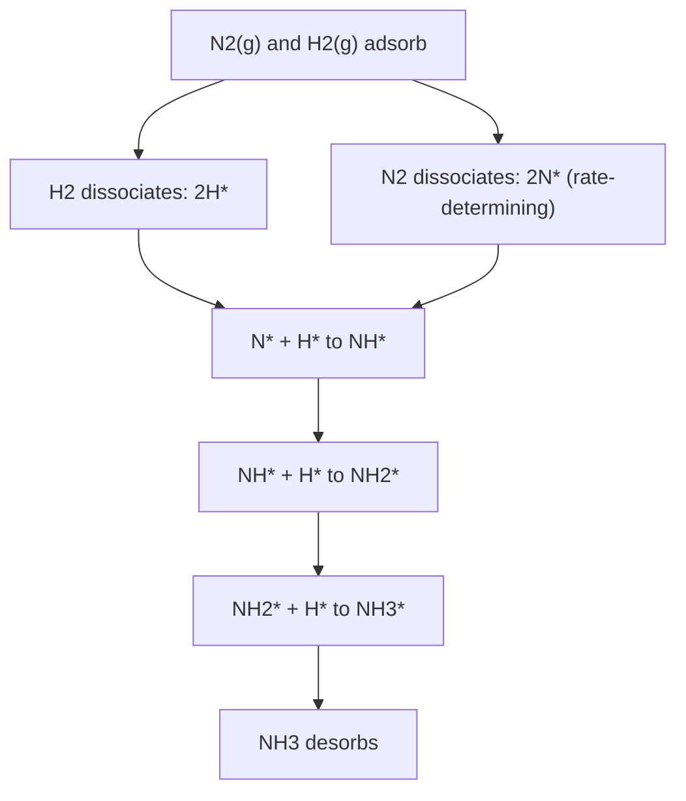
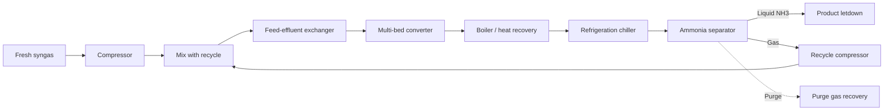

## The Haber Process for Ammonia Synthesis

### Overview

The Haber process (Haber–Bosch process) is the industrial catalytic synthesis of ammonia from gaseous nitrogen and hydrogen at elevated temperature and pressure:

$$\text{N}_2(g) + 3\,\text{H}_2(g) \rightleftharpoons 2\,\text{NH}_3(g), \quad \Delta H^\circ_{298} = -92.4\ \text{kJ/mol (per 2 mol NH}_3)$$

Fritz Haber demonstrated laboratory-scale synthesis in 1909 using an osmium catalyst. Carl Bosch and Alwin Mitasch (BASF) scaled it industrially, commissioning the Oppau plant in 1913 with an iron-based catalyst discovered through systematic screening of thousands of candidates. Haber (1918) and Bosch (1931, shared with Bergius) received Nobel Prizes in Chemistry. Gerhard Ertl received the 2007 Nobel Prize in Chemistry for surface-chemistry studies that established the molecular mechanism on iron surfaces.

**Key Points**

- Ammonia is the feedstock for nitrogen fertilizers (urea, ammonium nitrate, ammonium sulfate, DAP/MAP), nitric acid, explosives, nylon precursors, and refrigerants.
- The reaction is exothermic, with a decrease in moles of gas (4 mol to 2 mol), so equilibrium favors low temperature and high pressure; kinetics require high temperature. Industrial conditions are a compromise.
- Typical loop conditions: 400–500 °C, 100–250 bar, promoted iron catalyst, single-pass conversion of roughly 15–25%, with unreacted gas recycled.
- Global ammonia output is on the order of 150–190 million tonnes per year [Unverified: figures vary by source and year], and the process is commonly estimated at about 1–2% of global energy consumption and a similar order of CO$_2$ emissions [Unverified].

### Thermodynamics and Equilibrium

#### Equilibrium Constant

$$K_p = \frac{p_{\text{NH}_3}^2}{p_{\text{N}_2}\, p_{\text{H}_2}^3}$$

In terms of mole fractions at total pressure $P$:

$$K_p = \frac{y_{\text{NH}_3}^2}{y_{\text{N}_2}\, y_{\text{H}_2}^3} \cdot \frac{1}{P^2}$$

At high pressures, gas non-ideality is significant; fugacity coefficients ($\phi_i$) are used:

$$K_p = K_\phi^{-1} K_y \cdot P^{-2}, \quad K_\phi = \frac{\phi_{\text{NH}_3}^2}{\phi_{\text{N}_2}\phi_{\text{H}_2}^3}$$

#### Temperature Dependence (van 't Hoff)

$$\frac{d\ln K_p}{dT} = \frac{\Delta H^\circ}{RT^2}$$

Because $\Delta H^\circ < 0$, $K_p$ decreases as $T$ increases.

**Approximate literature $K_p$ values (atm$^{-2}$, N$_2$ + 3H$_2$ $\rightleftharpoons$ 2NH$_3$)** [Inference: approximate, source-dependent]

| T (°C) | $K_p$ (approx.) |
| --- | --- |
| 25 | $\sim 6 \times 10^{5}$ |
| 200 | $\sim 0.44$ |
| 300 | $\sim 4.3 \times 10^{-3}$ |
| 400 | $\sim 1.6 \times 10^{-4}$ |
| 500 | $\sim 1.5 \times 10^{-5}$ |

#### Le Chatelier Analysis

| Change | Effect on equilibrium NH$_3$ yield | Rationale |
| --- | --- | --- |
| Increase pressure | Increases | Fewer gas moles on the product side |
| Increase temperature | Decreases | Exothermic forward reaction |
| Remove NH$_3$ continuously | Increases | Shifts equilibrium right |
| Excess N$_2$ or H$_2$ beyond stoichiometry | Depends | Feed near 3:1 H$_2$:N$_2$ is optimal for rate and equilibrium |
| Add catalyst | No change in equilibrium | Only increases rate |
| Inert gases (Ar, CH$_4$) accumulate | Decreases | Dilution lowers partial pressures; controlled by purge |

#### Equilibrium Ammonia Fraction

For a stoichiometric feed, an approximate equilibrium ammonia mole fraction (mol %) at various conditions [Inference: approximate values from standard tabulations; actual figures vary with non-ideality treatment]:

| T (°C) | 100 bar | 200 bar | 300 bar |
| --- | --- | --- | --- |
| 400 | ~25 | ~37 | ~47 |
| 450 | ~16 | ~26 | ~35 |
| 500 | ~10 | ~18 | ~26 |

**Worked Example: Equilibrium Composition (ideal-gas approximation)**

For a 1:3 N$_2$:H$_2$ feed at total pressure $P$, let $\xi$ be the extent (per mole N$_2$ initially). Starting with 1 mol N$_2$ and 3 mol H$_2$:

- N$_2$: $1 - \xi$, H$_2$: $3 - 3\xi$, NH$_3$: $2\xi$, total $= 4 - 2\xi$

$$K_p = \frac{\left(\frac{2\xi}{4-2\xi}\right)^2 P^2}{\left(\frac{1-\xi}{4-2\xi}\right)\left(\frac{3-3\xi}{4-2\xi}\right)^3 P^4} = \frac{4\xi^2 (4-2\xi)^2}{27 (1-\xi)^4 P^2}$$

Solving numerically for given $K_p$ and $P$ yields $\xi$ and the ammonia mole fraction $y_{\text{NH}_3} = 2\xi/(4-2\xi)$.

### Kinetics and Mechanism

#### Rate-Determining Step

Dissociative chemisorption of N$_2$ on the iron surface is generally accepted as the rate-determining step, because of the very strong N≡N triple bond (bond energy ≈ 945 kJ/mol).

#### Elementary Steps (Langmuir–Hinshelwood type on Fe)

$$\text{H}_2(g) + 2^* \rightleftharpoons 2\text{H}^*$$

$$\text{N}_2(g) + 2^* \rightarrow 2\text{N}^* \quad \text{(rate-determining)}$$

$$\text{N}^* + \text{H}^* \rightleftharpoons \text{NH}^* + *$$

$$\text{NH}^* + \text{H}^* \rightleftharpoons \text{NH}_2^* + *$$

$$\text{NH}_2^* + \text{H}^* \rightleftharpoons \text{NH}_3^* + *$$

$$\text{NH}_3^* \rightleftharpoons \text{NH}_3(g) + *$$

where $*$ denotes a vacant surface site.

#### Temkin–Pyzhev Rate Equation

A classical empirical rate expression for iron catalysts:

$$r = k_1\, p_{\text{N}_2} \left(\frac{p_{\text{H}_2}^3}{p_{\text{NH}_3}^2}\right)^{\alpha} - k_2 \left(\frac{p_{\text{NH}_3}^2}{p_{\text{H}_2}^3}\right)^{1-\alpha}$$

with $\alpha \approx 0.5$ for iron catalysts. The first term is the forward rate and the second the reverse rate. This form captures NH$_3$ product inhibition (surface coverage by nitrogen-containing species).

#### Activation Energy and Surface Science

- Uncatalyzed gas-phase activation energy for N$_2$ dissociation is prohibitively high; iron lowers the effective barrier to roughly 50–100 kJ/mol range for the overall process on promoted catalysts [Inference: reported values depend on the model and conditions].
- Ertl's work showed that structure sensitivity is strong: Fe(111) is far more active than Fe(110); Fe(211) and Fe(100) show intermediate activity. C7 sites (seven-coordinated iron atoms) on Fe(111) are the most active sites.

#### Volcano Relationship

Catalytic activity across transition metals follows a Sabatier-type volcano curve against nitrogen binding energy: metals binding N too weakly (e.g., Ni, Co at the weak side) cannot dissociate N$_2$, while those binding too strongly (e.g., Mo, W) suffer poisoning by strongly bound N. Fe and Ru are near the top; Co–Mo alloys exploit synergy and sit near the volcano peak.

### Catalysts

#### Promoted Iron Catalyst

Prepared by fusing magnetite (Fe$_3$O$_4$) with promoters, cooling, crushing, and reducing in situ with synthesis gas to form porous $\alpha$-Fe.

| Component | Typical role |
| --- | --- |
| Fe$_3$O$_4$ (precursor) | Reduced to active $\alpha$-Fe |
| Al$_2$O$_3$ | Structural promoter; prevents sintering and stabilizes high surface area |
| K$_2$O | Electronic promoter; donates electron density, enhances N$_2$ dissociation, weakens NH$_3$ binding |
| CaO | Structural promoter; raises resistance to sintering, aids in melt properties |
| SiO$_2$, MgO (minor) | Structural stabilization, acid-neutralization |

Reduction proceeds as:

$$\text{Fe}_3\text{O}_4 + 4\,\text{H}_2 \rightarrow 3\,\text{Fe} + 4\,\text{H}_2\text{O}$$

Reduction is done gradually (avoid water vapor buildup to prevent sintering), typically between 350–500 °C.

**Catalyst Poisons**

| Poison | Effect |
| --- | --- |
| O-containing species (H$_2$O, CO, CO$_2$, O$_2$) | Temporary poisons; oxidize active iron; removed by re-reduction |
| Sulfur compounds (H$_2$S, COS) | Permanent poisons |
| Chlorine, phosphorus, arsenic compounds | Permanent poisons |
| Excess oil, lubricants, halides | Fouling, poisoning |

Synthesis gas is purified so total oxygen-containing compounds are typically kept to a few ppm.

#### Ruthenium-Based Catalysts

- Ru on graphitized carbon, or Ru supported on MgO/CeO$_2$ with Cs/Ba promoters (e.g., the Kellogg Advanced Ammonia Process, KAAP, first commercialized in the 1990s).
- Higher intrinsic activity than iron at lower pressures and temperatures (roughly 60–150 bar), and less inhibition by NH$_3$.
- Higher cost; carbon supports can suffer methanation under reaction conditions; oxide supports mitigate this.

#### Emerging Catalyst Classes

- Cobalt–molybdenum nitrides (Co$_3$Mo$_3$N), used in some commercial variations.
- Electride-supported Ru (e.g., Ru/C12A7:e$^-$), enabling N$_2$ dissociation with reduced hydrogen poisoning [Inference: results primarily from laboratory-scale work].
- Lithium-mediated and chemical-looping nitrogen reduction under investigation.

### Feedstock Production and Synthesis Gas Preparation

The overwhelming majority of hydrogen is produced by steam reforming of natural gas; coal gasification is used in some regions (notably China). Nitrogen comes from air.

#### Block Flow Diagram (svg_diagram)

<svg xmlns="http://www.w3.org/2000/svg" viewBox="0 0 760 340" width="760" height="340" font-family="sans-serif" font-size="12">
<title>Haber Process Block Flow (svg_diagram)</title>
<text x="380" y="22" text-anchor="middle" font-size="15" font-weight="bold">Haber Process Block Flow (svg_diagram)</text>
<rect x="10" y="60" width="100" height="44" rx="6" fill="#e8f0ff" stroke="#333" />
<text x="60" y="80" text-anchor="middle">Natural gas</text>
<text x="60" y="95" text-anchor="middle">Desulfurization</text>
<rect x="135" y="60" width="100" height="44" rx="6" fill="#e8f0ff" stroke="#333" />
<text x="185" y="80" text-anchor="middle">Primary</text>
<text x="185" y="95" text-anchor="middle">Reformer</text>
<rect x="260" y="60" width="100" height="44" rx="6" fill="#e8f0ff" stroke="#333" />
<text x="310" y="80" text-anchor="middle">Secondary</text>
<text x="310" y="95" text-anchor="middle">Reformer (+air)</text>
<rect x="385" y="60" width="100" height="44" rx="6" fill="#e8f0ff" stroke="#333" />
<text x="435" y="80" text-anchor="middle">Shift (HT/LT)</text>
<text x="435" y="95" text-anchor="middle">CO to CO2</text>
<rect x="510" y="60" width="100" height="44" rx="6" fill="#e8f0ff" stroke="#333" />
<text x="560" y="80" text-anchor="middle">CO2 Removal</text>
<text x="560" y="95" text-anchor="middle">(amine/PSA)</text>
<rect x="635" y="60" width="100" height="44" rx="6" fill="#e8f0ff" stroke="#333" />
<text x="685" y="80" text-anchor="middle">Methanation</text>
<text x="685" y="95" text-anchor="middle">(CO to CH4)</text>
<line x1="110" y1="82" x2="135" y2="82" stroke="#333" marker-end="url(#a2)" />
<line x1="235" y1="82" x2="260" y2="82" stroke="#333" marker-end="url(#a2)" />
<line x1="360" y1="82" x2="385" y2="82" stroke="#333" marker-end="url(#a2)" />
<line x1="485" y1="82" x2="510" y2="82" stroke="#333" marker-end="url(#a2)" />
<line x1="610" y1="82" x2="635" y2="82" stroke="#333" marker-end="url(#a2)" />
<line x1="685" y1="104" x2="685" y2="160" stroke="#333" marker-end="url(#a2)" />
<rect x="635" y="160" width="100" height="44" rx="6" fill="#fff2d8" stroke="#333" />
<text x="685" y="180" text-anchor="middle">Syngas</text>
<text x="685" y="195" text-anchor="middle">Compressor</text>
<line x1="635" y1="182" x2="560" y2="182" stroke="#333" marker-end="url(#a2)" />
<rect x="460" y="160" width="100" height="44" rx="6" fill="#ffe0e0" stroke="#333" />
<text x="510" y="180" text-anchor="middle">Ammonia</text>
<text x="510" y="195" text-anchor="middle">Converter</text>
<line x1="460" y1="182" x2="385" y2="182" stroke="#333" marker-end="url(#a2)" />
<rect x="285" y="160" width="100" height="44" rx="6" fill="#d8f0d8" stroke="#333" />
<text x="335" y="180" text-anchor="middle">Chiller /</text>
<text x="335" y="195" text-anchor="middle">Separator</text>
<line x1="285" y1="182" x2="210" y2="182" stroke="#333" marker-end="url(#a2)" />
<rect x="110" y="160" width="100" height="44" rx="6" fill="#d8f0d8" stroke="#333" />
<text x="160" y="180" text-anchor="middle">Liquid NH3</text>
<text x="160" y="195" text-anchor="middle">Product</text>
<path d="M335 204 L335 270 L640 270 L640 200" fill="none" stroke="#333" stroke-dasharray="5,3" marker-end="url(#a2)" />
<text x="490" y="286" text-anchor="middle">Recycle loop (unreacted N2/H2, purge to remove inerts)</text>
</svg>

#### Stage-by-Stage Chemistry

**1. Desulfurization**

Organic sulfur is hydrogenated over Co-Mo or Ni-Mo catalysts (hydrodesulfurization), then H$_2$S is absorbed on ZnO:

$$\text{RSH} + \text{H}_2 \rightarrow \text{RH} + \text{H}_2\text{S}$$

$$\text{H}_2\text{S} + \text{ZnO} \rightarrow \text{ZnS} + \text{H}_2\text{O}$$

**2. Primary Steam Reforming** (Ni/Al$_2$O$_3$ or Ni/calcium aluminate catalyst, ~700–850 °C, 25–40 bar, tubular furnace)

$$\text{CH}_4 + \text{H}_2\text{O} \rightleftharpoons \text{CO} + 3\,\text{H}_2, \quad \Delta H^\circ = +206\ \text{kJ/mol}$$

**3. Secondary Reforming** (air-fired autothermal, ~950–1000 °C, adds N$_2$ and burns part of remaining CH$_4$)

$$\text{CH}_4 + \tfrac{3}{2}\text{O}_2 \rightarrow \text{CO} + 2\,\text{H}_2\text{O}$$

$$\text{CH}_4 + \text{H}_2\text{O} \rightleftharpoons \text{CO} + 3\,\text{H}_2$$

The amount of process air is set so the H$_2$:N$_2$ ratio after downstream cleanup is close to 3:1.

**4. Water–Gas Shift**

$$\text{CO} + \text{H}_2\text{O} \rightleftharpoons \text{CO}_2 + \text{H}_2, \quad \Delta H^\circ = -41\ \text{kJ/mol}$$

- High-temperature shift (HTS): Fe$_3$O$_4$/Cr$_2$O$_3$ (or chromium-free alternatives) at ~350–450 °C.
- Low-temperature shift (LTS): Cu/ZnO/Al$_2$O$_3$ at ~190–250 °C.

**5. CO$_2$ Removal**

Absorption with aqueous amines (MEA, activated MDEA), hot potassium carbonate (Benfield), or physical solvents; or pressure swing adsorption (PSA). Recovered CO$_2$ can feed urea synthesis:

$$2\,\text{NH}_3 + \text{CO}_2 \rightleftharpoons \text{NH}_2\text{COONH}_4 \rightleftharpoons \text{CO(NH}_2)_2 + \text{H}_2\text{O}$$

**6. Methanation** (Ni catalyst, ~250–350 °C)

Trace carbon oxides poison the ammonia catalyst and are converted to methane (an inert in the loop):

$$\text{CO} + 3\,\text{H}_2 \rightarrow \text{CH}_4 + \text{H}_2\text{O}$$

$$\text{CO}_2 + 4\,\text{H}_2 \rightarrow \text{CH}_4 + 2\,\text{H}_2\text{O}$$

#### Overall Simplified Stoichiometry (Natural Gas Route)

$$0.88\,\text{CH}_4 + 1.26\,\text{air} + 1.24\,\text{H}_2\text{O} \rightarrow 0.88\,\text{CO}_2 + \text{N}_2 + 3\,\text{H}_2$$

[Inference: commonly cited textbook stoichiometry; actual balance depends on plant design and feedstock composition.]

#### Alternative Hydrogen Sources

| Route | Feedstock | Notes |
| --- | --- | --- |
| Steam methane reforming | Natural gas | Dominant globally |
| Naphtha reforming | Light oil | Older plants |
| Coal gasification | Coal | Prevalent in China; higher CO$_2$ intensity |
| Partial oxidation | Heavy oil/residue | Requires air separation |
| Water electrolysis | Water + electricity | "Green ammonia" with renewable power |
| Methane pyrolysis | Natural gas | Produces solid carbon |

### Synthesis Loop and Reactor Design

#### Compression

Synthesis gas (~25–35 bar after methanation) is compressed to 100–250 bar using centrifugal compressors (large plants; steam-turbine driven) or reciprocating compressors (small plants).

#### Ammonia Converter

The reaction is exothermic and equilibrium-limited, so converters use multiple catalyst beds with interbed cooling to follow an approach toward the optimal temperature profile.

**Reactor Types**

| Type | Cooling method |
| --- | --- |
| Quench converter (Kellogg, Casale) | Cold feed injected between beds |
| Indirect-cooled multi-bed (Haldor Topsøe S-200, S-300) | Heat exchangers between beds; radial flow to reduce pressure drop |
| Tube-cooled converter | Catalyst around cooling tubes (TVA design) |
| Horizontal converters (Uhde) | Horizontal layout, radial flow |

Radial-flow catalyst beds allow the use of small catalyst particles (high external surface area) at low pressure drop.

#### Optimal Temperature Profile

Because equilibrium conversion falls with rising temperature but kinetics rise, the ideal operating line lies between the equilibrium curve and the rate-maximum curve. The locus of maximum rate for given composition is:

$$T_{opt} = \frac{T_e}{1 + \frac{RT_e}{E_2 - E_1}\ln\left(\frac{E_2}{E_1}\right)}$$

where $T_e$ is the equilibrium temperature at the given composition and $E_1$, $E_2$ are the activation energies for the forward and reverse reactions, respectively. Multi-bed designs approximate this optimum by cooling between beds.

#### Ammonia Separation

The effluent is cooled (water/air cooling followed by ammonia refrigeration to about -5 to -25 °C, depending on pressure) so that NH$_3$ condenses, and the unreacted gas is recycled. Refrigeration temperature is set by the desired residual NH$_3$ content in the recycle gas.

#### Purge and Inert Management

Ar (from air) and CH$_4$ (from methanation) accumulate in the loop. A purge stream (typically a few percent of loop flow) is withdrawn and treated by cryogenic separation, membranes (Prism), or PSA to recover H$_2$ and return it to the loop.

Inert steady-state fraction is controlled by balancing purge rate against inert feed.

#### Energy Integration

- Waste-heat boilers generate high-pressure steam (typically 100+ bar) used to drive compressors.
- Modern natural gas-based plants approach energy consumption of roughly 28–32 GJ per tonne of NH$_3$ (lower heating value basis), compared with a theoretical minimum of about 20–21 GJ/t for the natural-gas route [Inference: values vary with source and plant vintage].
- Coal-based plants typically consume substantially more energy per tonne of ammonia.

### Process Conditions: Optimization Trade-offs

| Parameter | Effect of increase | Practical constraints |
| --- | --- | --- |
| Temperature | Faster kinetics; lower equilibrium yield | Catalyst sintering above ~550 °C; NH$_3$ decomposition |
| Pressure | Higher yield and rate | Compression cost, materials (thick-walled vessels, hydrogen embrittlement), safety |
| H$_2$:N$_2$ ratio | Optimum near 3:1 (slightly lower at high conversion due to kinetic effects) | Feed ratio depends on upstream reforming design |
| Space velocity | Lower conversion per pass, higher throughput | Loop compressor size |
| Inert level | Lowers partial pressures | Balanced by purge rate (hydrogen loss) |
| Catalyst particle size | Smaller = better effectiveness factor | Pressure drop |

**Worked Example: Loop Mass Balance**

Consider 100 kmol/h of fresh 3:1 H$_2$:N$_2$ makeup gas (25 kmol/h N$_2$, 75 kmol/h H$_2$), no inerts, and a complete conversion at the plant level via recycle:

$$\text{N}_2 + 3\,\text{H}_2 \rightarrow 2\,\text{NH}_3$$

- NH$_3$ produced = $2 \times 25 = 50$ kmol/h
- Mass = $50 \times 17.03 = 851.5$ kg/h $\approx 0.85$ t/h

With a single-pass conversion of 20% and a reactor feed rate $F$ (including recycle), the recycle rate $R$ satisfies:

$$0.20 \cdot F_{\text{reactants}} = 100\ \text{kmol/h (fresh reactants consumed)} \Rightarrow F_{\text{reactants}} = 500\ \text{kmol/h}$$

so about 400 kmol/h of unreacted reactant gas is recycled (recycle ratio ≈ 4:1, ignoring purge).

### Materials, Safety, and Operational Considerations

#### Materials of Construction

- **Hydrogen attack and embrittlement**: high-pressure, high-temperature H$_2$ diffuses into steel and reacts with carbon to form methane (decarburization), causing cracking. Vessel wall designs use low-alloy Cr–Mo steels selected using Nelson curves and internal liners/sleeves.
- **Nitriding**: NH$_3$ at high temperature forms iron nitrides on steel surfaces, causing embrittlement; nitriding-resistant alloys (e.g., austenitic stainless steels) or internal liners are used in critical zones.
- **Stress corrosion cracking**: NH$_3$ can cause SCC in carbon steel storage vessels (mitigated by adding water inhibitor to storage, or refrigerated storage).

#### Hazards

| Hazard | Description |
| --- | --- |
| Toxicity | NH$_3$ is toxic and corrosive; IDLH is 300 ppm |
| Flammability | LEL ≈ 15% v/v, UEL ≈ 28% v/v in air; relatively difficult to ignite |
| Hydrogen fire/explosion | Wide flammability range (~4–75% v/v in air) |
| High-pressure release | Vessel or line failure |
| BLEVE risk | Pressurized liquid storage |
| Runaway | Loss of heat removal at reformers, shift, and converter |

#### Storage and Transport

- Refrigerated atmospheric storage at approximately −33 °C.
- Pressurized spheres at ambient temperature (~17–18 bar at ~45 °C).
- Semi-refrigerated intermediate.
- Distribution by pipeline, ship, rail, and truck.

#### Start-up and Reduction

Fresh catalyst is reduced gradually under controlled H$_2$/N$_2$ flow and temperature ramp. Exposure of reduced catalyst to air is hazardous because pyrophoric iron reoxidizes exothermically; passivated ("pre-reduced") catalysts are supplied by manufacturers to shorten start-up.

### Environmental and Sustainability Aspects

#### CO$_2$ Emissions

For the natural gas route, roughly 1.6–2.0 t CO$_2$ per tonne NH$_3$ are emitted in total (combining process CO$_2$ and combustion CO$_2$) [Inference: commonly reported ranges, dependent on plant efficiency]. Coal-based routes can exceed 3–4 t CO$_2$/t NH$_3$ [Unverified].

The stoichiometrically necessary process CO$_2$ (from the reforming and shift reactions) is a concentrated stream well-suited to capture (often already used for urea production).

#### Decarbonization Pathways

| Pathway | Approach |
| --- | --- |
| Blue ammonia | SMR/ATR with CO$_2$ capture and storage (CCS) |
| Green ammonia | Water electrolysis with renewable electricity; N$_2$ from air separation (cryogenic or PSA) |
| Turquoise ammonia | Methane pyrolysis to H$_2$ and solid carbon |
| Biomass-based | Gasification of biomass residue |

**Green Ammonia Considerations**

$$2\,\text{H}_2\text{O} \rightarrow 2\,\text{H}_2 + \text{O}_2$$

- Electricity requirement is on the order of 9–10 MWh per tonne of NH$_3$ when electrolysis is included (approximately 50–55 kWh/kg H$_2$ for electrolysis plus compression and air separation) [Inference: order-of-magnitude estimate].
- Intermittent renewables require flexible loop operation, hydrogen or ammonia buffering, or hybrid grid supply. Conventional Haber–Bosch loops are designed for steady operation; load-following capability is a design constraint.
- Ammonia is also under investigation as a hydrogen carrier and a carbon-free fuel (shipping, power generation, co-firing).

#### Other Environmental Impacts

- **Nitrogen cycle disruption**: fertilizer runoff drives eutrophication; NO$_x$ and N$_2$O emissions downstream (nitric acid plants, soils).
- **Water use** in reforming and electrolysis.
- **Ammonia releases** to air/water (aquatic toxicity).

### Downstream Products

| Product | Chemistry |
| --- | --- |
| Urea | $2\text{NH}_3 + \text{CO}_2 \rightarrow \text{CO(NH}_2)_2 + \text{H}_2\text{O}$ (via carbamate) |
| Ammonium nitrate | $\text{NH}_3 + \text{HNO}_3 \rightarrow \text{NH}_4\text{NO}_3$ |
| Ammonium sulfate | $2\text{NH}_3 + \text{H}_2\text{SO}_4 \rightarrow (\text{NH}_4)_2\text{SO}_4$ |
| Nitric acid (Ostwald) | $4\,\text{NH}_3 + 5\,\text{O}_2 \xrightarrow{\text{Pt-Rh}} 4\,\text{NO} + 6\,\text{H}_2\text{O}$; then oxidation to NO$_2$ and absorption in water |
| Caprolactam / nylon-6 precursors | Via cyclohexanone oxime |
| Acrylonitrile (SOHIO ammoxidation) | $\text{CH}_2\text{=CHCH}_3 + \text{NH}_3 + \tfrac{3}{2}\text{O}_2 \rightarrow \text{CH}_2\text{=CHCN} + 3\,\text{H}_2\text{O}$ |
| Hydrazine, amines, nitriles | Various |

### Historical and Economic Context

- 1909: Haber's laboratory demonstration (~8% NH$_3$ in a small recirculating apparatus with Os catalyst at ~175 bar, ~550 °C).
- 1910–1913: Bosch, Mitasch, and colleagues at BASF develop high-pressure steel reactors (solving hydrogen-attack problems) and the iron catalyst; Oppau plant starts 1913.
- WWI: Process supports German munitions independence from Chilean nitrate.
- Post-1960s: Large single-train plants with centrifugal compressors (Kellogg design, ~1,000 t/d scale) lower energy and capital cost per tonne.
- Present: Large plants at 1,000–3,500+ t/d per train.
- Agricultural impact: A widely cited estimate holds that roughly half of nitrogen in human tissues derives from Haber–Bosch-derived fertilizer [Unverified: estimate varies by study].

### Analytical and Process Control

- **Feed and loop analysis**: gas chromatography (H$_2$, N$_2$, CH$_4$, Ar), online IR for CO/CO$_2$, ppm-level oxygenates monitoring at converter inlet.
- **Converter control**: temperature profiling by thermocouples in each bed; inlet temperature control by quench flow or exchanger bypass.
- **Key performance indicators**: specific energy consumption, loop conversion per pass, purge rate, catalyst activity (approach to equilibrium), pressure drop.
- **Advanced control**: model predictive control (MPC) on syngas ratio, loop pressure, and converter temperatures.

**Approach to Equilibrium**

$$\Delta T_{eq} = T_{\text{actual}} - T_{\text{equilibrium}}(y_{\text{NH}_3,\text{actual}})$$

A rising $\Delta T_{eq}$ over time indicates catalyst deactivation.

### Common Exam-Style Calculations

**Example 1: Effect of Pressure on Equilibrium**

If total pressure doubles from $P$ to $2P$ (at constant $T$ and ideal gas behavior), $K_p$ is unchanged but $K_y$ changes:

$$K_y = K_p P^2 \Rightarrow K_y \text{ increases by a factor of } 4$$

so equilibrium shifts toward NH$_3$.

**Example 2: Enthalpy Balance per Bed**

Adiabatic temperature rise for an ammonia fraction increase $\Delta y$ in a bed:

$$\Delta T_{ad} \approx \frac{(-\Delta H_r)\, \Delta y}{\bar{C}_p \cdot 2} \quad [\text{for a basis of 1 mol reactant gas; the factor 2 accounts for the stoichiometry of NH}_3]$$

Roughly, each 1 mol% NH$_3$ produced raises the adiabatic bed temperature by about 14 °C [Inference: standard textbook approximation]. This is why interbed cooling is necessary.

**Example 3: Yield Calculation**

A converter operating at 200 bar and 450 °C reaches ~20 mol% NH$_3$ at the outlet, compared with equilibrium ~26 mol% (from the table above). Approach to equilibrium:

$$\frac{20}{26} \approx 77\%$$

### Conclusion

The Haber process combines thermodynamic constraints (exothermic, mole-reducing equilibrium), kinetic limitations (N$_2$ dissociation on a promoted iron or ruthenium surface), and process-engineering solutions (multi-bed converters, recycle loops, heat integration, purge management) to produce ammonia at scales exceeding 100 million tonnes per year. It illustrates the interplay of chemical equilibrium, heterogeneous catalysis, reactor design, and energy integration, and it is now a focal point for industrial decarbonization through green and blue hydrogen supply chains.

### Related Topics

- Chemical equilibrium and Le Chatelier's principle in industrial synthesis
- Heterogeneous catalysis: Langmuir–Hinshelwood mechanisms and the Sabatier principle
- Surface science of nitrogen activation (Ertl's mechanism)
- Steam methane reforming and syngas chemistry
- Water–gas shift reaction engineering
- Urea synthesis (Bosch–Meiser process)
- Ostwald process and nitric acid production
- Reactor design for exothermic equilibrium-limited reactions
- Green ammonia, electrolyzers, and power-to-X
- Ammonia as a fuel and hydrogen carrier
- Nitrogen cycle, fertilizer use efficiency, and eutrophication
- Process safety for high-pressure hydrogen and ammonia systems
- Electrochemical and plasma-assisted nitrogen fixation