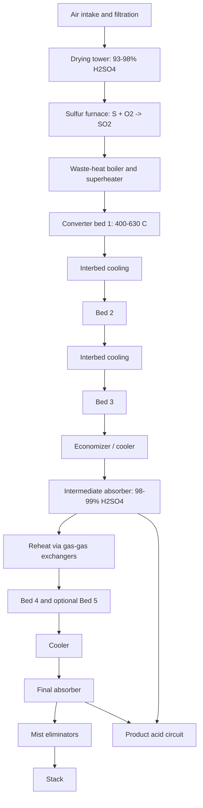

## The Contact Process for Sulfuric Acid Production

### Overview

The Contact process is the dominant industrial route to sulfuric acid (H$_2$SO$_4$), the highest-volume industrial chemical worldwide. It converts sulfur dioxide (SO$_2$) to sulfur trioxide (SO$_3$) by catalytic oxidation over a vanadium(V) oxide catalyst, then absorbs SO$_3$ into concentrated sulfuric acid to form oleum, which is diluted to the desired acid strength.

The process was patented by Peregrine Phillips (1831) using platinum, and was developed industrially by BASF (Rudolf Knietsch, 1901) and others. It displaced the lead chamber process because it yields higher-strength, purer acid (98–99% H$_2$SO$_4$ and oleum) with better economics. Platinum was later replaced by vanadium pentoxide, which is cheaper and less susceptible to poisoning by arsenic compounds.

**Key Points**

- Overall chemistry: sulfur source → SO$_2$ → SO$_3$ → H$_2$S$_2$O$_7$ (oleum) → H$_2$SO$_4$.
- The critical step is the reversible, exothermic, mole-reducing oxidation $2\,\text{SO}_2 + \text{O}_2 \rightleftharpoons 2\,\text{SO}_3$.
- Modern plants use multi-bed converters with interbed cooling and interpass absorption (double contact/double absorption, DCDA) to reach overall conversion above 99.7%.
- SO$_3$ is absorbed in 98–99% H$_2$SO$_4$, not in water, because direct absorption in water forms an acid mist that is hard to condense.
- The process is strongly exothermic overall and is a net steam exporter in sulfur-burning plants.
- Major uses: phosphate fertilizers (largest share), metal leaching, petroleum alkylation, chemical synthesis, batteries, detergents, pigments, and water treatment.

### Process Chemistry

#### Overall Reactions

$$\text{S}(l) + \text{O}_2(g) \rightarrow \text{SO}_2(g), \quad \Delta H^\circ \approx -297\ \text{kJ/mol}$$

$$2\,\text{SO}_2(g) + \text{O}_2(g) \rightleftharpoons 2\,\text{SO}_3(g), \quad \Delta H^\circ_{298} \approx -198\ \text{kJ/mol (per 2 mol SO}_3)$$

$$\text{SO}_3(g) + \text{H}_2\text{SO}_4(l) \rightarrow \text{H}_2\text{S}_2\text{O}_7(l) \quad \text{(oleum formation)}$$

$$\text{H}_2\text{S}_2\text{O}_7(l) + \text{H}_2\text{O}(l) \rightarrow 2\,\text{H}_2\text{SO}_4(l)$$

Net absorption equivalent:

$$\text{SO}_3(g) + \text{H}_2\text{O}(l) \rightarrow \text{H}_2\text{SO}_4(l), \quad \Delta H^\circ \approx -130\ \text{kJ/mol}$$

The absorption enthalpy is large and is recovered as heat (steam, hot water) in modern heat-recovery designs.

#### Why Not Absorb SO$_3$ Directly in Water?

The reaction is so exothermic that water vaporizes and SO$_3$ reacts in the gas phase to form fine H$_2$SO$_4$ mist droplets that pass through the absorber and are difficult to capture. Absorption in 98–99% H$_2$SO$_4$ has a minimum vapor pressure of both SO$_3$ and H$_2$O (near the azeotrope at approximately 98.3 wt%), allowing efficient absorption.

#### Feedstock Routes to SO$_2$

| Feedstock | Reaction | Notes |
| --- | --- | --- |
| Elemental sulfur (Frasch, recovered from H$_2$S in oil/gas via Claus) | $\text{S} + \text{O}_2 \rightarrow \text{SO}_2$ | Cleanest gas; most common; ~11–12% SO$_2$ possible |
| Iron pyrite | $4\,\text{FeS}_2 + 11\,\text{O}_2 \rightarrow 2\,\text{Fe}_2\text{O}_3 + 8\,\text{SO}_2$ | Requires dust removal and gas cleaning |
| Non-ferrous smelter gases (Cu, Zn, Pb, Ni sulfides) | e.g., $2\,\text{ZnS} + 3\,\text{O}_2 \rightarrow 2\,\text{ZnO} + 2\,\text{SO}_2$ | Variable SO$_2$ strength (often 5–13%); extensive gas cleaning; acid as by-product |
| Spent (regenerated) acid | Thermal decomposition: $\text{H}_2\text{SO}_4 \rightarrow \text{SO}_2 + \text{H}_2\text{O} + \tfrac{1}{2}\text{O}_2$ | Regeneration of refinery alkylation acid |
| Gypsum/anhydrite | Reduction with carbon, producing SO$_2$ and CaO (cement) | Niche (historical Müller–Kühne process) |
| Hydrogen sulfide | $2\,\text{H}_2\text{S} + 3\,\text{O}_2 \rightarrow 2\,\text{SO}_2 + 2\,\text{H}_2\text{O}$ | Wet gas (WSA-type) processes |

### Thermodynamics and Equilibrium

#### Equilibrium Constant

$$K_p = \frac{p_{\text{SO}_3}^2}{p_{\text{SO}_2}^2\, p_{\text{O}_2}}$$

Le Chatelier considerations:

| Change | Effect on SO$_3$ equilibrium yield | Reason |
| --- | --- | --- |
| Lower temperature | Increases | Exothermic forward reaction |
| Higher pressure | Increases (modestly) | 3 mol gas → 2 mol gas |
| Excess O$_2$ | Increases | Drives equilibrium right |
| Removal of SO$_3$ | Increases | Basis of interpass absorption (DCDA) |
| Catalyst | No effect on $K_p$ | Only rate |

**Approximate Equilibrium Conversion** (typical gas: ~10 vol% SO$_2$, ~11 vol% O$_2$, balance N$_2$, ~1 atm) [Inference: approximate; values depend on feed composition and source correlation]

| T (°C) | Equilibrium SO$_2$ conversion (%) |
| --- | --- |
| 400 | ~99 |
| 450 | ~97 |
| 500 | ~93 |
| 550 | ~85 |
| 600 | ~73 |
| 650 | ~56 |

Because the equilibrium conversion increases as temperature falls, but the catalyst becomes kinetically inactive below its light-off temperature (~380–420 °C for conventional V$_2$O$_5$, ~360–380 °C for cesium-promoted catalysts), the practical strategy is to operate at high temperature (~600–630 °C) at the first bed inlet for fast kinetics and progressively lower temperatures in later beds.

**Worked Example: Equilibrium Conversion Calculation**

For $x$ = fractional conversion of SO$_2$ with initial feed of $a$ mol SO$_2$, $b$ mol O$_2$, $c$ mol inert:

Total moles $= a + b + c - \tfrac{1}{2} a x$

$$K_p = \frac{\left(a x\right)^2 \, n_t^{\,1}}{\left[a(1-x)\right]^2\left[b - \tfrac{1}{2} a x\right] P}$$

where $n_t$ is the total moles at equilibrium and $P$ is total pressure (atm). For an ideal-gas basis with $a = 10$, $b = 11$, $c = 79$ (per 100 mol feed), solving iteratively for $x$ at a given $K_p(T)$ gives the equilibrium conversion curve.

The temperature dependence of $K_p$ is often correlated as [Inference: commonly cited approximate form, units atm$^{-1/2}$ when written per mole of SO$_3$]:

$$\log_{10} K_p \approx \frac{4905.5}{T} - 4.6455 \quad (T \text{ in K, for } \text{SO}_2 + \tfrac{1}{2}\text{O}_2 \rightleftharpoons \text{SO}_3)$$

### Kinetics and Catalysis

#### Vanadium Catalyst

The industrial catalyst comprises V$_2$O$_5$ (roughly 5–9 wt%) with alkali-metal sulfate promoters (K$_2$SO$_4$, and Cs$_2$SO$_4$ in low-temperature grades) on a silica support (diatomaceous earth or synthetic silica). At operating temperatures, the active phase forms a supported molten salt (liquid film) in the pores.

| Component | Role |
| --- | --- |
| V$_2$O$_5$ | Active oxidation component (V$^{5+}$/V$^{4+}$ redox couple) |
| K$_2$SO$_4$ (and Na, Cs sulfates) | Form a molten pyrosulfate/vanadate film; lower melting point and increase activity |
| SiO$_2$ (diatomite) | Support providing porosity |
| Cs$_2$SO$_4$ (promoter) | Lowers ignition temperature (~360–380 °C) and improves low-temperature activity |

#### Mechanism (Redox Cycle)

A simplified accepted mechanism in the molten film:

$$\text{V}^{5+}\text{O} + \text{SO}_2 \rightarrow \text{V}^{4+}\text{O} + \text{SO}_3$$

$$2\,\text{V}^{4+} + \tfrac{1}{2}\text{O}_2 \rightarrow 2\,\text{V}^{5+} + \text{O}^{2-}$$

Practical notes: The oxidation of V$^{4+}$ back to V$^{5+}$ is commonly considered rate-limiting at lower temperatures. Below approximately 440 °C, V$^{4+}$ precipitates as solid vanadyl sulfate complexes (for example, K$_4$(VO)$_3$(SO$_4$)$_5$), deactivating the melt; this is the origin of the practical lower temperature limit [Inference: consistent with published catalyst studies; details vary by formulation].

#### Rate Expression

A commonly used rate law for V$_2$O$_5$ catalysts (Mars–Maessen style form) [Inference: multiple correlations exist; parameters are catalyst-specific]:

$$r = \frac{k\, p_{\text{SO}_2}^{1/2} \, p_{\text{O}_2}^{\,\ldots}}{\ldots}\left(1 - \frac{p_{\text{SO}_3}}{K_p\, p_{\text{SO}_2}\, p_{\text{O}_2}^{1/2}}\right)$$

Key qualitative dependencies:

- Rate is positive-order in O$_2$ and SO$_2$, and inhibited by SO$_3$ (product inhibition, especially near equilibrium).
- Apparent activation energy shows a break near ~420–440 °C (higher below the break).
- Internal pore diffusion limits effectiveness for larger pellets; ring, star, or daisy-shaped extrudates reduce diffusion path length and pressure drop.

#### Catalyst Poisons and Deactivation

| Factor | Effect |
| --- | --- |
| Dust and fouling | Blocks bed voids; increases pressure drop |
| Moisture (liquid water contact) | Damages catalyst structure by dissolution of active phase |
| Arsenic, fluorine, chlorine compounds | Deactivate or attack catalyst/silica support (fluoride attacks silica) |
| Excessive temperature (>650 °C) | Sintering and loss of active phase |
| Low temperature (below light-off) | Formation of inactive V$^{4+}$ solids |
| Acid mist carryover | Local liquid acid attack |

Gas cleaning is critical for smelter and pyrite-derived streams (electrostatic precipitators, scrubbers, mist precipitators, drying towers) before the gas enters the converter.

### Process Flow

#### Block Flow Diagram (svg_diagram)

<svg xmlns="http://www.w3.org/2000/svg" viewBox="0 0 780 360" width="780" height="360" font-family="sans-serif" font-size="12">
<title>Contact Process Block Flow (svg_diagram)</title>
<text x="390" y="22" text-anchor="middle" font-size="15" font-weight="bold">Contact Process Block Flow, DCDA Configuration (svg_diagram)</text>
<rect x="10" y="60" width="90" height="44" rx="6" fill="#fff2d8" stroke="#333" />
<text x="55" y="80" text-anchor="middle">Molten S /</text>
<text x="55" y="95" text-anchor="middle">Ore / Smelter</text>
<rect x="125" y="60" width="90" height="44" rx="6" fill="#ffe0e0" stroke="#333" />
<text x="170" y="80" text-anchor="middle">SO2 Furnace</text>
<text x="170" y="95" text-anchor="middle">(air, dried)</text>
<rect x="240" y="60" width="90" height="44" rx="6" fill="#e8f0ff" stroke="#333" />
<text x="285" y="80" text-anchor="middle">Waste-heat</text>
<text x="285" y="95" text-anchor="middle">Boiler</text>
<rect x="355" y="60" width="90" height="44" rx="6" fill="#e8f0ff" stroke="#333" />
<text x="400" y="80" text-anchor="middle">Gas Cleaning</text>
<text x="400" y="95" text-anchor="middle">(if required)</text>
<rect x="470" y="60" width="90" height="44" rx="6" fill="#d8f0d8" stroke="#333" />
<text x="515" y="80" text-anchor="middle">Drying Tower</text>
<text x="515" y="95" text-anchor="middle">(98% H2SO4)</text>
<rect x="585" y="60" width="90" height="44" rx="6" fill="#ffe0e0" stroke="#333" />
<text x="630" y="80" text-anchor="middle">Converter</text>
<text x="630" y="95" text-anchor="middle">Beds 1-3</text>
<line x1="100" y1="82" x2="125" y2="82" stroke="#333" marker-end="url(#a3)" />
<line x1="215" y1="82" x2="240" y2="82" stroke="#333" marker-end="url(#a3)" />
<line x1="330" y1="82" x2="355" y2="82" stroke="#333" marker-end="url(#a3)" />
<line x1="445" y1="82" x2="470" y2="82" stroke="#333" marker-end="url(#a3)" />
<line x1="560" y1="82" x2="585" y2="82" stroke="#333" marker-end="url(#a3)" />
<line x1="630" y1="104" x2="630" y2="160" stroke="#333" marker-end="url(#a3)" />
<rect x="585" y="160" width="90" height="44" rx="6" fill="#d8f0d8" stroke="#333" />
<text x="630" y="180" text-anchor="middle">Intermediate</text>
<text x="630" y="195" text-anchor="middle">Absorber</text>
<line x1="585" y1="182" x2="560" y2="182" stroke="#333" marker-end="url(#a3)" />
<rect x="470" y="160" width="90" height="44" rx="6" fill="#ffe0e0" stroke="#333" />
<text x="515" y="180" text-anchor="middle">Converter</text>
<text x="515" y="195" text-anchor="middle">Bed 4 (+5)</text>
<line x1="470" y1="182" x2="445" y2="182" stroke="#333" marker-end="url(#a3)" />
<rect x="355" y="160" width="90" height="44" rx="6" fill="#d8f0d8" stroke="#333" />
<text x="400" y="180" text-anchor="middle">Final</text>
<text x="400" y="195" text-anchor="middle">Absorber</text>
<line x1="355" y1="182" x2="330" y2="182" stroke="#333" marker-end="url(#a3)" />
<rect x="240" y="160" width="90" height="44" rx="6" fill="#f0f0f0" stroke="#333" />
<text x="285" y="180" text-anchor="middle">Stack (tail</text>
<text x="285" y="195" text-anchor="middle">gas, mist elim.)</text>
<rect x="470" y="260" width="205" height="44" rx="6" fill="#fff2d8" stroke="#333" />
<text x="572" y="280" text-anchor="middle">Acid circuit: tanks, coolers, dilution water</text>
<text x="572" y="295" text-anchor="middle">Product: 98-99% H2SO4 / oleum</text>
<line x1="630" y1="204" x2="630" y2="260" stroke="#333" stroke-dasharray="5,3" marker-end="url(#a3)" />
<line x1="400" y1="204" x2="470" y2="282" stroke="#333" stroke-dasharray="5,3" marker-end="url(#a3)" />
</svg>

#### Sequence Diagram of Unit Operations

#### Stage-by-Stage Description

**1. Air Drying**

Atmospheric air is filtered and dried in a packed tower countercurrent to 93–98% H$_2$SO$_4$ to a moisture level of typically below about 50 mg H$_2$O per Nm$^3$ [Inference: design values vary by plant]. Moisture must be removed to prevent acid mist formation and corrosion downstream when SO$_3$ meets H$_2$O.

**2. Sulfur Burning (Sulfur-Based Plants)**

Molten sulfur (~140–150 °C, filtered to remove ash) is atomized into a refractory-lined furnace. Combustion temperatures reach roughly 1000–1200 °C. The SO$_2$ concentration at the furnace outlet is typically 10–12 vol% (limited by adiabatic flame temperature and refractory constraints).

$$\text{S} + \text{O}_2 \rightarrow \text{SO}_2, \quad \Delta H = -297\ \text{kJ/mol}$$

**3. Heat Recovery and Gas Conditioning**

A waste-heat boiler cools the gas to the converter inlet temperature (approximately 400–430 °C for bed 1 in conventional schemes) while generating high-pressure steam.

**4. Catalytic Conversion (Converter)**

Multi-bed adiabatic converter, typically 3 to 5 catalyst passes. Each bed operates adiabatically: temperature rises as conversion proceeds, approaching the equilibrium curve. Gas is cooled between beds (indirect heat exchange with steam or by gas-gas exchangers) so that the next bed starts at a lower temperature, allowing higher equilibrium conversion.

| Bed | Typical inlet T (°C) | Typical outlet T (°C) | Cumulative conversion (%) |
| --- | --- | --- | --- |
| 1 | 410–430 | 600–630 | ~60–70 |
| 2 | 430–450 | 500–520 | ~85–90 |
| 3 | 430–440 | 450–470 | ~93–95 |
| Intermediate absorption (SO$_3$ removed) |  |  |  |
| 4 | 410–430 | 430–450 | ~99–99.6 (overall) |
| 5 (optional, cesium) | 380–400 | ~400–410 | >99.8 (overall) |

[Inference: representative textbook profile; actual profiles depend on gas strength, catalyst grade, and design.]

**5. Interpass Absorption**

After bed 3 (or bed 2, depending on design), gas is cooled and passed through the intermediate absorber, where SO$_3$ is removed by 98–99% H$_2$SO$_4$. With SO$_3$ removed, the equilibrium is shifted, and the remaining SO$_2$ can be converted almost completely in the following beds.

**6. Final Absorption**

Remaining SO$_3$ is absorbed in the final tower. Gas exits through high-efficiency mist eliminators (Brownian-diffusion candle filters) to control acid mist emissions.

#### Interpass Absorption Principle (Conversion Gain)

Single absorption (SCSA) reaches about 97–98% overall conversion; DCDA reaches 99.7–99.9%. If the first-stage conversion is $X_1$ and the second stage converts a fraction $X_2$ of the residual SO$_2$:

$$X_{\text{overall}} = X_1 + (1 - X_1)\, X_2$$

**Worked Example**: With $X_1 = 0.94$ and $X_2 = 0.95$ (second stage, SO$_3$-free feed):

$$X_{\text{overall}} = 0.94 + 0.06 \times 0.95 = 0.997 \ (99.7\%)$$

**Comparison: SCSA vs. DCDA**

| Feature | Single contact | Double contact |
| --- | --- | --- |
| Overall conversion | ~97–98% | 99.7–99.9% |
| SO$_2$ emission | Much higher (needs tail-gas scrubbing) | Low; often below regulatory limits without scrubbing |
| Capital cost | Lower | Higher |
| Energy | Lower pressure drop | Extra gas-gas exchangers and absorber |

### Absorption Section Details

#### Acid Strength Control

Absorption efficiency peaks at acid strengths of about 98.3–99 wt% H$_2$SO$_4$. At lower concentrations, water vapor pressure rises, promoting mist formation; at higher concentrations, SO$_3$ vapor pressure rises, reducing absorption.

Oleum designation: "20% oleum" contains 20 wt% free SO$_3$ dissolved in H$_2$SO$_4$ (that is, mainly H$_2$S$_2$O$_7$).

**Oleum Conversion to Sulfuric Acid**

For dilution to a target strength, mass balances use free SO$_3$ content:

$$\text{H}_2\text{SO}_4 \text{ equivalent (wt\%)} = 100 + 22.5 \times \frac{w_{\text{free SO}_3}}{100}\ \text{(in wt\%, approx.)}$$

which accounts for the fact that 80 g of SO$_3$ combine with 18 g of H$_2$O to form 98 g H$_2$SO$_4$ (ratio 1.225). For 20% oleum: $100 + 0.225 \times 20 = 104.5\%$ acid equivalent [Inference: standard chemical-engineering convention].

#### Acid Circuit

- Circulating acid is cooled in acid coolers (anodically protected stainless steel, or alloy heat exchangers) because absorption releases heat.
- Dilution water is added to maintain strength as SO$_3$ is absorbed.
- Product acid is withdrawn from the drying and absorption loops (they are interconnected to maintain strength balance).

**Mass Balance Example**

For 1000 t/d of 100% H$_2$SO$_4$ from sulfur:

$$\text{Sulfur required} = 1000 \times \frac{32.06}{98.08} \approx 327\ \text{t/d (100\% conversion basis)}$$

At an overall conversion of 99.7% and absorption efficiency near 99.99%, actual sulfur demand is ~328–330 t/d.

**Stoichiometric Ratio**

$$\text{S} : \text{H}_2\text{SO}_4 = 32.06 : 98.08 = 0.3269 \ \text{(mass basis)}$$

### Energy Recovery and Heat Integration

The overall process is strongly exothermic:

| Step | Approx. heat release (kJ/mol S) |
| --- | --- |
| S → SO$_2$ | ~297 |
| SO$_2$ → SO$_3$ | ~99 |
| SO$_3$ + H$_2$O → H$_2$SO$_4$ (absorption) | ~130 |
| Total | ~526 |

Heat-recovery options:

- High-pressure steam from furnace waste-heat boiler and converter interbed coolers (typical 40–60 bar superheated steam; steam exported or used in turbogenerators).
- Economizers on converter gas outlets.
- **Heat Recovery System (HRS, Monsanto)**: absorption at higher acid temperature (~200–220 °C) in an energy-recovery tower so that a portion of the absorption heat is recovered as medium-pressure steam (about 8–12 bar), increasing total steam export by roughly 0.5 t per tonne of acid [Inference: approximate; varies by design].
- Modern sulfur-burning plants are often net energy exporters, producing on the order of 1–1.4 t steam per tonne acid.

### Materials of Construction

| Equipment | Typical material | Reason |
| --- | --- | --- |
| Sulfur burner | Refractory brick, carbon steel shell | High temperature |
| Waste-heat boiler | Carbon steel/low-alloy | High temperature, dry SO$_2$ |
| Converter | Stainless steel (e.g., 304H/321) or aluminized steel internals | Sulfidation, high temperature |
| Absorption towers | Brick-lined carbon steel; ceramic packing (saddles) | Hot concentrated acid |
| Acid piping/pumps | Alloy 20, Zeron 100, silicon iron, high-silicon stainless (e.g., SX) | Erosion-corrosion by hot 98% acid |
| Acid coolers | Anodically protected 316L / alloy tube-and-shell; alloy plate exchangers | Corrosion control |

Concentrated sulfuric acid (>93%) passivates carbon steel at moderate temperatures through formation of an iron sulfate layer; dilute or moving acid rapidly corrodes carbon steel, so velocity and concentration are controlled.

### Emissions and Environmental Control

| Emission | Source | Control |
| --- | --- | --- |
| SO$_2$ | Unconverted gas, upsets | DCDA; tail-gas scrubbing (peroxide, ammonia, caustic, cesium-catalyst 5th bed) |
| SO$_3$ / acid mist | Absorber tail gas | Mist eliminators (candle filters), proper acid temperature/strength control |
| NO$_x$ | High-temperature combustion | Low-NO$_x$ furnace design; typically small in sulfur burning |
| Particulates | Ore roasting | ESPs, wet electrostatic precipitators |
| Spent catalyst | Screening losses | Reclamation of vanadium |
| Wastewater | Gas cleaning purge | Neutralization, metal removal |

**Emission Performance Metric**

$$\text{Emission factor} = \frac{\text{kg SO}_2 \text{ emitted}}{\text{t of H}_2\text{SO}_4 \text{ produced (100\% basis)}}$$

Conversion of 99.7% corresponds to about 1.5–2 kg SO$_2$/t acid; single contact at 98% conversion results in roughly 10 times that amount [Inference: approximate calculation from stoichiometry].

Derivation sketch: One tonne of 100% H$_2$SO$_4$ corresponds to $\approx 0.6532$ t SO$_2$ (64.06/98.08). At 99.7% conversion, unconverted SO$_2$ $\approx 0.6532 \times 0.003 = 1.96$ kg/t.

### Safety Considerations

| Hazard | Description |
| --- | --- |
| Acid burns | Concentrated H$_2$SO$_4$ is severely corrosive and strongly dehydrating |
| Oleum | Fuming SO$_3$ vapor; violent reaction with water |
| SO$_2$ | Toxic, respiratory irritant |
| Molten sulfur | Fire hazard; H$_2$S formation; static ignition |
| Hydrogen generation | Dilute acid on steel evolves H$_2$, creating explosion risk in tanks and pipes |
| High temperature | Furnace and converter |
| Exothermic dilution | Always add acid to water, not water to acid, to control heat release and spattering |

Mitigation measures include leak detection, acid-resistant PPE, emergency showers, acid-proof containment (bunds), interlocks on air/sulfur flow ratio, and hydrogen monitoring for storage tanks.

### Process Control and Monitoring

- **Air-to-sulfur ratio control**: maintains SO$_2$ strength (typically 9–12 vol%) and O$_2$:SO$_2$ ratio (≥ ~0.8–1.0).
- **Converter inlet temperature control**: managed by gas bypass around interbed heat exchangers.
- **Acid strength control**: conductivity or density measurement with dilution water addition.
- **Analyzers**: on-line SO$_2$ (UV or IR), O$_2$, moisture, and stack SO$_2$/SO$_3$ (continuous emissions monitoring).
- **Catalyst health**: track bed temperature profile shift downstream (an indication of deactivation as the reaction front moves through the bed) and pressure drop.

**Approach to Equilibrium** (converter performance indicator)

$$\Delta T_{eq} = T_{\text{outlet}} - T_{\text{equilibrium}}(X_{\text{actual}})$$

Values of $\Delta T_{eq}$ below roughly 10–20 °C indicate good catalyst activity in most beds [Inference: typical operating guidance; varies by bed].

### Comparison with Alternative Routes

| Process | Description | Status |
| --- | --- | --- |
| Lead chamber | NO$_x$ catalyzed oxidation in lead chambers; ~65–78% acid | Obsolete |
| Tower (Glover) process | Improved nitrous vitriol route; ~78% acid | Obsolete |
| Contact process | V$_2$O$_5$ catalyst; 98–99% acid and oleum | Dominant |
| Wet sulfuric acid (WSA, Topsøe) | Condenses acid from wet gas without drying | Used for wet H$_2$S gases and spent-acid gases |
| Metallurgical acid plants | Contact process on smelter off-gas | Widely used |

### Economics and Scale

- Typical modern single-train sulfur burning plant capacity: 2,000–5,000+ t/d (100% H$_2$SO$_4$).
- Sulfur cost is the dominant operating cost, followed by energy credit offsets and catalyst/maintenance.
- Sulfuric acid is typically produced close to its use because of low value-to-weight ratio (transport is costly); fertilizer complexes integrate acid plants with phosphoric acid production:

$$\text{Ca}_5(\text{PO}_4)_3\text{F} + 5\,\text{H}_2\text{SO}_4 + 10\,\text{H}_2\text{O} \rightarrow 3\,\text{H}_3\text{PO}_4 + 5\,\text{CaSO}_4\cdot 2\text{H}_2\text{O} + \text{HF}$$

### Worked Calculations

**Example 1: Sulfur Furnace Outlet Composition**

Combustion of sulfur in dry air (21 vol% O$_2$, 79 vol% N$_2$) to produce a gas with 11 vol% SO$_2$: Basis 100 mol gas out. Since S + O$_2$ → SO$_2$ consumes one O$_2$ per SO$_2$, and no net change in moles occurs:

- SO$_2$ = 11 mol
- O$_2$ = 21 − 11 = 10 mol
- N$_2$ = 79 mol

$$\frac{\text{O}_2}{\text{SO}_2} = \frac{10}{11} = 0.91$$

The O$_2$:SO$_2$ ratio is close to but slightly below 1, which is acceptable for high-strength gas designs (many plants target ≥ 0.8).

**Example 2: Adiabatic Temperature Rise in Bed 1**

For a converter feed of 11 vol% SO$_2$ with 60% conversion in bed 1, the heat released per mole feed gas:

$$Q = 0.11 \times 0.60 \times 99\ \text{kJ/mol} \approx 6.5\ \text{kJ/mol feed}$$

With mean heat capacity $\bar{C}_p \approx 32\ \text{J/(mol·K)}$:

$$\Delta T_{ad} \approx \frac{6500}{32} \approx 200\ \text{K}$$

consistent with bed 1 inlet ~420 °C and outlet ~620 °C [Inference: order-of-magnitude verification].

**Example 3: Sulfur Requirement**

Producing 1,500 t/d of 98.5 wt% H$_2$SO$_4$:

$$m_{\text{H}_2\text{SO}_4,\,100\%} = 1500 \times 0.985 = 1477.5\ \text{t/d}$$

$$m_{\text{S}} = 1477.5 \times \frac{32.06}{98.08} \approx 483\ \text{t/d}$$

allowing an overall plant efficiency of ~99.5% raises this to approximately 485 t/d.

### Recent Developments

- Cesium-promoted catalysts allow lower-temperature operation (final bed at ~380 °C), improving overall conversion.
- Larger-diameter, low-pressure-drop catalyst geometries (star, ring, daisy) reduce fan power.
- High-strength gas designs (up to ~13–14% SO$_2$) increase throughput per unit converter volume.
- Improved acid materials (high-silicon stainless steels, Zeron 100) allow higher acid temperatures and greater heat recovery.
- Digital monitoring and predictive maintenance for converter and acid circuit.
- Increased regulatory pressure to reduce SO$_2$ and acid mist emissions (varies by jurisdiction; consult current regulations).

### Conclusion

The Contact process couples a favorable exothermic equilibrium (driven by staged cooling and interpass absorption) with an active vanadium catalyst, and integrates heat recovery and acid absorption to produce concentrated sulfuric acid with minimal emissions and a net energy surplus. Design decisions balance conversion, catalyst temperature windows, materials limitations, and emission regulations, and the same principles (staged adiabatic beds, product removal to shift equilibrium) appear in many other industrial catalytic processes.

### Related Topics

- Chemical equilibrium and Le Chatelier's principle in industrial systems
- Heterogeneous catalysis: supported liquid-phase (SLP) catalysts
- Adiabatic reactor design and interbed heat exchange
- Claus process and sulfur recovery from H$_2$S
- Phosphoric acid and fertilizer production (wet process)
- Wet sulfuric acid (WSA) process
- Metallurgical off-gas treatment and SO$_2$ abatement (flue gas desulfurization)
- Corrosion science for concentrated H$_2$SO$_4$ and oleum
- Oleum chemistry and sulfonation reactions
- Industrial heat integration and pinch analysis
- Air pollution control: mist eliminators and scrubbers
- Sulfuric acid alkylation and regeneration in refineries