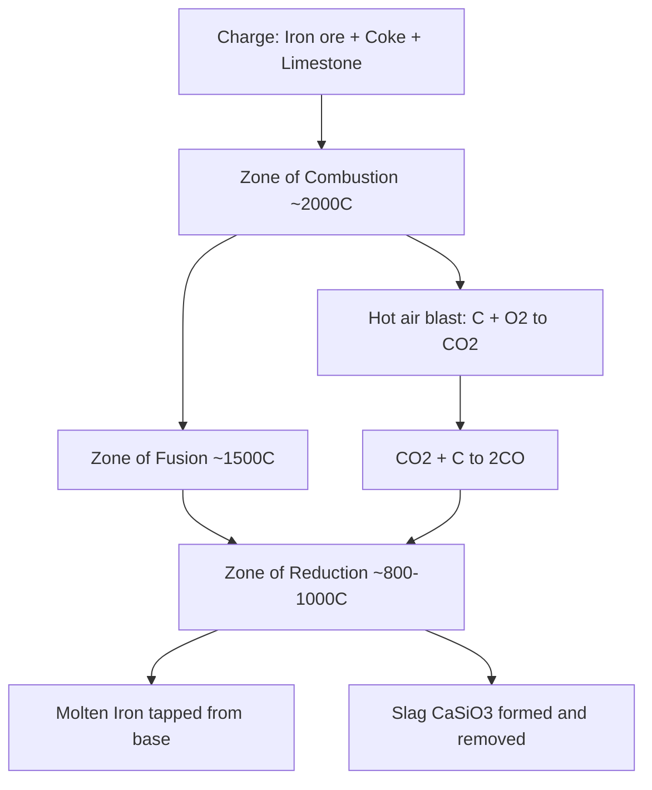

## Extraction and Refining of Metals

### Overview

Metal extraction (metallurgy) is the branch of industrial chemistry concerned with obtaining metals from their naturally occurring ores and refining them to usable purity. Since most metals occur in nature as compounds (oxides, sulfides, carbonates, halides) rather than in elemental form (except for noble metals like Au, Pt, and Ag), extraction requires chemical or electrochemical reduction of the metal ion to the metallic state.

### Occurrence of Metals

**Key Points**

- **Native state**: Unreactive metals (Au, Pt, Ag, Cu occasionally) occur as free elements.
- **Combined state**: Reactive metals occur as compounds:
  - **Oxides**: Hematite ($Fe_2O_3$), Bauxite ($Al_2O_3 \cdot 2H_2O$), Cassiterite ($SnO_2$)
  - **Sulfides**: Galena ($PbS$), Zinc blende ($ZnS$), Copper pyrites ($CuFeS_2$)
  - **Carbonates**: Limestone ($CaCO_3$), Magnesite ($MgCO_3$), Siderite ($FeCO_3$)
  - **Halides**: Rock salt ($NaCl$), Carnallite ($KCl \cdot MgCl_2 \cdot 6H_2O$)
  - **Sulfates**: Gypsum ($CaSO_4 \cdot 2H_2O$), Barite ($BaSO_4$)

A **mineral** is a naturally occurring compound of a metal; an **ore** is a mineral (or mixture) from which the metal can be extracted profitably and conveniently.

### Reactivity Series and Extraction Method

The method of extraction correlates directly with the metal's position in the reactivity (activity) series, since this determines the ease of reduction of its ion:

| Reactivity Zone | Metals | Extraction Method |
| --- | --- | --- |
| Highly reactive | K, Na, Ca, Mg, Al | Electrolysis of molten (fused) compounds |
| Moderately reactive | Zn, Fe, Pb, Cu, Sn | Reduction with carbon/CO (thermal reduction) or self-reduction |
| Low reactivity | Hg, Ag | Simple heating (thermal decomposition) |
| Least reactive (noble) | Au, Pt | Found native; physical separation only |

### General Steps in Metal Extraction

#### 1. Concentration (Ore Dressing)

Removal of unwanted gangue (earthy impurities) from the ore before extraction.

- **Hydraulic washing (gravity separation)**: Exploits density difference between ore and gangue using a stream of water. Used for oxide ores like hematite and tin ore.
- **Magnetic separation**: Exploits magnetic properties; used to separate magnetic ore (e.g., magnetite) from non-magnetic gangue, or vice versa.
- **Froth flotation**: Used mainly for sulfide ores. The powdered ore is mixed with water, pine oil (frother), and a collector (e.g., xanthate). Air is blown through; sulfide ore particles adhere to froth bubbles and float, while gangue sinks.
- **Leaching**: Chemical method where the ore is dissolved in a suitable reagent leaving impurities undissolved. Example: bauxite is leached using concentrated NaOH (**Bayer's process**) to remove silica and iron oxide impurities, exploiting the amphoteric nature of $Al_2O_3$:

$$Al_2O_3(s) + 2NaOH(aq) + 3H_2O(l) \rightarrow 2NaAl(OH)_4(aq)$$

#### 2. Conversion to Oxide (Roasting and Calcination)

Since most reduction methods work efficiently on oxides, sulfide and carbonate ores are first converted to oxides.

- **Calcination**: Heating carbonate/hydrated ore in limited air/absence of air to drive off $CO_2$ or $H_2O$.

$$CaCO_3(s) \xrightarrow{\Delta} CaO(s) + CO_2(g)$$

- **Roasting**: Heating sulfide ore strongly in excess air to convert it to oxide, releasing $SO_2$.

$$2ZnS(s) + 3O_2(g) \xrightarrow{\Delta} 2ZnO(s) + 2SO_2(g)$$

#### 3. Reduction to Free Metal

**a) Thermal (Smelting) Reduction**

The metal oxide is reduced using a reducing agent, typically coke (carbon), carbon monoxide, or a more reactive metal.

- Reduction of iron oxide in a **blast furnace**:

$$Fe_2O_3(s) + 3CO(g) \rightarrow 2Fe(l) + 3CO_2(g)$$

- **Self-reduction (auto-reduction)**: Applicable to metals lower in reactivity (e.g., Cu, Hg, Pb) whose sulfide ores are partially roasted, and the resulting oxide reacts with remaining sulfide:

$$2Cu_2S + 3O_2 \rightarrow 2Cu_2O + 2SO_2$$

$$2Cu_2O + Cu_2S \rightarrow 6Cu + SO_2$$

**b) Reduction Using a More Reactive Metal (Thermite/Metallothermic Process)**

Highly exothermic displacement reactions used for metals like Cr and Mn, or for welding railway tracks:

$$Fe_2O_3(s) + 2Al(s) \rightarrow 2Fe(l) + Al_2O_3(s) + \text{heat}$$

**c) Electrolytic Reduction**

Used for highly reactive metals (K, Na, Ca, Mg, Al) that cannot be reduced by carbon because carbon itself is less reactive, or because they would react with carbon to form carbides. The molten (fused) ionic compound is electrolyzed:

- **Extraction of Aluminum (Hall–Héroult Process)**: Purified $Al_2O_3$ is dissolved in molten cryolite ($Na_3AlF_6$) to lower the melting point (from ~2050 °C to ~950 °C) and increase conductivity. Electrolysis with carbon electrodes:
  - Cathode: $Al^{3+} + 3e^- \rightarrow Al(l)$
  - Anode: $2O^{2-} \rightarrow O_2(g) + 4e^-$ (anode is consumed as $O_2$ reacts with carbon to form $CO_2$)
- **Extraction of Sodium (Down's Process)**: Electrolysis of molten $NaCl$ (mixed with $CaCl_2$ to lower melting point).
  - Cathode: $Na^+ + e^- \rightarrow Na$
  - Anode: $2Cl^- \rightarrow Cl_2(g) + 2e^-$

#### 4. Refining (Purification of Crude Metal)

The crude metal obtained still contains impurities and must be purified for commercial use.

| Method | Principle | Example |
| --- | --- | --- |
| **Distillation** | Volatile metal is distilled off from impurities | Zn, Hg |
| **Liquation** | Low-melting metal is melted away from higher-melting impurities on a sloping hearth | Sn |
| **Poling** | Impure molten metal stirred with green wood poles; the released hydrocarbon gases reduce any metal oxide impurity | Cu |
| **Electrolytic refining** | Impure metal (anode) dissolves and pure metal deposits on cathode; less active impurities collect as "anode mud" | Cu, Ag, Au, Ni |
| **Zone refining** | Exploits the difference in solubility of impurities in molten vs. solid state of the metal; a moving heater sweeps impurities to one end | Ge, Si (semiconductor-grade) |
| **Vapor phase refining (Mond process)** | Metal converted to a volatile compound, which is then decomposed to give pure metal | Ni (as $Ni(CO)_4$) |
| **Chromatographic method** | Adsorption differences separate metal ions in solution | Used for trace/rare metals |

**Electrolytic Refining (Detailed Example — Copper)**

- Anode: Impure copper block
- Cathode: Thin sheet of pure copper
- Electrolyte: Acidified copper sulfate solution ($CuSO_4$ + dilute $H_2SO_4$)
  - Anode: $Cu(s) \rightarrow Cu^{2+}(aq) + 2e^-$
  - Cathode: $Cu^{2+}(aq) + 2e^- \rightarrow Cu(s)$

More reactive impurities (Fe, Zn) dissolve into the electrolyte but do not deposit at the cathode under controlled voltage; less reactive impurities (Ag, Au, Pt) do not dissolve and fall as **anode mud**, which is commercially valuable as a source of precious metals.

### Process Flow Diagram (svg_diagram)

<svg xmlns="http://www.w3.org/2000/svg" viewBox="0 0 900 240" font-family="sans-serif">
\<style\>
.box{fill:#eef3fb;stroke:#33557a;stroke-width:2;}
.txt{font-size:14px;fill:#1a1a1a;text-anchor:middle;}
.lbl{font-size:12px;fill:#444;text-anchor:middle;}
.arrow{stroke:#33557a;stroke-width:2;marker-end:url(#arrowhead);}
\</style\>
<text x="450" y="20" class="txt" font-weight="bold">Metal Extraction and Refining Process Flow (svg_diagram)</text>
<rect x="20" y="60" width="130" height="60" class="box" />
<text x="85" y="85" class="txt">Ore</text>
<text x="85" y="102" class="lbl">(with gangue)</text>
<line x1="150" y1="90" x2="200" y2="90" class="arrow" />
<rect x="200" y="60" width="130" height="60" class="box" />
<text x="265" y="85" class="txt">Concentration</text>
<text x="265" y="102" class="lbl">Flotation/Leaching</text>
<line x1="330" y1="90" x2="380" y2="90" class="arrow" />
<rect x="380" y="60" width="130" height="60" class="box" />
<text x="445" y="85" class="txt">Roasting/</text>
<text x="445" y="102" class="lbl">Calcination</text>
<line x1="510" y1="90" x2="560" y2="90" class="arrow" />
<rect x="560" y="60" width="130" height="60" class="box" />
<text x="625" y="85" class="txt">Reduction</text>
<text x="625" y="102" class="lbl">Thermal/Electrolytic</text>
<line x1="690" y1="90" x2="740" y2="90" class="arrow" />
<rect x="740" y="60" width="130" height="60" class="box" />
<text x="805" y="85" class="txt">Crude Metal</text>
<line x1="805" y1="120" x2="805" y2="160" class="arrow" />
<rect x="740" y="160" width="130" height="60" class="box" />
<text x="805" y="185" class="txt">Refining</text>
<text x="805" y="202" class="lbl">Electrolysis/Distillation</text>
</svg>

### Blast Furnace Process (Iron Extraction) — Reaction Zones

### Environmental and Industrial Considerations

- **$SO_2$ emissions** from roasting sulfide ores contribute to acid rain; modern plants capture $SO_2$ for sulfuric acid manufacture (contact process feedstock).
- **Slag formation**: Flux (e.g., limestone) is added to combine with gangue (e.g., $SiO_2$) forming fusible slag (e.g., $CaSiO_3$), which floats over molten metal and is removed.

$$CaO + SiO_2 \rightarrow CaSiO_3 \, (\text{slag})$$

- **Energy intensity**: Electrolytic extraction (e.g., Al) is highly energy-intensive; aluminum production is often sited near cheap hydroelectric power.
- [Inference] Recycling rates and energy recovery strategies for metals like Al and Cu vary significantly by region and industrial infrastructure, so specific recovery percentages should be verified against current industry data rather than treated as fixed constants.

### Worked Example

**Problem**: Calculate the mass of $CO$ required to reduce 1 tonne of $Fe_2O_3$ completely to iron.

**Solution**:

$$Fe_2O_3 + 3CO \rightarrow 2Fe + 3CO_2$$

Molar mass of $Fe_2O_3 = 160 \, g/mol$; Molar mass of $CO = 28 \, g/mol$

Moles of $Fe_2O_3$ in 1 tonne ($10^6 \, g$) $= \dfrac{10^6}{160} = 6250 \, mol$

Moles of $CO$ needed $= 3 \times 6250 = 18750 \, mol$

Mass of $CO = 18750 \times 28 = 525000 \, g = 525 \, kg$

**Next Steps**

- Thermodynamics of reduction (Ellingham diagrams) and predicting feasibility of reducing agents
- Electrochemistry: Faraday's laws applied to electrolytic extraction and refining
- Corrosion chemistry and metal protection (galvanization, anodizing, sacrificial protection)
- Alloy formation and its relation to metallurgical purity
- Industrial case study: contact process for $H_2SO_4$ from roaster $SO_2$
- Environmental chemistry: acid mine drainage and tailings management