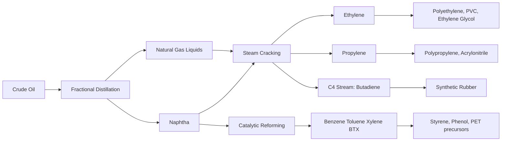

## Petroleum Refining and Petrochemicals

### Overview

Petroleum (crude oil) is a complex mixture of hydrocarbons (alkanes, cycloalkanes, aromatics) along with sulfur, nitrogen, oxygen, and trace metal compounds. Petroleum refining is the industrial process of separating and converting this mixture into usable fuels, lubricants, and feedstocks for the petrochemical industry.

### Composition of Crude Oil

**Key Points**

- **Paraffins (alkanes)**: Straight and branched-chain saturated hydrocarbons ($C_nH_{2n+2}$)
- **Naphthenes (cycloalkanes)**: Saturated ring hydrocarbons ($C_nH_{2n}$)
- **Aromatics**: Ring compounds with delocalized $\pi$ systems (benzene, toluene, xylene)
- **Asphaltenes/Resins**: High molecular weight, complex polycyclic structures
- **Impurities**: Sulfur compounds (thiols, sulfides), nitrogen compounds, oxygenated compounds, and trace metals (Ni, V)

### Primary Refining: Fractional Distillation

Crude oil is heated in a furnace to ~350–400 °C and fed into a **fractionating column** (fractionating tower) where it separates by boiling point into fractions, each collected at trays at different heights.

| Fraction | Approx. Boiling Range | Carbon Range | Uses |
| --- | --- | --- | --- |
| Refinery gas | < 30 °C | $C_1$–$C_4$ | LPG, fuel gas |
| Naphtha (light) | 30–110 °C | $C_5$–$C_9$ | Petrochemical feedstock, gasoline blending |
| Gasoline (petrol) | 40–200 °C | $C_5$–$C_{12}$ | Motor fuel |
| Kerosene | 150–250 °C | $C_{10}$–$C_{16}$ | Jet fuel, lighting |
| Diesel (gas oil) | 250–350 °C | $C_{14}$–$C_{20}$ | Diesel engines, heating |
| Lubricating oil | 300–370 °C | $C_{20}$–$C_{50}$ | Lubricants, wax |
| Residue (bitumen/asphalt) | > 370 °C (non-volatile) | $C_{50}+$ | Road surfacing, fuel oil |

The process exploits differences in **boiling point**, not chemical composition, so each fraction is still a mixture requiring further processing.

### Fractionating Column Schematic (svg_diagram)

<svg xmlns="http://www.w3.org/2000/svg" viewBox="0 0 500 400" font-family="sans-serif">
\<style\>
.tower{fill:#f0f4f9;stroke:#33557a;stroke-width:2;}
.tray{fill:#dbe6f4;stroke:#33557a;stroke-width:1;}
.txt{font-size:12px;fill:#1a1a1a;}
.title{font-size:14px;font-weight:bold;fill:#1a1a1a;text-anchor:middle;}
\</style\>
<text x="250" y="20" class="title">Fractionating Column (svg_diagram)</text>
<polygon points="200,40 300,40 340,360 160,360" class="tower" />
<rect x="175" y="60" width="150" height="15" class="tray" />
<text x="335" y="72" class="txt">Refinery gas (&lt;30°C)</text>
<rect x="180" y="110" width="140" height="15" class="tray" />
<text x="330" y="122" class="txt">Naphtha (30-110°C)</text>
<rect x="185" y="160" width="130" height="15" class="tray" />
<text x="325" y="172" class="txt">Kerosene (150-250°C)</text>
<rect x="190" y="210" width="120" height="15" class="tray" />
<text x="320" y="222" class="txt">Diesel (250-350°C)</text>
<rect x="195" y="260" width="110" height="15" class="tray" />
<text x="315" y="272" class="txt">Lubricating oil (300-370°C)</text>
<rect x="160" y="340" width="180" height="20" fill="#8a6d3b" />
<text x="250" y="390" class="title">Residue / Bitumen (&gt;370°C)</text>
<line x1="250" y1="360" x2="250" y2="10" stroke="#c0392b" stroke-width="2" stroke-dasharray="4,2" />
<text x="400" y="30" class="txt" fill="#c0392b">Temp decreases ↑</text>
<polygon points="10,300 100,300 100,330 130,315" fill="#e67e22" />
<text x="55" y="320" class="txt">Furnace feed</text>
</svg>

### Secondary Refining Processes

#### 1. Cracking (Breaking Large Molecules into Smaller Ones)

Cracking converts heavy, less-demanded fractions into lighter, high-demand products (gasoline, alkenes for petrochemicals).

**a) Thermal Cracking**

Heating heavy hydrocarbons to 450–750 °C at high pressure without a catalyst; produces a wide range of alkanes and alkenes via free-radical mechanisms.

**b) Catalytic Cracking (FCC – Fluid Catalytic Cracking)**

Uses zeolite catalysts (~500 °C, near atmospheric pressure) to selectively produce branched alkanes, cycloalkanes, and aromatics — improving gasoline octane rating.

$$C_{16}H_{34} \xrightarrow{\text{catalyst, heat}} C_8H_{18} + C_8H_{16}$$

**c) Steam Cracking**

Naphtha or ethane is cracked with steam at 750–900 °C for very short residence times, primarily to produce **ethylene** and **propylene** — the two most important petrochemical building blocks.

#### 2. Catalytic Reforming

Converts straight-chain alkanes and naphthenes in naphtha into branched alkanes and aromatics (increasing octane number) using a platinum-based catalyst (Pt/Al₂O₃, "platforming"). Key reactions include dehydrocyclization and isomerization:

$$n\text{-heptane} \xrightarrow{\text{Pt catalyst}} \text{toluene} + 4H_2$$

#### 3. Isomerization

Converts straight-chain alkanes to branched isomers (higher octane) using catalysts like $AlCl_3$ or Pt-based catalysts.

$$n\text{-pentane} \xrightarrow{\text{catalyst}} \text{isopentane}$$

#### 4. Alkylation

Combines small alkenes (e.g., propene, butene) with isobutane in the presence of a strong acid catalyst ($H_2SO_4$ or $HF$) to form high-octane branched alkanes ("alkylate") suitable for premium gasoline.

#### 5. Hydrotreating / Hydrodesulfurization (HDS)

Removes sulfur, nitrogen, and metal impurities by reacting the fraction with $H_2$ over a Co-Mo or Ni-Mo catalyst, protecting downstream catalysts and reducing $SO_2$ emissions on combustion.

$$RSH + H_2 \xrightarrow{\text{catalyst}} RH + H_2S$$

### Petrochemicals: Downstream Products

Petrochemicals are chemicals derived from petroleum/natural gas fractions (mainly naphtha and natural gas liquids) used as building blocks for synthetic materials.

**Primary Petrochemical Building Blocks**

| Building Block | Source | Major Derivatives |
| --- | --- | --- |
| Ethylene ($C_2H_4$) | Steam cracking | Polyethylene, PVC (via vinyl chloride), ethylene glycol, PET |
| Propylene ($C_3H_6$) | Steam/catalytic cracking | Polypropylene, acrylonitrile, propylene oxide |
| Butadiene ($C_4H_6$) | Steam cracking (C4 stream) | Synthetic rubber (SBR, polybutadiene) |
| Benzene | Catalytic reforming | Styrene, phenol, cyclohexane (nylon precursor) |
| Toluene | Catalytic reforming | Solvent, TDI (polyurethane), benzene (via dealkylation) |
| Xylenes | Catalytic reforming | Terephthalic acid (PET), phthalic anhydride |

### Petrochemical Value Chain Flow

### Key Industrial Polymer Routes

**Example**

- Ethylene $\rightarrow$ Polymerization (Ziegler-Natta or metallocene catalysts) $\rightarrow$ **Polyethylene (HDPE/LDPE)**
- Propylene $\rightarrow$ Ammoxidation with $NH_3$/$O_2$ $\rightarrow$ **Acrylonitrile** (for acrylic fibers, ABS plastics)
- Benzene + Ethylene $\rightarrow$ Friedel-Crafts alkylation $\rightarrow$ **Ethylbenzene** $\rightarrow$ dehydrogenation $\rightarrow$ **Styrene** $\rightarrow$ polymerization $\rightarrow$ **Polystyrene**
- p-Xylene $\rightarrow$ oxidation $\rightarrow$ **Terephthalic acid** + Ethylene glycol $\rightarrow$ condensation polymerization $\rightarrow$ **PET (polyethylene terephthalate)**

### Octane Number and Fuel Quality

**Key Points**

- **Octane number** measures a fuel's resistance to knocking (premature detonation); defined relative to a mixture of iso-octane (100) and n-heptane (0).
- Branched alkanes, aromatics, and cyclic compounds have higher octane numbers than straight-chain alkanes.
- Reforming, alkylation, and isomerization are all used to raise the octane rating of gasoline blends.
- [Inference] Exact octane targets and blend formulations vary by regional fuel standards and should be checked against current specifications (e.g., RON/MON requirements) rather than assumed universal.

### Environmental and Safety Considerations

- **Flue gas desulfurization** and hydrotreating reduce $SO_2$ and $NO_x$ emissions from refined fuel combustion.
- **Flaring and fugitive emissions**: Refineries manage volatile organic compound (VOC) release through vapor recovery units.
- **Catalyst regeneration**: FCC catalysts (zeolites) deactivate due to coke deposition and are regenerated by controlled combustion of coke in air.
- Behavior of specific refinery configurations (yields, catalyst lifetimes, emission profiles) may vary significantly with plant design, crude source, and operating conditions.

### Worked Example

**Problem**: In steam cracking, ethane is cracked to ethylene and hydrogen. Write the balanced equation and calculate the theoretical yield of ethylene from 100 kg of ethane (assume complete conversion).

**Solution**:

$$C_2H_6 \rightarrow C_2H_4 + H_2$$

Molar mass $C_2H_6 = 30 \, g/mol$; Molar mass $C_2H_4 = 28 \, g/mol$

Moles of ethane in 100 kg $= \dfrac{100000}{30} = 3333.3 \, mol$

Since 1 mol ethane $\rightarrow$ 1 mol ethylene (stoichiometric 1:1):

Mass of ethylene $= 3333.3 \times 28 = 93333 \, g \approx 93.3 \, kg$

**Next Steps**

- Polymer chemistry: addition vs. condensation polymerization mechanisms
- Catalysis: heterogeneous catalysts in reforming and cracking (zeolite structure, acid sites)
- Green/sustainable chemistry: bio-based feedstocks and plastic recycling alternatives to virgin petrochemicals
- Natural gas processing and its overlap with petrochemical feedstocks (ethane, propane)
- Combustion chemistry and emissions control (catalytic converters, $NO_x$ reduction)
- Industrial case study: contact process ($H_2SO_4$) as it relates to refinery sulfur recovery