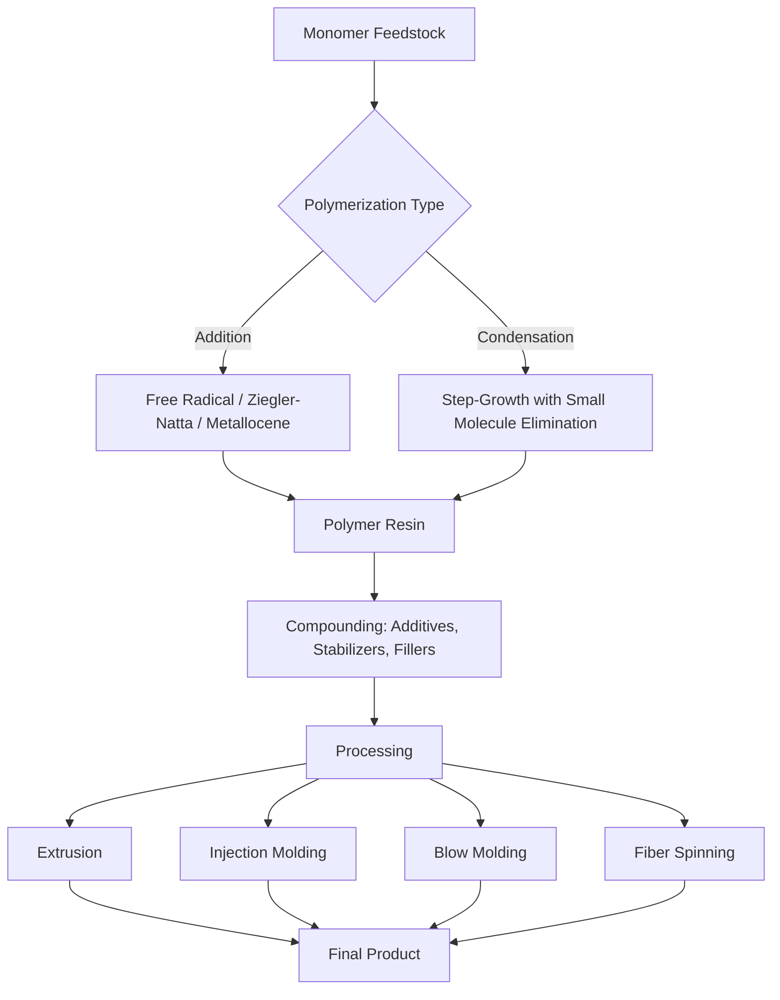

## Industrial Polymer and Materials Production

### Overview

Industrial polymer and materials production encompasses the large-scale synthesis, processing, and engineering of macromolecular substances used in plastics, fibers, rubbers, and advanced composites. This spans monomer synthesis, polymerization chemistry, processing techniques, and the structure-property relationships that determine material performance.

### Classification of Polymers

**Key Points**

- **By origin**: Natural (cellulose, natural rubber, proteins) vs. Synthetic (polyethylene, nylon, polyester)
- **By structure**: Linear, branched, cross-linked (network)
- **By thermal behavior**:
  - **Thermoplastics**: Soften on heating, harden on cooling, reversibly (e.g., PE, PP, PVC, PET) — no cross-linking
  - **Thermosets**: Cross-link irreversibly on curing/heating, cannot be remelted (e.g., epoxy resins, bakelite, vulcanized rubber)
  - **Elastomers**: Lightly cross-linked polymers exhibiting high elastic extensibility (e.g., natural/synthetic rubber)
- **By polymerization mechanism**: Addition (chain-growth) vs. Condensation (step-growth)

### Polymerization Mechanisms

#### 1. Addition (Chain-Growth) Polymerization

Monomers with unsaturation (typically C=C double bonds) add sequentially to a growing chain without loss of any atoms.

**a) Free Radical Polymerization**

- **Initiation**: A radical initiator (e.g., benzoyl peroxide, AIBN) decomposes to form free radicals that attack the monomer.
- **Propagation**: The radical adds successively to monomer units, extending the chain.
- **Termination**: Combination (two radical chain ends couple) or disproportionation (one chain gains, one loses a hydrogen).

$$R\cdot + CH_2=CH_2 \rightarrow R-CH_2-CH_2\cdot$$

**b) Ziegler-Natta / Coordination Polymerization**

Uses transition metal catalysts (e.g., $TiCl_4$/$Al(C_2H_5)_3$) to produce stereoregular polymers (isotactic, syndiotactic) with controlled molecular weight and crystallinity — critical for high-density polyethylene (HDPE) and isotactic polypropylene.

**c) Metallocene Catalysis**

Single-site catalysts offering precise control over molecular weight distribution, comonomer incorporation, and tacticity, enabling tailored polymer properties (narrower polydispersity than Ziegler-Natta).

**d) Living/Controlled Polymerization**

Techniques such as ATRP (atom transfer radical polymerization) and RAFT (reversible addition-fragmentation chain transfer) suppress premature termination, allowing precise control of molecular weight and the synthesis of block copolymers.

#### 2. Condensation (Step-Growth) Polymerization

Monomers (typically bifunctional) react with the elimination of a small molecule (water, HCl, methanol) at each step, building the chain progressively through reaction of functional groups.

$$n \, HOOC-R-COOH + n \, H_2N-R'-NH_2 \rightarrow [-OC-R-CO-NH-R'-NH-]_n + 2n \, H_2O$$

**Examples**:

- **Nylon-6,6**: Hexamethylenediamine + Adipic acid → polyamide + water
- **PET (polyester)**: Terephthalic acid + Ethylene glycol → polyester + water
- **Bakelite**: Phenol + Formaldehyde → phenolic resin (thermoset) + water
- **Polyurethanes**: Diisocyanate + Diol (addition-type step-growth, no small molecule released)

### Key Industrial Polymers

| Polymer | Monomer(s) | Polymerization Type | Key Properties/Uses |
| --- | --- | --- | --- |
| Polyethylene (LDPE/HDPE) | Ethylene | Addition (radical/Ziegler-Natta) | Packaging, films, containers |
| Polypropylene (PP) | Propylene | Addition (Ziegler-Natta/metallocene) | Automotive parts, textiles, packaging |
| PVC | Vinyl chloride | Addition (free radical) | Pipes, cables, flooring |
| Polystyrene (PS) | Styrene | Addition (free radical) | Insulation, disposable products |
| PET | Terephthalic acid + Ethylene glycol | Condensation | Bottles, synthetic fibers |
| Nylon-6,6 | Hexamethylenediamine + Adipic acid | Condensation | Textiles, engineering plastics |
| Polyurethane | Diisocyanate + Polyol | Step-growth (addition) | Foams, coatings, adhesives |
| Epoxy resin | Epichlorohydrin + Bisphenol-A | Condensation/cross-linking | Adhesives, coatings, composites |
| Synthetic rubber (SBR) | Styrene + Butadiene | Addition (emulsion copolymerization) | Tires, footwear |

### Industrial Polymerization Processes

**Key Points**

- **Bulk polymerization**: Monomer and initiator only; simple but heat removal is difficult in large batches.
- **Solution polymerization**: Monomer dissolved in solvent; better heat control, but solvent recovery adds cost.
- **Suspension polymerization**: Monomer dispersed as droplets in water with stabilizers; produces beads/pellets (e.g., PVC, PS production).
- **Emulsion polymerization**: Monomer emulsified in water with surfactant; produces fine latex particles (e.g., SBR rubber, some acrylics, paint latexes) with good heat dissipation and high molecular weight achievable at high rates.

### Polymer Production Flow

### Polymer Processing Techniques

| Technique | Principle | Typical Products |
| --- | --- | --- |
| Extrusion | Molten polymer forced through a die | Pipes, sheets, films, cable coating |
| Injection molding | Molten polymer injected into a mold cavity, cooled | Complex 3D parts (containers, casings) |
| Blow molding | Molten parison inflated inside a mold | Bottles, hollow containers |
| Fiber spinning | Molten/dissolved polymer extruded through spinnerets, drawn | Textile and industrial fibers |
| Calendering | Polymer passed through heated rollers | Sheets, films, coated fabrics |
| Thermoforming | Heated sheet formed over a mold using vacuum/pressure | Packaging trays, disposable cups |

### Additives in Polymer Formulation

**Key Points**

- **Plasticizers**: Increase flexibility by reducing intermolecular forces (e.g., phthalates in PVC)
- **Stabilizers**: Prevent degradation from heat, UV light, or oxidation (e.g., antioxidants, UV absorbers)
- **Fillers/Reinforcements**: Improve mechanical strength or reduce cost (e.g., glass fiber, carbon black, calcium carbonate)
- **Flame retardants**: Reduce flammability (e.g., halogenated compounds, phosphorus-based additives)
- **Colorants/Pigments**: Provide color and opacity

### Structure-Property Relationships

**Key Points**

- **Crystallinity**: Degree of ordered chain packing; higher crystallinity increases stiffness, strength, and melting point but reduces transparency and impact toughness (e.g., HDPE vs. LDPE).
- **Molecular weight and distribution**: Higher molecular weight generally increases strength and melt viscosity, affecting processability.
- **Cross-linking density**: Determines whether a material behaves as a thermoplastic (uncross-linked), elastomer (lightly cross-linked), or thermoset (highly cross-linked).
- **Glass transition temperature ($T_g$)**: The temperature below which an amorphous polymer becomes rigid and glassy; above $T_g$, it becomes rubbery/flexible.
- **Copolymerization**: Combining two or more monomers to tailor properties (random, block, graft, alternating copolymers).

### Advanced Materials and Composites

**Key Points**

- **Fiber-reinforced composites**: Combine a polymer matrix (epoxy, polyester) with reinforcing fibers (glass, carbon, aramid) for high strength-to-weight ratio applications (aerospace, automotive).
- **Nanocomposites**: Incorporate nanoscale fillers (clay, carbon nanotubes, graphene) to enhance mechanical, thermal, or barrier properties at low filler loading.
- **Biodegradable/bio-based polymers**: Materials such as polylactic acid (PLA, from fermented plant starch) and polyhydroxyalkanoates (PHA, microbially produced) offer reduced environmental persistence compared to conventional petrochemical plastics.
- [Inference] The precise environmental degradation timelines and end-of-life behavior of biodegradable polymers depend strongly on disposal conditions (industrial composting vs. natural environment) and should be evaluated against specific standards rather than assumed uniformly rapid.

### Environmental and Industrial Considerations

- **Recycling codes**: Polymers are classified by resin identification codes (e.g., PET = 1, HDPE = 2, PVC = 3) to facilitate sorting for recycling.
- **Mechanical recycling**: Reprocessing via melting and remolding; can degrade polymer properties over repeated cycles.
- **Chemical recycling (depolymerization)**: Breaking polymers back into monomers (e.g., glycolysis of PET) for repolymerization, offering higher-purity feedstock recovery.
- **Energy and emissions**: Polymer manufacturing is closely tied to petrochemical feedstock availability, so process efficiency and emissions vary with plant technology and feedstock source.

### Worked Example

**Problem**: Calculate the degree of polymerization ($DP$) of a polyethylene sample with a number-average molecular weight ($M_n$) of 280,000 g/mol.

**Solution**:

Molar mass of repeat unit ($-CH_2-CH_2-$) $= 28 \, g/mol$

$$DP = \frac{M_n}{M_{repeat \, unit}} = \frac{280000}{28} = 10000$$

The polymer chain contains approximately 10,000 repeat units.

**Conclusion**

Industrial polymer production integrates monomer chemistry, polymerization mechanism selection, and processing engineering to achieve materials with tailored mechanical, thermal, and chemical properties. The choice between addition and condensation routes, along with polymerization process (bulk, solution, suspension, emulsion), directly determines product form, purity, and downstream processability.

**Next Steps**

- Detailed polymerization kinetics (rate laws for free radical and step-growth polymerization)
- Rheology of polymer melts and its role in processing
- Composite material design and interfacial adhesion mechanisms
- Polymer degradation mechanisms (thermal, oxidative, photodegradation)
- Circular economy approaches: chemical recycling technologies (pyrolysis, solvolysis)
- Smart/functional polymers (conducting polymers, hydrogels, shape-memory polymers)