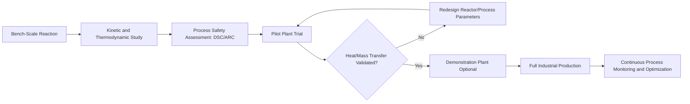

## Scaling Chemical Processes from Laboratory to Industrial Production

### Overview

Process scale-up is the systematic translation of a chemical reaction or process developed at laboratory scale (milligrams to grams) into a commercially viable industrial process (kilograms to tonnes). This transition requires addressing changes in heat transfer, mass transfer, mixing, reaction kinetics, safety, and economics that do not scale linearly with reactor volume.

### Why Scale-Up Is Non-Trivial

**Key Points**

- Reactor volume scales with the cube of a characteristic linear dimension ($L^3$), while surface area (through which heat is transferred) scales with the square ($L^2$).
- Consequently, the **surface-area-to-volume ratio decreases** as scale increases:

$$\frac{A}{V} \propto \frac{L^2}{L^3} = \frac{1}{L}$$

- This means heat generated by an exothermic reaction (proportional to volume) becomes increasingly difficult to remove through the vessel wall (proportional to area) as scale increases — a major cause of thermal runaway in scaled-up reactors.
- Similarly, mixing time, mass transfer rates, and residence time distributions all behave differently at large scale, so a reaction that appears well-controlled at bench scale may become mass-transfer-limited or heat-limited industrially.

### Surface-to-Volume Ratio Illustration (svg_diagram)

<svg xmlns="http://www.w3.org/2000/svg" viewBox="0 0 500 260" font-family="sans-serif">
\<style\>
.small{fill:#dbe6f4;stroke:#33557a;stroke-width:2;}
.large{fill:#f0d9b5;stroke:#8a6d3b;stroke-width:2;}
.txt{font-size:13px;fill:#1a1a1a;text-anchor:middle;}
.title{font-size:14px;font-weight:bold;fill:#1a1a1a;text-anchor:middle;}
\</style\>
<text x="250" y="20" class="title">Surface-to-Volume Ratio vs Scale (svg_diagram)</text>
<rect x="60" y="80" width="60" height="60" class="small" />
<text x="90" y="160" class="txt">Lab scale</text>
<text x="90" y="178" class="txt">L = 1 unit</text>
<text x="90" y="196" class="txt">A/V = 6</text>
<rect x="250" y="40" width="180" height="180" class="large" />
<text x="340" y="240" class="txt">Industrial scale</text>
<text x="340" y="258" class="txt">L = 3 units, A/V = 2</text>
<text x="180" y="120" class="txt" font-size="20">→</text>
</svg>

### Stages of Process Scale-Up

The typical progression moves through discrete stages, each generating data used to de-risk the next:

| Stage | Typical Scale | Purpose |
| --- | --- | --- |
| Bench/Lab scale | mL to a few L | Proof of concept, initial optimization, reaction screening |
| Bench-scale kinetics study | 0.1–5 L | Determine rate law, activation energy, byproduct formation |
| Pilot plant | 10 L–1 m³ | Validate heat/mass transfer, test real equipment behavior, generate engineering data |
| Demonstration plant | Intermediate, larger than pilot | De-risk before full capital commitment (used for novel/high-risk processes) |
| Full industrial scale | m³ to hundreds of m³ | Continuous commercial production |

### Scale-Up Progression Flow

### Key Engineering Considerations in Scale-Up

#### 1. Heat Transfer

- Exothermic/endothermic reactions must have adequate heat removal/addition capacity at scale.
- Cooling/heating jackets, internal coils, and external heat exchangers (recirculating loops) are used as scale increases, since jacket surface area alone becomes insufficient.
- **Adiabatic temperature rise** calculations and reaction calorimetry (e.g., using a Reaction Calorimeter, RC1) are used to quantify the heat that must be managed.

#### 2. Mass Transfer and Mixing

- **Mixing time** increases with vessel size for a fixed impeller tip speed; scale-up mixing correlations (e.g., matching power per unit volume, $P/V$, or impeller tip speed) are used to preserve mixing quality.
- For multiphase reactions (gas-liquid, liquid-liquid), mass transfer coefficients ($k_La$ for gas-liquid systems) must be characterized, since insufficient interfacial area at scale can become rate-limiting.
- Common scale-up criteria (not simultaneously achievable in general):
  - Constant $P/V$ (power per unit volume)
  - Constant impeller tip speed
  - Constant mixing time
  - Constant Reynolds number

#### 3. Reaction Kinetics and Selectivity

- Longer mixing/heat transfer times at scale can shift the balance between competing reaction pathways, altering selectivity and byproduct formation compared to bench scale.
- Residence time distribution (RTD) in continuous reactors can broaden at larger scale (especially in poorly mixed or laminar-flow regimes), affecting yield and impurity profiles.

#### 4. Materials of Construction and Equipment Compatibility

- Corrosion resistance, pressure rating, and material compatibility (glass-lined steel, stainless steel, Hastelloy) must be verified for industrial reactors, as lab glassware behavior does not guarantee compatibility at scale.
- Agitator design, baffle configuration, and reactor geometry are re-evaluated for large-scale hydrodynamics.

#### 5. Process Safety

**Key Points**

- **Thermal hazard analysis**: Differential Scanning Calorimetry (DSC) and Accelerating Rate Calorimetry (ARC) are used to characterize decomposition onset temperatures and potential runaway reaction hazards before scale-up.
- **Relief system design**: Pressure relief devices must be sized to handle worst-case runaway scenarios at the production scale.
- **Hazard and Operability Study (HAZOP)**: A structured process safety review conducted before commissioning large-scale equipment, systematically examining deviations from intended operating parameters.
- Batch processes carry a larger total inventory of reactive material at once, generally increasing the consequence severity of a thermal excursion compared to continuous processing at equivalent throughput.

### Batch vs. Continuous Processing

| Aspect | Batch Processing | Continuous Processing |
| --- | --- | --- |
| Reactor inventory | Large, all reactants present at once | Small, steady-state inventory |
| Heat management | More difficult (larger instantaneous heat load) | Easier (smaller reaction volume at any instant) |
| Flexibility | High — suited to multi-product facilities | Lower — optimized for a single product/process |
| Product consistency | Batch-to-batch variability possible | Generally more consistent (steady-state) |
| Capital investment | Often lower for small volumes | Often higher upfront, more efficient at high volume |
| Process safety at scale | Requires more careful hazard analysis due to larger inventory | Reduced inventory generally lowers worst-case consequence |

**Key Points**

- Modern fine chemical and pharmaceutical manufacturing increasingly employs **continuous flow chemistry** for hazardous or highly exothermic reactions, since the small reactor volume at any given time inherently limits the energy release in an upset condition.
- Microreactors and flow reactors provide high surface-area-to-volume ratios, enabling excellent heat/mass transfer even at production-relevant throughput, by running many small-volume reactions in parallel or over extended time rather than one large batch.

### Economic and Practical Considerations

**Key Points**

- **Raw material cost and availability**: A reagent viable in small lab quantities (e.g., an expensive catalyst or specialty solvent) may be economically or logistically unworkable at ton-scale.
- **Solvent selection**: Lab-scale solvents are re-evaluated for cost, recovery/recycling feasibility, environmental/regulatory restrictions, and worker exposure limits at scale.
- **Waste stream management**: By-products and waste generated per unit of product (E-factor) must be minimized and treatment/disposal routes established for continuous large-scale generation.
- **Yield and purity requirements**: Purification methods (recrystallization, distillation, chromatography) that work at gram scale (e.g., column chromatography) are often replaced with more scalable alternatives (crystallization, distillation) for industrial production.
- **Regulatory compliance**: Environmental permits, emissions limits, and (for pharmaceuticals) Good Manufacturing Practice (GMP) requirements shape process design well before full-scale implementation.

### Design of Experiments (DoE) in Process Development

- Statistical **Design of Experiments** approaches (factorial designs, response surface methodology) are used to efficiently map the effect of multiple process parameters (temperature, concentration, stoichiometry, residence time) on yield and selectivity, reducing the number of experiments needed compared to one-variable-at-a-time testing.
- DoE-derived models help define a **design space** (a validated operating region) within which the process is understood to reliably deliver the target product quality — a concept central to Quality by Design (QbD) approaches in regulated manufacturing.

### Worked Example

**Problem**: A lab-scale exothermic reaction releases 500 kJ per mole of product and is run in a 1 L flask, generating 0.5 mol of product. If the same reaction is scaled up 1000-fold in volume (to 1000 L, geometrically similar vessel), by what factor does the heat generated increase, and by what factor does the cooling surface area increase (assuming simple geometric scaling)?

**Solution**:

Heat generated scales with **volume** (amount of material reacting):

$$\text{Heat scale factor} = 1000$$

For geometrically similar vessels, linear dimension scales as $V^{1/3}$:

$$L_{scale} = 1000^{1/3} = 10$$

Surface area scales as $L^2$:

$$\text{Area scale factor} = 10^2 = 100$$

**Conclusion**: Heat generation increases 1000-fold, but cooling surface area increases only 100-fold — meaning the heat removal capacity per unit of heat generated drops by a factor of 10. This illustrates why supplementary cooling (external heat exchangers, jacketed cooling loops, or switching to continuous processing) becomes necessary at large scale even when a reaction is easily controlled in a small flask.

**Conclusion**

Scaling a chemical process from laboratory to industrial production requires far more than simply multiplying quantities — it demands re-evaluation of heat and mass transfer, mixing, reaction selectivity, materials compatibility, safety systems, and economics at each stage of scale-up. A structured, staged approach (bench → pilot → demonstration → full scale), supported by calorimetry, DoE, and hazard analysis, is essential to safely and economically translate a laboratory discovery into a viable industrial process.

- [Inference] The specific scale-up criteria and safety margins appropriate for a given process depend heavily on the chemistry involved (exothermicity, hazard profile, phase behavior) and should be assessed case-by-case using process-specific data rather than generalized rules of thumb.

**Next Steps**

- Reaction calorimetry techniques (RC1, DSC, ARC) and thermal hazard assessment in detail
- Continuous flow chemistry and microreactor technology for hazardous reactions
- Quality by Design (QbD) and Process Analytical Technology (PAT) in regulated manufacturing
- Distillation and crystallization process design for industrial purification
- Chemical reaction engineering: reactor design (CSTR, PFR) and residence time distribution
- Green chemistry metrics (E-factor, atom economy) applied to process scale-up decisions