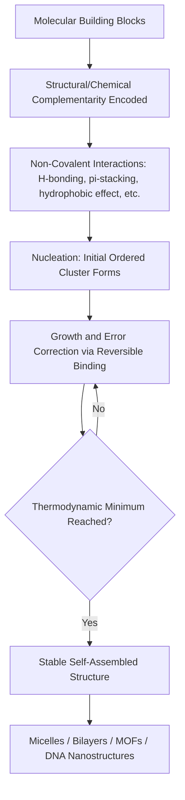

## Molecular Self-Assembly

### Overview

Molecular self-assembly is the spontaneous organization of individual molecules into ordered, structured aggregates under equilibrium conditions, driven by non-covalent interactions rather than external direction or covalent bond formation. It is a central concept in supramolecular chemistry and underlies phenomena ranging from lipid bilayer formation to protein folding and the design of nanomaterials.

### Fundamental Principles

**Key Points**

- Self-assembly is a **thermodynamically driven** process — the assembled state represents a local or global free energy minimum under given conditions.
- Assembly occurs through **non-covalent interactions**, which are individually weak but collectively strong when many act cooperatively.
- The process is typically **reversible** and **dynamic**, allowing error correction (defective aggregates can dissociate and reassemble correctly) — a key distinction from irreversible covalent synthesis.
- Self-assembly requires molecular components with built-in structural and chemical **complementarity** (shape, size, and interaction sites) that encode the information for the final assembled structure.

### Non-Covalent Interactions Driving Self-Assembly

| Interaction | Approx. Strength (kJ/mol) | Directionality | Example |
| --- | --- | --- | --- |
| Hydrogen bonding | 4–120 | Highly directional | DNA base pairing, urea-based gels |
| Van der Waals forces | 0.4–4 | Non-directional | Alkyl chain packing in lipids |
| $\pi$-$\pi$ stacking | 2–50 | Moderately directional | Aromatic stacking in nucleic acids, graphene sheets |
| Electrostatic (ionic) interactions | 0.4–4 (in water) to >200 (vacuum) | Non-directional | Polyelectrolyte complexes |
| Hydrophobic effect | Entropy-driven, variable | Non-directional | Micelle and bilayer formation |
| Metal-ligand coordination | 40–200 | Highly directional | Metal-organic frameworks (MOFs), coordination cages |
| Halogen bonding | 5–50 | Highly directional | Crystal engineering, anion recognition |

### The Hydrophobic Effect in Aqueous Self-Assembly

**Key Points**

- In water, nonpolar molecular segments (e.g., hydrocarbon tails) aggregate to minimize contact with water, driven primarily by an **increase in entropy** of surrounding water molecules (release of ordered water structure around the hydrophobic surface), rather than by direct attraction between the hydrophobic groups themselves.
- This effect is the principal driving force behind **micelle formation**, **lipid bilayer formation**, and the hydrophobic collapse stabilizing protein tertiary structure.

### Common Self-Assembled Structures

#### 1. Micelles

Amphiphilic molecules (surfactants) with a hydrophilic head and hydrophobic tail spontaneously aggregate in water above a threshold concentration called the **Critical Micelle Concentration (CMC)**, orienting hydrophobic tails inward and hydrophilic heads outward.

#### 2. Lipid Bilayers and Vesicles

Phospholipids, having two hydrophobic tails and a hydrophilic head, favor bilayer formation over simple micelles due to their approximately cylindrical molecular shape. Closed bilayer structures (liposomes/vesicles) form spontaneously, encapsulating an aqueous interior — foundational to biological cell membranes and drug delivery vehicles.

#### 3. Molecular Packing Parameter

The preferred aggregate morphology (spherical micelle, cylindrical micelle, bilayer) can be rationalized using the **packing parameter**, $P$:

$$P = \frac{v}{a_0 \, l_c}$$

where $v$ is the hydrophobic chain volume, $a_0$ is the optimal head-group area, and $l_c$ is the critical chain length.

| Packing Parameter Range | Preferred Structure |
| --- | --- |
| $P < 1/3$ | Spherical micelles |
| $1/3 < P < 1/2$ | Cylindrical micelles |
| $1/2 < P < 1$ | Vesicles/bilayers |
| $P \approx 1$ | Planar bilayers |
| $P > 1$ | Inverted structures |

### Self-Assembly Morphologies (svg_diagram)

<svg xmlns="http://www.w3.org/2000/svg" viewBox="0 0 600 260" font-family="sans-serif">
\<style\>
.head{fill:#3a7bd5;}
.tail{stroke:#333;stroke-width:2;}
.txt{font-size:12px;fill:#1a1a1a;text-anchor:middle;}
.title{font-size:14px;font-weight:bold;fill:#1a1a1a;text-anchor:middle;}
\</style\>
<text x="300" y="20" class="title">Amphiphile Self-Assembly Morphologies (svg_diagram)</text>

<g>
<circle cx="100" cy="120" r="55" fill="none" stroke="#ccc" stroke-dasharray="2,2" />
<circle cx="100" cy="75" r="6" class="head" /><line x1="100" y1="81" x2="100" y2="105" class="tail" />
<circle cx="130" cy="90" r="6" class="head" /><line x1="130" y1="96" x2="115" y2="115" class="tail" />
<circle cx="145" cy="120" r="6" class="head" /><line x1="145" y1="120" x2="115" y2="120" class="tail" />
<circle cx="130" cy="150" r="6" class="head" /><line x1="130" y1="144" x2="115" y2="125" class="tail" />
<circle cx="100" cy="165" r="6" class="head" /><line x1="100" y1="159" x2="100" y2="135" class="tail" />
<circle cx="70" cy="150" r="6" class="head" /><line x1="70" y1="144" x2="85" y2="125" class="tail" />
<circle cx="55" cy="120" r="6" class="head" /><line x1="55" y1="120" x2="85" y2="120" class="tail" />
<circle cx="70" cy="90" r="6" class="head" /><line x1="70" y1="96" x2="85" y2="115" class="tail" />
<text x="100" y="210" class="txt">Spherical Micelle</text>
</g>

<g>
<line x1="230" y1="80" x2="370" y2="80" stroke="#333" />
<line x1="230" y1="140" x2="370" y2="140" stroke="#333" />
<circle cx="240" cy="75" r="5" class="head" /><circle cx="240" cy="145" r="5" class="head" />
<circle cx="270" cy="75" r="5" class="head" /><circle cx="270" cy="145" r="5" class="head" />
<circle cx="300" cy="75" r="5" class="head" /><circle cx="300" cy="145" r="5" class="head" />
<circle cx="330" cy="75" r="5" class="head" /><circle cx="330" cy="145" r="5" class="head" />
<circle cx="360" cy="75" r="5" class="head" /><circle cx="360" cy="145" r="5" class="head" />
<text x="300" y="210" class="txt">Lipid Bilayer</text>
</g>

<g>
<circle cx="480" cy="110" r="45" fill="none" stroke="#333" stroke-width="4" />
<circle cx="480" cy="110" r="35" fill="none" stroke="#333" stroke-width="4" />
<text x="480" y="210" class="txt">Vesicle (Liposome)</text>
</g>
</svg>

### Templated and Directed Self-Assembly

**a) DNA Nanotechnology**

Exploits the highly specific and predictable Watson-Crick base pairing (A-T, G-C hydrogen bonding) to design DNA strands that self-assemble into precise nanostructures — including **DNA origami**, where a long scaffold strand is folded into arbitrary 2D/3D shapes using short "staple" strands.

**b) Metal-Organic Frameworks (MOFs) and Coordination Cages**

Metal ions (or metal clusters) act as directional "nodes" that coordinate with organic linker ligands, self-assembling into highly ordered, often porous, crystalline network structures. The specific geometry (coordination number and angle) of the metal center dictates the resulting topology.

**c) Block Copolymer Self-Assembly**

Diblock or triblock copolymers with immiscible segments microphase-separate into periodic nanostructures (spheres, cylinders, lamellae, gyroids) whose morphology depends on the relative volume fractions of each block — widely used in nanolithography and templating.

### Self-Assembly Process Flow

### Thermodynamics of Self-Assembly

The overall free energy change governing assembly follows the standard relation:

$$\Delta G = \Delta H - T\Delta S$$

- For hydrophobically-driven assembly in water, the process is often **entropically favorable** ($\Delta S > 0$ for the solvent, despite the assembling molecules themselves becoming more ordered), because releasing structured water around hydrophobic surfaces increases overall system entropy.
- For hydrogen-bond or metal-coordination driven assembly, the process is typically **enthalpically favorable** ($\Delta H < 0$), though it may incur an entropic penalty from reduced conformational freedom of the assembling components.
- **Cooperativity**: Many self-assembly processes show cooperative binding, where formation of initial contacts pre-organizes the system, making subsequent binding events more favorable (positive cooperativity) — important in processes like DNA duplex formation and multivalent recognition.

### Applications

**Key Points**

- **Drug delivery**: Self-assembled micelles and liposomes encapsulate hydrophobic drugs for targeted delivery, improving solubility and bioavailability.
- **Nanofabrication**: Block copolymer self-assembly is used as a templating method in semiconductor lithography to generate nanoscale patterns below conventional photolithographic resolution.
- **Biomimetic materials**: Peptide and protein self-assembly (e.g., amyloid-forming peptides) inform the design of hydrogels and structural biomaterials.
- **Molecular electronics**: Self-assembled monolayers (SAMs), typically formed by thiol-gold chemistry, create ordered molecular films for sensors and electronic device interfaces.
- [Inference] The practical performance and stability of self-assembled nanomaterials in real-world applications (e.g., drug delivery efficacy, device durability) depend strongly on formulation and environmental conditions, and should be evaluated against specific experimental data rather than assumed from idealized assembly models.

### Worked Example

**Problem**: A surfactant has a hydrophobic tail volume $v = 0.35 \, nm^3$, critical chain length $l_c = 1.5 \, nm$, and optimal head-group area $a_0 = 0.6 \, nm^2$. Determine the preferred aggregate morphology using the packing parameter.

**Solution**:

$$P = \frac{v}{a_0 \, l_c} = \frac{0.35}{0.6 \times 1.5} = \frac{0.35}{0.9} = 0.39$$

Since $1/3 < 0.39 < 1/2$, the packing parameter falls in the range favoring **cylindrical micelles**.

**Conclusion**

Molecular self-assembly transforms simple molecular building blocks, through the cooperative action of weak, reversible, non-covalent interactions, into complex and functional supramolecular architectures. Understanding the interplay of molecular geometry, interaction type, and thermodynamics allows chemists to rationally design self-assembling systems for applications spanning drug delivery, nanofabrication, and biomimetic materials.

**Next Steps**

- Supramolecular host-guest chemistry (cyclodextrins, crown ethers, cucurbiturils)
- DNA nanotechnology and DNA origami design principles
- Metal-organic frameworks (MOFs): synthesis, porosity, and applications
- Protein folding as a biological self-assembly process
- Block copolymer microphase separation and nanolithography applications
- Self-assembled monolayers (SAMs) in surface chemistry and sensor design