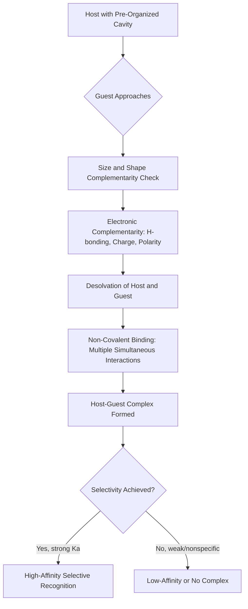

## Molecular Recognition and Host-Guest Chemistry

### Overview

Molecular recognition is the specific, selective binding of one molecule (the "guest") by another (the "host") through non-covalent interactions, based on structural and electronic complementarity. Host-guest chemistry is the branch of supramolecular chemistry that designs and studies synthetic receptors (hosts) capable of selectively binding target molecules or ions (guests), analogous to the specificity seen in biological systems such as enzyme-substrate binding.

### Fundamental Concepts

**Key Points**

- **Molecular recognition** relies on **complementarity** in size, shape, and chemical functionality between host and guest — often summarized by Emil Fischer's "lock-and-key" model, later refined by the **induced-fit model**, which recognizes that hosts and/or guests may undergo conformational adjustment upon binding.
- A **host** is typically a large molecule or aggregate with a convergent binding site (a cavity or cleft) that can enclose or wrap around a guest.
- A **guest** is typically a smaller molecule or ion (cation, anion, or neutral molecule) with divergent binding sites that fit within the host's cavity.
- The host-guest complex is held together by **non-covalent interactions** (hydrogen bonding, electrostatic interactions, van der Waals forces, $\pi$-$\pi$ stacking, hydrophobic effects) rather than covalent bonds.

### Thermodynamics of Host-Guest Binding

The binding process is characterized by an equilibrium constant, the **association (binding/stability) constant**, $K_a$:

$$\text{Host} + \text{Guest} \rightleftharpoons \text{Host-Guest Complex} \qquad K_a = \frac{[HG]}{[H][G]}$$

**Key Points**

- $\Delta G_{binding} = -RT \ln K_a$: A more negative $\Delta G$ (larger $K_a$) indicates tighter binding.
- **Enthalpy-entropy compensation**: Binding is often accompanied by a trade-off — strong directional interactions (H-bonding) tend to be enthalpically favorable but may reduce conformational freedom (entropically unfavorable), while the hydrophobic effect and desolvation can provide favorable entropic contributions.
- **Chelate effect / macrocyclic effect**: Multidentate or macrocyclic hosts bind guests more strongly than the sum of equivalent monodentate interactions would suggest, due to a favorable entropic contribution (fewer separate molecules are combined into one complex, and the host is pre-organized).
- **Pre-organization**: Hosts whose binding site geometry is already close to the ideal geometry for the guest (minimal conformational reorganization needed upon binding) generally show higher binding affinity and selectivity — a principle central to macrocyclic and cage-like host design (Cram's principle of pre-organization).

### Classes of Synthetic Host Molecules

#### 1. Crown Ethers

Cyclic polyethers with repeating $-O-CH_2-CH_2-$ units; the ring of oxygen atoms coordinates cations through ion-dipole interactions.

**Key Points**

- Cavity size determines cation selectivity: 18-crown-6 selectively binds $K^+$ (cavity size matches ionic radius), while smaller crowns (12-crown-4, 15-crown-5) preferentially bind $Li^+$ and $Na^+$ respectively.
- Selectivity based on the match between cavity diameter and ionic diameter is a foundational example of **size-complementarity** in host design.

#### 2. Cryptands

Bicyclic (or polycyclic) analogs of crown ethers with a three-dimensional cavity, providing even higher binding affinity and selectivity than crown ethers due to greater pre-organization and encapsulation (the "cryptate effect").

#### 3. Cyclodextrins

Cyclic oligosaccharides (typically 6, 7, or 8 glucose units, termed $\alpha$-, $\beta$-, $\gamma$-cyclodextrin respectively) with a hydrophobic interior cavity and hydrophilic exterior.

**Key Points**

- Bind hydrophobic guest molecules (e.g., aromatic compounds, drug molecules) within their apolar cavity while remaining water-soluble due to the hydroxyl-rich exterior.
- Widely used industrially to improve aqueous solubility and stability of poorly water-soluble drugs and flavor/fragrance compounds.

#### 4. Calixarenes

Cyclic oligomers formed from phenol and formaldehyde units, adopting a cup/basket-shaped conformation with a hydrophobic cavity, useful for binding neutral organic molecules, cations, and (in functionalized forms) anions.

#### 5. Cucurbiturils

Rigid, barrel-shaped macrocycles made of glycoluril units linked by methylene bridges, with two symmetric carbonyl-lined portals. Known for exceptionally high binding affinities (some of the strongest known non-covalent host-guest interactions in water) toward cationic and neutral guests.

#### 6. Coordination Cages and Metal-Organic Capsules

Self-assembled from metal ions and organic ligands (via coordination bonds) to form three-dimensional cage structures with enclosed cavities, capable of encapsulating guests and sometimes catalyzing reactions within their confined interior ("molecular flask" chemistry).

### Comparison of Common Host Systems

| Host | Cavity Character | Typical Guests | Notable Feature |
| --- | --- | --- | --- |
| Crown ethers | Polar, ring-shaped | Alkali/alkaline earth cations | Size-selective cation binding |
| Cryptands | Polar, 3D encapsulating | Cations | Higher affinity via full encapsulation |
| Cyclodextrins | Hydrophobic interior, hydrophilic exterior | Hydrophobic organics, drugs | Water-soluble, used in drug formulation |
| Calixarenes | Hydrophobic cup-shaped cavity | Neutral molecules, cations/anions (functionalized) | Tunable rim functionalization |
| Cucurbiturils | Rigid hydrophobic barrel, carbonyl portals | Cationic/neutral guests | Very high binding constants in water |
| Coordination cages | 3D metal-ligand enclosed cavity | Various (size/shape dependent) | Can host reactive intermediates, catalysis |

### Host-Guest Binding Schematic (svg_diagram)

<svg xmlns="http://www.w3.org/2000/svg" viewBox="0 0 500 260" font-family="sans-serif">
\<style\>
.host{fill:#eef3fb;stroke:#33557a;stroke-width:2.5;}
.guest{fill:#e67e22;stroke:#a04000;stroke-width:2;}
.txt{font-size:13px;fill:#1a1a1a;text-anchor:middle;}
.title{font-size:14px;font-weight:bold;fill:#1a1a1a;text-anchor:middle;}
.arrow{stroke:#333;stroke-width:2;marker-end:url(#ah);}
\</style\>
<text x="250" y="20" class="title">Host-Guest Complexation (svg_diagram)</text>
<path d="M 60 130 C 60 70, 160 70, 160 130 C 160 190, 60 190, 60 130 Z" class="host" />
<text x="110" y="220" class="txt">Host (cavity)</text>
<circle cx="230" cy="130" r="20" class="guest" />
<text x="230" y="220" class="txt">Guest</text>
<line x1="180" y1="130" x2="260" y2="130" class="arrow" />
<text x="220" y="115" class="txt">Ka</text>
<path d="M 340 130 C 340 70, 440 70, 440 130 C 440 190, 340 190, 340 130 Z" class="host" />
<circle cx="390" cy="130" r="18" class="guest" />
<text x="390" y="220" class="txt">Host-Guest Complex</text>
<line x1="270" y1="130" x2="330" y2="130" class="arrow" />
</svg>

### Selectivity Principles

**Key Points**

- **Size/shape complementarity**: The guest must geometrically fit the host cavity; mismatch in size reduces binding affinity (as seen in crown ether cation selectivity).
- **Electronic complementarity**: Matching of hydrogen bond donor/acceptor patterns, charge distribution, and polarity between host and guest surfaces.
- **Multivalency**: Hosts presenting multiple simultaneous binding interactions (e.g., several hydrogen bonds arranged geometrically) achieve much higher affinity and selectivity than any single interaction alone, due to cooperative and avidity effects.
- **Solvent effects**: Aqueous vs. organic solvent environments substantially affect binding strength, since competing solvation of host, guest, and free ions/molecules must be displaced upon complexation.

### Molecular Recognition Process Flow

### Applications

**Key Points**

- **Chemical sensing**: Host molecules functionalized with reporter groups (fluorescent or colorimetric) signal guest binding, enabling selective detection of ions or molecules (e.g., crown-ether-based cation sensors).
- **Drug delivery and solubilization**: Cyclodextrin inclusion complexes improve aqueous solubility, stability, and bioavailability of pharmaceutical compounds.
- **Separation science**: Selective host binding is exploited in chromatographic stationary phases and extraction processes (e.g., crown ethers for selective metal ion extraction).
- **Molecular machines and switches**: Reversible host-guest binding (e.g., in rotaxanes and catenanes) forms the basis of mechanically interlocked molecular machines, where guest binding/release can be triggered by external stimuli (pH, redox, light).
- **Catalysis in confined spaces**: Coordination cages can encapsulate reactive guests, altering reaction pathways or stabilizing unusual intermediates through the confined cavity environment ("supramolecular catalysis").
- [Inference] The magnitude of binding constants and selectivity reported for specific host-guest systems is sensitive to solvent, temperature, and measurement method, so specific $K_a$ values should be checked against the primary literature for the exact system in question rather than assumed to generalize across all conditions.

### Worked Example

**Problem**: The binding constant for a cyclodextrin-guest complex is measured as $K_a = 5.0 \times 10^4 \, M^{-1}$ at 298 K. Calculate the standard Gibbs free energy of binding.

**Solution**:

$$\Delta G° = -RT \ln K_a$$

Using $R = 8.314 \, J \, mol^{-1} K^{-1}$, $T = 298 \, K$:

$$\Delta G° = -(8.314)(298) \ln(5.0 \times 10^4)$$

$$\ln(5.0 \times 10^4) = 10.82$$

$$\Delta G° = -(8.314)(298)(10.82) = -26800 \, J/mol \approx -26.8 \, kJ/mol$$

The negative value confirms the host-guest complexation is thermodynamically favorable under these conditions.

**Conclusion**

Molecular recognition and host-guest chemistry provide the conceptual and structural foundation for designing synthetic receptors that mimic the selectivity of biological binding events. Through careful control of cavity size, shape, pre-organization, and non-covalent interaction patterns, chemists can achieve highly selective, tunable binding — enabling applications across sensing, drug delivery, separation, and molecular machine design.

**Next Steps**

- Mechanically interlocked molecules: rotaxanes, catenanes, and molecular machines
- Supramolecular catalysis within confined host cavities
- Anion recognition chemistry and anion-selective receptor design
- Thermodynamic methods for studying binding (ITC, NMR titration, fluorescence titration)
- Biological molecular recognition: enzyme-substrate and antibody-antigen binding
- Stimuli-responsive supramolecular systems (pH, redox, and light-triggered host-guest switching)