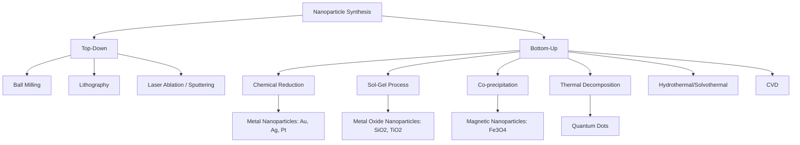

## Synthesis and Properties of Nanoparticles

### Overview

Nanoparticles are particles with at least one dimension in the range of approximately 1–100 nm. At this scale, materials exhibit distinct physical, chemical, optical, and electronic properties that differ substantially from their bulk counterparts, primarily due to increased surface-area-to-volume ratio and quantum confinement effects.

### Why Nanoscale Properties Differ from Bulk

**Key Points**

- **Surface-area-to-volume ratio** increases dramatically as particle size decreases, meaning a much larger fraction of atoms reside at or near the surface, altering reactivity, melting point, and catalytic behavior.
- **Quantum confinement**: When particle dimensions approach or fall below the exciton Bohr radius of the material, electronic energy levels become discretized rather than continuous (as in bulk), causing size-dependent optical and electronic properties.
- **Surface energy effects**: High surface curvature and unsatisfied surface bonds increase surface energy, which can lower melting points and alter phase stability compared to the bulk material.

### Surface Area to Volume Scaling (svg_diagram)

<svg xmlns="http://www.w3.org/2000/svg" viewBox="0 0 500 240" font-family="sans-serif">
\<style\>
.p1{fill:#33557a;}
.p2{fill:#5b8fd4;}
.p3{fill:#a9c6ea;}
.txt{font-size:12px;fill:#1a1a1a;text-anchor:middle;}
.title{font-size:14px;font-weight:bold;fill:#1a1a1a;text-anchor:middle;}
\</style\>
<text x="250" y="20" class="title">Surface-to-Volume Ratio vs Particle Size (svg_diagram)</text>
<circle cx="100" cy="130" r="70" class="p1" />
<text x="100" y="220" class="txt">Bulk (macroscale) - low S/V</text>
<circle cx="280" cy="150" r="30" class="p2" />
<circle cx="340" cy="140" r="30" class="p2" />
<text x="310" y="220" class="txt">Microparticles</text>
<circle cx="430" cy="160" r="8" class="p3" /><circle cx="450" cy="150" r="8" class="p3" />
<circle cx="465" cy="170" r="8" class="p3" /><circle cx="440" cy="180" r="8" class="p3" />
<circle cx="420" cy="140" r="8" class="p3" />
<text x="445" y="220" class="txt">Nanoparticles - high S/V</text>
</svg>

### Synthesis Approaches: Top-Down vs. Bottom-Up

**Key Points**

- **Top-down approaches**: Bulk material is broken down into nanoscale fragments using physical or mechanical methods.
- **Bottom-up approaches**: Nanoparticles are built up atom-by-atom or molecule-by-molecule through chemical reactions, typically offering finer control over size, shape, and composition.

### Top-Down Synthesis Methods

| Method | Principle | Notes |
| --- | --- | --- |
| Ball milling (mechanical attrition) | High-energy mechanical grinding of bulk material | Simple, scalable, but broad size distribution and possible contamination |
| Lithography | Patterned etching/deposition on a substrate | Precise, used mainly in semiconductor nanofabrication |
| Laser ablation | High-energy laser vaporizes target material, condensing into nanoparticles in a surrounding medium | Produces high-purity nanoparticles, useful for metals |
| Sputtering | Ion bombardment ejects atoms from a target, depositing as nanoscale films/clusters | Common in thin-film and nanostructure deposition |

### Bottom-Up Synthesis Methods

#### 1. Chemical Reduction (Solution-Phase Synthesis)

Metal salts are reduced in solution to form metal nanoparticles, with a capping/stabilizing agent controlling growth and preventing aggregation.

**Example — Turkevich Method (Gold Nanoparticles)**:

$$2 \, AuCl_4^- + 3 \, C_6H_5O_7^{3-} (\text{citrate}) \rightarrow 2 \, Au^0 + 3 \, \text{oxidized products} + 8Cl^-$$

Sodium citrate serves a dual role as both reducing agent and capping/stabilizing ligand, producing gold nanoparticles typically in the 10–20 nm range with a characteristic red colloidal color.

#### 2. Sol-Gel Process

A precursor (often a metal alkoxide) undergoes hydrolysis and polycondensation reactions to form a colloidal suspension ("sol") that transitions into a network ("gel"), commonly used for metal oxide nanoparticles (e.g., $SiO_2$, $TiO_2$).

$$Si(OR)_4 + 4H_2O \rightarrow Si(OH)_4 + 4ROH \, (\text{hydrolysis})$$

$$Si(OH)_4 \rightarrow SiO_2 + 2H_2O \, (\text{condensation})$$

#### 3. Co-precipitation

Simultaneous precipitation of two or more metal ions from solution (typically by raising pH) to form a mixed metal oxide nanoparticle, widely used for magnetic iron oxide nanoparticles ($Fe_3O_4$).

#### 4. Thermal Decomposition

Organometallic precursors are decomposed at elevated temperature in a high-boiling solvent with surfactants, producing highly monodisperse nanocrystals with excellent size control (e.g., quantum dot synthesis).

#### 5. Hydrothermal/Solvothermal Synthesis

Reactions are carried out in a sealed vessel (autoclave) at elevated temperature and pressure in water (hydrothermal) or other solvents (solvothermal), promoting crystal growth and enabling control over morphology.

#### 6. Chemical Vapor Deposition (CVD)

Gas-phase precursors react or decompose on a substrate surface to deposit nanoscale films or structures (e.g., carbon nanotubes, graphene).

#### 7. Green/Biosynthesis

Plant extracts, microorganisms, or biomolecules act as reducing and capping agents, offering an environmentally benign alternative to chemical reduction methods for producing metal nanoparticles.

### Nanoparticle Synthesis Route Comparison

### Stabilization and Capping Agents

**Key Points**

- Freshly formed nanoparticles have high surface energy and tend to aggregate; **capping/stabilizing agents** are used to prevent this.
- **Electrostatic (charge) stabilization**: Adsorbed charged species (e.g., citrate ions) create repulsive electrostatic forces between particles (described by DLVO theory).
- **Steric stabilization**: Bulky ligands or polymers (e.g., PVP, thiols, polymers) physically prevent close approach between particles.
- Common capping ligands: citrate, thiols (for Au/Ag), oleic acid/oleylamine (for oxide and metal nanocrystals), polyvinylpyrrolidone (PVP).

### Size-Dependent Optical Properties

#### Surface Plasmon Resonance (SPR)

In metal nanoparticles (especially Au, Ag), conduction electrons oscillate collectively in resonance with incident light at a specific frequency, giving rise to strong, size- and shape-dependent absorption bands.

**Key Points**

- Gold nanoparticles ~10–20 nm appear red in colloidal solution due to SPR absorption around 520 nm; larger particles or aggregation shift the SPR band to longer wavelengths (blue/purple color).
- SPR position is sensitive to particle size, shape (spheres vs. rods vs. stars), and the local dielectric environment, forming the basis for many colorimetric nanoparticle-based sensors.

#### Quantum Dots and Quantum Confinement

Semiconductor nanocrystals (e.g., CdSe, CdS, InP) exhibit **quantum confinement**: as particle size decreases below the material's exciton Bohr radius, the bandgap increases, causing emitted/absorbed light to shift to shorter wavelengths (blue-shift) with decreasing size.

$$E_g(\text{nanoparticle}) > E_g(\text{bulk})$$

This size-tunable emission makes quantum dots valuable for displays, bioimaging, and LEDs, where a single material composition can be tuned across a wide color range simply by controlling particle size.

### Size-Dependent Melting Point

**Key Points**

- Nanoparticles generally show a **depressed melting point** relative to the bulk material due to the high proportion of under-coordinated surface atoms with weaker bonding.
- This relationship is approximately described by the Gibbs-Thomson effect, where melting point depression scales inversely with particle radius.

### Catalytic Properties

**Key Points**

- The high surface-area-to-volume ratio of nanoparticles significantly increases the number of exposed active sites per unit mass, enhancing catalytic activity compared to bulk material of the same composition.
- Nanoparticle **shape** influences catalytic activity because different crystal facets exposed at the surface (e.g., {100} vs. {111} facets in cubic vs. octahedral nanoparticles) have different intrinsic reactivity.
- Supported metal nanoparticle catalysts (e.g., Pt/Pd nanoparticles on oxide supports) are widely used in automotive catalytic converters and industrial hydrogenation reactions.

### Magnetic Properties

**Key Points**

- Below a critical size threshold, magnetic nanoparticles (e.g., $Fe_3O_4$, $\gamma$-$Fe_2O_3$) can exhibit **superparamagnetism**: they show strong magnetization in an applied field but, unlike bulk ferromagnets, exhibit no residual magnetization once the field is removed (negligible coercivity/remanence).
- Superparamagnetic nanoparticles are used in magnetic resonance imaging (MRI) contrast agents and magnetic drug targeting/separation applications, since they can be manipulated by an external field but do not remain magnetized afterward.

### Characterization Techniques

| Technique | Information Obtained |
| --- | --- |
| Transmission Electron Microscopy (TEM) | Particle size, shape, morphology, internal structure |
| Dynamic Light Scattering (DLS) | Hydrodynamic size distribution in solution |
| UV-Vis Spectroscopy | Surface plasmon resonance band position (metal NPs), bandgap (quantum dots) |
| X-ray Diffraction (XRD) | Crystal structure, crystallite size (via Scherrer equation) |
| Zeta Potential Measurement | Surface charge, colloidal stability indicator |
| X-ray Photoelectron Spectroscopy (XPS) | Surface elemental composition and oxidation states |

### Applications

**Key Points**

- **Catalysis**: Enhanced activity and selectivity due to high surface area and tunable facet exposure.
- **Biomedical imaging and therapy**: Quantum dots for fluorescent imaging, superparamagnetic iron oxide nanoparticles (SPIONs) for MRI contrast, gold nanoparticles for photothermal therapy.
- **Drug delivery**: Nanoparticle carriers can improve solubility, circulation time, and targeted delivery of therapeutic agents.
- **Electronics and photonics**: Quantum dot displays, plasmonic sensors, and nanoscale electronic components.
- **Environmental remediation**: Nanoparticle-based catalysts and adsorbents for pollutant degradation and water treatment.
- [Inference] The biological safety and environmental fate of engineered nanoparticles depend strongly on composition, surface coating, and dose, and are subjects of ongoing research; specific toxicity or regulatory conclusions should be checked against current studies rather than generalized.

### Worked Example

**Problem**: A spherical gold nanoparticle has a diameter of 10 nm. Estimate the approximate percentage of gold atoms located at the surface, given that for spherical nanoparticles, the fraction of surface atoms scales approximately as $4/d$ (where $d$ is diameter in units of atomic diameters, here approximated using the relation that surface fraction $\approx \dfrac{4r_{atom}}{r_{particle}}$ for a simple estimate), using a gold atomic diameter of approximately 0.288 nm.

**Solution**:

Using the simplified approximation for surface fraction:

$$\text{Surface fraction} \approx \frac{4 \times r_{atom}}{r_{particle}} = \frac{4 \times 0.144 \, nm}{5 \, nm} = \frac{0.576}{5} \approx 0.115$$

This gives an estimated **~11–12%** of atoms located at the surface for a 10 nm gold nanoparticle — a dramatically higher proportion than the negligible surface fraction in bulk gold, illustrating why nanoscale materials show enhanced surface-driven reactivity.

*[Inference] This is a simplified geometric approximation; precise surface atom fractions depend on the specific crystal structure and shape and are more rigorously calculated using structural models rather than this estimate.*

**Conclusion**

The synthesis and properties of nanoparticles are governed by the interplay between synthesis method (top-down vs. bottom-up), stabilization strategy, and the resulting size, shape, and surface characteristics. These structural features, in turn, determine emergent size-dependent optical, electronic, magnetic, and catalytic properties that differ fundamentally from bulk materials, enabling applications across catalysis, medicine, electronics, and environmental science.

**Next Steps**

- Quantum dot synthesis and photophysics in detail (exciton dynamics, core-shell structures)
- Plasmonic nanoparticles: shape-controlled synthesis (nanorods, nanostars, nanocages)
- Nanoparticle toxicology and environmental fate (nano-ecotoxicology)
- Nanoparticle-based drug delivery systems and targeting strategies
- Characterization deep-dive: TEM, XRD (Scherrer equation), and zeta potential analysis
- Green synthesis methods and sustainable nanomaterial production