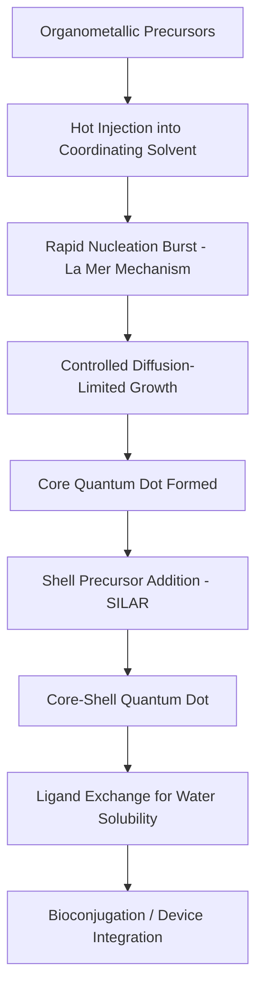

## Quantum Dots and Nanoscale Materials

### Overview

Quantum dots (QDs) are semiconductor nanocrystals, typically 2–10 nm in diameter, that exhibit size-dependent electronic and optical properties due to three-dimensional quantum confinement of charge carriers. They represent a key class of nanoscale materials bridging molecular and bulk semiconductor behavior, with wide-ranging applications in optoelectronics, bioimaging, and photovoltaics.

### Quantum Confinement Fundamentals

**Key Points**

- In bulk semiconductors, electronic states form continuous **energy bands** (valence band and conduction band) separated by a fixed bandgap.
- When a semiconductor crystal is reduced to a size comparable to or smaller than the material's **exciton Bohr radius** (the natural spatial extent of an electron-hole pair, or exciton), charge carriers become spatially confined, and the continuous bands break into **discrete, quantized energy levels** — analogous to a "particle in a box."
- This confinement increases the effective bandgap as particle size decreases, causing the absorption and emission wavelengths to blue-shift (shift toward higher energy/shorter wavelength) with decreasing particle size.

### Particle-in-a-Box Model for Quantum Dots

A simplified theoretical treatment models the confined exciton using the particle-in-a-box approximation, giving the size-dependent bandgap energy:

$$E(d) = E_g^{bulk} + \frac{h^2}{8d^2}\left(\frac{1}{m_e^*} + \frac{1}{m_h^*}\right) - \frac{1.8e^2}{4\pi\varepsilon\varepsilon_0 d}$$

where:

- $E_g^{bulk}$ = bulk semiconductor bandgap
- $d$ = quantum dot diameter
- $m_e^*$, $m_h^*$ = effective masses of electron and hole
- The second term represents the confinement energy (increases as $d$ decreases)
- The third term is a Coulombic electron-hole attraction correction (typically smaller in magnitude)

**Key Points**

- The dominant term is the confinement energy, which scales as $1/d^2$ — meaning bandgap increases sharply as size decreases below the exciton Bohr radius.
- This size-tunability allows a single semiconductor composition (e.g., CdSe) to emit across a wide range of the visible spectrum simply by controlling nanocrystal size during synthesis.

### Quantum Confinement Energy Diagram (svg_diagram)

<svg xmlns="http://www.w3.org/2000/svg" viewBox="0 0 520 300" font-family="sans-serif">
\<style\>
.band{fill:#a9c6ea;}
.level{stroke:#c0392b;stroke-width:2;}
.txt{font-size:12px;fill:#1a1a1a;text-anchor:middle;}
.title{font-size:14px;font-weight:bold;fill:#1a1a1a;text-anchor:middle;}
\</style\>
<text x="260" y="20" class="title">Bulk vs Quantum Dot Energy Levels (svg_diagram)</text>

<rect x="60" y="60" width="100" height="40" class="band" />
<text x="110" y="55" class="txt">Conduction Band</text>
<rect x="60" y="200" width="100" height="40" class="band" />
<text x="110" y="260" class="txt">Valence Band</text>
<text x="110" y="150" class="txt" font-size="16">Eg (bulk)</text>
<line x1="110" y1="100" x2="110" y2="200" stroke="#333" stroke-dasharray="3,2" />
<text x="110" y="280" class="txt">Bulk Semiconductor</text>

<line x1="280" y1="80" x2="340" y2="80" class="level" />
<line x1="280" y1="215" x2="340" y2="215" class="level" />
<text x="310" y="150" class="txt" font-size="14">Eg (large QD)</text>
<text x="310" y="280" class="txt">Large Quantum Dot</text>

<line x1="400" y1="60" x2="460" y2="60" class="level" />
<line x1="400" y1="235" x2="460" y2="235" class="level" />
<text x="430" y="150" class="txt" font-size="14">Eg (small QD)</text>
<text x="430" y="280" class="txt">Small Quantum Dot</text>
</svg>

### Structure of Quantum Dots

#### Core-Only Quantum Dots

Simple nanocrystals of a single semiconductor material (e.g., CdSe, PbS). Surface defects and dangling bonds create non-radiative recombination pathways, generally reducing photoluminescence quantum yield.

#### Core-Shell Quantum Dots

A wider-bandgap semiconductor shell (e.g., ZnS) is epitaxially grown around the core (e.g., CdSe/ZnS), passivating surface trap states and substantially improving photoluminescence quantum yield and photostability.

**Key Points**

- Type I core-shell structures (shell bandgap fully encompasses core bandgap) confine both electron and hole within the core, improving emission efficiency.
- Type II core-shell structures have staggered band alignments, spatially separating electron and hole between core and shell — useful for applications requiring longer exciton lifetimes or charge separation (e.g., photovoltaics).

#### Core-Shell-Shell and Alloyed Quantum Dots

Additional shell layers or gradient alloy compositions further reduce lattice strain at interfaces and improve stability and optical performance.

### Common Quantum Dot Materials

| Material | Bandgap Range | Emission Region | Notes |
| --- | --- | --- | --- |
| CdSe | Tunable ~1.7–2.5 eV | Visible | Most widely studied QD system |
| CdS | ~2.4 eV (bulk) | Blue-UV | Wider bandgap than CdSe |
| PbS | ~0.4 eV (bulk) | Near-infrared | Large exciton Bohr radius, strong confinement |
| InP | ~1.35 eV (bulk) | Visible-NIR | Cadmium-free alternative |
| CsPbX₃ (X = Cl, Br, I) perovskite QDs | Tunable ~1.7–3.1 eV | Visible | High photoluminescence quantum yield; less environmentally stable |
| Carbon dots / graphene QDs | Variable, often broad | UV-visible | Low toxicity, biocompatible alternative |

### Synthesis of Quantum Dots

**Key Points**

- **Hot-injection (thermal decomposition) method**: Organometallic precursors are rapidly injected into a hot coordinating solvent containing surfactants (e.g., trioctylphosphine oxide, oleic acid), inducing rapid nucleation followed by controlled, slower growth — the standard method for producing high-quality, monodisperse colloidal quantum dots.
- **La Mer mechanism**: Describes the separation of nucleation and growth phases — a short nucleation burst followed by diffusion-controlled growth on existing nuclei is critical for achieving narrow size distributions.
- **Shell growth**: Performed by subsequent controlled addition of shell precursors at moderate temperature onto pre-formed core nanocrystals (successive ionic layer adsorption and reaction, SILAR, is a common technique for precise shell thickness control).
- **Ligand exchange**: Native hydrophobic surfactant ligands (e.g., oleic acid) can be exchanged for hydrophilic or bifunctional ligands to render quantum dots water-soluble for biological applications.

### Quantum Dot Synthesis and Structure Flow

### Optical Properties

**Key Points**

- **Absorption**: Quantum dots exhibit broad absorption spectra that increase toward shorter wavelengths, allowing a single excitation wavelength to excite QDs of multiple sizes/colors simultaneously.
- **Emission**: Narrow, symmetric photoluminescence emission peaks (typically 20–30 nm full width at half maximum), with peak position precisely tunable by size — a significant advantage over organic fluorophores, which often show broader, asymmetric emission.
- **Photoluminescence quantum yield (QY)**: The fraction of absorbed photons re-emitted as photoluminescence; core-shell passivation strategies are used specifically to maximize QY by suppressing non-radiative surface trap recombination.
- **Blinking (fluorescence intermittency)**: Individual quantum dots can exhibit random switching between "on" (emitting) and "off" (dark) states under continuous excitation, attributed to charging/discharging of the nanocrystal (Auger-assisted processes); shell engineering can suppress this effect.
- **Photostability**: Quantum dots generally show greater resistance to photobleaching compared to organic dyes, an advantage for long-term imaging applications.

### Other Nanoscale Materials (Contextual Comparison)

| Nanomaterial | Dimensionality | Key Property | Example Application |
| --- | --- | --- | --- |
| Quantum dots | 0D (all three dimensions confined) | Size-tunable bandgap | Displays, bioimaging |
| Carbon nanotubes | 1D (confined in two dimensions) | High electrical/thermal conductivity, mechanical strength | Nanoelectronics, composites |
| Graphene | 2D (confined in one dimension) | High carrier mobility, single-atom thickness | Transparent electrodes, sensors |
| Nanowires | 1D | High aspect ratio, directional charge transport | Nanoscale transistors, sensors |
| Thin films/2D materials (e.g., $MoS_2$) | 2D | Layer-dependent electronic properties | Transistors, photodetectors |

### Applications

**Key Points**

- **Display technology**: QD-enhanced displays (QLED/QD-LCD) use quantum dots to convert backlight into precisely tuned, highly saturated colors, improving color gamut compared to conventional LCD displays.
- **Light-emitting diodes**: Electroluminescent quantum dot LEDs directly convert electrical excitation into narrow-band, color-tunable light emission.
- **Bioimaging and diagnostics**: Water-solubilized, bioconjugated quantum dots serve as bright, photostable fluorescent labels for cellular imaging and biosensing, offering advantages over traditional organic dyes in long-term or multiplexed imaging.
- **Photovoltaics**: Quantum dot solar cells exploit tunable bandgaps and, in some systems, the potential for multiple exciton generation (one absorbed photon generating more than one electron-hole pair) to improve theoretical efficiency limits.
- **Photodetectors**: Size-tunable absorption, particularly in materials like PbS QDs, enables photodetectors covering visible to infrared wavelengths.
- [Inference] Commercial device performance (display efficiency, solar cell conversion efficiency, biological imaging depth) depends heavily on specific device architecture and material formulation, and current benchmark figures should be verified against up-to-date literature rather than assumed static.

### Toxicity and Environmental Considerations

**Key Points**

- Many high-performance quantum dots (particularly Cd- and Pb-based) contain heavy metals, raising concerns regarding toxicity and environmental persistence, especially if the nanocrystal core is exposed due to shell degradation.
- Cadmium-free alternatives (InP, perovskite, carbon dots) are actively researched and increasingly adopted, partly in response to regulatory restrictions on heavy-metal-containing consumer products in some jurisdictions.
- [Inference] Regulatory status and permitted heavy-metal content limits for quantum dot-containing products vary by jurisdiction and change over time, so current requirements should be verified directly rather than assumed from general principles.

### Worked Example

**Problem**: Using a simplified particle-in-a-box approximation (ignoring the Coulombic term), estimate how the confinement energy of a quantum dot changes when its diameter is halved.

**Solution**:

The confinement energy term is:

$$E_{confinement} \propto \frac{1}{d^2}$$

If diameter is halved ($d \rightarrow d/2$):

$$E_{confinement}(d/2) \propto \frac{1}{(d/2)^2} = \frac{4}{d^2} = 4 \times E_{confinement}(d)$$

**Conclusion**: Halving the quantum dot diameter increases the confinement energy contribution by a factor of **4**, which is why quantum dot emission color is highly sensitive to even small changes in nanocrystal size — a core principle exploited in size-controlled QD synthesis for precise color tuning.

**Conclusion**

Quantum dots exemplify how nanoscale dimensional control can produce electronic and optical properties fundamentally distinct from bulk materials, governed by quantum confinement of charge carriers. Their precisely tunable, narrow emission combined with high photostability has driven adoption across displays, bioimaging, and photovoltaic technologies, while ongoing materials development addresses toxicity concerns associated with heavy-metal-based compositions.

**Next Steps**

- Core-shell quantum dot engineering: Type I vs. Type II band alignment design
- Perovskite quantum dots: synthesis, stability challenges, and optoelectronic applications
- Multiple exciton generation and quantum dot solar cell architectures
- Bioconjugation strategies for quantum dot-based biosensing and imaging
- Other low-dimensional nanomaterials: carbon nanotubes, graphene, and 2D transition metal dichalcogenides
- Bandstructure engineering and effective mass theory in semiconductor nanocrystals