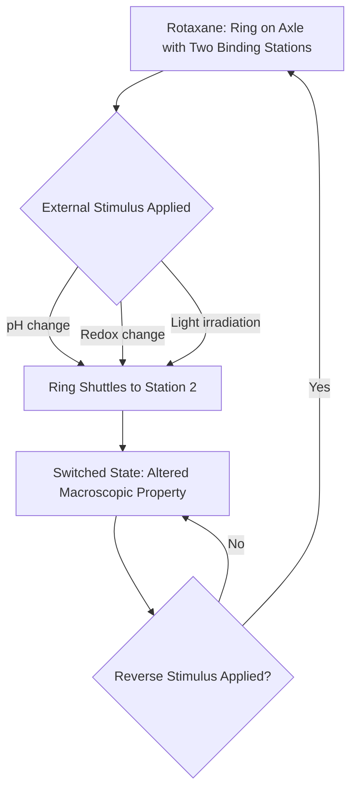
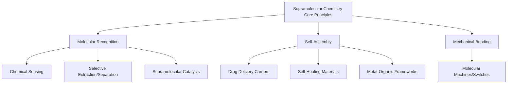

## Applications of Supramolecular Chemistry

### Overview

Supramolecular chemistry — the study of non-covalent interactions between molecules — extends beyond fundamental host-guest and self-assembly principles into a wide range of practical technologies. This item surveys how supramolecular design principles (molecular recognition, self-assembly, dynamic reversibility) are applied across drug delivery, sensing, materials science, catalysis, and molecular machines.

### Drug Delivery Systems

**Key Points**

- **Cyclodextrin inclusion complexes**: Hydrophobic drug molecules are encapsulated within the apolar cyclodextrin cavity, improving aqueous solubility, chemical stability, and bioavailability of poorly water-soluble active pharmaceutical ingredients — a strategy already used commercially in several marketed formulations.
- **Self-assembled micelles and liposomes**: Amphiphilic block copolymers or lipids self-assemble into nanoscale carriers that encapsulate hydrophobic drugs in their core, enabling controlled release and reduced systemic toxicity.
- **Stimuli-responsive supramolecular carriers**: Host-guest systems designed to release cargo in response to specific triggers (pH change, redox environment, enzymatic activity, or light) enable targeted release at disease sites, such as the acidic microenvironment of tumors.
- **Supramolecular hydrogels**: Self-assembled peptide or small-molecule gelators form injectable, biodegradable networks for sustained local drug release or tissue engineering scaffolds.

### Drug Delivery via Host-Guest Encapsulation (svg_diagram)

<svg xmlns="http://www.w3.org/2000/svg" viewBox="0 0 520 240" font-family="sans-serif">
\<style\>
.host{fill:#eef3fb;stroke:#33557a;stroke-width:2.5;}
.drug{fill:#c0392b;}
.txt{font-size:12px;fill:#1a1a1a;text-anchor:middle;}
.title{font-size:14px;font-weight:bold;fill:#1a1a1a;text-anchor:middle;}
.arrow{stroke:#333;stroke-width:2;marker-end:url(#ah2);}
\</style\>
<text x="260" y="20" class="title">Supramolecular Drug Encapsulation and Triggered Release (svg_diagram)</text>
<circle cx="100" cy="130" r="14" class="drug" />
<text x="100" y="200" class="txt">Free Drug</text>
<line x1="130" y1="130" x2="190" y2="130" class="arrow" />
<path d="M 220 90 C 220 60, 320 60, 320 90 C 320 160, 220 160, 220 130 C 220 110, 220 100, 220 90 Z" class="host" />
<circle cx="270" cy="115" r="12" class="drug" />
<text x="270" y="200" class="txt">Encapsulated (Stable, Soluble)</text>
<line x1="350" y1="115" x2="400" y2="115" class="arrow" />
<text x="375" y="100" class="txt">Trigger</text>
<circle cx="450" cy="115" r="14" class="drug" />
<text x="450" y="200" class="txt">Released at Target</text>
</svg>

### Chemical Sensing

**Key Points**

- Supramolecular receptors functionalized with a signaling unit (fluorophore, chromophore, or redox-active group) convert selective guest binding into a measurable optical or electrochemical signal.
- **Fluorescent chemosensors**: Guest binding alters the fluorescence intensity or wavelength of an attached fluorophore, commonly through mechanisms such as photoinduced electron transfer (PET) modulation or Förster resonance energy transfer (FRET) changes.
- **Colorimetric sensors**: Crown-ether or calixarene-based receptors linked to chromogenic groups produce a visible color change upon selective cation or anion binding, enabling simple naked-eye detection.
- **Anion sensing**: Receptors with hydrogen-bond donor groups (ureas, amides, pyrroles) selectively bind and signal the presence of anions such as fluoride, phosphate, or carboxylates, relevant to environmental and biomedical monitoring.
- **Molecularly imprinted polymers (MIPs)**: Synthetic receptors created by polymerizing functional monomers around a template molecule, then removing the template to leave complementary binding cavities — offering a robust, low-cost alternative to biological receptors (e.g., antibodies) for selective sensing.

### Molecular Machines and Switches

**Key Points**

- **Mechanically interlocked molecules (MIMs)**: Structures such as **rotaxanes** (a ring threaded on an axle with bulky stoppers) and **catenanes** (two or more interlocked rings) are held together by mechanical bonds rather than covalent bonds, yet cannot be separated without breaking a covalent bond.
- **Molecular shuttles**: In a rotaxane with two or more binding stations along the axle, the macrocycle can be reversibly shuttled between stations in response to an external stimulus (pH, redox, or light), forming the basis of a switchable molecular device.
- **Molecular motors**: Sequential, directional, and controllable motion (e.g., light-driven unidirectional rotation in overcrowded alkene-based motors) has been achieved using supramolecular and mechanically interlocked design principles, recognized by the 2016 Nobel Prize in Chemistry for the design and synthesis of molecular machines.
- **Applications of molecular machines**: Proposed and developing applications include stimuli-responsive materials, molecular-level information storage/logic gates, and nanoscale actuators, though most remain at the fundamental research stage rather than widespread commercial deployment.

### Molecular Machine Switching Flow

### Materials Science Applications

**Key Points**

- **Self-healing materials**: Polymers incorporating reversible non-covalent cross-links (hydrogen bonding, metal-ligand coordination, host-guest interactions) can spontaneously reform broken bonds after damage, restoring mechanical integrity without external intervention.
- **Supramolecular polymers**: Small molecule monomers linked by directional, reversible non-covalent interactions (e.g., quadruple hydrogen-bonding units) behave as polymers under normal conditions but can depolymerize/reprocess under altered conditions (heat, solvent), offering recyclability advantages over conventional covalent polymers.
- **Metal-organic frameworks (MOFs)**: Self-assembled porous crystalline materials from metal nodes and organic linkers, used for gas storage/separation, catalysis, and as templates for further nanomaterial synthesis.
- **Liquid crystals**: Ordered fluid phases arising from anisotropic molecular shape and weak intermolecular interactions, foundational to display technology (LCDs).
- **Crystal engineering**: Deliberate design of intermolecular interactions (hydrogen bonding, halogen bonding) to control solid-state packing, polymorphism, and physical properties (solubility, stability) of pharmaceutical and functional crystalline materials.

### Catalysis in Confined Supramolecular Environments

**Key Points**

- **Supramolecular (host-guest) catalysis**: Reactive guest molecules encapsulated within a coordination cage or capsule experience an altered local environment — restricted conformational freedom, unusual proximity effects, or stabilization of otherwise unstable intermediates — that can accelerate reactions or alter product selectivity compared to free solution.
- **Biomimetic catalysis**: Synthetic supramolecular hosts designed to mimic enzyme active site behavior (substrate pre-organization, transition-state stabilization) aim to replicate the efficiency and selectivity advantages seen in biological catalysis.
- **Phase-transfer catalysis**: Crown ethers solubilize inorganic salts (e.g., $KMnO_4$, $KCN$) into organic solvents by complexing the cation, enabling reactions between reagents that would otherwise be incompatible in a single phase.

### Separation and Extraction Technologies

**Key Points**

- **Selective metal ion extraction**: Crown ethers and related macrocycles are used industrially to selectively extract or separate specific metal ions (including radioactive isotopes in nuclear waste treatment) based on cavity-size matching.
- **Chromatographic applications**: Cyclodextrins and other chiral supramolecular hosts are incorporated into chromatographic stationary phases to achieve **enantiomeric separation** of chiral pharmaceutical compounds, exploiting differential host-guest binding affinity for each enantiomer.

### Application Domains Overview

### Comparative Summary of Application Areas

| Application Area | Key Supramolecular Concept | Example System |
| --- | --- | --- |
| Drug delivery | Host-guest encapsulation, self-assembly | Cyclodextrin-drug complexes, liposomes |
| Chemical sensing | Molecular recognition + signal transduction | Fluorescent crown-ether cation sensors |
| Molecular machines | Mechanical bonding, stimuli-responsive shuttling | Rotaxane-based molecular shuttles |
| Self-healing materials | Reversible non-covalent cross-linking | Hydrogen-bonded supramolecular polymers |
| Gas storage/separation | Directional coordination self-assembly | Metal-organic frameworks (MOFs) |
| Catalysis | Confinement/pre-organization effects | Coordination cage-encapsulated catalysis |
| Chiral separation | Enantioselective host-guest binding | Cyclodextrin-based chiral chromatography |

### Worked Example

**Problem**: A cyclodextrin-based drug delivery system shows a binding constant of $K_a = 1.0 \times 10^3 \, M^{-1}$ with a hydrophobic drug at physiological pH, but the binding constant drops to $K_a = 50 \, M^{-1}$ under the mildly acidic conditions found in a tumor microenvironment (pH ~6.5) due to protonation of a key functional group on the drug. Estimate the fold-change in free (unbound) drug concentration between the two environments, assuming total drug and host concentrations remain constant and are much lower than $1/K_a$ in both cases (so that bound fraction is approximately proportional to $K_a$).

**Solution**:

Under the low-concentration approximation, bound fraction $\approx K_a [Host]$, so the free (unbound) drug fraction is inversely related to $K_a$:

$$\frac{\text{Free fraction (tumor)}}{\text{Free fraction (physiological)}} \approx \frac{K_{a,\text{physiological}}}{K_{a,\text{tumor}}} = \frac{1000}{50} = 20$$

**Conclusion**: The free drug concentration increases approximately **20-fold** in the tumor microenvironment relative to normal physiological conditions, illustrating the design principle behind pH-responsive supramolecular drug carriers that preferentially release their cargo at a disease site.

**Conclusion**

Supramolecular chemistry translates fundamental principles of non-covalent interaction, molecular recognition, and self-assembly into practical technologies spanning medicine, sensing, materials, catalysis, and molecular-scale devices. The reversibility and tunability inherent to non-covalent systems provide functional advantages — stimuli-responsiveness, self-healing, and recyclability — that are difficult to achieve with purely covalent chemistry, positioning supramolecular design as a central strategy in modern functional materials development.

- [Inference] The maturity and commercial readiness of these applications vary widely — some (cyclodextrin drug formulations, crown-ether extraction) are established industrial technologies, while others (molecular motors, most self-healing supramolecular materials) remain primarily at the research or early-development stage; current status should be checked against up-to-date sources for any specific application of interest.

**Next Steps**

- Molecular machines: detailed mechanisms of light- and redox-driven molecular motors
- Metal-organic frameworks: synthesis strategies and gas storage/separation performance
- Supramolecular hydrogels for tissue engineering and controlled drug release
- Molecularly imprinted polymers: synthesis and sensing performance
- Chiral recognition and enantioselective separation techniques
- Crystal engineering and polymorph control in pharmaceutical solid-form design