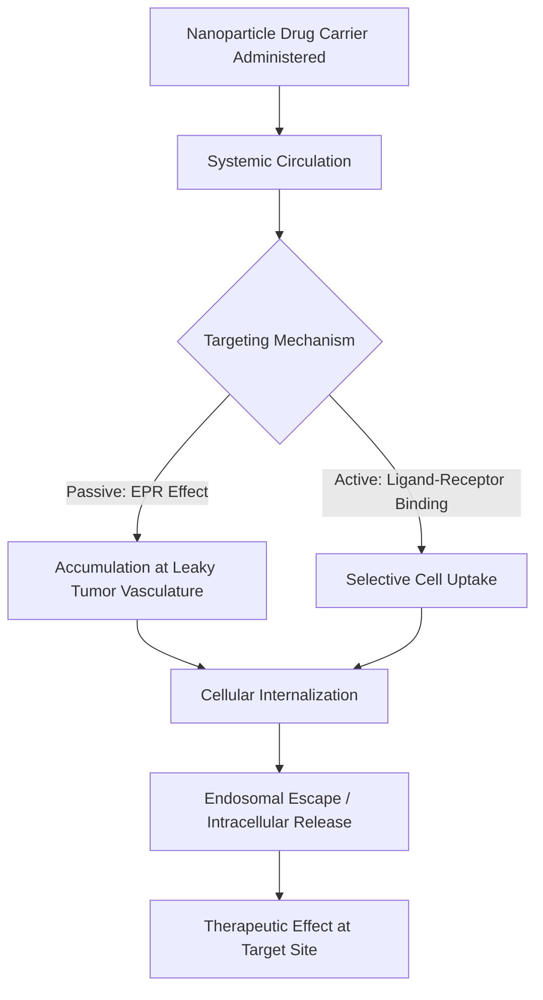
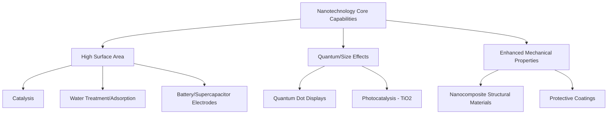

## Nanotechnology in Medicine and Industry

### Overview

Nanotechnology applies nanoscale materials and devices (typically 1–100 nm) to solve practical problems in healthcare, manufacturing, energy, and consumer products. By exploiting size-dependent physical, chemical, and biological properties, nanotechnology enables capabilities not achievable with bulk materials — ranging from targeted drug delivery to advanced structural composites.

### Nanomedicine

#### 1. Drug Delivery Systems

**Key Points**

- **Liposomal formulations**: Lipid bilayer vesicles encapsulate hydrophilic drugs in their aqueous core or hydrophobic drugs within the bilayer, improving circulation time and reducing systemic toxicity (e.g., liposomal doxorubicin formulations used in oncology).
- **Polymeric nanoparticles**: Biodegradable polymers (e.g., PLGA, PLA) encapsulate drugs for controlled, sustained release, degrading into non-toxic byproducts that are cleared by normal metabolic pathways.
- **Lipid nanoparticles (LNPs)**: Deliver nucleic acid-based therapeutics (mRNA, siRNA) by encapsulating and protecting them from degradation while facilitating cellular uptake and endosomal escape — the platform underlying mRNA vaccine technology.
- **Enhanced Permeability and Retention (EPR) effect**: Many solid tumors have leaky vasculature and poor lymphatic drainage, allowing appropriately sized nanoparticles to preferentially accumulate in tumor tissue relative to healthy tissue — a passive targeting mechanism exploited in cancer nanomedicine.
- **Active targeting**: Nanoparticle surfaces functionalized with targeting ligands (antibodies, peptides, aptamers) bind specific receptors overexpressed on target cells, improving selectivity beyond passive accumulation alone.

#### 2. Diagnostic and Imaging Applications

**Key Points**

- **Superparamagnetic iron oxide nanoparticles (SPIONs)**: Used as contrast agents in magnetic resonance imaging (MRI), enhancing image contrast in target tissues.
- **Quantum dots**: Provide bright, photostable fluorescent labels for cellular and molecular imaging, with size-tunable emission enabling multiplexed detection of several targets simultaneously.
- **Gold nanoparticles**: Used in colorimetric and electrochemical diagnostic assays (including lateral flow tests) due to their strong, size/shape-dependent optical absorption.
- **Nanoparticle-based biosensors**: Combine nanomaterial signal amplification with molecular recognition elements (antibodies, aptamers, nucleic acid probes) for highly sensitive detection of biomarkers, pathogens, or toxins.

#### 3. Therapeutic Applications

**Key Points**

- **Photothermal therapy**: Gold or other plasmonic nanoparticles absorb near-infrared light and convert it to localized heat, selectively destroying targeted tissue (e.g., tumor cells) while minimizing damage to surrounding healthy tissue.
- **Magnetic hyperthermia**: Superparamagnetic nanoparticles generate localized heat when exposed to an alternating magnetic field, used experimentally to induce targeted cell death.
- **Nanoparticle-based vaccines**: Lipid nanoparticle and virus-like particle platforms deliver antigens or genetic material to stimulate immune responses, as demonstrated at large scale in mRNA vaccine technology.
- **Tissue engineering scaffolds**: Nanostructured and nanofiber-based scaffolds mimic the extracellular matrix, supporting cell adhesion, proliferation, and tissue regeneration.

### Nanomedicine Drug Delivery Pathway

### Nanoparticle Size and Biodistribution (svg_diagram)

<svg xmlns="http://www.w3.org/2000/svg" viewBox="0 0 520 240" font-family="sans-serif">
\<style\>
.vessel{fill:none;stroke:#8a6d3b;stroke-width:3;}
.leak{fill:none;stroke:#8a6d3b;stroke-width:2;stroke-dasharray:3,2;}
.np{fill:#c0392b;}
.txt{font-size:12px;fill:#1a1a1a;text-anchor:middle;}
.title{font-size:14px;font-weight:bold;fill:#1a1a1a;text-anchor:middle;}
\</style\>
<text x="260" y="20" class="title">EPR Effect: Nanoparticle Tumor Accumulation (svg_diagram)</text>
<rect x="40" y="80" width="440" height="30" fill="none" stroke="#8a6d3b" stroke-width="3" />
<text x="260" y="130" class="txt">Normal Blood Vessel (tight junctions)</text>
<circle cx="100" cy="95" r="5" class="np" /><circle cx="150" cy="95" r="5" class="np" />
<circle cx="200" cy="95" r="5" class="np" /><circle cx="250" cy="95" r="5" class="np" />
<path d="M 40 180 L 480 180" class="leak" />
<path d="M 40 210 L 480 210" class="leak" />
<text x="260" y="235" class="txt">Tumor Vessel (leaky, fenestrated) - Nanoparticles Escape into Tissue</text>
<circle cx="120" cy="195" r="5" class="np" /><circle cx="160" cy="195" r="5" class="np" />
<circle cx="150" cy="230" r="5" class="np" /><circle cx="200" cy="240" r="5" class="np" />
<circle cx="280" cy="195" r="5" class="np" /><circle cx="320" cy="230" r="5" class="np" />
</svg>

### Industrial Applications of Nanotechnology

#### 1. Nanocomposite Materials

**Key Points**

- **Polymer nanocomposites**: Incorporating nanoscale fillers (nanoclay, carbon nanotubes, graphene, nanosilica) at low loading levels can substantially improve mechanical strength, thermal stability, gas barrier properties, and flame retardancy compared to the unmodified polymer.
- **Carbon nanotube (CNT) composites**: Exceptional tensile strength and electrical conductivity of CNTs enable lightweight, high-strength structural materials for aerospace and automotive applications, and conductive composites for antistatic or EMI-shielding applications.
- **Nanoclay composites**: Exfoliated clay platelets create tortuous diffusion pathways within a polymer matrix, significantly improving barrier properties against gas and moisture permeation (relevant to food packaging).

#### 2. Catalysis and Chemical Processing

**Key Points**

- Nanostructured catalysts (supported metal nanoparticles, zeolites with nanoscale pore architecture) provide high surface-area-to-volume ratios, improving catalytic activity and selectivity in industrial chemical processes, including automotive catalytic converters and petroleum refining.
- Nanoscale catalyst design allows tuning of exposed crystal facets and particle size to optimize reaction selectivity for specific industrial transformations.

#### 3. Energy Applications

**Key Points**

- **Batteries**: Nanostructured electrode materials (e.g., nanoscale silicon or graphene-based anodes) increase surface area for ion exchange, potentially improving charge/discharge rates and capacity in lithium-ion battery technology.
- **Solar cells**: Nanostructured materials, including quantum dots and nanostructured electrodes (e.g., in dye-sensitized solar cells), are used to enhance light absorption and charge transport.
- **Fuel cells**: Nanoscale platinum-group metal catalysts maximize active surface area, improving efficiency while reducing the mass of expensive catalyst required.
- **Supercapacitors**: Nanostructured carbon materials (e.g., graphene, activated carbon with nanoscale porosity) provide high surface area for charge storage, enabling rapid charge/discharge cycles.

#### 4. Environmental and Water Treatment

**Key Points**

- **Nanofiltration membranes**: Membranes with nanoscale pore structures enable selective removal of contaminants, salts, or pathogens from water.
- **Photocatalytic nanoparticles**: $TiO_2$ nanoparticles, activated by UV light, generate reactive oxygen species capable of degrading organic pollutants and inactivating pathogens in water and air purification systems.
- **Nanoscale adsorbents**: High surface-area nanomaterials (e.g., nanoscale iron oxide, activated carbon nanostructures) are used for heavy metal and organic pollutant removal from contaminated water.

#### 5. Consumer and Industrial Products

**Key Points**

- **Textiles**: Nanoparticle coatings (e.g., silver nanoparticles for antimicrobial properties, or nanoscale hydrophobic coatings) impart functional properties such as odor resistance and water repellency to fabrics.
- **Coatings and paints**: Nanoparticle additives improve scratch resistance, UV protection, and self-cleaning properties (e.g., $TiO_2$-based photocatalytic self-cleaning coatings).
- **Cosmetics and sunscreens**: Nanoscale zinc oxide and titanium dioxide provide UV protection with improved transparency on skin compared to larger particle formulations.
- **Electronics**: Nanoscale fabrication underlies modern semiconductor manufacturing, enabling continued miniaturization of transistors and integrated circuits.

### Industrial Nanotechnology Application Map

### Comparative Summary: Medicine vs. Industry

| Domain | Key Nanomaterials Used | Primary Benefit |
| --- | --- | --- |
| Drug delivery | Liposomes, polymeric NPs, lipid nanoparticles | Targeted delivery, reduced toxicity |
| Diagnostics | Quantum dots, gold NPs, SPIONs | Sensitive, multiplexed detection |
| Therapy | Plasmonic NPs, magnetic NPs | Localized, minimally invasive treatment |
| Structural materials | Carbon nanotubes, nanoclay, graphene | Improved strength-to-weight ratio |
| Catalysis | Supported metal nanoparticles, nanostructured zeolites | Higher activity/selectivity per unit mass |
| Energy storage/conversion | Nanostructured electrodes, Pt-group catalysts | Improved efficiency and capacity |
| Water/air treatment | TiO2 photocatalysts, nanoscale adsorbents | Pollutant degradation and removal |

### Safety, Regulatory, and Ethical Considerations

**Key Points**

- **Nanotoxicology**: The small size and high surface reactivity of nanoparticles can lead to different biological interactions (cellular uptake, biodistribution, potential for crossing biological barriers) compared to bulk material of the same composition, requiring dedicated safety assessment rather than extrapolation from bulk material data.
- **Environmental fate**: Engineered nanomaterials released into the environment may behave differently from bulk equivalents in terms of persistence, mobility, and bioaccumulation potential.
- **Regulatory frameworks**: Governments and regulatory agencies have developed nanomaterial-specific guidance and safety assessment requirements for pharmaceuticals, cosmetics, food contact materials, and industrial chemicals, though specifics vary by jurisdiction and are subject to ongoing revision.
- [Inference] Given the evolving regulatory and scientific landscape, specific approval statuses, exposure limits, and safety classifications for particular nanomaterials should be verified against current regulatory sources rather than assumed static.

### Worked Example

**Problem**: A liposomal drug formulation has a circulation half-life of 24 hours, compared to 2 hours for the free (non-encapsulated) drug. Assuming first-order elimination for both, calculate the ratio of the elimination rate constants ($k_e$) for the free drug versus the liposomal formulation.

**Solution**:

Using $t_{1/2} = \dfrac{0.693}{k_e}$, rearranged to $k_e = \dfrac{0.693}{t_{1/2}}$:

$$k_{e,\text{free}} = \frac{0.693}{2} = 0.347 \, h^{-1}$$

$$k_{e,\text{liposomal}} = \frac{0.693}{24} = 0.0289 \, h^{-1}$$

$$\frac{k_{e,\text{free}}}{k_{e,\text{liposomal}}} = \frac{0.347}{0.0289} \approx 12$$

**Conclusion**: The free drug is eliminated approximately **12 times faster** than the liposomal formulation, illustrating how nanoparticle encapsulation can substantially extend systemic circulation time — a key pharmacokinetic advantage of nanomedicine drug delivery platforms.

**Conclusion**

Nanotechnology's ability to exploit size-dependent physical, chemical, and biological phenomena has enabled transformative applications across medicine and industry — from targeted cancer therapies and sensitive diagnostics to high-performance composites, efficient catalysts, and advanced energy storage systems. Continued development requires balancing these functional advantages against careful evaluation of nanomaterial-specific safety and environmental considerations.

**Next Steps**

- Lipid nanoparticle formulation and mRNA vaccine delivery mechanisms in detail
- Nanotoxicology: mechanisms of nanoparticle-cell interaction and biological clearance pathways
- Carbon nanotube and graphene synthesis, functionalization, and composite fabrication
- Nanostructured battery and supercapacitor electrode design
- Photocatalysis mechanisms and TiO2-based environmental remediation systems
- Regulatory frameworks for nanomaterials in pharmaceuticals, cosmetics, and consumer products