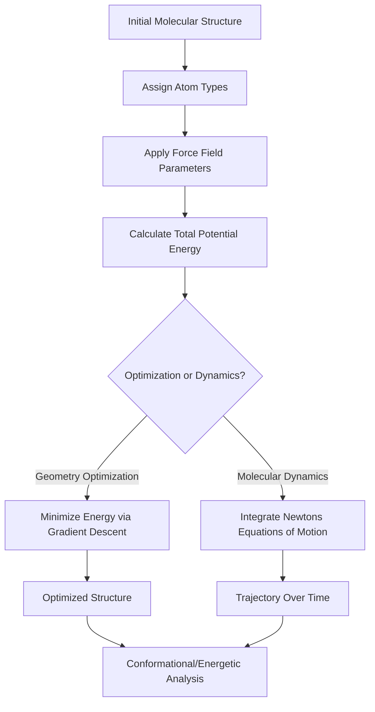

## Molecular Mechanics and Force Fields

### Overview

Molecular mechanics (MM) is a computational approach that models molecular systems using classical (Newtonian) physics rather than quantum mechanics, treating atoms as point masses connected by springs representing bonds. A **force field** is the mathematical function and associated parameter set that defines the potential energy of a molecular system as a function of atomic positions, enabling rapid energy and geometry calculations for large systems (proteins, polymers, materials) that are computationally intractable with quantum mechanical methods.

### Fundamental Principle

**Key Points**

- Molecular mechanics treats atoms as classical spheres with defined radii and charges, and bonds as springs following classical mechanical laws (Hooke's law for bond stretching, for example).
- The total potential energy of a molecular system is expressed as a sum of individual energy terms, each corresponding to a specific type of structural distortion or interaction.
- Because MM does not explicitly treat electrons, it cannot describe bond breaking/forming, electronic excited states, or reactions — it is limited to describing the energetics of a molecule's ground-state structure and conformational changes.
- The trade-off for this approximation is dramatically reduced computational cost, enabling simulation of systems containing thousands to millions of atoms (proteins, polymers, membranes) over time scales (nanoseconds to microseconds) far beyond the reach of quantum mechanical methods.

### General Force Field Energy Equation

$$E_{total} = E_{bonded} + E_{non-bonded}$$

$$E_{bonded} = E_{bond} + E_{angle} + E_{dihedral} + E_{improper}$$

$$E_{non-bonded} = E_{van der Waals} + E_{electrostatic}$$

### Bonded Energy Terms

#### 1. Bond Stretching

Modeled using a harmonic (Hooke's law) potential around an equilibrium bond length:

$$E_{bond} = \sum_{bonds} k_b (r - r_0)^2$$

where $k_b$ is the force constant, $r$ is the actual bond length, and $r_0$ is the equilibrium bond length.

#### 2. Angle Bending

Similarly modeled as a harmonic potential around an equilibrium bond angle:

$$E_{angle} = \sum_{angles} k_\theta (\theta - \theta_0)^2$$

#### 3. Dihedral (Torsional) Terms

Describes the energy variation with rotation about a bond, typically modeled as a periodic (cosine) function to capture the repeating nature of torsional rotation:

$$E_{dihedral} = \sum_{dihedrals} \frac{V_n}{2}[1 + \cos(n\phi - \gamma)]$$

where $V_n$ is the barrier height, $n$ is the periodicity (number of energy minima per full rotation), $\phi$ is the dihedral angle, and $\gamma$ is the phase offset.

#### 4. Improper Dihedrals (Out-of-Plane Bending)

An additional term used to maintain planarity or correct chirality at specific centers (e.g., keeping an sp² carbon planar, or maintaining tetrahedral geometry at a stereocenter), typically modeled with a harmonic potential.

### Non-Bonded Energy Terms

#### 1. Van der Waals Interactions

Commonly modeled using the **Lennard-Jones potential**, capturing short-range repulsion (from electron cloud overlap) and longer-range attractive dispersion forces:

$$E_{vdW} = \sum_{i<j} 4\varepsilon_{ij}\left[\left(\frac{\sigma_{ij}}{r_{ij}}\right)^{12} - \left(\frac{\sigma_{ij}}{r_{ij}}\right)^{6}\right]$$

where $\varepsilon_{ij}$ is the depth of the potential well (interaction strength), $\sigma_{ij}$ is the distance at which the potential is zero, and $r_{ij}$ is the interatomic distance.

#### 2. Electrostatic Interactions

Modeled using Coulomb's law with fixed atomic partial charges:

$$E_{electrostatic} = \sum_{i<j} \frac{q_i q_j}{4\pi\varepsilon_0 r_{ij}}$$

where $q_i$ and $q_j$ are the partial atomic charges and $r_{ij}$ is the interatomic distance.

### Force Field Energy Terms Diagram (svg_diagram)

<svg xmlns="http://www.w3.org/2000/svg" viewBox="0 0 560 320" font-family="sans-serif">
\<style\>
.atom{fill:#33557a;}
.bond{stroke:#333;stroke-width:2;}
.spring{stroke:#c0392b;stroke-width:2;fill:none;}
.txt{font-size:12px;fill:#1a1a1a;text-anchor:middle;}
.title{font-size:14px;font-weight:bold;fill:#1a1a1a;text-anchor:middle;}
\</style\>
<text x="280" y="20" class="title">Force Field Energy Term Types (svg_diagram)</text>

<circle cx="60" cy="80" r="8" class="atom" /><circle cx="140" cy="80" r="8" class="atom" />

<path d="M 68 80 Q 100 65, 132 80" class="spring" />

<text x="100" y="110" class="txt">Bond Stretch (r)</text>

<circle cx="240" cy="100" r="8" class="atom" /><circle cx="280" cy="60" r="8" class="atom" /><circle cx="280" cy="130" r="8" class="atom" />

<line x1="240" y1="100" x2="280" y2="60" class="bond" />

<line x1="240" y1="100" x2="280" y2="130" class="bond" />

<path d="M 260 90 A 15 15 0 0 1 260 105" class="spring" />

<text x="260" y="160" class="txt">Angle Bend (theta)</text>

<circle cx="380" cy="70" r="8" class="atom" /><circle cx="420" cy="90" r="8" class="atom" />

<circle cx="420" cy="130" r="8" class="atom" /><circle cx="460" cy="150" r="8" class="atom" />

<line x1="380" y1="70" x2="420" y2="90" class="bond" />

<line x1="420" y1="90" x2="420" y2="130" class="bond" />

<line x1="420" y1="130" x2="460" y2="150" class="bond" />

<text x="420" y="180" class="txt">Dihedral (phi)</text>

<circle cx="80" cy="250" r="8" class="atom" /><circle cx="180" cy="250" r="8" class="atom" />

<line x1="88" y1="250" x2="172" y2="250" stroke="#888" stroke-width="1.5" stroke-dasharray="4,3" />

<text x="130" y="280" class="txt">Non-bonded (vdW + Electrostatic)</text>

</svg>

### Common Force Fields

| Force Field | Primary Application Domain | Notes |
| --- | --- | --- |
| AMBER | Proteins, nucleic acids | Widely used in biomolecular simulation |
| CHARMM | Proteins, lipids, nucleic acids | Extensive parameterization for biomolecules |
| OPLS-AA | Organic liquids, biomolecules | All-atom, optimized for liquid-phase properties |
| GROMOS | Biomolecules (often united-atom) | United-atom representation reduces computational cost |
| MMFF (Merck Molecular Force Field) | General organic molecules | Broad applicability across diverse organic chemistry |
| UFF (Universal Force Field) | Broad periodic table coverage | Applicable to inorganic/organometallic systems where specialized force fields are unavailable |
| ReaxFF | Reactive systems | Allows bond breaking/forming, bridging MM and reactive chemistry |

### Force Field Parameterization

**Key Points**

- Force field parameters ($k_b$, $r_0$, $k_\theta$, $\theta_0$, $V_n$, $\varepsilon$, $\sigma$, atomic charges) are derived by fitting to a combination of **experimental data** (crystal structures, vibrational spectra, thermodynamic properties) and **higher-level quantum mechanical calculations** (ab initio or DFT).
- **Atom typing**: Force fields classify atoms into specific "atom types" based on element, hybridization, and local chemical environment (e.g., sp³ carbon in an alkane vs. aromatic carbon), each carrying its own set of parameters.
- **Transferability**: A key assumption underlying force field use is that parameters derived for a given functional group (e.g., a carbonyl in one molecule) can be reasonably transferred to describe that same functional group in a different, related molecule — though this assumption has limits and can introduce error for unusual or highly strained structures.
- Because force fields are empirically parameterized, their accuracy is inherently limited to the chemical space and property types represented in their parameterization/validation data set.

### United-Atom vs. All-Atom Representations

**Key Points**

- **All-atom force fields**: Explicitly represent every atom, including hydrogens, providing higher accuracy at increased computational cost.
- **United-atom force fields**: Group nonpolar hydrogens together with the heavy atom they are attached to (e.g., treating a $CH_2$ or $CH_3$ group as a single interaction site), reducing the number of particles and computational cost at some expense of accuracy.
- **Coarse-grained force fields**: Further reduce resolution by representing groups of several atoms (e.g., an entire amino acid side chain) as a single interaction bead, enabling simulation of much larger systems and longer timescales at the cost of atomic-level detail.

### Applications of Molecular Mechanics

**Key Points**

- **Molecular dynamics (MD) simulations**: Force fields provide the energy function used to compute forces (via the gradient of potential energy) that drive time-evolution of atomic positions according to Newton's equations of motion.
- **Geometry optimization**: MM is used to rapidly relax molecular structures to a local energy minimum, often as a preprocessing step before more expensive quantum mechanical calculations.
- **Conformational analysis**: Systematic or random sampling of torsional angles combined with MM energy evaluation identifies low-energy conformers of flexible molecules.
- **Protein structure prediction and refinement**: Force fields underpin homology modeling refinement and structure validation in computational structural biology.
- **Drug design**: MM-based docking and scoring functions estimate ligand-receptor binding energies in virtual screening workflows.
- **Materials modeling**: Force fields parameterized for polymers, zeolites, or metal-organic frameworks enable prediction of mechanical, thermal, and diffusion properties.

### Molecular Mechanics Workflow

### Limitations of Molecular Mechanics

**Key Points**

- **No explicit electrons**: Cannot describe bond breaking/forming, polarization response to a changing environment (unless using a polarizable force field), or electronic excited states.
- **Fixed atomic charges** (in standard, non-polarizable force fields): Do not respond dynamically to changes in the local electrostatic environment, which can reduce accuracy in highly polar or charged environments.
- **Parameter availability**: Novel or unusual chemical structures (exotic functional groups, transition metal complexes, non-standard bonding) may lack well-validated force field parameters, requiring careful parameterization or use of more general (but less accurate) force fields like UFF.
- **Empirical nature**: Since parameters are fit rather than derived purely from first principles, force field accuracy for properties or systems outside their original parameterization/validation scope should be verified rather than assumed.

### Worked Example

**Problem**: For a C–C bond with force constant $k_b = 300 \, kcal/mol/Å^2$ and equilibrium bond length $r_0 = 1.54 \, Å$, calculate the bond-stretching energy contribution if the bond is stretched to $r = 1.60 \, Å$.

**Solution**:

$$E_{bond} = k_b (r - r_0)^2$$

$$E_{bond} = 300 \times (1.60 - 1.54)^2$$

$$E_{bond} = 300 \times (0.06)^2 = 300 \times 0.0036 = 1.08 \, kcal/mol$$

**Conclusion**: A relatively small bond length deviation of 0.06 Å from equilibrium contributes about 1.08 kcal/mol of strain energy, illustrating the steep, quadratic energy penalty for bond distortion characteristic of the harmonic approximation used in most force fields.

**Conclusion**

Molecular mechanics and force fields provide a computationally efficient framework for modeling molecular structure and dynamics by representing the potential energy surface as a sum of simple, physically motivated bonded and non-bonded terms. While limited by their inability to describe bond-breaking chemistry and reliance on empirically fitted parameters, force fields remain indispensable for large-scale simulations of biomolecules, polymers, and materials where quantum mechanical methods are computationally prohibitive.

- [Inference] The accuracy of any specific force field for a given system or property should be validated against relevant experimental or higher-level computational benchmarks rather than assumed, since force field performance can vary substantially depending on the chemical system and property of interest.

**Next Steps**

- Molecular dynamics simulation methodology: integrators, thermostats, and barostats
- Polarizable force fields and their advantages for accurately modeling electrostatics
- Quantum mechanics/molecular mechanics (QM/MM) hybrid methods
- Free energy calculation methods (FEP, umbrella sampling) built on force field energy functions
- Coarse-grained modeling approaches for large-scale biomolecular and materials systems
- Force field parameterization workflows and validation against experimental/QM data