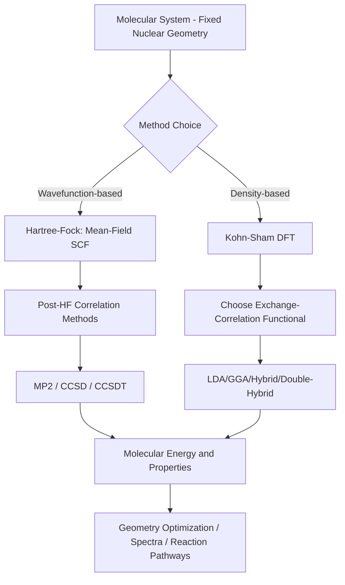

## Ab Initio and Density Functional Theory Methods

### Overview

Ab initio ("from first principles") and density functional theory (DFT) methods are quantum mechanical approaches to computational chemistry that calculate molecular properties directly from the Schrödinger equation without relying on empirically fitted parameters (in contrast to molecular mechanics). These methods explicitly treat electrons, enabling the study of bond breaking/forming, electronic structure, spectroscopic properties, and reaction mechanisms.

### The Schrödinger Equation and the Born-Oppenheimer Approximation

**Key Points**

- The time-independent Schrödinger equation, $\hat{H}\Psi = E\Psi$, is the fundamental equation of quantum mechanics; solving it exactly is only possible for the simplest systems (e.g., the hydrogen atom).
- The **Born-Oppenheimer approximation** separates nuclear and electronic motion, exploiting the large mass difference between nuclei and electrons: nuclei are treated as fixed while the electronic Schrödinger equation is solved, generating a **potential energy surface** as a function of nuclear coordinates.
- Nearly all practical ab initio and DFT methods operate within this approximation, solving the electronic problem for a given fixed nuclear geometry.

### Hartree-Fock (HF) Theory

Hartree-Fock is the foundational ab initio method, approximating the many-electron wavefunction as a single **Slater determinant** of one-electron orbitals, and solving for these orbitals self-consistently.

**Key Points**

- **Self-Consistent Field (SCF) procedure**: Each electron is treated as moving in the average (mean) field generated by all other electrons; the orbitals are iteratively refined until the field and orbitals become mutually consistent.
- **Mean-field approximation**: Because each electron experiences only the averaged effect of other electrons rather than their instantaneous positions, HF neglects **electron correlation** — the fact that electron motions are actually correlated (i.e., electrons avoid each other more than a mean-field treatment predicts).
- **Basis sets**: Molecular orbitals are expressed as linear combinations of atomic orbital basis functions (LCAO approach); larger, more flexible basis sets improve accuracy but increase computational cost.
- HF typically recovers ~99% of the total electronic energy but the missing ~1% (the correlation energy) is often chemically significant, since it is comparable in magnitude to many important energy differences (bond energies, reaction barriers).

### Electron Correlation and Post-Hartree-Fock Methods

Post-HF methods systematically recover electron correlation energy missing from HF, at increased computational cost.

| Method | Approach | Scaling with System Size | Typical Accuracy |
| --- | --- | --- | --- |
| Møller-Plesset perturbation theory (MP2) | Perturbative correction to HF | $N^5$ | Moderate improvement over HF |
| Configuration Interaction (CI) | Linear combination of excited Slater determinants | Up to $N^8$ (Full CI) | High (Full CI is exact within a given basis, but computationally intractable except for small systems) |
| Coupled Cluster (CC, e.g., CCSD(T)) | Exponential ansatz capturing correlation systematically | $N^7$ (CCSD(T)) | Very high — CCSD(T) is often termed the "gold standard" of quantum chemistry for small-to-medium systems |
| Multi-configurational SCF (MCSCF/CASSCF) | Multiple determinants optimized simultaneously | Varies | Essential for systems with near-degenerate electronic states (e.g., bond breaking, diradicals) |

**Key Points**

- Higher-accuracy post-HF methods scale steeply (often as a high power of the number of basis functions), limiting their practical application to relatively small molecules (tens of atoms) even on modern computational resources.
- **CCSD(T)** (coupled cluster with single, double, and perturbative triple excitations) is widely regarded as providing near-experimental accuracy for many molecular properties when combined with a sufficiently large basis set, but its steep computational scaling restricts routine use to small systems.

### Density Functional Theory (DFT)

DFT takes a fundamentally different approach: rather than solving for the many-electron wavefunction directly, it reformulates the problem in terms of the **electron density**, $\rho(r)$, a much simpler three-dimensional function regardless of the number of electrons.

**Key Points**

- **Hohenberg-Kohn theorems**: Establish that the ground-state electron density uniquely determines all ground-state properties of a system, and that the true ground-state density minimizes the total energy functional.
- **Kohn-Sham approach**: Introduces a fictitious system of non-interacting electrons that reproduces the same electron density as the real interacting system, making the problem computationally tractable while formally retaining exactness (in principle).
- The total DFT energy is expressed as:

$$E[\rho] = T_s[\rho] + E_{ne}[\rho] + J[\rho] + E_{xc}[\rho]$$

where $T_s[\rho]$ is the kinetic energy of the non-interacting reference system, $E_{ne}[\rho]$ is the nuclear-electron attraction, $J[\rho]$ is the classical Coulomb repulsion, and $E_{xc}[\rho]$ is the **exchange-correlation functional** — the term that captures all remaining many-body quantum effects.

- The exact form of $E_{xc}[\rho]$ is unknown; practical DFT relies on **approximate exchange-correlation functionals**, and the choice of functional is the primary source of variation in DFT accuracy and the central practical decision in any DFT calculation.

### Hierarchy of Exchange-Correlation Functionals ("Jacob's Ladder")

| Rung | Functional Type | Examples | Characteristics |
| --- | --- | --- | --- |
| 1 | Local Density Approximation (LDA) | SVWN | Depends only on local electron density; simplest, least accurate for molecules |
| 2 | Generalized Gradient Approximation (GGA) | PBE, BLYP | Includes density gradient; improved accuracy over LDA |
| 3 | Meta-GGA | TPSS, M06-L | Includes kinetic energy density; further refinement |
| 4 | Hybrid functionals | B3LYP, PBE0 | Mix a fraction of exact HF exchange with GGA/meta-GGA; widely used for general chemistry |
| 5 | Double-hybrid functionals | B2PLYP | Incorporate a perturbative correlation correction; higher accuracy, higher cost |

**Key Points**

- **B3LYP** is among the most widely used hybrid functionals in computational chemistry due to its broad reliability across many types of chemical properties, though it has known systematic weaknesses for certain properties (e.g., some non-covalent interactions, certain reaction barrier heights) that have motivated development of numerous alternative functionals.
- **Dispersion correction** (e.g., Grimme's DFT-D3/D4 corrections) is commonly added to standard functionals, which otherwise poorly describe long-range van der Waals (dispersion) interactions — an important consideration for systems where non-covalent interactions are significant.
- No single functional performs best across all molecular properties and system types; functional selection is often guided by benchmarking against reference data relevant to the specific property and chemical system of interest.

### DFT vs. Wavefunction-Based Methods Flow

### Basis Sets

**Key Points**

- **Minimal basis sets** (e.g., STO-3G): One basis function per atomic orbital; computationally cheap but generally inadequate for quantitative accuracy.
- **Split-valence basis sets** (e.g., 6-31G, 6-311G): Use multiple basis functions for valence orbitals, allowing more flexible description of bonding.
- **Polarization functions** (denoted by * or (d,p)): Add higher-angular-momentum functions (e.g., d-functions on heavy atoms, p-functions on hydrogen), allowing orbitals to distort/polarize in response to the molecular environment — important for accurate geometries and energies.
- **Diffuse functions** (denoted by + or ++): Add more spatially extended basis functions, important for accurately describing anions, weakly bound systems, and excited states.
- **Correlation-consistent basis sets** (e.g., cc-pVDZ, cc-pVTZ, cc-pVQZ): Systematically constructed to allow extrapolation toward the complete basis set (CBS) limit, commonly used in high-accuracy post-HF calculations.
- **Basis set superposition error (BSSE)**: An artificial stabilization of intermolecular complexes arising from incomplete basis sets, often corrected using the counterpoise method.

### Basis Set Size vs. Accuracy Diagram (svg_diagram)

<svg xmlns="http://www.w3.org/2000/svg" viewBox="0 0 500 260" font-family="sans-serif">
\<style\>
.axis{stroke:#333;stroke-width:2;}
.curve{fill:none;stroke:#33557a;stroke-width:2.5;}
.txt{font-size:12px;fill:#1a1a1a;}
.title{font-size:14px;font-weight:bold;fill:#1a1a1a;text-anchor:middle;}
\</style\>
<text x="250" y="20" class="title">Accuracy vs Basis Set Size / Computational Cost (svg_diagram)</text>
<line x1="60" y1="220" x2="460" y2="220" class="axis" />
<line x1="60" y1="220" x2="60" y2="40" class="axis" />
<text x="260" y="245" class="txt">Basis Set Size / Computational Cost</text>
<text x="20" y="130" class="txt" transform="rotate(-90 20,130)">Accuracy</text>
<path d="M 70 210 C 150 160, 200 100, 280 70 S 400 50, 450 45" class="curve" />
<text x="100" y="205" class="txt">Minimal (STO-3G)</text>
<text x="250" y="95" class="txt">Split-valence + polarization</text>
<text x="380" y="55" class="txt">Correlation-consistent (large)</text>
</svg>

### Ab Initio and DFT Applications

**Key Points**

- **Geometry optimization**: Determining equilibrium molecular structures corresponding to minima on the potential energy surface.
- **Vibrational frequency analysis**: Calculating normal modes and IR/Raman spectra, and confirming whether an optimized structure is a true minimum (all real frequencies) or a transition state (one imaginary frequency).
- **Reaction mechanism studies**: Locating transition states and computing activation energies and reaction pathways.
- **Electronic spectra**: Time-dependent DFT (TD-DFT) extends ground-state DFT to compute excited-state properties, enabling prediction of UV-Vis absorption spectra.
- **Thermochemistry**: Computing reaction enthalpies, entropies, and free energies via statistical mechanical treatment of computed vibrational frequencies combined with electronic energies.
- **NMR and other spectroscopic property prediction**: Calculating chemical shifts, coupling constants, and other spectroscopic observables to aid structural assignment.

### Comparison: Ab Initio Wavefunction Methods vs. DFT

| Aspect | Wavefunction Methods (HF, Post-HF) | DFT |
| --- | --- | --- |
| Fundamental variable | Many-electron wavefunction | Electron density |
| Systematic improvability | Yes (HF → MP2 → CCSD → CCSD(T) → Full CI converges to exact answer) | No single systematic path to exact functional |
| Computational cost scaling | Often steep for high accuracy (post-HF) | Generally more favorable scaling for comparable accuracy |
| Typical system size accessible | Small molecules for high-accuracy post-HF methods | Small to moderately large systems (tens to hundreds of atoms) |
| Accuracy predictability | Can be systematically converged and benchmarked | Depends on functional choice; less systematically improvable |

### Practical Workflow Considerations

**Key Points**

- **Method/basis set selection** involves balancing required accuracy against available computational resources and system size; a common strategy is benchmarking a smaller model system with higher-level methods (e.g., CCSD(T)) to validate the appropriateness of a more affordable method (e.g., a specific DFT functional) for the larger system of interest.
- **Software packages**: A range of commercial and open-source quantum chemistry software packages (implementing HF, post-HF, and DFT methods) are used across academic and industrial computational chemistry, each with differing strengths regarding available methods, basis sets, and system size capability; specific software features and capabilities should be checked against current documentation given the pace of ongoing development.
- **Convergence considerations**: SCF and geometry optimization procedures are iterative and require careful convergence criteria; poor initial guesses or challenging electronic structures (e.g., open-shell systems, near-degenerate states) can require specialized convergence strategies.

### Worked Example

**Problem**: A single-point energy calculation using Hartree-Fock recovers 99.1% of the exact non-relativistic electronic energy of a small molecule, whose exact energy is $-100.000 \, hartree$. Estimate the correlation energy (in hartree) missing from the HF calculation.

**Solution**:

$$E_{HF} = 0.991 \times E_{exact} = 0.991 \times (-100.000) = -99.100 \, hartree$$

$$E_{correlation} = E_{exact} - E_{HF} = -100.000 - (-99.100) = -0.900 \, hartree$$

**Conclusion**: The missing correlation energy is approximately **-0.9 hartree** (about 23.5 kcal/mol using $1 , hartree \approx 627.5 , kcal/mol$) — a magnitude far larger than many chemically relevant energy differences (e.g., typical reaction barrier heights of 10–40 kcal/mol), illustrating why electron correlation cannot be neglected for quantitatively reliable predictions of reaction energetics.

**Conclusion**

Ab initio and DFT methods provide rigorous, first-principles routes to molecular electronic structure, ranging from computationally efficient Hartree-Fock and DFT approaches suitable for larger systems to highly accurate but computationally demanding post-HF methods like CCSD(T) for small, high-precision benchmark calculations. The choice of method, functional, and basis set represents a fundamental trade-off between accuracy and computational feasibility that must be tailored to the specific chemical system and property under investigation.

- [Inference] The relative performance of specific functionals or methods for a particular class of molecules or properties is an active area of ongoing benchmarking research, so specific accuracy claims for a given functional should be checked against current comparative studies relevant to the property of interest.

**Next Steps**

- Time-dependent DFT (TD-DFT) for excited states and UV-Vis spectral prediction
- Transition state theory and reaction pathway calculations (IRC, NEB methods)
- QM/MM hybrid methods for modeling large systems with localized quantum treatment
- Basis set convergence and complete basis set (CBS) extrapolation techniques
- Relativistic effects in quantum chemistry (important for heavy element chemistry)
- Benchmarking and method validation strategies in computational chemistry