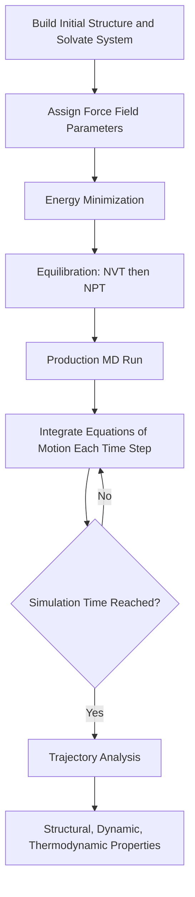

## Molecular Dynamics Simulations

### Overview

Molecular dynamics (MD) is a computational simulation technique that models the time-evolution of a molecular system by numerically integrating Newton's equations of motion for every atom, using forces derived from a force field or, in ab initio MD, from quantum mechanical calculations. MD provides a dynamic, time-resolved picture of molecular behavior — conformational changes, diffusion, binding events — complementing the static structures obtained from geometry optimization.

### Fundamental Principle

**Key Points**

- MD simulates atomic motion by solving Newton's second law, $F = ma$, for every atom in the system at each discrete time step, based on the forces derived from the gradient of the potential energy function (typically a molecular mechanics force field).
- The output of an MD simulation is a **trajectory**: a time-ordered series of atomic positions (and velocities) that can be analyzed to extract structural, dynamic, and thermodynamic properties.
- MD is fundamentally a **deterministic** classical mechanics calculation — given identical initial positions and velocities, the same integration algorithm reproduces the identical trajectory (subject to numerical precision).

### The Newtonian Equations of Motion

For each atom $i$ with mass $m_i$, position $r_i$, and force $F_i$:

$$F_i = m_i \frac{d^2r_i}{dt^2} = -\nabla_i E_{potential}$$

The force on each atom is the negative gradient of the potential energy (from the force field) with respect to that atom's position, and this force determines the atom's acceleration.

### Numerical Integration Algorithms

Since the equations of motion cannot generally be solved analytically for many-body systems, they are integrated numerically in small discrete time steps.

**Key Points**

- **Verlet algorithm**: A widely used integration scheme that calculates new positions from current and previous positions plus the current acceleration, offering good energy conservation and time-reversibility.
- **Velocity Verlet algorithm**: A variant that explicitly propagates both positions and velocities, widely used in practice because it provides velocities at each time step (needed for temperature calculation and coupling to thermostats).
- **Leapfrog algorithm**: Computes velocities and positions at staggered ("leapfrogging") half-time-step offsets; mathematically related to Verlet integration.
- **Time step selection**: The integration time step must be small enough to accurately capture the fastest motions in the system (typically bond vibrations, with periods on the order of femtoseconds); a common time step is ~1–2 femtoseconds, often extended to ~2–4 fs by constraining the fastest bond vibrations (e.g., via the SHAKE or LINCS algorithms).

### Velocity Verlet Algorithm Steps

$$r(t + \Delta t) = r(t) + v(t)\Delta t + \frac{1}{2}a(t)\Delta t^2$$

$$v(t + \Delta t/2) = v(t) + \frac{1}{2}a(t)\Delta t$$

$$a(t + \Delta t) = F(t + \Delta t)/m$$

$$v(t + \Delta t) = v(t + \Delta t/2) + \frac{1}{2}a(t + \Delta t)\Delta t$$

### MD Simulation Time Step Hierarchy (svg_diagram)

<svg xmlns="http://www.w3.org/2000/svg" viewBox="0 0 520 220" font-family="sans-serif">
\<style\>
.bar{fill:#5b8fd4;}
.txt{font-size:12px;fill:#1a1a1a;text-anchor:middle;}
.title{font-size:14px;font-weight:bold;fill:#1a1a1a;text-anchor:middle;}
\</style\>
<text x="260" y="20" class="title">Timescales of Molecular Motion (svg_diagram)</text>
<rect x="60" y="60" width="20" height="30" class="bar" />
<text x="70" y="105" class="txt">Bond</text>
<text x="70" y="120" class="txt">vibration</text>
<text x="70" y="135" class="txt">~10 fs</text>
<rect x="140" y="60" width="30" height="60" class="bar" />
<text x="155" y="135" class="txt">Angle</text>
<text x="155" y="150" class="txt">bending</text>
<text x="155" y="165" class="txt">~100 fs</text>
<rect x="230" y="60" width="40" height="90" class="bar" />
<text x="250" y="165" class="txt">Side-chain</text>
<text x="250" y="180" class="txt">rotation ~ps</text>
<rect x="330" y="60" width="60" height="130" class="bar" />
<text x="360" y="205" class="txt">Protein loop motion ~ns</text>
<rect x="440" y="60" width="60" height="140" class="bar" />
<text x="470" y="210" class="txt">Folding ~us-ms</text>
</svg>

### Ensembles in Molecular Dynamics

Simulations are typically run to sample a specific statistical mechanical ensemble, controlled via thermostats and/or barostats.

| Ensemble | Controlled Variables | Common Use |
| --- | --- | --- |
| NVE (microcanonical) | Number of particles (N), Volume (V), Energy (E) | Fundamental/reference simulations; tests energy conservation |
| NVT (canonical) | N, V, Temperature (T) | Most common for equilibrium property sampling at constant T |
| NPT (isothermal-isobaric) | N, Pressure (P), T | Mimics typical experimental conditions (constant T and P) |
| $\mu$VT (grand canonical) | Chemical potential ($\mu$), V, T | Systems with variable particle number (e.g., adsorption studies) |

**Key Points**

- **Thermostats** (e.g., Berendsen, Nosé-Hoover, Langevin) regulate simulation temperature by coupling the system to an external heat bath, adjusting atomic velocities to maintain the target temperature.
- **Barostats** (e.g., Berendsen, Parrinello-Rahman) regulate pressure by adjusting the simulation box volume, enabling constant-pressure simulations.
- Different thermostat/barostat algorithms have different theoretical properties (e.g., whether they rigorously sample the correct statistical ensemble); algorithm choice can matter for the specific property being studied.

### Periodic Boundary Conditions

**Key Points**

- To simulate bulk-like behavior with a manageable number of atoms, MD simulations commonly use **periodic boundary conditions (PBC)**: the simulation box is treated as one unit cell of an infinitely repeating lattice, so atoms exiting one side re-enter from the opposite side.
- PBC eliminates artificial surface effects that would otherwise dominate a small, isolated simulation box, better approximating bulk solution or condensed-phase behavior.
- **Minimum image convention**: Non-bonded interactions are typically calculated only with the nearest periodic image of each particle, combined with a cutoff distance beyond which interactions are neglected or approximated (e.g., via Ewald summation/Particle Mesh Ewald for long-range electrostatics).

### Periodic Boundary Conditions Diagram (svg_diagram)

<svg xmlns="http://www.w3.org/2000/svg" viewBox="0 0 460 320" font-family="sans-serif">
\<style\>
.cell{fill:#eef3fb;stroke:#33557a;stroke-width:2;}
.ghost{fill:#f5f5f5;stroke:#999;stroke-width:1;stroke-dasharray:3,2;}
.atom{fill:#c0392b;}
.txt{font-size:11px;fill:#1a1a1a;text-anchor:middle;}
.title{font-size:14px;font-weight:bold;fill:#1a1a1a;text-anchor:middle;}
\</style\>
<text x="230" y="20" class="title">Periodic Boundary Conditions (svg_diagram)</text>
<rect x="10" y="30" width="140" height="140" class="ghost" />
<rect x="160" y="30" width="140" height="140" class="ghost" />
<rect x="310" y="30" width="140" height="140" class="ghost" />
<rect x="10" y="180" width="140" height="140" class="ghost" />
<rect x="160" y="180" width="140" height="140" class="cell" />
<rect x="310" y="180" width="140" height="140" class="ghost" />
<circle cx="200" cy="220" r="6" class="atom" />
<circle cx="60" cy="220" r="6" class="atom" opacity="0.4" />
<circle cx="350" cy="220" r="6" class="atom" opacity="0.4" />
<circle cx="200" cy="70" r="6" class="atom" opacity="0.4" />
<circle cx="200" cy="370" r="6" class="atom" opacity="0.4" />
<text x="230" y="230" class="txt">Central Cell</text>
<text x="230" y="305" class="txt">Ghost/Image Cells (repeated copies)</text>
</svg>

### Force Field and Potential Energy Basis

**Key Points**

- Classical (empirical) MD relies on a **force field** (e.g., AMBER, CHARMM, OPLS) to compute the potential energy and forces at each step, as described under molecular mechanics.
- **Ab initio molecular dynamics (AIMD)**, such as Born-Oppenheimer MD or Car-Parrinello MD, computes forces "on the fly" from quantum mechanical (typically DFT) calculations rather than a pre-parameterized force field, enabling the description of bond breaking/forming during the simulation, at substantially higher computational cost than classical MD.

### Molecular Dynamics Simulation Workflow

### Simulation Setup Stages

**Key Points**

- **System building/solvation**: The molecule(s) of interest are placed in a simulation box, typically solvated with explicit water molecules (or another solvent) and neutralized with counterions if the system carries a net charge.
- **Energy minimization**: Performed before dynamics to relieve steric clashes or unfavorable contacts introduced during system construction, preventing simulation instability.
- **Equilibration**: A preliminary MD phase (often first at constant volume, then constant pressure) allows the system to relax to a stable, representative state before data collection begins, monitored via properties such as temperature, pressure, and energy stabilization.
- **Production run**: The main simulation phase, from which the trajectory is collected for subsequent analysis.

### Analysis of MD Trajectories

| Analysis Method | Property Extracted |
| --- | --- |
| Root-mean-square deviation (RMSD) | Structural stability/deviation from a reference structure over time |
| Root-mean-square fluctuation (RMSF) | Per-residue/per-atom flexibility |
| Radial distribution function (RDF) | Local structural ordering (e.g., solvation shell structure) |
| Radius of gyration | Overall compactness of a macromolecule |
| Hydrogen bond analysis | Occupancy and lifetime of specific hydrogen bonds |
| Free energy calculations (e.g., umbrella sampling, FEP) | Free energy profiles along a reaction coordinate or binding process |
| Diffusion coefficient (from mean-squared displacement) | Molecular mobility/transport properties |

### Enhanced Sampling Methods

**Key Points**

- Standard MD is limited by accessible simulation timescales (often nanoseconds to low microseconds on typical computational resources), which may be insufficient to observe rare events (e.g., protein folding, ligand unbinding) that occur on much longer timescales.
- **Enhanced sampling techniques** (e.g., replica exchange/parallel tempering, metadynamics, umbrella sampling, accelerated MD) bias or restructure the simulation to more efficiently explore relevant regions of configuration space or compute free energies along specific reaction coordinates.
- **Coarse-grained MD**: Reduces system resolution (grouping several atoms into a single interaction site) to access much longer simulation timescales at reduced atomic-level detail, complementary to enhanced sampling of all-atom systems.

### Applications of Molecular Dynamics

**Key Points**

- **Protein dynamics and folding**: Studying conformational flexibility, folding pathways, and stability of biomolecules.
- **Drug design**: Simulating ligand-protein binding, estimating binding free energies, and studying induced-fit binding effects not captured by static docking.
- **Membrane biophysics**: Modeling lipid bilayer properties, membrane protein behavior, and permeation processes.
- **Materials science**: Simulating diffusion, mechanical properties, and phase behavior of polymers, nanomaterials, and crystalline solids.
- **Liquid structure and thermodynamics**: Computing solvation structure, transport properties, and thermodynamic quantities for liquids and solutions.
- [Inference] The reliability of MD-derived quantitative predictions (binding affinities, folding rates, transport coefficients) depends strongly on force field accuracy, sampling adequacy, and system-specific validation, so specific numerical results from any given study should be interpreted with reference to that validation rather than assumed universally accurate.

### Worked Example

**Problem**: An MD simulation uses a time step of 2 femtoseconds ($2 \times 10^{-15}$ s). How many integration steps are required to simulate 10 nanoseconds of dynamics?

**Solution**:

Convert to consistent units:

$$10 \, ns = 10 \times 10^{-9} \, s = 1 \times 10^{-8} \, s$$

$$\text{Number of steps} = \frac{\text{Total simulation time}}{\text{Time step}} = \frac{1 \times 10^{-8} \, s}{2 \times 10^{-15} \, s}$$

$$\text{Number of steps} = 5 \times 10^{6} \, \text{steps}$$

**Conclusion**: Simulating just 10 nanoseconds requires 5 million discrete integration steps, illustrating why accessing biologically relevant timescales (microseconds to milliseconds) in all-atom MD remains computationally demanding and often motivates the use of enhanced sampling or coarse-grained approaches.

**Conclusion**

Molecular dynamics simulations provide a powerful window into the time-dependent behavior of molecular systems by numerically integrating classical equations of motion. Through careful choice of force field, ensemble, boundary conditions, and simulation protocol, MD enables the study of conformational dynamics, binding processes, and material properties that are inaccessible to static structural methods alone, though practical timescale limitations continue to motivate the development of enhanced and coarse-grained sampling techniques.

**Next Steps**

- Enhanced sampling methods in detail: metadynamics, umbrella sampling, replica exchange
- Free energy perturbation (FEP) and alchemical free energy calculations for drug binding
- Ab initio and Car-Parrinello molecular dynamics for reactive systems
- Coarse-grained force fields and multiscale modeling approaches
- Thermostat and barostat algorithms: theoretical basis and practical selection
- Trajectory analysis software and best practices for MD data interpretation