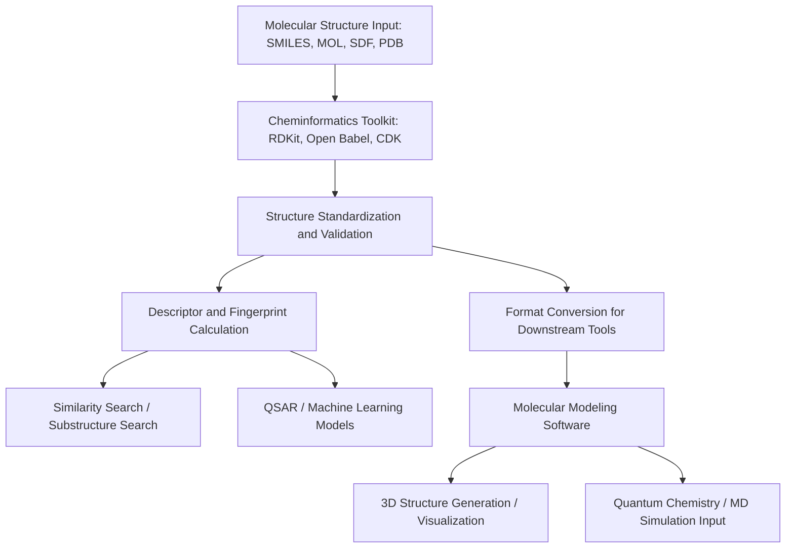
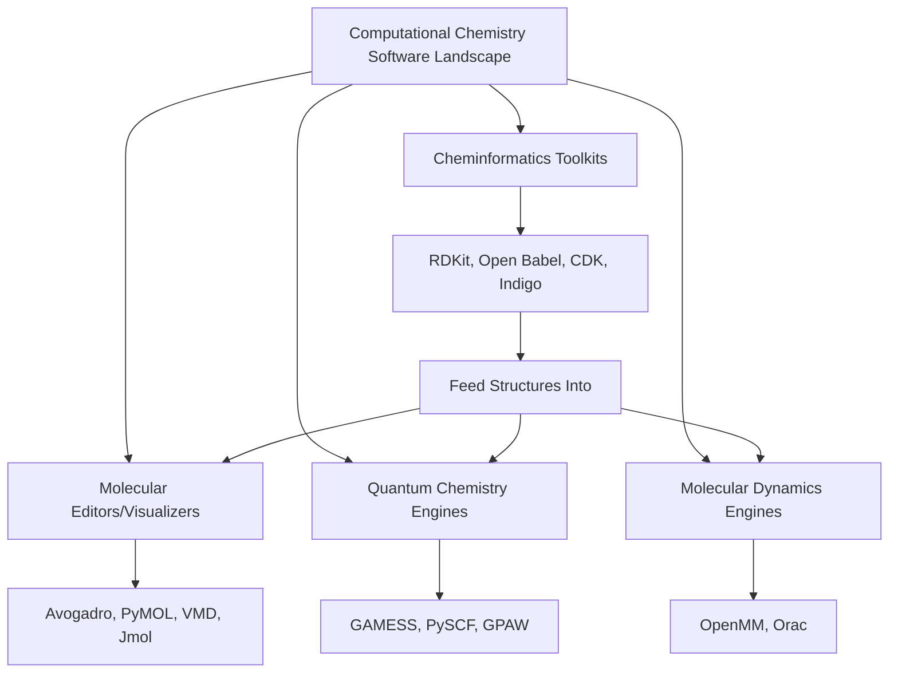

## Cheminformatics and Molecular Modeling Software

### Overview

Cheminformatics is the discipline that applies computational and informational techniques to solve chemical problems — storing, retrieving, analyzing, and predicting molecular structures and properties. Molecular modeling software complements this by providing tools to build, visualize, simulate, and compute the geometry, energetics, and dynamics of molecular systems. Together, these tools form the software infrastructure underlying modern drug discovery, materials design, and computational chemistry research.

### Core Data Representations in Cheminformatics

**Key Points**

- **SMILES (Simplified Molecular Input Line Entry System)**: A compact, human-readable text notation for representing molecular structure as a linear string (e.g., ethanol as `CCO`), widely used for storage, database searching, and interchange.
- **InChI (International Chemical Identifier)**: A standardized, algorithmically generated string designed to provide a unique, non-proprietary identifier for chemical substances, aiding cross-database structure matching.
- **Molecular file formats**: Structured formats such as **MOL/SDF** (2D/3D atom-bond connection tables, often with associated data fields), **PDB** (Protein Data Bank format for macromolecular structures), and **Mol2** (includes atom typing and partial charges) serve different structural and application needs.
- **Molecular fingerprints**: Bit-vector representations encoding the presence/absence of structural features or fragments, enabling rapid similarity comparison and machine-learning feature generation (e.g., Morgan/ECFP circular fingerprints, MACCS keys).

### Cheminformatics Toolkit Landscape

| Toolkit | License | Primary Languages | Key Capabilities |
| --- | --- | --- | --- |
| RDKit | BSD (open source) | C++, Python | Molecular manipulation, descriptor calculation, fingerprint generation, and database integration; widely used for handling large compound datasets and integrating with machine learning workflows in drug discovery |
| Open Babel | GPL (open source) | C++, with bindings for Python, Java, Perl, C#, Ruby | Facilitates conversion of chemical file formats and management of molecular data; provides utilities from conformer searching and 2D depiction to filtering, batch conversion, and substructure/similarity searching |
| CDK (Chemistry Development Kit) | LGPL (open source) | Java | Java-based cheminformatics library for structure handling, descriptor calculation, and QSAR |
| Indigo | Apache 2.0 (open source) | C++, with bindings | General-purpose cheminformatics toolkit for molecules and reactions |
| Commercial suites (e.g., Schrödinger, MOE, ChemDraw ecosystem) | Proprietary | Varies | Integrated GUI-driven platforms combining cheminformatics, modeling, and visualization |

**Key Points**

- RDKit has become a de facto standard in pharmaceutical and academic cheminformatics , financially supported by several major pharmaceutical companies, with quarterly releases and an active community. [ki-syndikat](https://www.ki-syndikat.de/tools/rdkit/)
- [Unverified] Specific current version numbers, release cadences, and supported Python versions for any of these actively developed tools change frequently; the exact current release should be checked directly against the project's official documentation or repository rather than assumed from general knowledge.

### Cheminformatics Software Ecosystem Flow

### Molecular Modeling and Visualization Software

| Tool | Category | Primary Use |
| --- | --- | --- |
| Avogadro | Molecular editor/visualizer | Advanced molecular editor for building and visualizing 2D/3D structures |
| Jmol | Structure viewer | Viewer for three-dimensional chemical structures, often used for web-embedded visualization |
| PyMOL | Molecular visualization | Widely used for macromolecular (protein/nucleic acid) structure visualization and rendering |
| VMD (Visual Molecular Dynamics) | Visualization + trajectory analysis | Visualization and analysis of molecular dynamics simulation trajectories |
| Ketcher | 2D structure editor | Web-based chemical structure editor |

### Computational Chemistry Engines

| Tool | Category | Primary Use |
| --- | --- | --- |
| GAMESS | Ab initio quantum chemistry | General ab initio quantum chemistry package |
| PySCF | Quantum chemistry framework | Quantum chemistry framework with Python-based scripting for method development |
| GPAW | DFT package | Python package for density-functional theory calculations |
| OpenMM | Molecular dynamics engine | High-performance toolkit for molecular simulation |
| Orac | Molecular dynamics engine | OpenMP/MPI molecular dynamics engine to simulate solvated biomolecules |
| Cantera | Chemical kinetics/thermodynamics | Chemical kinetics, thermodynamics, and transport tool suite, relevant to combustion and reaction engineering modeling |

### Software Landscape Map

### Core Cheminformatics Functions in Practice

#### 1. Structure Search and Similarity Analysis

**Key Points**

- **Substructure search**: Identifies molecules within a database containing a specified structural fragment, essential for scaffold-based compound library queries.
- **Similarity search**: Uses fingerprint-based distance metrics (commonly the **Tanimoto coefficient**) to rank database molecules by structural similarity to a query molecule, supporting "find similar compounds" workflows in drug discovery.

$$T_{Tanimoto} = \frac{c}{a + b - c}$$

where $a$ and $b$ are the number of bits set in each fingerprint, and $c$ is the number of bits common to both.

#### 2. Molecular Descriptor Calculation

**Key Points**

- Descriptors are numerical values summarizing molecular structure or properties (molecular weight, logP, topological polar surface area, number of hydrogen bond donors/acceptors, ring counts, etc.), commonly used as input features for QSAR (Quantitative Structure-Activity Relationship) and machine learning models.
- **Lipinski's Rule of Five** and related drug-likeness filters are commonly implemented as descriptor-based screening criteria in early-stage drug discovery pipelines.

#### 3. Conformer Generation and 3D Structure Building

**Key Points**

- Since many cheminformatics data sources store molecules as 2D connectivity (SMILES, 2D SDF), toolkits provide algorithms to generate plausible 3D conformers, often via distance geometry or systematic/stochastic conformational search, sometimes refined using a molecular mechanics force field.

#### 4. Reaction and Retrosynthesis Modeling

**Key Points**

- **Reaction SMARTS/SMIRKS**: Pattern-matching languages extending SMILES to describe chemical transformations, enabling automated reaction enumeration and virtual library generation.
- **Retrosynthetic analysis tools**: Increasingly incorporate machine learning models trained on reaction databases to propose plausible synthetic routes to a target molecule, an active and rapidly evolving area of cheminformatics/AI integration.

### Integration with Machine Learning

**Key Points**

- Cheminformatics toolkits (particularly RDKit) provide the descriptor and fingerprint generation infrastructure that feeds directly into machine learning pipelines for property prediction, virtual screening, and generative molecular design.
- **Graph-based molecular representations**: Increasingly used in graph neural network (GNN) approaches, representing atoms as nodes and bonds as edges, offering an alternative to traditional fixed-length fingerprint descriptors.
- [Inference] The specific performance advantages of machine-learning-based approaches (e.g., GNNs) versus traditional descriptor/fingerprint-based methods vary by dataset and prediction task, and should be evaluated against current benchmark studies rather than assumed to be uniformly superior.

### Choosing Software for a Given Task

| Task | Typical Tool Choice |
| --- | --- |
| Format conversion between chemical file types | Open Babel |
| Python-based cheminformatics pipeline/ML feature generation | RDKit |
| 3D molecular visualization for publication/presentation | PyMOL, Avogadro, VMD |
| Ab initio/DFT single-point or geometry calculations | GAMESS, PySCF, GPAW |
| Classical molecular dynamics simulation | OpenMM, Orac (or AMBER/GROMACS-class packages) |
| Reaction kinetics/thermodynamics modeling | Cantera |
| 2D structure drawing/editing | Ketcher, JChemPaint, XDrawChem |

### Practical Workflow Example

**Key Points**

- A typical drug-discovery cheminformatics pipeline might: (1) import a compound library in SDF format, (2) standardize structures and generate canonical SMILES/InChI identifiers, (3) calculate molecular descriptors and fingerprints, (4) perform similarity or substructure filtering against a target scaffold, (5) generate 3D conformers, and (6) export prepared structures for docking or MD simulation software.
- Interoperability between tools relies heavily on standardized file formats (SDF, MOL2, PDB) and format-conversion utilities, since no single toolkit typically covers the entire pipeline from 2D structure to simulation-ready 3D input.

### Worked Example

**Problem**: Two molecules have fingerprint bit counts $a = 120$ set bits and $b = 100$ set bits, with $c = 60$ bits in common. Calculate their Tanimoto similarity coefficient.

**Solution**:

$$T = \frac{c}{a + b - c} = \frac{60}{120 + 100 - 60} = \frac{60}{160} = 0.375$$

**Conclusion**: A Tanimoto coefficient of 0.375 indicates moderate structural similarity; values closer to 1.0 indicate near-identical fingerprints, while values near 0 indicate little shared structural feature overlap. Similarity thresholds for practical use (e.g., "similar enough" for lead-hopping in drug discovery) are typically chosen empirically based on the fingerprint type and application context.

**Conclusion**

Cheminformatics and molecular modeling software together provide the essential digital infrastructure connecting molecular structure representation, database searching, property prediction, and physics-based simulation. Open-source toolkits such as RDKit and Open Babel handle structure representation, format conversion, and descriptor/fingerprint generation, while specialized visualization and computational engines (Avogadro, PyMOL, GAMESS, OpenMM) extend this foundation into 3D modeling, quantum chemistry, and molecular dynamics — forming an interoperable ecosystem central to modern computational chemistry and drug discovery workflows.

- [Unverified] Given the rapid pace of software development in this field, specific version numbers, newly added features, and licensing terms for any tool mentioned should be verified against current official sources before being relied upon for a specific project.

**Next Steps**

- SMILES, InChI, and other chemical structure notation systems in depth
- QSAR modeling and machine learning-based property prediction pipelines
- Molecular fingerprints and similarity metrics for virtual screening
- Structure-based drug design: docking software and scoring functions
- Reaction prediction and retrosynthesis using machine learning
- Database and repository infrastructure for large-scale chemical data (e.g., PubChem-style systems)