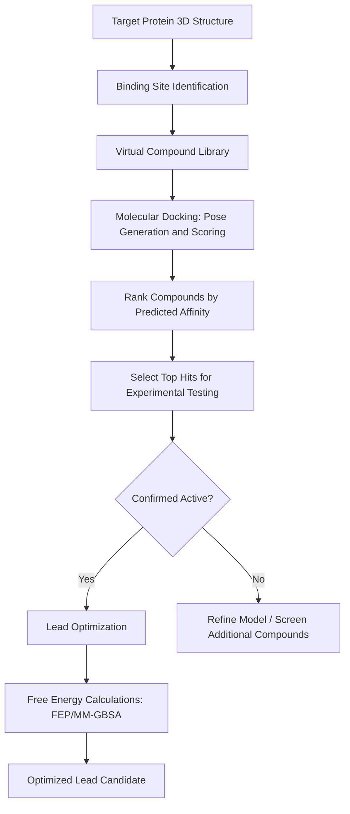
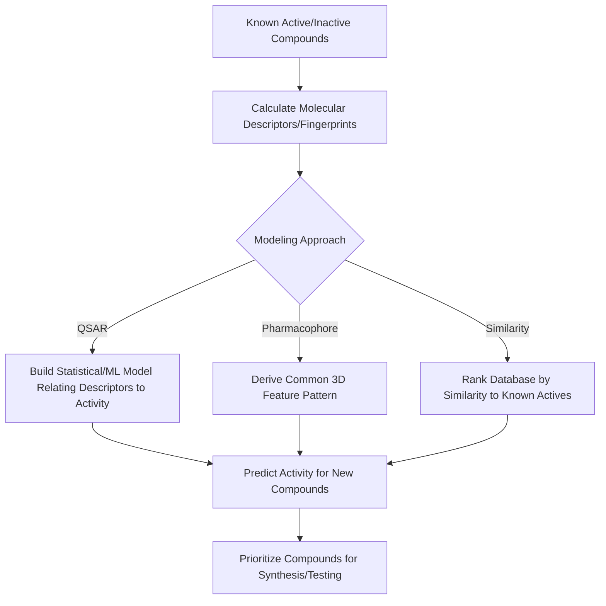
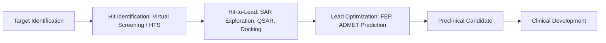

## Computational Approaches to Drug Design

### Overview

Computer-aided drug design (CADD) applies computational chemistry, molecular modeling, and data science techniques to accelerate and de-risk the drug discovery process — from identifying promising chemical starting points through lead optimization. CADD methods are broadly divided into **structure-based** approaches (using knowledge of the target's 3D structure) and **ligand-based** approaches (using knowledge of known active/inactive compounds without requiring target structure).

### Structure-Based vs. Ligand-Based Drug Design

| Approach | Requires | Core Strategy |
| --- | --- | --- |
| Structure-based drug design (SBDD) | 3D structure of target (X-ray, cryo-EM, homology model) | Model direct physical interaction between ligand and binding site |
| Ligand-based drug design (LBDD) | Set of known active/inactive compounds | Infer structure-activity relationships from existing ligand data, without requiring target structure |

### Structure-Based Drug Design (SBDD)

#### 1. Molecular Docking

Molecular docking predicts the preferred orientation (**pose**) of a small molecule ligand within a target protein's binding site and estimates the strength of the interaction.

**Key Points**

- **Search algorithm**: Explores possible ligand positions, orientations, and conformations within the binding site (e.g., genetic algorithms, incremental construction, systematic search).
- **Scoring function**: Estimates the binding affinity or "goodness" of each pose, typically combining terms for van der Waals interactions, electrostatics, hydrogen bonding, and desolvation, calibrated against experimental binding data.
- **Rigid vs. flexible docking**: Early docking methods treated the receptor as rigid; modern methods increasingly allow some degree of receptor side-chain (or even backbone) flexibility to better capture induced-fit binding effects.
- Docking is primarily used for **virtual screening** (ranking large compound libraries to prioritize candidates for experimental testing) and **pose prediction** (understanding how a known active compound binds).

#### 2. Virtual Screening

**Key Points**

- **Structure-based virtual screening (SBVS)**: Docks a large virtual compound library against the target structure, ranking compounds by predicted binding score to prioritize a manageable subset for experimental testing.
- **Ligand-based virtual screening (LBVS)**: Uses similarity to known active compounds (via fingerprints, pharmacophores, or machine learning models) to filter large libraries without requiring target structure.
- Virtual screening dramatically reduces the experimental burden of screening a chemical library, though computational hit rates and enrichment vary substantially depending on target druggability, method choice, and library composition.

#### 3. Binding Free Energy Calculations

More rigorous (and computationally expensive) methods estimate binding free energy using physics-based sampling rather than a simplified scoring function.

**Key Points**

- **Free Energy Perturbation (FEP)** and **Thermodynamic Integration (TI)**: "Alchemical" methods that compute the free energy difference between two closely related ligands (or between bound and unbound states) via a series of intermediate, non-physical states, using molecular dynamics sampling at each step.
- **MM-PBSA/MM-GBSA**: Approximate free energy methods combining molecular mechanics energies with continuum solvation models (Poisson-Boltzmann or Generalized Born), offering a computationally cheaper (but generally less accurate) alternative to full alchemical FEP/TI.
- These methods are typically applied later in a drug discovery campaign (lead optimization) on a smaller, more focused set of compounds, since they are far more computationally expensive than docking-based scoring.

### Structure-Based Drug Design Workflow

### Ligand-Based Drug Design (LBDD)

#### 1. Quantitative Structure-Activity Relationship (QSAR)

**Key Points**

- QSAR models establish a mathematical relationship between molecular descriptors (physicochemical, structural, or topological properties) and biological activity, enabling prediction of activity for new, untested compounds.
- **2D-QSAR**: Uses descriptors derived from 2D molecular structure (molecular weight, logP, topological indices, counts of functional groups).
- **3D-QSAR** (e.g., CoMFA, CoMSIA): Incorporates 3D molecular fields (steric, electrostatic) aligned across a series of compounds to build predictive spatial models of activity.
- Model validation (e.g., cross-validation, external test sets) is essential, since QSAR models are only reliable within the **applicability domain** defined by the chemical space of the training set.

#### 2. Pharmacophore Modeling

**Key Points**

- A **pharmacophore** is an abstract representation of the essential spatial arrangement of chemical features (hydrogen bond donors/acceptors, hydrophobic regions, aromatic rings, charged groups) required for biological activity.
- Pharmacophore models can be derived either from a set of known active ligands (ligand-based) or from analysis of a target binding site (structure-based).
- Once established, a pharmacophore model can be used to screen compound databases for molecules matching the required feature arrangement, independent of exact chemical scaffold — enabling **scaffold hopping** to structurally novel chemotypes with similar predicted activity.

#### 3. Similarity Searching and Clustering

**Key Points**

- Molecular fingerprint-based similarity searching (e.g., Tanimoto similarity) identifies compounds structurally similar to a known active, based on the principle that structurally similar molecules often share similar biological activity.
- **Compound clustering** (grouping a library into structurally related clusters) supports diverse library design and helps ensure chemical diversity is represented when selecting compounds for screening.

### Ligand-Based Drug Design Workflow

### Binding Site and Interaction Diagram (svg_diagram)

<svg xmlns="http://www.w3.org/2000/svg" viewBox="0 0 520 260" font-family="sans-serif">
\<style\>
.protein{fill:#eef3fb;stroke:#33557a;stroke-width:2;}
.ligand{fill:#c0392b;}
.hbond{stroke:#2e7d32;stroke-width:1.5;stroke-dasharray:3,2;}
.txt{font-size:12px;fill:#1a1a1a;text-anchor:middle;}
.title{font-size:14px;font-weight:bold;fill:#1a1a1a;text-anchor:middle;}
\</style\>
<text x="260" y="20" class="title">Ligand Binding to Protein Pocket (svg_diagram)</text>
<path d="M 80 60 C 20 60, 20 220, 100 220 L 380 220 C 460 220, 460 60, 400 60 C 350 90, 250 40, 200 90 C 150 60, 120 90, 80 60 Z" class="protein" />
<polygon points="230,110 260,100 280,120 270,150 240,155 220,135" class="ligand" />
<line x1="240" y1="105" x2="220" y2="80" class="hbond" />
<line x1="270" y1="150" x2="290" y2="180" class="hbond" />
<text x="260" y="240" class="txt">Ligand (red) docked within binding pocket, hydrogen bonds (green dashed)</text>
</svg>

### Machine Learning and AI in Drug Design

**Key Points**

- **Predictive property models**: Machine learning models (random forests, gradient boosting, neural networks) trained on molecular descriptors or fingerprints predict properties such as binding affinity, solubility, toxicity, and metabolic stability.
- **Generative molecular design**: Deep generative models (variational autoencoders, generative adversarial networks, diffusion-based models) propose novel molecular structures optimized for desired property profiles, an active area of ongoing methodological development.
- **Graph neural networks (GNNs)**: Represent molecules as graphs (atoms as nodes, bonds as edges) for property prediction, often achieving strong performance without requiring hand-crafted descriptors.
- **Protein structure prediction**: Deep learning-based structure prediction methods have substantially expanded the availability of predicted protein structures for targets lacking experimental structures, extending the applicability of structure-based methods to previously "undruggable" or structurally uncharacterized targets.
- [Inference] The relative performance of specific machine learning architectures for particular drug design tasks is an active and rapidly evolving research area; current comparative benchmarks should be checked against up-to-date literature rather than treated as fixed conclusions.

### ADMET Prediction

**Key Points**

- Beyond target binding, successful drug candidates must have acceptable **ADMET** properties (Absorption, Distribution, Metabolism, Excretion, Toxicity).
- Computational ADMET prediction tools estimate properties such as oral bioavailability, blood-brain barrier permeability, cytochrome P450 metabolism liability, and potential toxicity (e.g., hERG channel binding associated with cardiotoxicity risk) early in the design process, helping to deprioritize compounds likely to fail later in development.
- Early-stage computational ADMET filtering aims to reduce costly late-stage attrition, though computational predictions carry inherent uncertainty and are typically used alongside, not as a replacement for, experimental ADMET assays.

### The Drug Discovery Funnel and Role of CADD

### Key Computational Considerations and Limitations

**Key Points**

- **Scoring function accuracy**: Docking scoring functions are simplified approximations and often show limited correlation with experimental binding affinity across diverse chemical series; docking is generally more reliable for pose prediction and relative ranking within a congeneric series than for absolute affinity prediction.
- **Protein flexibility**: Many target proteins undergo conformational changes upon ligand binding (induced fit) that are challenging to fully capture with a single static structure, motivating ensemble docking or MD-based approaches.
- **Water molecules in binding sites**: Ordered water molecules can play critical roles in ligand binding (bridging hydrogen bonds, displacement upon binding), and their treatment (explicit inclusion, displacement modeling) is an important and sometimes underappreciated modeling consideration.
- **Model validation**: Both structure-based and ligand-based models require rigorous validation against experimental data (retrospective validation on known actives/inactives, prospective validation on new compounds) before being trusted for decision-making in a drug discovery program.

### Worked Example

**Problem**: A docking-based virtual screen of 500,000 compounds selects the top 0.1% highest-scoring compounds for experimental testing. If the experimental hit rate (fraction of tested compounds showing genuine activity) among these top-scoring compounds is 8%, and a comparable random selection from the full library would be expected to have a hit rate of 0.5%, calculate the **enrichment factor**.

**Solution**:

Number of compounds selected: $500{,}000 \times 0.001 = 500$ compounds

$$\text{Enrichment Factor} = \frac{\text{Hit rate in selected set}}{\text{Hit rate in random selection}} = \frac{0.08}{0.005} = 16$$

**Conclusion**: The virtual screening approach achieved a 16-fold enrichment of active compounds relative to random selection, meaning experimental resources are used far more efficiently by prioritizing computationally predicted top-ranking compounds rather than testing the library at random.

**Conclusion**

Computational approaches to drug design integrate structure-based methods (docking, free energy calculations) and ligand-based methods (QSAR, pharmacophore modeling, similarity searching) to prioritize and optimize chemical matter throughout the drug discovery pipeline. Increasingly, machine learning and generative modeling are augmenting these traditional physics-based approaches, though rigorous experimental validation remains essential given the approximations inherent in all computational prediction methods.

- [Inference] The specific accuracy, throughput, and cost-effectiveness of any given CADD method for a particular drug discovery program depends heavily on target characteristics, data availability, and validation rigor, and should be assessed against current, target-specific benchmarking rather than generalized expectations.

**Next Steps**

- Free energy perturbation (FEP) methodology and practical alchemical calculation setup
- Pharmacophore modeling: ligand-based vs. structure-based derivation methods
- Machine learning for ADMET prediction and generative molecular design
- Fragment-based drug design and fragment growing/linking strategies
- Protein structure prediction methods and their integration into structure-based drug design
- QSAR model validation: applicability domain and statistical validation metrics