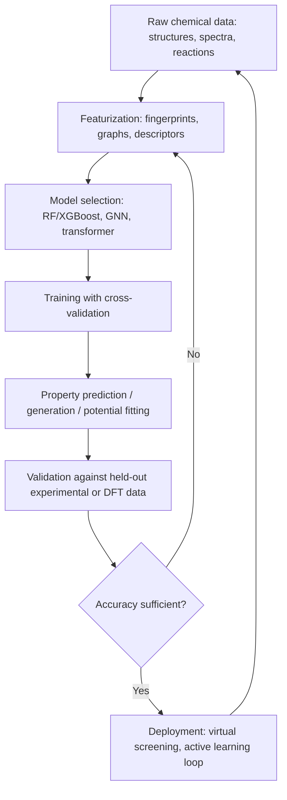

## Machine Learning Applications in Chemistry


### Overview

Machine learning (ML) in chemistry applies statistical learning algorithms to chemical data—molecular structures, spectra, reaction outcomes, and simulation results—to predict properties, accelerate discovery, and model systems too complex for traditional first-principles methods alone. The field sits at the intersection of cheminformatics, computational chemistry, and data science.

**Key Points**

- ML models learn mappings from molecular representations to target properties (energy, toxicity, solubility, reactivity)
- Training data typically comes from experimental databases, quantum chemistry calculations (DFT, ab initio), or high-throughput screening
- Model quality depends critically on molecular representation (featurization) and dataset size/diversity
- ML complements rather than replaces physics-based methods; hybrid ML/physics approaches are increasingly standard

### Molecular Representations (Featurization)

Before any ML algorithm can operate on a molecule, it must be converted into a numerical format.

#### Fingerprints

Fixed-length bit vectors encoding substructural features.

- **Morgan/ECFP (Extended-Connectivity Fingerprints)**: circular fingerprints built by iteratively hashing atom environments out to a radius $r$. Commonly used at ECFP4/ECFP6 (radius 2/3).
- **MACCS keys**: 166 predefined structural keys (presence/absence of specific substructures).
- **Topological fingerprints (e.g., RDKit's own)**: path-based bit vectors.

Fingerprints are fast, interpretable to a degree, and work well with classical ML (random forests, SVMs).

#### SMILES and String-Based Representations

SMILES (Simplified Molecular Input Line Entry System) strings encode molecular graphs as text, e.g., ethanol as `CCO`. These can be fed to sequence models (RNNs, transformers) for generative and predictive tasks. Limitations include non-uniqueness (multiple valid SMILES per molecule, mitigated by canonicalization) and lack of explicit 3D information.

#### Graph-Based Representations

Molecules are naturally graphs: atoms as nodes, bonds as edges. This motivates **Graph Neural Networks (GNNs)**, which learn representations directly from molecular graphs without hand-crafted features.

- **Message Passing Neural Networks (MPNNs)**: nodes iteratively aggregate information from neighbors.
- **Graph Convolutional Networks (GCNs)**, **Graph Attention Networks (GATs)**: variants with different neighbor-aggregation schemes.

#### 3D/Geometric Descriptors

For properties dependent on conformation (binding affinity, reaction energetics):

- Coulomb matrices, encoding pairwise nuclear charges and distances
- Symmetry functions (Behler-Parrinello descriptors) used in neural network potentials
- $E(3)$-equivariant representations (e.g., used in models like NequIP, MACE) that respect rotational/translational symmetry of 3D space

### Core Application Areas

#### 1. Property Prediction (QSAR/QSPR)

Quantitative Structure-Activity/Property Relationship models predict a target property $y$ from molecular descriptors $\mathbf{x}$:

$$y = f(\mathbf{x}) + \epsilon$$

Applications: predicting solubility, $\log P$ (lipophilicity), boiling point, toxicity, bioactivity. Classical approaches use random forests or gradient-boosted trees (XGBoost) on fingerprints; deep learning approaches use GNNs directly on molecular graphs.

#### 2. Reaction Prediction and Retrosynthesis

- **Forward reaction prediction**: given reactants and conditions, predict products. Framed as sequence-to-sequence (SMILES-to-SMILES translation using transformers) or graph-edit prediction problems.
- **Retrosynthesis**: given a target molecule, predict plausible precursor reactions—framed as a search problem guided by ML-scored reaction templates or template-free generative models.

#### 3. Molecular Generation (De Novo Design)

Generative models propose novel molecules with desired properties.

- **Variational Autoencoders (VAEs)**: encode molecules into a continuous latent space; sampling and decoding produces new candidates.
- **Generative Adversarial Networks (GANs)**: generator/discriminator pairs trained adversarially on molecular graphs or SMILES.
- **Reinforcement learning**: an agent modifies/builds molecules step-by-step, rewarded by a property-prediction oracle (useful for multi-objective optimization, e.g., high potency + low toxicity + synthesizability).
- **Diffusion models**: increasingly used for 3D molecule generation, iteratively denoising random coordinates into valid structures.

#### 4. Machine-Learned Interatomic Potentials (MLIPs)

MLIPs approximate the potential energy surface (PES) that would otherwise require expensive quantum mechanical calculation, enabling molecular dynamics (MD) at near-DFT accuracy but at a fraction of the computational cost.

- **Behler-Parrinello Neural Network Potentials**: use symmetry functions as input to per-atom neural networks, energies summed to total energy.
- **Gaussian Approximation Potentials (GAP)**: Gaussian process regression on smooth overlap of atomic positions (SOAP) descriptors.
- **Message-passing/equivariant potentials**: SchNet, NequIP, MACE, and similar architectures that learn energies and forces directly from atomic graphs, respecting physical symmetries.

The core training objective typically fits both energies and forces:

$$\mathcal{L} = \lambda_E \left(E_{\text{pred}} - E_{\text{ref}}\right)^2 + \lambda_F \sum_i \left\| \mathbf{F}_i^{\text{pred}} - \mathbf{F}_i^{\text{ref}} \right\|^2$$

where $\mathbf{F}_i = -\nabla_{\mathbf{r}_i} E$.

#### 5. Spectral Prediction and Structure Elucidation

ML models predict NMR chemical shifts, IR spectra, or mass spectra from structure (forward problem), or infer structure from spectra (inverse problem)—useful for automated structure elucidation pipelines.

#### 6. Catalysis and Materials Screening

High-throughput virtual screening combines DFT-derived training data with ML surrogate models to rapidly evaluate catalyst or materials candidates (e.g., predicting adsorption energies on catalytic surfaces), reducing the combinatorial search space before expensive experimental or high-fidelity computational validation.

### Representative Workflow



### Example: Simple QSAR Pipeline (Conceptual)

```python
from rdkit import Chem
from rdkit.Chem import AllChem
from sklearn.ensemble import RandomForestRegressor
import numpy as np

def featurize(smiles_list, radius=2, n_bits=2048):
    fps = []
    for smi in smiles_list:
        mol = Chem.MolFromSmiles(smi)
        fp = AllChem.GetMorganFingerprintAsBitVect(mol, radius, nBits=n_bits)
        fps.append(np.array(fp))
    return np.array(fps)

# X: fingerprints, y: experimental property (e.g., solubility, logS)
X_train = featurize(train_smiles)
model = RandomForestRegressor(n_estimators=500, random_state=42)
model.fit(X_train, y_train)

predictions = model.predict(featurize(test_smiles))
```

This pattern (fingerprint → classical regressor) remains a strong, interpretable baseline even against deep learning approaches on small-to-medium datasets.

### Key Challenges

- **Data scarcity and quality**: experimental chemical datasets are often small (hundreds to thousands of points) relative to typical deep learning requirements, and may contain measurement noise or inconsistent conditions across sources.
- **Extrapolation**: models trained on one chemical space (e.g., drug-like molecules) generalize poorly to structurally distant regions (e.g., novel scaffolds).
- **Synthesizability**: generative models can propose molecules that are difficult or impossible to synthesize; synthesizability scoring (e.g., SAScore) is often incorporated as a filter or reward term.
- **Interpretability**: deep models (GNNs, transformers) are less interpretable than classical QSAR descriptors, which matters in regulated domains like drug approval.
- **Active learning and uncertainty quantification**: because labeled data (often DFT or experiment) is expensive to generate, workflows increasingly use model uncertainty estimates to select which new data points to compute/measure next, maximizing information gain per unit cost.

[Inference] Equivariant GNN-based interatomic potentials (e.g., MACE, NequIP-family models) currently represent the state of the art in accuracy-per-training-sample for molecular and materials simulation, though the specific best-performing architecture for a given system depends on the chemistry involved and continues to shift as new methods are published.

### Related Topics

- Graph Neural Networks: architecture details (message passing, attention mechanisms)
- Density Functional Theory (DFT) as a data source for ML training
- Active learning strategies in computational chemistry
- Cheminformatics descriptors and molecular fingerprints in depth
- Generative models for de novo drug design
- Uncertainty quantification in scientific ML (ensembles, Gaussian processes, conformal prediction)
- High-throughput virtual screening pipelines
- Transfer learning and pretraining strategies for small chemical datasets