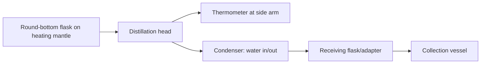

## Common Laboratory Equipment and Glassware

### Overview

Chemistry laboratory work depends on a standardized set of glassware and equipment, each designed for specific functions: containment, measurement, heating, separation, and manipulation of chemical substances. Correct selection and use directly affects experimental accuracy, safety, and reproducibility.

### Volumetric Glassware (Measurement)

Glassware calibrated for measuring liquid volumes, ranked by precision from lowest to highest.

#### Beakers

Cylindrical containers with a pour spout, used for mixing, heating, and rough volume estimation. Graduations are approximate (±5–10%), not suitable for precise measurement.

#### Erlenmeyer (Conical) Flasks

Narrow-necked, wide-based flasks that reduce evaporation and splashing—ideal for titrations (allows swirling without spillage) and boiling liquids.

#### Graduated Cylinders

Tall, narrow cylinders with fine graduation marks for moderately precise volume measurement (±1%), more accurate than beakers but less than volumetric glassware.

#### Volumetric Flasks

Pear-shaped flasks with a single calibration line on a long, narrow neck, designed to contain (TC) a precise volume at a specified temperature. Used for preparing standard solutions of exact concentration.

#### Pipettes

- **Volumetric (transfer) pipettes**: single-volume, high-precision (±0.1%), used to deliver (TD) a fixed volume.
- **Graduated (Mohr) pipettes**: multiple graduation marks, moderate precision, variable delivery volumes.
- **Micropipettes**: adjustable-volume, spring-loaded, for microliter-scale liquid handling (common in biochemistry/analytical work).

#### Burettes

Long, graduated tubes with a stopcock at the base, used to dispense precisely measured, variable volumes of liquid—essential for titration.

**Key Points**

- TC (To Contain) vs. TD (To Deliver) markings indicate whether the glassware accounts for residual liquid clinging to the walls
- Precision hierarchy (lowest to highest): beaker < graduated cylinder < graduated pipette < volumetric pipette ≈ volumetric flask ≈ burette
- Always read the meniscus at eye level, at the bottom of the curve for most aqueous solutions

### Reaction and Containment Vessels

#### Test Tubes

Small cylindrical tubes for small-scale reactions, qualitative tests, and heating small samples directly over a flame (with care).

#### Round-Bottom Flasks

Spherical flasks designed for even heat distribution, commonly used with heating mantles or oil baths in reflux and distillation setups. The round shape resists cracking under thermal stress compared to flat-bottomed vessels.

#### Boiling Flasks / Florence Flasks

Round-bottomed, long-necked flasks used for boiling liquids, often paired with a stand rather than direct heating.

#### Watch Glasses

Curved glass discs used to cover beakers (preventing evaporation/contamination), hold small solid samples, or evaporate small liquid volumes.

#### Crucibles

Heat-resistant (often ceramic or porcelain) small containers for high-temperature reactions, ignition, or gravimetric analysis, since they can withstand direct flame or furnace temperatures beyond what glass tolerates.

### Separation and Filtration Equipment

#### Funnels

- **Standard (conical) funnels**: for pouring liquids and simple gravity filtration with filter paper
- **Büchner funnels**: flat-bottomed funnels with a perforated plate, used with vacuum filtration (paired with a Büchner/side-arm flask and vacuum source) for faster filtration
- **Separatory funnels**: pear-shaped, with a stopcock, used to separate immiscible liquid layers (liquid-liquid extraction) by density difference

#### Büchner (Side-Arm/Filter) Flasks

Thick-walled flasks with a side arm connected to vacuum, used with Büchner funnels for vacuum filtration.

#### Condensers

Glass tubes with a water jacket (or air-cooled variants) used to cool and condense vapor back into liquid during distillation or reflux.

- **Liebig condenser**: straight tube, common general-purpose type
- **Graham (coil) condenser**: spiral inner tube, greater surface area
- **Allihn (bulb) condenser**: bulbed constrictions, typically used for reflux rather than distillation

### Heating and Temperature Control Equipment

#### Bunsen Burners

Gas burners producing an adjustable flame via an air-intake collar controlling the fuel-air mixture; used for general heating, flame tests, and sterilization.

#### Hot Plates and Heating Mantles

Electric alternatives to open flame. Heating mantles conform to round-bottom flask shapes for even heat distribution and are preferred for flammable solvents.

#### Water Baths and Oil Baths

Provide gentler, more uniform, and controllable heating than direct flame—water baths for temperatures up to ~100°C, oil baths for higher temperatures.

#### Thermometers

Measure temperature; laboratory thermometers are typically mercury/alcohol-filled or digital, with a range and precision suited to the application (e.g., -10°C to 250°C for general organic chemistry).

### Support and Holding Equipment

#### Ring Stands (Retort Stands) and Clamps

Metal stands with adjustable clamps (buret clamps, three-finger clamps) used to hold glassware securely at a fixed height during setups like titration or distillation.

#### Wire Gauze and Iron Rings

Wire gauze (often ceramic-centered) distributes heat evenly under a beaker or flask placed on an iron ring attached to a ring stand, protecting glassware from direct flame damage (thermal shock).

#### Test Tube Racks and Holders

Racks for organizing multiple test tubes; tongs/holders for handling hot test tubes.

### Measurement and Analytical Instruments

#### Analytical Balances

Measure mass with high precision (typically ±0.0001 g), housed in a draft shield to minimize air-current interference. Distinguished from top-loading balances, which offer lower precision (±0.01 g) but higher capacity and are less sensitive to environmental disturbance.

#### pH Meters

Electrochemical instruments measuring hydrogen ion activity via a glass electrode, requiring calibration against standard buffer solutions before use.

#### Spectrophotometers

Measure absorbance/transmittance of light through a sample at specified wavelengths, used in quantitative analysis via Beer-Lambert law:

$$A = \varepsilon \cdot l \cdot c$$

where $A$ is absorbance, $\varepsilon$ is the molar absorptivity, $l$ is path length, and $c$ is concentration.

### Personal Protective Equipment (PPE) and Safety Apparatus

- **Safety goggles**: chemical splash protection (mandatory in nearly all wet-lab settings)
- **Lab coats/aprons**: body and clothing protection from spills
- **Gloves**: chemical-resistant (nitrile, latex) for handling reagents
- **Fume hoods**: ventilated enclosures for working with volatile, toxic, or noxious substances
- **Eyewash stations and safety showers**: emergency response equipment for chemical exposure
- **Fire extinguishers and fire blankets**: for fire suppression appropriate to chemical fire classes

### Common Setup: Simple Distillation (Illustrative Diagram)

### Glassware Material Notes

Most laboratory glassware is made of **borosilicate glass** (e.g., Pyrex, Duran), chosen for:

- Low coefficient of thermal expansion, providing strong resistance to thermal shock
- Chemical inertness to most acids, bases, and solvents
- Mechanical strength relative to soda-lime glass

[Inference] Soda-lime glass is occasionally used for basic containers (e.g., some reagent bottles) where thermal shock resistance is not required, since it is cheaper to produce than borosilicate glass, though modern lab-grade glassware is overwhelmingly borosilicate by default.

### Safety and Handling Considerations

- Always inspect glassware for cracks or chips before use (stressed glass can shatter under heating or vacuum)
- Never heat sealed/closed systems (pressure buildup risk)
- Allow glassware to cool before washing (thermal shock from rapid temperature change)
- Use appropriate clamps rather than hand-holding for heated or vacuum setups

### Related Topics

- Titration technique and endpoint detection
- Vacuum filtration procedure and troubleshooting
- Distillation types (simple, fractional, steam, vacuum)
- Calibration procedures for volumetric glassware and balances
- Proper technique for reading a meniscus and avoiding parallax error
- Laboratory safety protocols and chemical hazard classification (GHS)
- Liquid-liquid extraction technique using separatory funnels