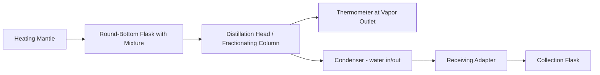
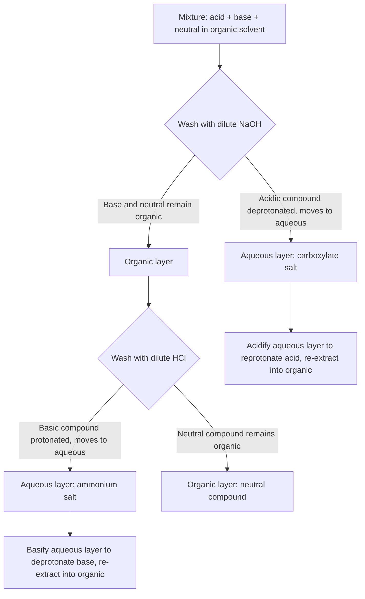

## Separation Techniques: Distillation and Extraction

### Overview

Separation techniques exploit differences in physical or chemical properties—boiling point, polarity, solubility, particle size, density—to isolate components from a mixture. Distillation and extraction are two of the most widely used methods, forming the backbone of purification workflows in both academic laboratories and industrial chemical processing.

### Underlying Principles

**Key Points**

- Separation is possible only when components differ in at least one measurable physical property
- Distillation exploits differences in **volatility** (vapor pressure/boiling point)
- Extraction exploits differences in **solubility/partition coefficient** between two immiscible phases
- Both techniques are non-destructive in the sense that the chemical identity of components is preserved (unlike a chemical reaction-based separation)

### Distillation

#### Theoretical Basis

Distillation separates liquids based on differences in boiling points. When a liquid mixture is heated, the vapor produced is enriched in the more volatile component, per Raoult's Law for ideal mixtures:

$$P_{total} = x_A P_A^{\circ} + x_B P_B^{\circ}$$

where $P_A^{\circ}$ and $P_B^{\circ}$ are the pure-component vapor pressures and $x_A$, $x_B$ are mole fractions in the liquid phase.

The relative volatility $\alpha$ governs separability:

$$\alpha_{AB} = \frac{P_A^{\circ}}{P_B^{\circ}}$$

A larger $\alpha$ (further from 1) means easier separation by distillation.

#### Types of Distillation

**Simple Distillation**

- Used when boiling points differ by more than ~25°C
- Single equilibration between liquid and vapor
- Setup: round-bottom flask, heating mantle, thermometer, condenser, receiving flask
- Not effective for close-boiling mixtures or azeotropes

**Fractional Distillation**

- Used when boiling points differ by less than ~25°C
- Employs a fractionating column packed with surface area (Raschig rings, glass beads, or a Vigreux column) that provides repeated vaporization-condensation cycles, each acting like a theoretical plate
- More theoretical plates → sharper separation (described by the McCabe-Thiele method in industrial contexts)
- Industrial example: petroleum refining towers separating crude oil into fractions (gasoline, kerosene, diesel, etc.)

**Vacuum Distillation**

- Reduces system pressure to lower the boiling point of components
- Used for thermally sensitive/high-boiling compounds that would decompose at atmospheric-pressure boiling points
- Relationship approximated by the Clausius-Clapeyron equation:

$$\ln\left(\frac{P_2}{P_1}\right) = -\frac{\Delta H_{vap}}{R}\left(\frac{1}{T_2}-\frac{1}{T_1}\right)$$

**Steam Distillation**

- Co-distills a volatile, water-immiscible compound with steam at a temperature below either pure component's boiling point
- Total pressure equals the sum of the two partial vapor pressures, so boiling occurs when $P_{water} + P_{compound} = P_{atm}$
- Common in essential oil extraction (e.g., isolating eugenol from cloves) and purifying heat-sensitive natural products

**Azeotropic Distillation**

- Addresses azeotropes—mixtures whose vapor and liquid compositions are identical at a given composition, making further separation by ordinary distillation impossible
- Classic example: ethanol-water forms a minimum-boiling azeotrope at ~95.6% ethanol by mass, boiling at 78.2°C (lower than either pure component)
- Resolved industrially via entrainer addition (e.g., benzene or cyclohexane, historically), pressure-swing distillation, or molecular sieves

#### Standard Apparatus Diagram

#### Practical Considerations

- **Boiling chips/stones** prevent bumping (violent, uneven boiling) by providing nucleation sites
- Thermometer bulb placement matters: it should sit at the level of the side-arm opening to accurately read the temperature of vapor entering the condenser, not the liquid temperature
- Collecting fractions in separate receiving flasks based on distinct boiling-point plateaus improves purity
- [Inference] In student laboratory settings, incomplete column equilibration and non-ideal heat loss commonly reduce the effective number of theoretical plates below the column's rated value

### Extraction

#### Theoretical Basis

Extraction separates a solute from a mixture by transferring it into a second, immiscible solvent phase in which it is more soluble. The distribution is governed by the **partition coefficient** ($K_D$ or $K$):

$$K_D = \frac{[\text{solute}]_{organic}}{[\text{solute}]_{aqueous}}$$

#### Liquid-Liquid Extraction

- Most common form: uses a separatory funnel to partition a solute between an aqueous phase and an immiscible organic solvent (e.g., diethyl ether, dichloromethane, ethyl acetate)
- **Multiple smaller extractions are more efficient than one large extraction** for a fixed total solvent volume, because equilibrium is re-established each time

For $n$ successive extractions with volume $V_{org}$ each, the fraction of solute remaining in the aqueous phase ($V_{aq}$) is:

$$\text{fraction remaining} = \left(\frac{K_D V_{aq}}{K_D V_{aq} + V_{org}}\right)^n$$

**Example**

A solute has $K_D = 5$ (favoring organic phase). Starting with 100 mL aqueous solution:

- One extraction with 100 mL organic solvent leaves $\frac{100}{100+500} = 16.7\%$ in the aqueous phase
- Two extractions with 50 mL each leave $\left(\frac{100}{100+250}\right)^2 \approx 8.2\%$ in the aqueous phase

  This demonstrates why "3 x 50 mL" extractions outperform "1 x 150 mL" for the same total solvent.

#### Acid-Base (Selective) Extraction

Exploits the fact that ionized (charged) species are water-soluble while neutral species favor organic solvents. This allows selective separation of compounds by class:

This technique is a cornerstone of natural product isolation and reaction workup in organic synthesis.

#### Other Extraction Modalities

**Solid-Liquid Extraction**

- Solute is extracted from a solid matrix using a solvent
- Example: Soxhlet extraction, which continuously cycles fresh condensed solvent through a solid sample, useful for compounds with low solubility requiring prolonged contact

**Solid-Phase Extraction (SPE)**

- Sample passed through a cartridge packed with a stationary phase (e.g., C18-silica); target analytes selectively retained or eluted
- Common in analytical sample preparation and environmental/forensic chemistry

**Supercritical Fluid Extraction (SFE)**

- Uses a supercritical fluid (commonly CO₂ above its critical point, 31.1°C and 7.39 MPa) as the extraction solvent
- Advantages: tunable solvent power via pressure/temperature, no toxic solvent residue, easy solvent removal by depressurization
- Industrial application: decaffeination of coffee, essential oil extraction

### Comparing Distillation and Extraction

| Aspect | Distillation | Extraction |
| --- | --- | --- |
| Basis of separation | Volatility (boiling point) | Solubility/partition coefficient |
| Phases involved | Liquid ⇌ vapor | Two immiscible liquids (or solid-liquid) |
| Typical apparatus | Distillation flask, condenser | Separatory funnel |
| Best suited for | Liquids with differing volatility | Solutes with differing polarity/solubility |
| Common failure mode | Azeotrope formation | Emulsion formation |

### Common Complications and Troubleshooting

**Key Points**

- **Bumping** in distillation: prevented using boiling chips or stir bars; never add boiling chips to an already-hot liquid (can cause sudden violent boiling)
- **Emulsions** in extraction: occur when two phases fail to separate cleanly, often due to surfactant-like impurities or vigorous shaking; addressed by gentle swirling, adding saturated NaCl (salting out), gravity filtration, or centrifugation
- **Azeotrope misidentification**: observing a constant boiling point during fractional distillation does not always indicate purity—it may indicate an azeotrope
- [Inference] Emulsion tendency is generally more pronounced with solvents of intermediate polarity and mixtures containing amphiphilic impurities, though the extent varies significantly by system

### Worked Example: Reaction Workup

**Example**

After an organic synthesis reaction in dichloromethane (DCM) containing product, unreacted carboxylic acid starting material, and inorganic salts:

1. Wash the DCM layer with water to remove inorganic salts and highly polar impurities
2. Wash with saturated NaHCO₃ (mild base) to deprotonate and extract the carboxylic acid into the aqueous phase (avoiding stronger NaOH, which might hydrolyze sensitive functional groups)
3. Dry the organic layer over anhydrous MgSO₄ or Na₂SO₄ to remove residual water
4. Filter and concentrate under reduced pressure (rotary evaporation) to isolate the product
5. If further purification is needed, proceed to distillation (if volatile/liquid) or recrystallization/chromatography (if solid)

### Related Topics

- Chromatography (TLC, column, GC, HPLC) as complementary/alternative separation methods
- Recrystallization for solid purification
- Rotary evaporation and solvent removal techniques
- Azeotropic behavior and non-ideal solutions (Dalton's and Raoult's Law deviations)
- Green chemistry solvent selection and supercritical CO₂ applications
- Countercurrent distribution and industrial multistage extraction design