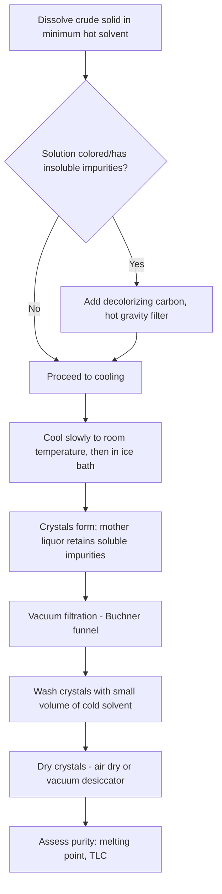

## Purification and Recrystallization

### Overview

Recrystallization is a purification technique that exploits differences in solubility as a function of temperature to separate a desired compound from impurities. It is one of the most common methods for purifying solid organic and inorganic compounds and typically serves as a final polishing step after a reaction workup or initial isolation.

### Theoretical Basis

**Key Points**

- Relies on the principle that most solids become more soluble in a given solvent as temperature increases
- A compound is dissolved in a minimum volume of hot solvent, then the solution is cooled slowly, causing the solute to become supersaturated and crystallize out
- Impurities present in small amounts remain dissolved in the mother liquor because their concentration never reaches their own solubility threshold
- Purity improvement arises because crystal lattice formation favors incorporation of a single, geometrically consistent molecule; impurity molecules are excluded from the growing lattice

### Solvent Selection Criteria

An ideal recrystallization solvent must satisfy several criteria simultaneously:

1. Compound is **highly soluble at high temperature (near boiling point)** but **poorly soluble at low temperature**
2. Impurities are either highly soluble at all temperatures (stay in solution) or highly insoluble at all temperatures (removed by hot filtration)
3. Solvent does not react chemically with the solute
4. Reasonably low boiling point for ease of removal, and a boiling point below the compound's melting point (to avoid oiling out)
5. Low toxicity and cost are practical considerations

**Example**

For a moderately polar organic solid: water, ethanol, and ethanol-water mixtures are common first choices. For nonpolar compounds: hexane, toluene, or petroleum ether may be tested.

#### Solvent Pair Method

When no single solvent satisfies all criteria, a **mixed solvent system** is used:

- Solvent A: dissolves the compound readily even when cold (good solvent)
- Solvent B: compound is poorly soluble in it even hot (poor solvent), and is miscible with Solvent A

Procedure: dissolve the solid in a minimum volume of hot Solvent A, then add hot Solvent B dropwise until the solution turns faintly cloudy (indicating saturation), then add a few more drops of Solvent A to clear the cloudiness before allowing slow cooling.

### Step-by-Step Recrystallization Procedure

### Key Procedural Details

**Dissolving the Solid**

- Use the **minimum amount of hot solvent** necessary; excess solvent lowers yield since more compound remains dissolved in the mother liquor at the final cooling temperature
- Heat solvent to near boiling, add in small portions to the solid with stirring/swirling until it just dissolves

**Hot Filtration (if needed)**

- Removes insoluble impurities (dust, drying agents, polymeric byproducts) and decolorizing carbon
- Performed quickly through pre-heated, fluted filter paper in a stemless funnel to minimize premature crystallization and clogging
- Decolorizing carbon (activated charcoal) adsorbs colored impurities via surface adsorption; used in small quantities since excess can adsorb product too

**Cooling**

- Slow cooling favors formation of larger, purer, well-ordered crystals
- Rapid cooling can trap solvent and impurities within a fine precipitate (not true crystals), lowering purity
- Scratching the flask interior with a glass rod or adding a seed crystal can induce crystallization in a supersaturated solution that fails to nucleate spontaneously

**Vacuum Filtration**

- Buchner funnel with filter paper connected to a vacuum flask and aspirator/vacuum pump
- Separates crystals from the mother liquor rapidly; crystals are rinsed with a small volume of ice-cold solvent to remove surface-adhering mother liquor without redissolving significant product

**Drying**

- Air drying, oven drying (below melting point), or vacuum desiccation over a drying agent (e.g., CaCl₂, silica gel)

### Assessing Purity

**Melting Point Analysis**

- Pure crystalline solids exhibit a **sharp melting point** (typically within a 1-2°C range)
- Impurities generally **lower and broaden** the melting point range, per melting point depression, consistent with colligative property behavior in the solid-liquid phase
- A mixed melting point test (mixing the unknown with an authentic sample) is used to confirm compound identity: no depression indicates a match

**Thin-Layer Chromatography (TLC)**

- A pure compound shows a single spot with a consistent $R_f$ value
- Comparison against the crude (pre-recrystallization) sample demonstrates impurity removal

### Yield Considerations

Recrystallization inherently trades yield for purity because some product remains dissolved in the mother liquor at equilibrium.

**Example**

If a compound has solubility of 2 g/100 mL at 0°C and 20 g/100 mL at 100°C, dissolving 10 g of crude solid in 50 mL of hot solvent and cooling to 0°C leaves approximately 1 g dissolved in the mother liquor (2 g/100 mL × 50 mL), giving a theoretical maximum recovery of about 9 g (90%), assuming no impurity interference.

- Second-crop recovery from concentrating and re-cooling the mother liquor can improve overall yield but typically returns lower-purity material
- [Inference] In practice, mechanical losses during filtration and rinsing typically reduce actual recovery below the solubility-based theoretical maximum

### Related Purification Techniques

**Sublimation**

- Solid transitions directly to vapor and re-deposits as a purified solid, bypassing the liquid phase
- Effective for compounds with high vapor pressure relative to their melting point (e.g., caffeine, naphthalene)

**Recrystallization vs. Chromatography**

| Aspect | Recrystallization | Column Chromatography |
| --- | --- | --- |
| Physical basis | Differential solubility with temperature | Differential adsorption/polarity |
| Typical scale | Gram to multi-gram | Milligram to gram (standard columns) |
| Resolving power | Effective for single major impurity | Effective for closely related compound mixtures |
| Cost/simplicity | Low cost, simple equipment | Requires stationary phase, solvent gradients |

### Common Complications and Troubleshooting

**Key Points**

- **Oiling out**: compound separates as an oily liquid rather than crystals, typically because the solvent's boiling point exceeds the compound's melting point, or cooling occurred too rapidly; addressed by reheating to redissolve the oil, then cooling more slowly, or reformulating solvent choice
- **No crystallization occurs**: may indicate the solution is not sufficiently concentrated, or lacks nucleation sites; addressed by seeding, scratching the flask, or further solvent evaporation
- **Low yield**: often due to using excess solvent during dissolution; minimizing solvent volume is critical
- [Inference] Colored or resinous impurities are more likely to co-precipitate with the product when the crude sample was not adequately hot-filtered beforehand, though the degree of interference is compound-dependent

### Related Topics

- Distillation and liquid-liquid extraction as complementary purification methods
- Melting point determination and phase diagrams
- Thin-layer and column chromatography for polarity-based separation
- Crystal lattice structure and polymorphism
- Solubility product and common-ion effects in inorganic recrystallization