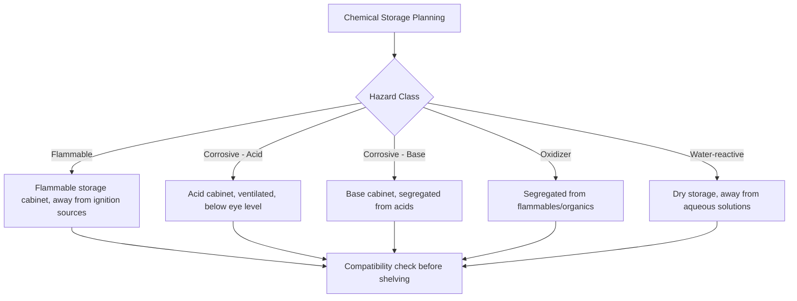

## Chemical Hazard Communication and Safety Practices

### Overview

Chemical hazard communication encompasses the standardized systems, labeling requirements, and documentation used to convey the risks of hazardous substances to workers, students, and emergency responders. Safety practices are the procedural and engineering controls that translate this information into reduced risk of injury, exposure, or environmental release in laboratory and industrial settings.

### The Globally Harmonized System (GHS)

**Key Points**

- GHS is an internationally agreed-upon framework (developed under UN auspices) standardizing the classification and labeling of chemicals across countries
- Adopted into national regulations with local variations (e.g., OSHA's Hazard Communication Standard, HazCom 2012, in the United States; CLP Regulation in the EU)
- Core components: hazard classification criteria, standardized pictograms, signal words, hazard statements, and precautionary statements

#### GHS Pictograms

Nine pictograms represent distinct hazard classes, each a red-bordered diamond containing a black symbol on a white background:

| Pictogram Symbol | Hazard Class |
| --- | --- |
| Flame | Flammables, self-reactives, pyrophorics, organic peroxides |
| Flame over circle | Oxidizers |
| Exploding bomb | Explosives, self-reactives, organic peroxides |
| Gas cylinder | Gases under pressure |
| Corrosion (test tubes/hand) | Skin corrosion/burns, metal corrosivity |
| Skull and crossbones | Acute toxicity (severe) |
| Health hazard (exclamation on chest) | Carcinogenicity, respiratory sensitization, reproductive toxicity |
| Exclamation mark | Irritant, skin sensitizer, acute toxicity (lower severity) |
| Environment (dead fish/tree) | Aquatic toxicity |

#### Signal Words

- **Danger**: used for more severe hazard categories
- **Warning**: used for less severe hazard categories
- Only one signal word appears per label, corresponding to the most severe classification present

#### Sample GHS Label Layout (SVG Diagram)

<svg xmlns="http://www.w3.org/2000/svg" viewBox="0 0 500 320">
<text x="250" y="20" font-size="13" font-weight="bold" text-anchor="middle" fill="#000">GHS Label Layout (svg_diagram)</text>
<rect x="20" y="35" width="460" height="265" fill="none" stroke="#000" stroke-width="2" />
<text x="30" y="55" font-size="12" font-weight="bold" fill="#000">Product Identifier: Acetone, ACS Reagent Grade</text>
<polygon points="60,70 90,100 60,130 30,100" fill="#fff" stroke="#e00" stroke-width="3" />
<text x="60" y="105" font-size="18" text-anchor="middle" fill="#000">🔥</text>
<polygon points="150,70 180,100 150,130 120,100" fill="#fff" stroke="#e00" stroke-width="3" />
<text x="150" y="105" font-size="14" text-anchor="middle" fill="#000">!</text>
<text x="30" y="150" font-size="14" font-weight="bold" fill="#c00">SIGNAL WORD: DANGER</text>
<text x="30" y="175" font-size="11" fill="#000">Hazard Statements:</text>
<text x="35" y="192" font-size="10" fill="#000">H225: Highly flammable liquid and vapor</text>
<text x="35" y="207" font-size="10" fill="#000">H319: Causes serious eye irritation</text>
<text x="35" y="222" font-size="10" fill="#000">H336: May cause drowsiness or dizziness</text>
<text x="30" y="245" font-size="11" fill="#000">Precautionary Statements:</text>
<text x="35" y="262" font-size="10" fill="#000">P210: Keep away from heat/sparks/open flames</text>
<text x="35" y="277" font-size="10" fill="#000">P233: Keep container tightly closed</text>
<text x="30" y="295" font-size="10" fill="#000">Supplier: [Manufacturer Name and Address]</text>
</svg>

### Safety Data Sheets (SDS)

**Key Points**

- Formerly called Material Safety Data Sheets (MSDS); reformatted under GHS into a standardized 16-section structure
- Provides comprehensive information for safe handling, storage, and emergency response

#### The 16 Standard Sections

1. Identification
2. Hazard(s) identification
3. Composition/information on ingredients
4. First-aid measures
5. Fire-fighting measures
6. Accidental release measures
7. Handling and storage
8. Exposure controls/personal protection
9. Physical and chemical properties
10. Stability and reactivity
11. Toxicological information
12. Ecological information
13. Disposal considerations
14. Transport information
15. Regulatory information
16. Other information

**Example**

Before working with a new reagent (e.g., concentrated sulfuric acid), a researcher should consult Section 4 (First-Aid Measures) for exposure response, Section 7 (Handling and Storage) for compatibility with other stored chemicals, and Section 8 (Exposure Controls) for required PPE.

### Personal Protective Equipment (PPE)

| PPE Type | Protects Against | Notes |
| --- | --- | --- |
| Safety glasses/goggles | Splashes, particulates | Goggles required for corrosive/volatile liquids; ANSI Z87.1 rated |
| Lab coat | Skin/clothing contamination | Flame-resistant coats recommended when working with pyrophorics |
| Nitrile/latex gloves | Chemical contact | Glove selection depends on chemical compatibility charts; nitrile resists many organics, but not all solvents |
| Closed-toe shoes | Spills, dropped objects | Required in essentially all wet-chemistry labs |
| Respirator | Inhalation hazards | Required only when engineering controls (fume hood) are insufficient; requires fit-testing and training |

- [Inference] Glove permeation times vary considerably by chemical and glove material thickness, so specific breakthrough times should be checked against the manufacturer's chemical resistance chart rather than assumed from general glove type alone

### Engineering Controls

**Fume Hoods**

- Primary engineering control for volatile or toxic chemical handling
- Function by drawing air across the work surface and exhausting it away from the user, maintaining a face velocity typically in the range of 80-120 feet per minute (per many institutional guidelines) [Unverified — specific required face velocity varies by institution and hood design]
- Sash height should be kept as low as practical to maintain proper airflow and act as a physical barrier

**Emergency Equipment**

- Eyewash stations and safety showers: required within a specified travel distance (commonly cited as 10 seconds/55 feet under ANSI Z358.1) of hazard areas
- Fire extinguishers: classified by fire type (Class A: ordinary combustibles; Class B: flammable liquids; Class C: electrical; Class D: combustible metals)
- Spill kits: contain absorbent material, neutralizing agents (e.g., sodium bicarbonate for acids, citric acid for bases), and PPE for spill response

### Chemical Storage and Compatibility

**Key Points**

- Chemicals must be segregated by hazard class to prevent dangerous reactions if containers are breached
- Common incompatible pairs:
  - Oxidizers (e.g., nitric acid, hydrogen peroxide) segregated from flammables and organics
  - Acids segregated from bases and from active metals (risk of hydrogen gas generation)
  - Cyanides/sulfides segregated from acids (risk of toxic gas generation, e.g., HCN, H₂S)

### Standard Operating Procedures and Risk Assessment

**Key Points**

- A risk assessment identifies hazards, evaluates likelihood and severity, and defines control measures before an experimental procedure begins
- The hierarchy of controls, in descending order of preferred effectiveness: elimination, substitution, engineering controls, administrative controls, PPE
- Standard Operating Procedures (SOPs) document step-by-step safe handling instructions for specific hazardous materials or procedure classes (e.g., an SOP for handling pyrophoric reagents, or one for particularly hazardous substances like carcinogens)

**Example**

A hierarchy-of-controls approach to a reaction using a highly flammable, low-boiling solvent might proceed: (1) substitute with a higher-flashpoint solvent if the reaction tolerates it (substitution); (2) if not possible, run the reaction in a fume hood away from ignition sources (engineering control); (3) restrict the procedure to trained personnel only (administrative control); (4) require flame-resistant lab coat and goggles (PPE) as the final layer of protection.

### Waste Disposal

- Hazardous chemical waste must be segregated by compatibility class, not simply combined into a single waste container
- Labeled with contents, hazard classification, and accumulation start date per regulatory requirements (e.g., RCRA in the United States)
- Never dispose of reactive, toxic, or heavy-metal-containing waste down the drain unless explicitly permitted by institutional/local regulations for that specific substance and concentration

### First Aid and Emergency Response Basics

| Exposure Type | Immediate Response |
| --- | --- |
| Skin contact | Remove contaminated clothing, flush affected area with water for at least 15 minutes |
| Eye contact | Flush at eyewash station for at least 15 minutes, holding eyelids open |
| Inhalation | Move to fresh air immediately, seek medical attention if symptoms persist |
| Ingestion | Do not induce vomiting unless directed by poison control or SDS; seek immediate medical attention |

- [Inference] Specific first-aid timing and technique recommendations can vary between individual SDS documents for a given chemical, so the SDS for the specific substance and concentration involved should take precedence over generic guidance

### Related Topics

- Reactive chemical hazards and incompatible chemical reactions
- Laboratory ventilation design and fume hood performance testing
- Regulatory frameworks: OSHA HazCom, EPA RCRA, DOT hazardous materials transport
- Risk assessment methodologies (e.g., Job Hazard Analysis)
- Nanomaterial and biological hazard-specific safety considerations