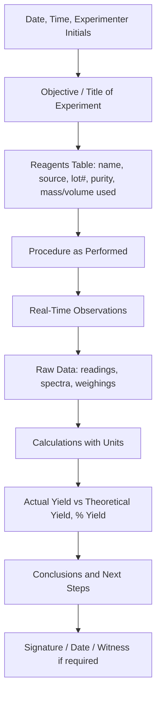

## Keeping Laboratory Records

### Overview

Laboratory record-keeping is the systematic documentation of experimental procedures, observations, data, and reasoning as they occur. Well-maintained records establish reproducibility, support intellectual property claims, enable error tracing, and satisfy regulatory and institutional requirements across academic, industrial, and clinical chemistry settings.

### Purpose and Importance

**Key Points**

- Provides a permanent, verifiable account of what was actually done, not what was planned or intended
- Enables reproducibility: another researcher (or the same researcher months later) should be able to repeat the exact procedure from the record alone
- Serves as legal evidence for patent priority disputes, particularly in industrial and pharmaceutical research
- Supports error diagnosis when unexpected results occur, by allowing retrospective review of conditions, reagents, and technique
- Required for regulatory compliance in contexts governed by Good Laboratory Practice (GLP) or Good Manufacturing Practice (GMP) standards

### The Laboratory Notebook

#### Physical/Bound Notebooks

- Traditionally a bound notebook with numbered, non-removable pages to prevent tampering or page substitution
- Entries made in permanent ink (never pencil), since pencil can be erased or altered
- Errors are corrected with a single strikethrough line (preserving legibility of the original entry) rather than erasure, cross-out scribbling, or use of correction fluid
- Blank spaces and unused portions of a page are typically crossed out to prevent later insertion of fraudulent data

#### Electronic Lab Notebooks (ELNs)

- Digital systems that timestamp entries, track edit history, and often integrate with instrument data output
- Advantages: searchability, backup/redundancy, integration with data analysis software, easier sharing among collaborators
- Requires audit-trail functionality (recording who changed what and when) to maintain the same evidentiary integrity as a bound paper notebook
- [Inference] Institutional and regulatory acceptance of ELNs as legal records varies by jurisdiction and by whether the system meets specific validation and audit-trail requirements

### What to Record

**Key Points**

- Date and time of the experiment
- Objective/purpose of the experiment, stated concisely
- Complete list of reagents with source, lot number, purity/grade, and safety data reference where relevant
- Exact quantities used (mass, volume, concentration) — including actual measured values, not just target values
- Step-by-step procedure as actually performed, including any deviations from a written protocol
- Observations made during the experiment (color changes, precipitate formation, temperature changes, gas evolution, timing of events)
- Raw data: instrument readings, spectra, chromatograms, weighings — recorded directly, not transcribed from memory afterward
- Calculations performed, with units shown explicitly at each step
- Yield (both actual and theoretical, with percent yield calculated)
- Any unusual occurrences, unexpected results, or equipment malfunctions
- Conclusions drawn from the data, distinguished clearly from the raw observations themselves
- Signature/initials and date (and, in industrial/patent contexts, a witness signature) confirming the entry's authenticity

#### Example Entry Structure

### Recording Quantitative Data and Calculations

**Example**

A synthesis targeting 2.50 g of product from a limiting reagent should show, in the notebook:

- Mass of limiting reagent actually weighed (e.g., 3.142 g, not just "3.14 g target")
- Molar mass and moles calculated explicitly: $n = \dfrac{m}{M}$
- Theoretical yield calculation shown step-by-step, including the stoichiometric ratio used
- Actual mass of isolated product (e.g., 2.187 g)
- Percent yield calculated and shown:

$$\%\ \text{yield} = \frac{\text{actual yield}}{\text{theoretical yield}} \times 100\%$$

Recording the full calculation (not just the final percentage) allows later verification and error tracing if a discrepancy is found.

### Significant Figures and Precision in Records

- Recorded values should reflect the actual precision of the measuring instrument (e.g., an analytical balance reading to 0.0001 g should be recorded to that precision, not rounded prematurely)
- Uncertainty or instrument tolerance should be noted where relevant (e.g., "25.0 ± 0.1 mL from Class A volumetric pipette")
- Intermediate calculation values should not be rounded before the final step, to avoid compounding rounding error

### Data Integrity Practices

**Key Points**

- Record data **contemporaneously** — at the time of observation, not reconstructed afterward from memory or scratch paper
- Never selectively omit data points because they seem "wrong"; anomalous results should be recorded along with any suspected explanation, and repeated/verified rather than deleted
- Attach or reference raw instrument printouts (spectra, chromatograms) directly, either physically taped in or cross-referenced by a unique sample/run ID
- Maintain a consistent sample-labeling and cross-referencing system so that a specific data file, spectrum, or physical sample vial can always be traced back to its notebook entry

### Common Recording Failures and Their Consequences

| Poor Practice | Consequence |
| --- | --- |
| Recording data on loose scrap paper first, notebook later | Risk of lost or altered data; breaks contemporaneous record requirement |
| Using pencil or erasable ink | Raises doubt about data authenticity; unacceptable for regulated/patent work |
| Omitting "failed" or unexpected results | Loses diagnostic information; may constitute scientific misconduct if selective |
| Vague procedure descriptions ("added acid until reaction started") | Not reproducible; exact quantities/conditions are lost |
| No units on recorded numbers | Introduces ambiguity and calculation errors |
| Retroactively changing entries without strikethrough/annotation | Undermines legal and scientific credibility of the record |

### Regulatory Context

- **Good Laboratory Practice (GLP)**: a quality system governing the organization and conditions under which non-clinical health and safety studies are planned, performed, and reported, often required for regulatory submissions (e.g., to the FDA or EPA)
- **Good Manufacturing Practice (GMP)**: governs documentation standards in pharmaceutical and manufacturing production contexts, emphasizing traceability of every batch and process step
- [Inference] Specific documentation retention periods and audit requirements differ substantially by regulatory body, industry, and jurisdiction, so applicable local regulations should be consulted for compliance-critical work

### Related Topics

- Data analysis and statistical treatment of experimental results
- Chain of custody documentation in forensic and regulated chemistry
- Reproducibility and the broader scientific replication crisis
- Electronic Lab Notebook (ELN) system selection and validation
- Intellectual property and patent documentation requirements