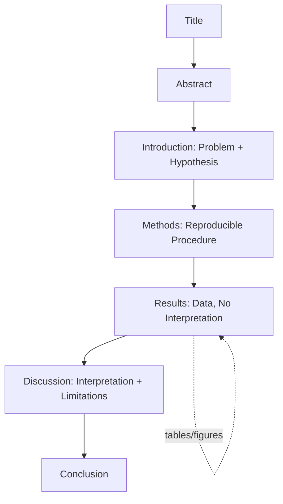

## Scientific Writing and Data Presentation

### Overview and Scope

Scientific writing is the structured communication of experimental design, methodology, results, and interpretation in a form that permits independent evaluation and reproduction. In chemistry specifically, this discipline extends beyond prose composition to encompass the accurate representation of quantitative data, adherence to nomenclature conventions (IUPAC), proper significant figure handling, and standardized graphical conventions. Data presentation is the visual and tabular complement to written text, converting raw numerical output into interpretable figures, tables, and charts.

The two domains are inseparable in practice: a well-designed experiment loses value if its results are ambiguously reported, and a poorly designed figure can misrepresent otherwise sound data.

---

### Core Components of a Scientific Report

#### **Key Points**

- Standard structure follows the **IMRaD** format: Introduction, Methods, Results, and Discussion
- Each section serves a distinct epistemic function and should not duplicate content from other sections
- Abstracts and titles are written last, despite appearing first

#### Title

- Should be specific, informative, and searchable
- Avoid vague constructions ("A Study of...") in favor of declarative or descriptive titles that state the finding or system studied
- Chemical names in titles should follow IUPAC conventions unless a common name is unambiguous and standard in the subfield

#### Abstract

- A self-contained summary (typically 150–250 words) covering: problem statement, methodology (brief), key quantitative results, and principal conclusion
- Should not contain citations, undefined abbreviations, or information absent from the body text

#### Introduction

- States the scientific problem, relevant background/literature context, and the specific hypothesis or objective
- Moves from general context to specific research question (funnel structure)

#### Methods (Experimental Section)

- Must contain sufficient detail for replication: reagent purity/source, instrument models and settings, temperature, pressure, reaction times, and safety-relevant conditions
- Written in past tense, typically passive voice in traditional chemistry journals, though active voice is increasingly accepted (e.g., ACS style now permits "We measured..." in many journals)
- Quantities should include uncertainty where measured (e.g., $25.0 \pm 0.2\ ^\circ\text{C}$)

#### Results

- Presents findings without interpretation
- Data should be presented in the most appropriate format (table vs. figure — see below) with descriptive but non-interpretive captions
- Statistical treatment (mean, standard deviation, $n$ replicates) should be stated explicitly

#### Discussion

- Interprets results in light of the hypothesis, compares to literature values, addresses discrepancies, and states limitations
- Distinguishes between what the data show and what can be inferred `[Inference]` from them

---

### Data Presentation: Tables vs. Figures

#### **Key Points**

- Use **tables** for precise numerical values where exact comparison across multiple variables matters
- Use **figures** (graphs, charts) when the goal is to communicate a trend, relationship, or pattern
- Never duplicate the same dataset in both a table and a figure within the same document unless the redundancy serves a distinct pedagogical or comparative purpose

#### Table Conventions

- Column headers must include units, typically in the format `Property / unit` (e.g., `Concentration / mol L⁻¹`) per IUPAC recommendation, or `Property (unit)` per many journal styles — consistency within a document is mandatory
- Significant figures in tabulated data should reflect actual measurement precision, not calculator output
- Horizontal rules typically separate header from body; vertical rules are conventionally omitted in most chemistry journal styles (e.g., ACS, RSC)

#### Figure Conventions

- Axes must be labeled with quantity and unit, following the format $\text{quantity} / \text{unit}$
- Error bars must be defined in the caption (standard deviation, standard error, or confidence interval)
- Data points from different series should be distinguishable by marker shape, not merely color, to remain accessible in grayscale reproduction
- Trend lines from regression should report the fit equation and $R^2$ value only if scientifically meaningful, not as decoration

**Example** — Correct axis labeling for a kinetics plot:

$$\ln[\text{A}] \ \text{vs.} \ t / \text{s}$$

with the y-axis labeled $\ln([\text{A}]/\text{mol L}^{-1})$, since the argument of a logarithm must be dimensionless.

---

### Significant Figures and Uncertainty Reporting

#### Rules for Significant Figures

- The result of a calculation cannot claim more precision than the least precise measured value
- **Addition/subtraction**: result is rounded to the least number of decimal places among inputs
- **Multiplication/division**: result is rounded to the least number of significant figures among inputs

**Example:**

$$12.11\ \text{g} + 18.0\ \text{g} = 30.1\ \text{g}$$

(not $30.11$, since $18.0$ limits the result to one decimal place)

#### Uncertainty Notation

- Absolute uncertainty: $m = 4.52 \pm 0.03\ \text{g}$
- Relative (percent) uncertainty: $\frac{0.03}{4.52} \times 100\% = 0.66\%$
- Propagated uncertainty in derived quantities should follow standard propagation rules (partial derivatives for multi-variable functions); this is standard analytical chemistry practice, not an inference

---

### Chemical Nomenclature and Notation in Text

- IUPAC names are preferred in formal writing; common names may be used parenthetically on first mention
- Isotopes: mass number as left superscript, e.g., $^{14}\text{C}$
- Oxidation states: Roman numerals in parentheses immediately following the element, e.g., iron(III) chloride
- Reaction equations should be balanced and include physical states: $\text{state symbols (s), (l), (g), (aq)}$
- Equilibrium arrows ($\rightleftharpoons$) must be distinguished from single-direction reaction arrows ($\rightarrow$)

---

### Common Pitfalls

| Pitfall | Consequence | Correction |
| --- | --- | --- |
| Overstating significant figures | False precision implied | Round to measurement precision |
| Mixing tenses across Methods/Discussion | Reduces clarity of what was done vs. inferred | Methods: past tense; Discussion: present tense for accepted facts |
| Omitting units on axes/columns | Data becomes ambiguous or unusable | Always pair quantity with unit |
| Using color alone to distinguish series | Fails in grayscale/colorblind contexts | Use distinct markers/line styles |
| Interpreting in the Results section | Blurs observation and inference | Reserve interpretation for Discussion |

---

### Illustration: Manuscript Data Flow (svg_diagram)

<svg xmlns="http://www.w3.org/2000/svg" viewBox="0 0 760 260">
<text x="380" y="24" text-anchor="middle" font-size="16" font-weight="bold" fill="#1a1a1a">Manuscript Data Flow (svg_diagram)</text>
<rect x="20" y="60" width="140" height="60" rx="6" fill="#e8f0fe" stroke="#3b5bdb" />
<text x="90" y="85" text-anchor="middle" font-size="12" fill="#1a1a1a">Raw Instrument</text>
<text x="90" y="101" text-anchor="middle" font-size="12" fill="#1a1a1a">Output</text>
<rect x="210" y="60" width="140" height="60" rx="6" fill="#e6fcf5" stroke="#0ca678" />
<text x="280" y="85" text-anchor="middle" font-size="12" fill="#1a1a1a">Processed Data</text>
<text x="280" y="101" text-anchor="middle" font-size="12" fill="#1a1a1a">(sig figs, units)</text>
<rect x="400" y="20" width="140" height="60" rx="6" fill="#fff4e6" stroke="#e8590c" />
<text x="470" y="45" text-anchor="middle" font-size="12" fill="#1a1a1a">Table</text>
<text x="470" y="61" text-anchor="middle" font-size="12" fill="#1a1a1a">(exact values)</text>
<rect x="400" y="100" width="140" height="60" rx="6" fill="#fff4e6" stroke="#e8590c" />
<text x="470" y="125" text-anchor="middle" font-size="12" fill="#1a1a1a">Figure</text>
<text x="470" y="141" text-anchor="middle" font-size="12" fill="#1a1a1a">(trend/pattern)</text>
<rect x="590" y="60" width="140" height="60" rx="6" fill="#f3f0ff" stroke="#7048e8" />
<text x="660" y="85" text-anchor="middle" font-size="12" fill="#1a1a1a">Results &amp;</text>
<text x="660" y="101" text-anchor="middle" font-size="12" fill="#1a1a1a">Discussion Text</text>
<line x1="160" y1="90" x2="205" y2="90" stroke="#495057" stroke-width="2" marker-end="url(#arrow)" />
<line x1="350" y1="80" x2="395" y2="50" stroke="#495057" stroke-width="2" marker-end="url(#arrow)" />
<line x1="350" y1="100" x2="395" y2="130" stroke="#495057" stroke-width="2" marker-end="url(#arrow)" />
<line x1="540" y1="50" x2="585" y2="80" stroke="#495057" stroke-width="2" marker-end="url(#arrow)" />
<line x1="540" y1="130" x2="585" y2="100" stroke="#495057" stroke-width="2" marker-end="url(#arrow)" />
<text x="380" y="220" text-anchor="middle" font-size="11" fill="#495057" font-style="italic">
Raw data is processed once, then routed to the presentation format (table or figure) best suited to the analytical goal.
</text>
</svg>

---

### Illustration: IMRaD Logical Structure

---

### **Related Topics**

- IUPAC nomenclature rules for organic and inorganic compounds
- Propagation of uncertainty in derived quantities
- Statistical treatment of replicate data (t-tests, confidence intervals)
- Literature citation formats in chemistry (ACS, RSC style guides)
- Laboratory notebook practices and data integrity
- Peer review process and manuscript revision cycles
- Spectroscopic data reporting conventions (NMR, IR, MS tabulation standards)