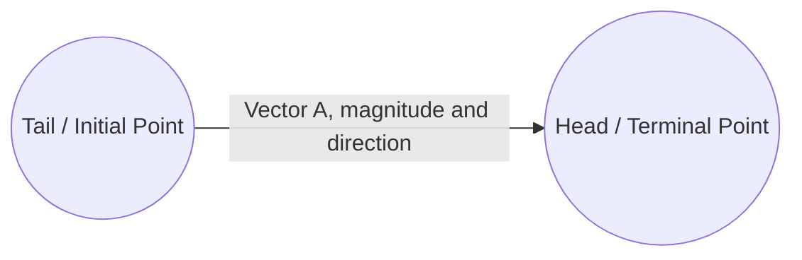

## Vectors and Vector Algebra

### Definition and Scalar-Vector Distinction

A **scalar** is a quantity fully specified by a single numerical value (magnitude) with an appropriate unit — examples include mass, temperature, time, and energy. A **vector** is a quantity that requires both magnitude and direction for complete specification — examples include displacement, velocity, acceleration, force, and momentum.

A vector is denoted in print as a boldface letter ($\mathbf{A}$) or with an arrow overhead ($\vec{A}$). Its magnitude is denoted $|\mathbf{A}|$ or simply $A$ (non-bold). Two vectors are equal if and only if they have identical magnitude and identical direction, regardless of their location in space — vectors in elementary mechanics are generally treated as "free vectors" unless the problem specifies a line of action (as with torque) or point of application (as with a bound force).

### Geometric Representation

A vector is represented geometrically as a directed line segment — an arrow — whose length (drawn to scale) represents magnitude and whose orientation represents direction. The tail is called the **origin** or **initial point**; the arrowhead is the **terminal point**.

### Vector Algebra: Addition

**Triangle Law of Addition**: If two vectors $\mathbf{A}$ and $\mathbf{B}$ are represented in magnitude and direction by two sides of a triangle taken in order, their resultant $\mathbf{R} = \mathbf{A} + \mathbf{B}$ is represented by the third side taken in the opposite order.

**Parallelogram Law of Addition**: If two vectors are represented by two adjacent sides of a parallelogram drawn from a common point, their resultant is represented by the diagonal of the parallelogram passing through that same point.

Below is an svg_diagram illustrating the parallelogram law:

<svg xmlns="http://www.w3.org/2000/svg" viewBox="0 0 420 260">
<text x="10" y="20" font-size="14" fill="black">Parallelogram Law of Vector Addition (svg_diagram)</text>
<line x1="40" y1="220" x2="200" y2="220" stroke="blue" stroke-width="3" marker-end="url(#arrow)" />
<text x="110" y="240" font-size="13" fill="blue">A</text>
<line x1="40" y1="220" x2="130" y2="100" stroke="green" stroke-width="3" marker-end="url(#arrow)" />
<text x="70" y="150" font-size="13" fill="green">B</text>
<line x1="200" y1="220" x2="290" y2="100" stroke="green" stroke-width="2" stroke-dasharray="4,3" marker-end="url(#arrow)" />
<line x1="130" y1="100" x2="290" y2="100" stroke="blue" stroke-width="2" stroke-dasharray="4,3" marker-end="url(#arrow)" />
<line x1="40" y1="220" x2="290" y2="100" stroke="red" stroke-width="3" marker-end="url(#arrow)" />
<text x="180" y="150" font-size="13" fill="red">R = A + B</text>
</svg>

**Properties of vector addition:**

- Commutative: $\mathbf{A} + \mathbf{B} = \mathbf{B} + \mathbf{A}$
- Associative: $(\mathbf{A} + \mathbf{B}) + \mathbf{C} = \mathbf{A} + (\mathbf{B} + \mathbf{C})$
- Additive identity: $\mathbf{A} + \mathbf{0} = \mathbf{A}$
- Additive inverse: $\mathbf{A} + (-\mathbf{A}) = \mathbf{0}$

**Magnitude of the resultant** (law of cosines form), for $\mathbf{A}$ and $\mathbf{B}$ separated by angle $\theta$:

$$R = \sqrt{A^2 + B^2 + 2AB\cos\theta}$$

**Direction of the resultant** relative to $\mathbf{A}$:

$$\tan\alpha = \frac{B\sin\theta}{A + B\cos\theta}$$

### Vector Subtraction

Subtraction is defined as addition of the negative (reversed-direction) vector:

$$\mathbf{A} - \mathbf{B} = \mathbf{A} + (-\mathbf{B})$$

Geometrically, $-\mathbf{B}$ has the same magnitude as $\mathbf{B}$ but points in the opposite direction. The magnitude of the difference, with $\theta$ the angle between $\mathbf{A}$ and $\mathbf{B}$:

$$|\mathbf{A} - \mathbf{B}| = \sqrt{A^2 + B^2 - 2AB\cos\theta}$$

### Multiplication of a Vector by a Scalar

If $k$ is a scalar and $\mathbf{A}$ a vector, $k\mathbf{A}$ is a vector with magnitude $|k|A$. If $k > 0$, $k\mathbf{A}$ points in the same direction as $\mathbf{A}$; if $k < 0$, it points in the opposite direction. This operation is used to scale forces, velocities, and to define unit vectors.

### Unit Vectors and Component Representation

A **unit vector** has magnitude exactly 1 and specifies direction only. The unit vector along $\mathbf{A}$ is:

$$\hat{A} = \frac{\mathbf{A}}{|\mathbf{A}|}$$

In three-dimensional Cartesian coordinates, the standard orthonormal basis vectors are $\hat{i}$, $\hat{j}$, $\hat{k}$, pointing along the $x$, $y$, $z$ axes respectively. Any vector can be written as:

$$\mathbf{A} = A_x\hat{i} + A_y\hat{j} + A_z\hat{k}$$

where $A_x, A_y, A_z$ are the **scalar components** (or simply "components") of $\mathbf{A}$ along each axis. The magnitude is:

$$|\mathbf{A}| = \sqrt{A_x^2 + A_y^2 + A_z^2}$$

**Component-wise addition and subtraction:**

$$\mathbf{A} \pm \mathbf{B} = (A_x \pm B_x)\hat{i} + (A_y \pm B_y)\hat{j} + (A_z \pm B_z)\hat{k}$$

### Resolution of a Vector into Components (2D)

For a vector $\mathbf{A}$ in the $xy$-plane making angle $\theta$ with the positive $x$-axis:

$$A_x = A\cos\theta, \qquad A_y = A\sin\theta$$

$$A = \sqrt{A_x^2 + A_y^2}, \qquad \theta = \tan^{-1}\left(\frac{A_y}{A_x}\right)$$

**Key Points**

- When computing $\theta$ from $\tan^{-1}(A_y/A_x)$, the quadrant of $(A_x, A_y)$ must be checked manually, since the arctangent function alone only returns values in $(-90°, 90°)$.
- Component resolution is the standard technique for adding more than two vectors: resolve each into components, sum components algebraically, then recombine.

**Example**

A displacement vector has magnitude 10 m at $\theta = 37°$ above the $x$-axis.

$$A_x = 10\cos(37°) \approx 7.99 \text{ m}, \qquad A_y = 10\sin(37°) \approx 6.02 \text{ m}$$

So $\mathbf{A} \approx 7.99\hat{i} + 6.02\hat{j}$ m.

### Scalar (Dot) Product

The **dot product** of two vectors produces a scalar:

$$\mathbf{A} \cdot \mathbf{B} = AB\cos\theta$$

where $\theta$ is the angle between them. In component form:

$$\mathbf{A} \cdot \mathbf{B} = A_xB_x + A_yB_y + A_zB_z$$

**Properties:**

- Commutative: $\mathbf{A} \cdot \mathbf{B} = \mathbf{B} \cdot \mathbf{A}$
- Distributive: $\mathbf{A} \cdot (\mathbf{B} + \mathbf{C}) = \mathbf{A} \cdot \mathbf{B} + \mathbf{A} \cdot \mathbf{C}$
- $\mathbf{A} \cdot \mathbf{A} = A^2$ (magnitude squared)
- Two nonzero vectors are perpendicular if and only if $\mathbf{A} \cdot \mathbf{B} = 0$
- For unit vectors: $\hat{i}\cdot\hat{i} = \hat{j}\cdot\hat{j} = \hat{k}\cdot\hat{k} = 1$, and $\hat{i}\cdot\hat{j} = \hat{j}\cdot\hat{k} = \hat{k}\cdot\hat{i} = 0$

**Physical significance**: Work done by a constant force is $W = \mathbf{F} \cdot \mathbf{d} = Fd\cos\theta$, a canonical application of the dot product in mechanics.

### Vector (Cross) Product

The **cross product** of two vectors produces a vector perpendicular to both:

$$\mathbf{A} \times \mathbf{B} = AB\sin\theta \, \hat{n}$$

where $\hat{n}$ is the unit vector perpendicular to the plane containing $\mathbf{A}$ and $\mathbf{B}$, with direction given by the **right-hand rule**: curl the fingers of the right hand from $\mathbf{A}$ toward $\mathbf{B}$; the thumb points along $\hat{n}$.

In component (determinant) form:

$$\mathbf{A} \times \mathbf{B} = \begin{vmatrix} \hat{i} & \hat{j} & \hat{k} \\ A_x & A_y & A_z \\ B_x & B_y & B_z \end{vmatrix} = (A_yB_z - A_zB_y)\hat{i} + (A_zB_x - A_xB_z)\hat{j} + (A_xB_y - A_yB_x)\hat{k}$$

**Properties:**

- Anticommutative: $\mathbf{A} \times \mathbf{B} = -(\mathbf{B} \times \mathbf{A})$
- Distributive: $\mathbf{A} \times (\mathbf{B} + \mathbf{C}) = \mathbf{A} \times \mathbf{B} + \mathbf{A} \times \mathbf{C}$
- Not associative in general
- $\mathbf{A} \times \mathbf{A} = \mathbf{0}$
- Two nonzero vectors are parallel (or antiparallel) if and only if $\mathbf{A} \times \mathbf{B} = \mathbf{0}$
- $\hat{i}\times\hat{j} = \hat{k}$, $\hat{j}\times\hat{k} = \hat{i}$, $\hat{k}\times\hat{i} = \hat{j}$ (cyclic order)
- $|\mathbf{A} \times \mathbf{B}|$ equals the area of the parallelogram spanned by $\mathbf{A}$ and $\mathbf{B}$

**Physical significance**: Torque $\boldsymbol{\tau} = \mathbf{r} \times \mathbf{F}$, angular momentum $\mathbf{L} = \mathbf{r} \times \mathbf{p}$, and the magnetic force $\mathbf{F} = q\mathbf{v} \times \mathbf{B}$ are all cross-product relationships.

### Position, Displacement, and Relative Vectors

The **position vector** $\mathbf{r} = x\hat{i} + y\hat{j} + z\hat{k}$ locates a point relative to an origin. **Displacement** is the change in position:

$$\Delta\mathbf{r} = \mathbf{r}_2 - \mathbf{r}_1$$

**Relative velocity** between two objects A and B follows the same subtraction structure:

$$\mathbf{v}_{AB} = \mathbf{v}_A - \mathbf{v}_B$$

### Vector Differentiation and Integration (Preview)

Since vector components are treated independently, calculus operations apply component-wise:

$$\frac{d\mathbf{A}}{dt} = \frac{dA_x}{dt}\hat{i} + \frac{dA_y}{dt}\hat{j} + \frac{dA_z}{dt}\hat{k}$$

This underlies the definitions of velocity ($\mathbf{v} = d\mathbf{r}/dt$) and acceleration ($\mathbf{a} = d\mathbf{v}/dt$), covered in kinematics chapters. [Inference: full treatment depends on how the course sequences vector calculus relative to kinematics.]

### Common Errors and Misconceptions

- Treating vector magnitudes as directly additive ($|\mathbf{A}+\mathbf{B}| \neq |\mathbf{A}|+|\mathbf{B}|$ in general; equality holds only when $\mathbf{A}$ and $\mathbf{B}$ are parallel and same-directed)
- Forgetting to check the quadrant when computing direction angles from $\tan^{-1}$
- Confusing the dot product (scalar result) with the cross product (vector result)
- Applying the associative property to the cross product, which does not hold in general
- Treating position vectors as free vectors when the physical problem requires a fixed origin

**Next Steps**

- Vector Components and Unit Vectors (deeper treatment)
- Coordinate Systems (Cartesian, Polar, Cylindrical, Spherical)
- Vector Calculus: Differentiation and Integration of Vectors
- Kinematics in One and Two Dimensions
- Torque and Rotational Dynamics (cross product application)
- Work and Energy (dot product application)
- Gradient, Divergence, and Curl (vector field operators)