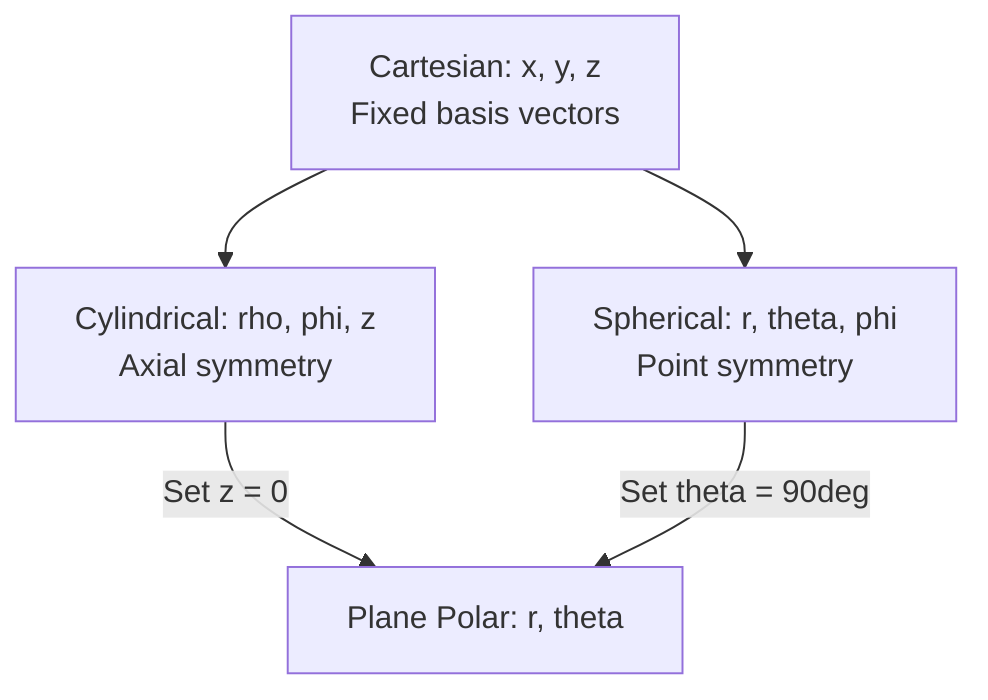

## Coordinate Systems and Transformations

### Overview and Purpose

A **coordinate system** assigns an ordered set of numbers to each point in space, enabling positions, vectors, and physical laws to be expressed algebraically. The choice of coordinate system does not change the underlying physics but can dramatically simplify the mathematics when the system's symmetry matches the problem's symmetry (e.g., spherical coordinates for central-force problems, cylindrical for axial symmetry).

### Cartesian (Rectangular) Coordinates

The Cartesian system uses three mutually perpendicular axes ($x$, $y$, $z$) with basis vectors $\hat{i}, \hat{j}, \hat{k}$. A point is specified as $(x, y, z)$, and a position vector is:

$$\mathbf{r} = x\hat{i} + y\hat{j} + z\hat{k}$$

The basis vectors are constant in direction everywhere in space — this is the key simplifying feature of Cartesian coordinates, distinguishing them from curvilinear systems.

The infinitesimal displacement and volume elements are:

$$d\mathbf{r} = dx\,\hat{i} + dy\,\hat{j} + dz\,\hat{k}, \qquad dV = dx\,dy\,dz$$

### Polar Coordinates (2D)

For planar problems, **plane polar coordinates** $(r, \theta)$ describe a point by its radial distance $r$ from the origin and angle $\theta$ from a reference axis (usually the positive $x$-axis).

**Transformation to Cartesian:**

$$x = r\cos\theta, \qquad y = r\sin\theta$$

**Transformation from Cartesian:**

$$r = \sqrt{x^2 + y^2}, \qquad \theta = \tan^{-1}\left(\frac{y}{x}\right)$$

Unlike Cartesian basis vectors, the polar basis vectors $\hat{r}$ and $\hat{\theta}$ **change direction** as the point moves:

$$\hat{r} = \cos\theta\,\hat{i} + \sin\theta\,\hat{j}, \qquad \hat{\theta} = -\sin\theta\,\hat{i} + \cos\theta\,\hat{j}$$

This position-dependence of the basis vectors is why velocity and acceleration in polar coordinates acquire extra terms (centripetal and Coriolis-like contributions) not present in Cartesian form:

$$\mathbf{v} = \dot{r}\hat{r} + r\dot\theta\,\hat\theta$$

$$\mathbf{a} = (\ddot{r} - r\dot\theta^2)\hat{r} + (r\ddot\theta + 2\dot{r}\dot\theta)\hat\theta$$

**Key Points**

- The term $r\dot\theta^2$ in the radial acceleration is the centripetal term; $2\dot r\dot\theta$ is the Coriolis-type term arising purely from using a rotating basis, even in an inertial frame.

### Cylindrical Coordinates (3D)

Cylindrical coordinates $(\rho, \phi, z)$ extend plane polar coordinates by adding the Cartesian $z$-axis unchanged. Here $\rho$ is the perpendicular distance from the $z$-axis (some texts use $r$ or $s$ for this radial coordinate — notation varies by author).

**Transformation to Cartesian:**

$$x = \rho\cos\phi, \qquad y = \rho\sin\phi, \qquad z = z$$

**Transformation from Cartesian:**

$$\rho = \sqrt{x^2+y^2}, \qquad \phi = \tan^{-1}\left(\frac{y}{x}\right), \qquad z = z$$

Volume element:

$$dV = \rho\,d\rho\,d\phi\,dz$$

Cylindrical coordinates are the natural choice for problems with axial symmetry: current-carrying wires, solenoids, rotating cylinders, and pipe flow.

### Spherical Coordinates (3D)

Spherical coordinates $(r, \theta, \phi)$ describe a point using: $r$, the distance from the origin; $\theta$ (polar/colatitude angle), measured from the positive $z$-axis; and $\phi$ (azimuthal angle), measured in the $xy$-plane from the positive $x$-axis. [Note: physics convention, as used here, swaps the roles of $\theta$ and $\phi$ relative to the mathematics convention common in some textbooks — always check the source's convention before applying formulas.]

**Transformation to Cartesian:**

$$x = r\sin\theta\cos\phi, \qquad y = r\sin\theta\sin\phi, \qquad z = r\cos\theta$$

**Transformation from Cartesian:**

$$r = \sqrt{x^2+y^2+z^2}, \qquad \theta = \cos^{-1}\left(\frac{z}{r}\right), \qquad \phi = \tan^{-1}\left(\frac{y}{x}\right)$$

Volume element:

$$dV = r^2\sin\theta\,dr\,d\theta\,d\phi$$

Spherical coordinates are standard for central-force problems (gravitation, Coulomb's law), atomic physics (hydrogen atom wavefunctions), and any system with point symmetry.

Below is a diagram comparing the three curvilinear systems:

### Coordinate Transformation via Rotation (2D)

When the coordinate axes themselves are rotated by angle $\alpha$ (same origin, same point in space, new axes $x', y'$), the coordinates of a fixed point transform as:

$$x' = x\cos\alpha + y\sin\alpha$$

$$y' = -x\sin\alpha + y\cos\alpha$$

In matrix form:

$$\begin{pmatrix} x' \\ y' \end{pmatrix} = \begin{pmatrix} \cos\alpha & \sin\alpha \\ -\sin\alpha & \cos\alpha \end{pmatrix}\begin{pmatrix} x \\ y \end{pmatrix}$$

This **rotation matrix** $R(\alpha)$ is orthogonal ($R^{-1} = R^T$) and its determinant is $+1$. This transformation is the foundation for understanding how vector and tensor components change under rotation of the reference frame — a concept central to defining what qualifies as a "vector" in the formal sense (a quantity whose components transform according to this rule).

### Jacobians and Differential Elements

Converting integrals between coordinate systems requires the **Jacobian determinant**, which accounts for how volume/area elements scale under transformation. For a transformation from $(u,v,w)$ to $(x,y,z)$:

$$J = \frac{\partial(x,y,z)}{\partial(u,v,w)} = \begin{vmatrix} \frac{\partial x}{\partial u} & \frac{\partial x}{\partial v} & \frac{\partial x}{\partial w} \\ \frac{\partial y}{\partial u} & \frac{\partial y}{\partial v} & \frac{\partial y}{\partial w} \\ \frac{\partial z}{\partial u} & \frac{\partial z}{\partial v} & \frac{\partial z}{\partial w} \end{vmatrix}$$

$$dV = |J|\,du\,dv\,dw$$

This recovers the $\rho$ factor in cylindrical and $r^2\sin\theta$ factor in spherical volume elements shown above.

### Choosing a Coordinate System: Practical Guidance

**Example**

- **Planetary orbit (central force)** → spherical or plane polar coordinates, since gravitational force depends only on $r$
- **Current in a straight wire** → cylindrical coordinates, since the magnetic field has axial symmetry
- **Projectile motion under uniform gravity** → Cartesian coordinates, since the force $-mg\hat{j}$ has fixed direction, not radial symmetry
- **Rigid body rotation about a fixed axis** → cylindrical coordinates aligned with the rotation axis

**Conclusion**

The physical symmetry of a problem should dictate the coordinate system: matching symmetry to coordinates reduces the number of independent variables in the governing equations (e.g., reducing a 3D central-force problem to an effective 1D radial equation via conservation of angular momentum), which is often the single most powerful simplification available before solving the dynamics.

**Related Topics**

- Vectors and Vector Algebra (prerequisite)
- Vector Calculus: Gradient, Divergence, Curl in Curvilinear Coordinates
- Generalized (Curvilinear) Coordinates and Metric Tensors
- Rotational Kinematics and Rigid Body Motion
- Central Force Motion and Orbital Mechanics
- Multiple Integrals in Physics (line, surface, volume integrals)
- Tensor Transformation Rules