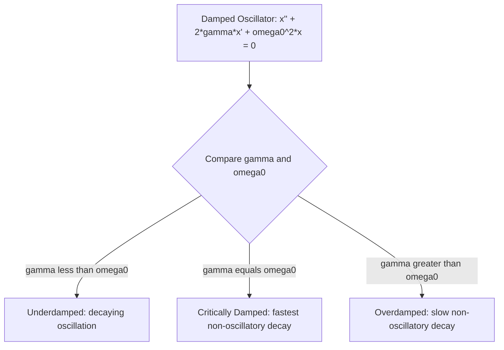

## Ordinary Differential Equations

### Definition and Role in Physics

An **ordinary differential equation (ODE)** is an equation relating a function of a single independent variable to its derivatives. Physics is built substantially on ODEs because most fundamental laws (Newton's second law, radioactive decay, circuit equations, simple harmonic motion) relate a quantity's rate of change to the quantity itself or to other known functions. The **order** of an ODE is the order of its highest derivative; the **degree** is the power to which that highest derivative is raised (after the equation is made polynomial in derivatives).

### Classification of ODEs

- **Order**: first-order ($dy/dx = f(x,y)$), second-order ($d^2y/dx^2 = f(x,y,dy/dx)$), etc.
- **Linearity**: an ODE is **linear** if the dependent variable and its derivatives appear only to the first power and are not multiplied together; otherwise it is **nonlinear**.
- **Homogeneity**: a linear ODE is **homogeneous** if every term contains the dependent variable or its derivatives (i.e., $y=0$ is a solution); **inhomogeneous** (or "driven"/"forced") if a term depends only on the independent variable.
- **Coefficients**: constant-coefficient vs. variable-coefficient.

**General linear second-order ODE:**

$$a_2(x)\frac{d^2y}{dx^2} + a_1(x)\frac{dy}{dx} + a_0(x)y = g(x)$$

If $g(x) = 0$, the equation is homogeneous; otherwise inhomogeneous.

### First-Order ODEs: Separation of Variables

If an ODE can be written as $\dfrac{dy}{dx} = f(x)h(y)$, variables separate:

$$\int \frac{dy}{h(y)} = \int f(x)\,dx$$

**Example** — Newton's Law of Cooling:

$$\frac{dT}{dt} = -k(T - T_{env})$$

Separating and integrating:

$$\int \frac{dT}{T-T_{env}} = -k\int dt \;\Rightarrow\; \ln|T-T_{env}| = -kt + C \;\Rightarrow\; T(t) = T_{env} + (T_0 - T_{env})e^{-kt}$$

This same technique solves radioactive decay ($dN/dt = -\lambda N$) and RC-circuit discharge ($dQ/dt = -Q/RC$) — a recurring pattern of exponential approach to equilibrium.

### First-Order Linear ODEs: Integrating Factor

The standard form is:

$$\frac{dy}{dx} + P(x)y = Q(x)$$

The **integrating factor** is $\mu(x) = e^{\int P(x)\,dx}$, which converts the left side into an exact derivative:

$$\frac{d}{dx}[\mu(x)y] = \mu(x)Q(x) \;\Rightarrow\; y(x) = \frac{1}{\mu(x)}\left[\int \mu(x)Q(x)\,dx + C\right]$$

**Example** — an object falling with linear air resistance, $m\dfrac{dv}{dt} = mg - bv$, rearranged as $\dfrac{dv}{dt} + \dfrac{b}{m}v = g$:

Here $P = b/m$ (constant), so $\mu(t) = e^{bt/m}$, yielding:

$$v(t) = \frac{mg}{b}\left(1 - e^{-bt/m}\right) + v_0 e^{-bt/m}$$

As $t\to\infty$, $v \to mg/b$, the **terminal velocity**.

### Second-Order Linear Homogeneous ODEs with Constant Coefficients

Standard form:

$$a\frac{d^2y}{dx^2} + b\frac{dy}{dx} + cy = 0$$

Assume a trial solution $y = e^{rx}$, yielding the **characteristic (auxiliary) equation**:

$$ar^2 + br + c = 0$$

**Three cases based on the discriminant** $\Delta = b^2 - 4ac$:

| Case | Roots | General Solution |
| --- | --- | --- |
| $\Delta > 0$ | Real, distinct: $r_1, r_2$ | $y = C_1e^{r_1x} + C_2e^{r_2x}$ |
| $\Delta = 0$ | Real, repeated: $r$ | $y = (C_1 + C_2x)e^{rx}$ |
| $\Delta < 0$ | Complex: $\alpha \pm i\beta$ | $y = e^{\alpha x}(C_1\cos\beta x + C_2\sin\beta x)$ |

### The Simple Harmonic Oscillator (Canonical Physics Application)

Undamped SHM, from Newton's second law with a restoring force $F=-kx$:

$$m\ddot{x} + kx = 0 \;\Rightarrow\; \ddot{x} + \omega_0^2 x = 0, \quad \omega_0 = \sqrt{k/m}$$

This is the $\Delta < 0$ case above with $\alpha = 0$, $\beta = \omega_0$:

$$x(t) = A\cos(\omega_0 t + \phi)$$

**Damped harmonic oscillator**, adding a resistive force $-b\dot{x}$:

$$m\ddot{x} + b\dot{x} + kx = 0 \;\Rightarrow\; \ddot{x} + 2\gamma\dot{x} + \omega_0^2 x = 0, \quad \gamma = \frac{b}{2m}$$

The characteristic equation $r^2 + 2\gamma r + \omega_0^2 = 0$ gives $r = -\gamma \pm \sqrt{\gamma^2-\omega_0^2}$, producing three physically named regimes:

- **Underdamped** ($\gamma < \omega_0$): oscillation with exponentially decaying amplitude, $x(t) = Ae^{-\gamma t}\cos(\omega_d t + \phi)$ where $\omega_d = \sqrt{\omega_0^2-\gamma^2}$
- **Critically damped** ($\gamma = \omega_0$): fastest non-oscillatory return to equilibrium, $x(t) = (C_1+C_2t)e^{-\gamma t}$
- **Overdamped** ($\gamma > \omega_0$): slow non-oscillatory decay with two real exponential rates

### Inhomogeneous (Driven) Second-Order ODEs

**General solution structure**: the full solution is the sum of the homogeneous solution $y_h$ (complementary function) and any particular solution $y_p$ satisfying the full inhomogeneous equation:

$$y(x) = y_h(x) + y_p(x)$$

**Driven (forced) harmonic oscillator**, with sinusoidal driving force $F_0\cos(\omega t)$:

$$\ddot{x} + 2\gamma\dot{x} + \omega_0^2x = \frac{F_0}{m}\cos(\omega t)$$

The steady-state particular solution (after transients from $y_h$ decay away) has amplitude:

$$A(\omega) = \frac{F_0/m}{\sqrt{(\omega_0^2-\omega^2)^2 + (2\gamma\omega)^2}}$$

This amplitude is maximized near $\omega \approx \omega_0$ (for weak damping) — the phenomenon of **resonance**, central to driven oscillator problems, AC circuits, and structural engineering.

**Method of undetermined coefficients**: for particular solutions, guess a trial form matching the structure of $g(x)$ (polynomial, exponential, sinusoidal) with unknown coefficients, then substitute to solve for them. This is the standard technique for driven-oscillator and RLC-circuit problems in introductory and intermediate courses.

### Initial Value Problems and Boundary Value Problems

An ODE alone has a family of solutions (with arbitrary constants $C_1, C_2, \ldots$); physical uniqueness requires additional conditions:

- **Initial Value Problem (IVP)**: conditions specified at a single point (e.g., $x(0) = x_0$, $\dot{x}(0) = v_0$) — standard for time-evolution problems in mechanics.
- **Boundary Value Problem (BVP)**: conditions specified at two different points (e.g., $y(0)=0$, $y(L)=0$) — standard for spatial problems like the quantum particle-in-a-box or vibrating string modes, and can produce **quantized** solutions (eigenvalue problems) where only discrete parameter values admit nontrivial solutions.

**Key Points**

- BVPs are the mathematical origin of quantization in introductory quantum mechanics: requiring a wavefunction to vanish at fixed boundaries restricts the allowed wavenumbers (and hence energies) to a discrete set.

### Numerical Methods (Brief Note)

When an ODE has no closed-form analytical solution, numerical integration methods are used, most commonly:

$$y_{n+1} = y_n + h\,f(x_n, y_n) \qquad \text{(Euler's Method)}$$

with higher-accuracy alternatives (Runge-Kutta methods, notably RK4) standard in computational physics for problems like orbital mechanics or nonlinear oscillators without closed-form solutions. [Inference: depth of numerical-methods coverage depends on whether the course includes a computational-physics component.]

**Common Errors and Misconceptions**

- Forgetting that the general solution to an $n$th-order linear ODE must contain exactly $n$ independent arbitrary constants
- Applying the constant-coefficient characteristic-equation method to variable-coefficient ODEs, where it does not apply
- Omitting the homogeneous solution $y_h$ when only the particular solution $y_p$ is found for a driven system, giving an incomplete general solution
- Confusing critical damping ($\gamma = \omega_0$, fastest non-oscillatory decay) with overdamping (slower decay despite more resistance)

**Related Topics**

- Differentiation and Integration for Physics
- Simple Harmonic Motion and Oscillations
- Driven Oscillations and Resonance
- Series Expansions and Approximation Methods
- Introduction to Quantum Mechanics (boundary value problems)
- Partial Differential Equations in Physics (wave equation, heat equation)
- Computational Methods and Numerical Integration