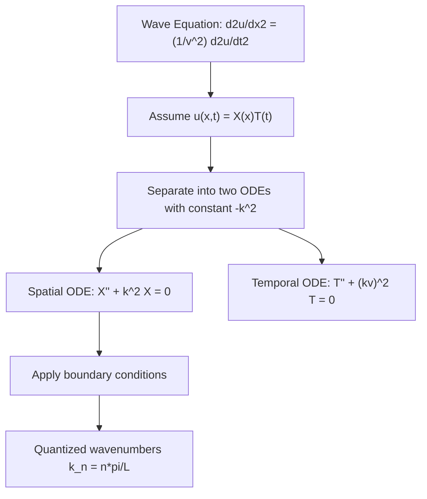

## Partial Differential Equations

### Definition and Role in Physics

A **partial differential equation (PDE)** relates a multivariable function to its partial derivatives with respect to two or more independent variables. Where ODEs govern quantities depending on a single variable (typically time), PDEs are required whenever a physical field varies over both space and time — displacement of a vibrating string, temperature distribution in a solid, electric and magnetic fields, and the quantum wavefunction. PDEs are the natural mathematical language of **field theories** in physics.

### Classification of PDEs

- **Order**: determined by the highest-order partial derivative present.
- **Linearity**: linear if the unknown function and its derivatives appear to the first power and are not multiplied together; otherwise nonlinear.
- **Second-order linear PDEs** are classified by analogy with conic sections, based on the sign of a discriminant analogous to $B^2-4AC$ for the general form $Au_{xx}+Bu_{xy}+Cu_{yy}+\ldots=0$:

| Type | Discriminant | Canonical Example | Physical Character |
| --- | --- | --- | --- |
| Elliptic | $B^2-4AC < 0$ | Laplace's equation | Equilibrium/steady-state, no wave propagation |
| Parabolic | $B^2-4AC = 0$ | Heat/diffusion equation | Irreversible smoothing/diffusion over time |
| Hyperbolic | $B^2-4AC > 0$ | Wave equation | Finite-speed wave propagation |

### The Wave Equation

Governing transverse waves on a string, electromagnetic waves, and sound waves, the 1D wave equation is:

$$\frac{\partial^2 u}{\partial x^2} = \frac{1}{v^2}\frac{\partial^2 u}{\partial t^2}$$

where $u(x,t)$ is the displacement (or field value) and $v$ is the wave propagation speed. In 3D, using the Laplacian $\nabla^2$:

$$\nabla^2 u = \frac{1}{v^2}\frac{\partial^2 u}{\partial t^2}$$

**D'Alembert's general solution** (1D, unbounded domain):

$$u(x,t) = f(x-vt) + g(x+vt)$$

representing a rightward-traveling wave $f$ and a leftward-traveling wave $g$, each of fixed shape moving at speed $v$.

### Solving PDEs by Separation of Variables

The dominant technique in introductory and intermediate physics courses for solving linear PDEs on bounded domains is to assume a **product solution**:

$$u(x,t) = X(x)T(t)$$

Substituting into the wave equation and dividing through by $XT$ separates the equation into two ODEs, each equal to a common separation constant (often written $-k^2$):

$$\frac{1}{X}\frac{d^2X}{dx^2} = \frac{1}{v^2T}\frac{d^2T}{dt^2} = -k^2$$

This yields:

$$X'' + k^2X = 0, \qquad T'' + (kv)^2T = 0$$

both simple harmonic-type ODEs (directly reusing the second-order constant-coefficient ODE methods).

**Example** — vibrating string fixed at both ends (length $L$), a boundary value problem:

Boundary conditions $X(0)=0$, $X(L)=0$ force $X(x) = \sin(k_nx)$ with quantized wavenumbers:

$$k_n = \frac{n\pi}{L}, \quad n=1,2,3,\ldots$$

giving discrete normal-mode frequencies $\omega_n = k_nv = n\pi v/L$ — the physical origin of the harmonic overtone series in musical strings.

### The Heat (Diffusion) Equation

Governing temperature evolution in a conducting medium (and, by mathematical analogy, particle diffusion and probability spreading):

$$\frac{\partial u}{\partial t} = D\frac{\partial^2 u}{\partial x^2}$$

where $D$ is the thermal diffusivity (or diffusion constant). Separation of variables here yields a spatial ODE identical in form to the wave-equation case, but the temporal equation is **first**-order:

$$T' + Dk^2T = 0 \;\Rightarrow\; T(t) = T(0)e^{-Dk^2t}$$

so each spatial mode decays exponentially in time rather than oscillating — reflecting the parabolic (irreversible, dissipative) character of diffusion, in contrast to the hyperbolic (reversible, oscillatory) wave equation.

### Laplace's Equation and Steady-State Problems

For time-independent (equilibrium) field distributions — electrostatic potential in charge-free regions, steady-state temperature — the governing equation is **Laplace's equation**:

$$\nabla^2 u = 0$$

Its inhomogeneous counterpart, **Poisson's equation**, includes a source term:

$$\nabla^2 u = -\frac{\rho}{\epsilon_0} \qquad \text{(electrostatics, with charge density } \rho\text{)}$$

Solutions to Laplace's equation are **harmonic functions**, characterized by the property that the value at any point equals the average of surrounding values (mean value property) — a hallmark of elliptic PDEs and the mathematical basis for the absence of local extrema in charge-free electrostatic potential (no stable equilibrium point for a charge in a static field, per Earnshaw's theorem).

### The Schrödinger Equation (Quantum Mechanics Preview)

The **time-dependent Schrödinger equation** is the central PDE of non-relativistic quantum mechanics:

$$i\hbar\frac{\partial \Psi}{\partial t} = -\frac{\hbar^2}{2m}\nabla^2\Psi + V(\mathbf{r})\Psi$$

Separation of variables ($\Psi(\mathbf{r},t) = \psi(\mathbf{r})e^{-iEt/\hbar}$) reduces this to the **time-independent Schrödinger equation**:

$$-\frac{\hbar^2}{2m}\nabla^2\psi + V(\mathbf{r})\psi = E\psi$$

which is structurally an eigenvalue boundary value problem — directly paralleling the vibrating-string quantization discussed above, with quantized energy $E$ playing the role of the quantized frequency $\omega_n$. [Inference: full treatment is reserved for a dedicated quantum mechanics chapter; included here only as a PDE-classification illustration.]

### Fourier Series and the Superposition of Modes

Because linear PDEs admit superposition, a general initial condition (e.g., an arbitrary initial string shape) is expressed as a sum over the normal modes found via separation of variables, with coefficients determined by **Fourier series**:

$$u(x,0) = \sum_{n=1}^{\infty} B_n\sin\left(\frac{n\pi x}{L}\right), \qquad B_n = \frac{2}{L}\int_0^L u(x,0)\sin\left(\frac{n\pi x}{L}\right)dx$$

This Fourier-coefficient formula follows from the orthogonality of sine functions over $[0,L]$, a property central to solving essentially all bounded-domain linear PDE problems by this method.

### Boundary and Initial Conditions

A PDE solution is only fully determined once appropriate conditions are specified:

- **Dirichlet condition**: the function value is fixed on the boundary (e.g., $u=0$ at fixed string ends)
- **Neumann condition**: the derivative (flux/slope) is fixed on the boundary (e.g., insulated end of a rod, $\partial u/\partial x=0$)
- **Initial conditions**: required for time-dependent PDEs (wave and heat equations), typically specifying $u(x,0)$ and, for the wave equation, $\partial u/\partial t\big|_{t=0}$ as well (since it is second-order in time)

**Key Points**

- The wave equation, being second order in time, requires two initial conditions (initial displacement and initial velocity); the heat equation, first order in time, requires only one (initial temperature distribution) — this difference in required data directly reflects each equation's hyperbolic vs. parabolic classification.

**Common Errors and Misconceptions**

- Applying the wave equation's two-initial-condition requirement to the heat equation, which needs only one
- Treating the separation constant's sign as arbitrary — the sign must be chosen consistent with the boundary conditions (oscillatory spatial solutions generally require the constant to be negative, i.e., $+k^2$ on the correct side, as shown above)
- Confusing Laplace's equation (source-free, homogeneous) with Poisson's equation (source term present)
- Assuming a nonlinear PDE obeys superposition, which holds only for linear PDEs

**Related Topics**

- Ordinary Differential Equations
- Fourier Series and Fourier Analysis
- Waves and Oscillations
- Electrostatics and Poisson's Equation
- Introduction to Quantum Mechanics
- Heat Transfer and Thermodynamics
- Boundary Value Problems and Eigenvalue Problems