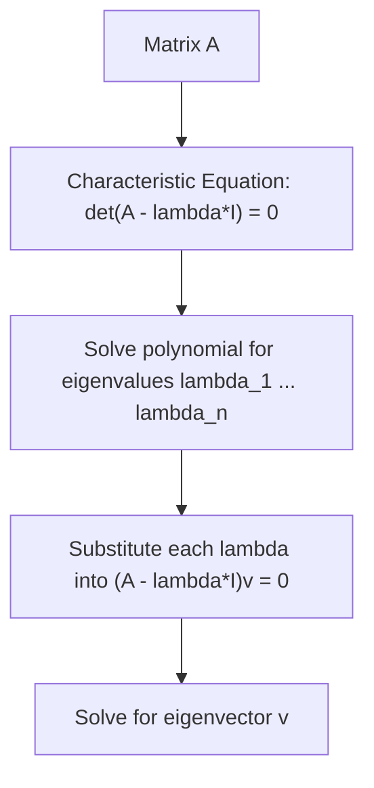

## Linear Algebra and Matrices

### Role in Physics

Linear algebra provides the formal structure for handling multiple linear relationships simultaneously — coordinate transformations, systems of coupled oscillators, quantum states, and rigid-body inertia are all naturally expressed as vectors and matrices. Where single-vector algebra (dot and cross products) handles individual vectors, linear algebra generalizes to **vector spaces** of arbitrary dimension and to the **linear operators** (matrices) that act on them.

### Matrices: Definitions and Basic Operations

A **matrix** is a rectangular array of numbers with $m$ rows and $n$ columns, denoted an $m\times n$ matrix. Element $A_{ij}$ occupies row $i$, column $j$.

**Addition** (element-wise, requires equal dimensions):

$$(A+B)_{ij} = A_{ij} + B_{ij}$$

**Scalar multiplication**:

$$(kA)_{ij} = kA_{ij}$$

**Matrix multiplication**, for $A$ ($m\times n$) and $B$ ($n\times p$), producing an $m\times p$ result:

$$(AB)_{ij} = \sum_{k=1}^{n} A_{ik}B_{kj}$$

Matrix multiplication is **associative** — $(AB)C=A(BC)$ — and **distributive** over addition, but **not commutative** in general: $AB \neq BA$.

**Transpose**: $(A^T)_{ij} = A_{ji}$ — rows and columns interchanged. A matrix is **symmetric** if $A^T=A$; **antisymmetric** (skew-symmetric) if $A^T=-A$.

### Special Matrices

- **Identity matrix** $I$: diagonal entries 1, off-diagonal 0; satisfies $AI=IA=A$
- **Zero matrix**: all entries 0
- **Diagonal matrix**: nonzero entries only on the main diagonal
- **Orthogonal matrix**: $A^TA = I$, equivalently $A^{-1}=A^T$ — preserves vector lengths and angles, and represents rotations and reflections (the rotation matrix from coordinate transformations is a canonical example)
- **Hermitian matrix** (complex analog of symmetric): $A^\dagger = A$, where $A^\dagger$ is the conjugate transpose — central to quantum mechanics, since Hermitian operators represent physical observables and guarantee real eigenvalues

### Determinants

The **determinant** is a scalar computed from a square matrix, encoding whether the matrix is invertible ($\det A \neq 0$) and, geometrically, the volume scaling factor of the linear transformation it represents.

**2×2 case:**

$$\det\begin{pmatrix} a & b \\ c & d \end{pmatrix} = ad - bc$$

**3×3 case** (cofactor expansion along the first row):

$$\det\begin{pmatrix} a_1 & a_2 & a_3 \\ b_1 & b_2 & b_3 \\ c_1 & c_2 & c_3 \end{pmatrix} = a_1(b_2c_3-b_3c_2) - a_2(b_1c_3-b_3c_1) + a_3(b_1c_2-b_2c_1)$$

This determinant expression is identical in structure to the component formula for the vector cross product — a connection worth noting explicitly, since $\det$ of a matrix whose rows are $\mathbf{A}, \mathbf{B}, \mathbf{C}$ gives the **scalar triple product** $\mathbf{A}\cdot(\mathbf{B}\times\mathbf{C})$, the signed volume of the parallelepiped spanned by the three vectors.

**Properties**: $\det(AB) = \det A \det B$; $\det(A^T) = \det A$; swapping two rows negates the determinant; a matrix with a zero row/column, or with linearly dependent rows/columns, has $\det A = 0$.

### The Matrix Inverse

For a square matrix $A$ with $\det A \neq 0$, the inverse $A^{-1}$ satisfies $AA^{-1}=A^{-1}A=I$. For a $2\times 2$ matrix:

$$A^{-1} = \frac{1}{\det A}\begin{pmatrix} d & -b \\ -c & a \end{pmatrix}, \quad \text{for } A=\begin{pmatrix} a & b \\ c & d \end{pmatrix}$$

More generally, $A^{-1} = \dfrac{1}{\det A}\text{adj}(A)$, where $\text{adj}(A)$ is the adjugate (transpose of the cofactor matrix).

### Systems of Linear Equations

A system of $n$ linear equations in $n$ unknowns can be written compactly as $A\mathbf{x} = \mathbf{b}$. If $A$ is invertible, the unique solution is:

$$\mathbf{x} = A^{-1}\mathbf{b}$$

**Cramer's Rule** offers an alternative for small systems: $x_i = \det(A_i)/\det(A)$, where $A_i$ replaces column $i$ of $A$ with $\mathbf{b}$.

**Example** — solving two coupled equations for currents $I_1, I_2$ in a circuit (Kirchhoff's laws):

$$\begin{pmatrix} 5 & -3 \\ -3 & 8 \end{pmatrix}\begin{pmatrix} I_1 \\ I_2 \end{pmatrix} = \begin{pmatrix} 10 \\ 0 \end{pmatrix}$$

$\det A = 40-9=31$, giving $I_1 = \dfrac{\det\begin{pmatrix}10 & -3\\0 & 8\end{pmatrix}}{31} = \dfrac{80}{31} \approx 2.58\text{ A}$, and similarly for $I_2$.

### Eigenvalues and Eigenvectors

For a square matrix $A$, a nonzero vector $\mathbf{v}$ is an **eigenvector** with **eigenvalue** $\lambda$ if:

$$A\mathbf{v} = \lambda\mathbf{v}$$

meaning $A$ acts on $\mathbf{v}$ by pure scaling, without changing its direction. Eigenvalues are found from the **characteristic equation**:

$$\det(A - \lambda I) = 0$$

which, for an $n\times n$ matrix, is a degree-$n$ polynomial in $\lambda$ yielding up to $n$ eigenvalues.

**Example** — for $A = \begin{pmatrix} 2 & 1 \\ 1 & 2\end{pmatrix}$:

$$\det\begin{pmatrix}2-\lambda & 1\\1 & 2-\lambda\end{pmatrix} = (2-\lambda)^2 - 1 = 0 \;\Rightarrow\; \lambda = 1, 3$$

Substituting $\lambda=3$: $(A-3I)\mathbf{v}=0 \Rightarrow -v_1+v_2=0$, giving eigenvector direction $(1,1)$.

**Physical significance**: eigenvalue problems appear throughout physics — **normal modes** of coupled oscillators (eigenvalues give squared normal-mode frequencies), **principal axes of inertia** for rigid bodies (eigenvectors of the inertia tensor), and **stationary states** in quantum mechanics (eigenvalues of the Hamiltonian give allowed energies).

### Diagonalization

A matrix $A$ is **diagonalizable** if it can be written as:

$$A = PDP^{-1}$$

where $D$ is diagonal (containing the eigenvalues) and $P$'s columns are the corresponding eigenvectors. Diagonalization is possible whenever $A$ has $n$ linearly independent eigenvectors — guaranteed for symmetric (or Hermitian) matrices with real, orthogonal eigenvectors, per the **spectral theorem**. Diagonalization is the standard technique for decoupling systems of coupled linear ODEs (e.g., finding normal-mode coordinates that each oscillate independently at a single frequency).

### Vector Spaces (Conceptual Overview)

A **vector space** is a set closed under addition and scalar multiplication, satisfying axioms (associativity, commutativity of addition, existence of a zero vector and additive inverses, distributivity of scalar multiplication). **Basis vectors** span the space such that every vector is a unique linear combination of them; the number of basis vectors is the space's **dimension**. This abstraction generalizes familiar 3D Cartesian vectors to function spaces (relevant in quantum mechanics, where wavefunctions form a vector space) and to $n$-dimensional configuration spaces in classical mechanics.

**Key Points**

- The formal definition of a quantum state as a vector in a complex Hilbert space, and of observables as Hermitian operators (matrices) acting on that space, is a direct extension of the finite-dimensional linear algebra developed here. [Inference: depth of this connection depends on whether the course previews quantum formalism at this stage.]

**Common Errors and Misconceptions**

- Assuming matrix multiplication is commutative ($AB=BA$); in general it is not, and order matters physically (e.g., non-commuting quantum operators)
- Confusing the transpose with the inverse — these coincide only for orthogonal matrices
- Forgetting that a zero determinant means the matrix is singular (non-invertible) and the corresponding linear system has either no solution or infinitely many
- Normalizing eigenvectors incorrectly or forgetting that eigenvectors are defined only up to an arbitrary scalar multiple

**Related Topics**

- Vectors and Vector Algebra
- Coordinate Systems and Transformations
- Normal Modes and Coupled Oscillations
- Rigid Body Dynamics and the Inertia Tensor
- Introduction to Quantum Mechanics (Hilbert spaces, operators)
- Ordinary Differential Equations (systems of coupled ODEs)
- Tensor Algebra in Physics