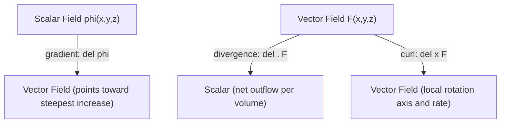

## Vector Calculus: Gradient, Divergence, and Curl

### Overview and the Del Operator

Vector calculus extends single-variable calculus to **scalar fields** $\phi(\mathbf{r})$ (a number at every point in space, e.g., temperature or potential) and **vector fields** $\mathbf{F}(\mathbf{r})$ (a vector at every point, e.g., electric field or fluid velocity). Three differential operators — gradient, divergence, and curl — are constructed from the **del (nabla) operator**:

$$\nabla = \hat{i}\frac{\partial}{\partial x} + \hat{j}\frac{\partial}{\partial y} + \hat{k}\frac{\partial}{\partial z}$$

Del behaves formally like a vector, and each of the three operators corresponds to a different way of "multiplying" it into a field: scalar multiplication onto a scalar field (gradient), dot product onto a vector field (divergence), and cross product onto a vector field (curl).

### Gradient

The **gradient** of a scalar field $\phi(x,y,z)$ produces a vector field:

$$\nabla\phi = \frac{\partial\phi}{\partial x}\hat{i} + \frac{\partial\phi}{\partial y}\hat{j} + \frac{\partial\phi}{\partial z}\hat{k}$$

**Physical and geometric meaning**: $\nabla\phi$ points in the direction of **steepest increase** of $\phi$, and its magnitude equals the rate of that increase per unit distance. The gradient is always perpendicular to surfaces of constant $\phi$ (equipotential or isothermal surfaces).

**Directional derivative** of $\phi$ along a unit vector $\hat{u}$:

$$D_{\hat u}\phi = \nabla\phi \cdot \hat{u}$$

**Key physics application** — force as the negative gradient of potential energy:

$$\mathbf{F} = -\nabla U$$

The negative sign reflects that force points toward decreasing potential energy — objects accelerate "downhill" on the energy landscape.

**Example**: for $U(x,y) = kx^2+ky^2$ (an isotropic harmonic potential), $\nabla U = 2kx\,\hat{i}+2ky\,\hat{j}$, so $\mathbf{F}=-2k(x\hat i+y\hat j) = -2k\mathbf{r}$ — a restoring force directed toward the origin, proportional to distance, as expected for an isotropic spring-like potential.

### Divergence

The **divergence** of a vector field $\mathbf{F} = F_x\hat i+F_y\hat j+F_z\hat k$ is the scalar:

$$\nabla \cdot \mathbf{F} = \frac{\partial F_x}{\partial x} + \frac{\partial F_y}{\partial y} + \frac{\partial F_z}{\partial z}$$

**Physical meaning**: divergence measures the net "outflow" of the field per unit volume at a point — how much the field spreads out from (source, $\nabla\cdot\mathbf{F}>0$) or converges into (sink, $\nabla\cdot\mathbf{F}<0$) that point. A field with $\nabla\cdot\mathbf{F}=0$ everywhere is called **divergence-free** or **solenoidal**.

**Key physics application** — Gauss's Law in differential form, relating electric field divergence to local charge density:

$$\nabla \cdot \mathbf{E} = \frac{\rho}{\epsilon_0}$$

and the statement that magnetic fields have no sources or sinks (no magnetic monopoles):

$$\nabla \cdot \mathbf{B} = 0$$

**Example**: for $\mathbf{F} = x\hat i + y\hat j + z\hat k$ (a radially outward field), $\nabla\cdot\mathbf{F} = 1+1+1=3$, a positive constant, consistent with the field emanating outward from the origin everywhere.

### Curl

The **curl** of a vector field produces another vector field, measuring local rotation:

$$\nabla \times \mathbf{F} = \begin{vmatrix} \hat i & \hat j & \hat k \\ \frac{\partial}{\partial x} & \frac{\partial}{\partial y} & \frac{\partial}{\partial z} \\ F_x & F_y & F_z \end{vmatrix} = \left(\frac{\partial F_z}{\partial y}-\frac{\partial F_y}{\partial z}\right)\hat i + \left(\frac{\partial F_x}{\partial z}-\frac{\partial F_z}{\partial x}\right)\hat j + \left(\frac{\partial F_y}{\partial x}-\frac{\partial F_x}{\partial y}\right)\hat k$$

**Physical meaning**: curl measures the tendency of the field to circulate or "swirl" around a point — its direction (right-hand rule) is the axis of rotation, and its magnitude is twice the local angular velocity of a hypothetical fluid element. A field with $\nabla\times\mathbf{F}=\mathbf{0}$ everywhere is called **curl-free** or **irrotational**.

**Key physics application** — Faraday's Law in differential form, and the static-field condition for a conservative electric field:

$$\nabla \times \mathbf{E} = -\frac{\partial \mathbf{B}}{\partial t}$$

For time-independent fields, $\nabla\times\mathbf{E}=\mathbf{0}$, which is precisely the condition guaranteeing that $\mathbf{E}$ can be written as $-\nabla V$ for some scalar potential $V$.

**Example**: for $\mathbf{F} = -y\hat i + x\hat j$ (a field circulating counterclockwise about the origin), $\nabla\times\mathbf{F} = \left(\frac{\partial x}{\partial x}-\frac{\partial(-y)}{\partial y}\right)\hat k = (1-(-1))\hat k = 2\hat k$, confirming nonzero rotation.

### Fundamental Vector Identities

Two identities recur throughout electromagnetism and are worth memorizing:

$$\nabla \times (\nabla\phi) = \mathbf{0} \qquad \text{(curl of any gradient is always zero)}$$

$$\nabla \cdot (\nabla \times \mathbf{F}) = 0 \qquad \text{(divergence of any curl is always zero)}$$

These identities underlie the existence of scalar potentials for irrotational fields and vector potentials for solenoidal fields (e.g., the magnetic vector potential $\mathbf{A}$, defined via $\mathbf{B}=\nabla\times\mathbf{A}$, is guaranteed consistent with $\nabla\cdot\mathbf{B}=0$ by the second identity).

### The Laplacian

The **Laplacian** operator, $\nabla^2 = \nabla\cdot\nabla$, applied to a scalar field:

$$\nabla^2\phi = \frac{\partial^2\phi}{\partial x^2}+\frac{\partial^2\phi}{\partial y^2}+\frac{\partial^2\phi}{\partial z^2}$$

appears in Laplace's/Poisson's equation, the heat equation, the wave equation, and the Schrödinger equation — making it arguably the single most recurring differential operator across all of physics.

### Line, Surface, and Volume Integral Theorems

Three integral theorems connect the differential vector operators to integral (global) statements, generalizing the Fundamental Theorem of Calculus:

**Gradient Theorem** (Fundamental Theorem for line integrals):

$$\int_C \nabla\phi \cdot d\mathbf{r} = \phi(\mathbf{r}_B) - \phi(\mathbf{r}_A)$$

meaning the line integral of a gradient depends only on the endpoints, not the path — the mathematical statement that conservative forces do path-independent work.

**Divergence Theorem (Gauss's Theorem)**, relating a volume integral of divergence to a flux integral over the enclosing surface:

$$\int_V (\nabla\cdot\mathbf{F})\,dV = \oint_S \mathbf{F}\cdot d\mathbf{A}$$

This is the mathematical machinery behind converting Gauss's Law between its integral form (flux through a closed surface) and differential form (local charge density).

**Stokes' Theorem**, relating a surface integral of curl to a line integral around the boundary:

$$\int_S (\nabla\times\mathbf{F})\cdot d\mathbf{A} = \oint_C \mathbf{F}\cdot d\mathbf{r}$$

This connects Ampère's Law's integral form (circulation of $\mathbf{B}$ around a loop) to its differential form (curl of $\mathbf{B}$ related to current density).

**Key Points**

- These three theorems are the reason Maxwell's equations exist in two equivalent forms (integral and differential) throughout electromagnetism — each pair is related by exactly one of the divergence or Stokes' theorems.

### Vector Operators in Curvilinear Coordinates

Because $\nabla$ is defined via Cartesian partial derivatives, applying gradient/divergence/curl in cylindrical or spherical coordinates requires modified formulas that account for the position-dependence of curvilinear basis vectors (as introduced in the coordinate systems topic). For example, the spherical Laplacian includes extra terms beyond simple second derivatives:

$$\nabla^2\phi = \frac{1}{r^2}\frac{\partial}{\partial r}\left(r^2\frac{\partial \phi}{\partial r}\right) + \frac{1}{r^2\sin\theta}\frac{\partial}{\partial\theta}\left(\sin\theta\frac{\partial\phi}{\partial\theta}\right) + \frac{1}{r^2\sin^2\theta}\frac{\partial^2\phi}{\partial\phi^2}$$

This form is essential for solving the hydrogen atom's Schrödinger equation and other central-potential problems. [Unverified: exact term arrangement should be cross-checked against the specific textbook's notation convention before use in derivations.]

**Common Errors and Misconceptions**

- Confusing divergence (a scalar output) with curl (a vector output) — they answer fundamentally different questions about a field
- Forgetting the negative sign in $\mathbf{F}=-\nabla U$, reversing the direction of the resulting force
- Applying Cartesian gradient/divergence/curl formulas directly in polar, cylindrical, or spherical coordinates without the correction terms required by non-constant basis vectors
- Assuming every vector field has a scalar potential; this holds only for irrotational ($\nabla\times\mathbf{F}=\mathbf{0}$) fields

**Related Topics**

- Coordinate Systems and Transformations
- Differentiation and Integration for Physics
- Electrostatics and Gauss's Law
- Magnetostatics and Ampère's Law
- Partial Differential Equations (Laplace's equation, wave equation)
- Maxwell's Equations (integral and differential forms)
- Fluid Dynamics (divergence and curl of velocity fields)