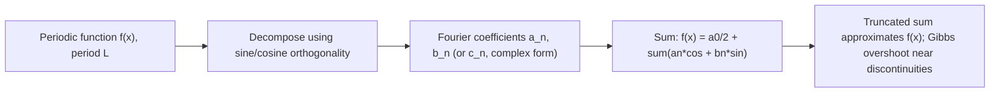

## Fourier Series and Transforms

### Central Idea

**Fourier analysis** rests on the principle that a broad class of functions — periodic or otherwise — can be represented as a superposition of sines and cosines (or, equivalently, complex exponentials) of different frequencies. This decomposition into frequency components underlies signal processing, solving PDEs by separation of variables, quantum mechanical momentum-position duality, and spectral analysis of any oscillatory physical system.

### Periodic Functions and Fourier Series

For a function $f(x)$ periodic with period $L$ (i.e., $f(x+L)=f(x)$), the **Fourier series** represents it as an infinite sum of harmonically related sinusoids:

$$f(x) = \frac{a_0}{2} + \sum_{n=1}^{\infty}\left[a_n\cos\left(\frac{2\pi nx}{L}\right) + b_n\sin\left(\frac{2\pi nx}{L}\right)\right]$$

The coefficients are found using the **orthogonality** of sine and cosine functions over one period:

$$a_n = \frac{2}{L}\int_0^L f(x)\cos\left(\frac{2\pi nx}{L}\right)dx, \qquad b_n = \frac{2}{L}\int_0^L f(x)\sin\left(\frac{2\pi nx}{L}\right)dx$$

$$a_0 = \frac{2}{L}\int_0^L f(x)\,dx \quad \text{(twice the average value of } f\text{)}$$

**Orthogonality relations** (the mathematical foundation for extracting each coefficient independently):

$$\int_0^L \sin\left(\frac{2\pi mx}{L}\right)\sin\left(\frac{2\pi nx}{L}\right)dx = \frac{L}{2}\delta_{mn}, \quad \int_0^L \sin\left(\frac{2\pi mx}{L}\right)\cos\left(\frac{2\pi nx}{L}\right)dx = 0$$

where $\delta_{mn}$ is the Kronecker delta (1 if $m=n$, 0 otherwise).

**Simplifications by symmetry**: an **even function** ($f(-x)=f(x)$) has only cosine terms ($b_n=0$); an **odd function** ($f(-x)=-f(x)$) has only sine terms ($a_n=0$) — recognizing symmetry before integrating substantially reduces computation.

### Complex Exponential Form

Using Euler's formula, the Fourier series is often written more compactly using complex exponentials:

$$f(x) = \sum_{n=-\infty}^{\infty} c_n\, e^{i2\pi nx/L}, \qquad c_n = \frac{1}{L}\int_0^L f(x)e^{-i2\pi nx/L}\,dx$$

This form is algebraically more convenient for differentiation and for connecting to the Fourier transform, since complex exponentials are eigenfunctions of the derivative operator ($d/dx\, e^{ikx} = ik\,e^{ikx}$).

### Example: Square Wave

**Example**

For an odd square wave of period $L=2\pi$, amplitude $A$ (equal to $+A$ for $0<x<\pi$ and $-A$ for $-\pi<x<0$), only sine terms survive, giving:

$$f(x) = \frac{4A}{\pi}\sum_{n=1,3,5,\ldots}^{\infty}\frac{1}{n}\sin(nx) = \frac{4A}{\pi}\left(\sin x + \frac{1}{3}\sin 3x + \frac{1}{5}\sin 5x + \cdots\right)$$

Only odd harmonics appear, with amplitude falling off as $1/n$ — a signature pattern of the square wave's sharp discontinuities. Truncating this sum at finite $n$ produces persistent overshoot near the discontinuity (the **Gibbs phenomenon**), which does not vanish as more terms are added, though the overshoot region narrows.

### Physical Applications of Fourier Series

- **Vibrating strings and normal modes**: an arbitrary initial string shape is decomposed into the string's normal modes (Fourier sine series), each evolving independently at its own frequency — directly connecting to the PDE separation-of-variables method.
- **Musical timbre**: the harmonic content (relative amplitudes $a_n, b_n$) of a periodic sound wave determines its timbre, distinguishing instruments playing the same fundamental pitch.
- **Signal analysis**: any periodic signal (electrical, acoustic) can be characterized by its **frequency spectrum**, the set of coefficients $|c_n|$ versus frequency.

### The Fourier Transform: Extension to Non-Periodic Functions

For a function that is **not periodic** (or has period extending to infinity), the discrete sum of the Fourier series generalizes to a continuous integral — the **Fourier transform**:

$$F(k) = \int_{-\infty}^{\infty} f(x)\,e^{-ikx}\,dx$$

with the **inverse Fourier transform** recovering the original function:

$$f(x) = \frac{1}{2\pi}\int_{-\infty}^{\infty} F(k)\,e^{ikx}\,dk$$

(Convention note: normalization factors and the sign of the exponent vary between physics and engineering texts — some place $1/2\pi$ symmetrically as $1/\sqrt{2\pi}$ on both transforms, or use frequency $\nu$ instead of angular frequency $k$/$\omega$. [Unverified: always confirm which convention a specific source or course uses before combining formulas.])

**Physical interpretation**: $F(k)$ describes the amplitude and phase of each continuous frequency component $k$ present in $f(x)$ — the continuous analog of the discrete Fourier coefficients $c_n$.

### Key Fourier Transform Properties

| Property | Time/Space Domain | Frequency Domain |
| --- | --- | --- |
| Linearity | $af(x)+bg(x)$ | $aF(k)+bG(k)$ |
| Differentiation | $f'(x)$ | $ikF(k)$ |
| Convolution | $(f*g)(x)$ | $F(k)G(k)$ |
| Scaling | $f(ax)$ | $\frac{1}{ |

The **differentiation property** ($f'(x) \leftrightarrow ikF(k)$) is the reason Fourier transforms convert differential equations into algebraic equations in frequency space — a powerful solution technique for linear PDEs and ODEs with constant coefficients.

### The Heisenberg Uncertainty Principle as a Fourier Property

**Key Points**

- A mathematical property of the Fourier transform — that a function sharply localized in $x$ has a Fourier transform spread broadly in $k$, and vice versa (formalized via the time-bandwidth product) — is the direct mathematical origin of the Heisenberg position-momentum uncertainty principle in quantum mechanics, since momentum-space and position-space wavefunctions are Fourier transform pairs of one another:

$$\Delta x\, \Delta p \geq \frac{\hbar}{2}$$

This is not a statement about measurement imprecision but a fundamental property of wave-like quantities related by a Fourier transform — a purely mathematical inequality applied to a physical pair of variables.

### Applications in Optics and Diffraction

**Example**

In wave optics, the far-field (Fraunhofer) diffraction pattern of an aperture is mathematically the Fourier transform of the aperture's transmission function. A single narrow slit (small spatial extent in $x$) produces a broad diffraction pattern (large spread in angle/spatial frequency $k$) — a direct physical manifestation of the same localization trade-off underlying the uncertainty principle.

### Discrete and Fast Fourier Transform (Computational Note)

For sampled (digital) data, the **Discrete Fourier Transform (DFT)** computes frequency content from a finite set of samples, and the **Fast Fourier Transform (FFT)** is the standard efficient algorithm ($O(N\log N)$ instead of $O(N^2)$) for computing it — used extensively in computational physics for spectral analysis of experimental or simulated time-series data. [Inference: depth of FFT/DFT coverage depends on whether the course includes a computational-physics laboratory component.]

**Common Errors and Misconceptions**

- Assuming a Fourier series representation converges to $f(x)$ exactly at a jump discontinuity; it converges instead to the average of the left- and right-hand limits there
- Mixing normalization conventions (angular frequency $\omega$ vs. ordinary frequency $\nu$, or differing $2\pi$ placement) when combining formulas from different sources
- Treating the Gibbs phenomenon overshoot as an error that vanishes with more terms — the overshoot magnitude (about 9% of the jump) persists; only its width narrows
- Forgetting that a purely real, even function has a purely real Fourier transform, while other symmetries produce different reality/parity constraints on $F(k)$

**Related Topics**

- Partial Differential Equations
- Complex Numbers and Functions
- Waves and Oscillations
- Introduction to Quantum Mechanics (uncertainty principle, momentum space)
- Wave Optics and Diffraction
- Signal Processing and Spectral Analysis
- Vector Calculus: Gradient, Divergence, and Curl