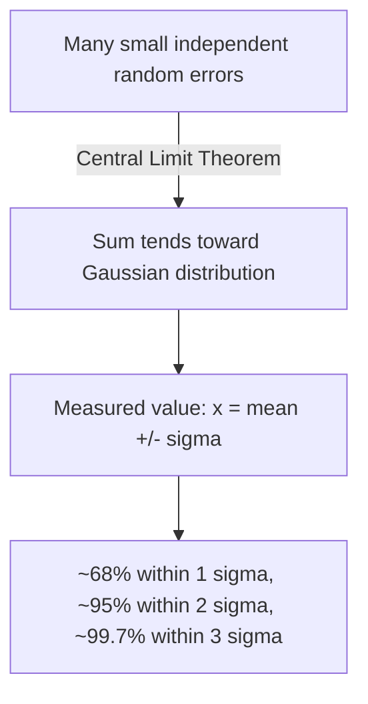

## Probability and Statistics for Physics

### Role in Physics

Probability and statistics enter physics in two distinct ways: as tools for **analyzing experimental data** (measurement uncertainty, error propagation, curve fitting) and as **fundamental theoretical content** in statistical mechanics and quantum mechanics, where physical predictions are inherently probabilistic rather than deterministic. Both roles rest on the same underlying mathematical framework.

### Basic Probability Concepts

The **probability** $P(A)$ of an event $A$ satisfies $0 \le P(A) \le 1$, with $P(A)=1$ for a certain event. For mutually exclusive events, probabilities add; for independent events, probabilities multiply:

$$P(A \text{ or } B) = P(A)+P(B) \quad \text{(mutually exclusive)}$$

$$P(A \text{ and } B) = P(A)P(B) \quad \text{(independent)}$$

**Conditional probability**, the probability of $A$ given that $B$ has occurred:

$$P(A|B) = \frac{P(A \text{ and } B)}{P(B)}$$

which rearranges to **Bayes' Theorem**:

$$P(A|B) = \frac{P(B|A)P(A)}{P(B)}$$

### Random Variables and Distributions

A **random variable** takes numerical values according to a probability rule. For a **discrete** random variable, a **probability mass function (PMF)** $P(x_i)$ gives the probability of each outcome, with $\sum_i P(x_i) = 1$. For a **continuous** random variable, a **probability density function (PDF)** $f(x)$ satisfies:

$$P(a \le x \le b) = \int_a^b f(x)\,dx, \qquad \int_{-\infty}^{\infty}f(x)\,dx = 1$$

**Mean (expectation value)** and **variance** of a continuous distribution:

$$\langle x \rangle = \int_{-\infty}^{\infty} x f(x)\,dx, \qquad \sigma^2 = \langle x^2\rangle - \langle x\rangle^2 = \int_{-\infty}^{\infty}(x-\langle x\rangle)^2f(x)\,dx$$

The **standard deviation** $\sigma = \sqrt{\sigma^2}$ quantifies the typical spread of the distribution about the mean, and is the standard measure of statistical uncertainty in a measured quantity.

### The Binomial Distribution

Describes the number of "successes" $k$ in $n$ independent trials, each with success probability $p$:

$$P(k) = \binom{n}{k}p^k(1-p)^{n-k}, \qquad \binom{n}{k} = \frac{n!}{k!(n-k)!}$$

with mean $\langle k\rangle = np$ and variance $\sigma^2 = np(1-p)$. Physical applications include radioactive decay counting over discrete trials and simple coin-flip-style two-state systems in introductory statistical mechanics.

### The Poisson Distribution

Describes the number of discrete, independent events occurring in a fixed interval, given a known average rate $\mu$:

$$P(k) = \frac{\mu^k e^{-\mu}}{k!}$$

with $\langle k \rangle = \mu$ and $\sigma^2 = \mu$ (mean equals variance — a distinguishing signature of Poisson statistics). This distribution is standard for describing **radioactive decay counting statistics**: the number of decays detected in a fixed time interval from a large sample of nuclei follows a Poisson distribution, so the statistical uncertainty on a count of $N$ decays is $\sqrt{N}$.

### The Gaussian (Normal) Distribution

The most important continuous distribution in physics, arising whenever many small independent random contributions sum together (formalized by the Central Limit Theorem, below):

$$f(x) = \frac{1}{\sigma\sqrt{2\pi}}\exp\left[-\frac{(x-\mu)^2}{2\sigma^2}\right]$$

where $\mu$ is the mean and $\sigma$ the standard deviation. The Gaussian is the standard model for **random measurement error**: repeated measurements of a fixed physical quantity, subject to many small independent sources of noise, tend to scatter according to this distribution.

**Key Points**

- Approximately 68% of a Gaussian distribution's values fall within $\pm 1\sigma$ of the mean, about 95% within $\pm 2\sigma$, and about 99.7% within $\pm 3\sigma$ — the basis for reporting measurement results as "value $\pm$ uncertainty" with an implied confidence level.

### The Central Limit Theorem

States that the sum (or average) of a large number of independent, identically distributed random variables tends toward a Gaussian distribution, regardless of the shape of the original distribution, as the number of variables grows large. This theorem is the theoretical justification for why measurement noise — the sum of many small, independent perturbations — is so commonly observed to be Gaussian in practice, even when individual error sources are not themselves Gaussian.

### Error Propagation

When a derived quantity $q$ is calculated from measured quantities $x, y, \ldots$ each with independent uncertainties $\sigma_x, \sigma_y, \ldots$, the propagated uncertainty in $q=f(x,y,\ldots)$ is:

$$\sigma_q = \sqrt{\left(\frac{\partial f}{\partial x}\right)^2\sigma_x^2 + \left(\frac{\partial f}{\partial y}\right)^2\sigma_y^2 + \cdots}$$

**Example** — for a sum/difference $q = x \pm y$: $\sigma_q = \sqrt{\sigma_x^2+\sigma_y^2}$

**Example** — for a product/quotient $q = xy$ or $q=x/y$: $\dfrac{\sigma_q}{|q|} = \sqrt{\left(\dfrac{\sigma_x}{x}\right)^2+\left(\dfrac{\sigma_y}{y}\right)^2}$ (relative/fractional uncertainties add in quadrature)

This formula assumes the errors in $x$ and $y$ are independent (uncorrelated); correlated errors require an additional covariance term not shown here.

### Least-Squares Fitting (Linear Regression)

Given a set of $(x_i, y_i)$ data points expected to follow $y=mx+b$, the **least-squares method** finds the line minimizing the sum of squared vertical deviations:

$$\chi^2 = \sum_i \frac{(y_i - mx_i - b)^2}{\sigma_i^2}$$

Minimizing $\chi^2$ with respect to $m$ and $b$ (setting partial derivatives to zero) yields closed-form expressions for the best-fit slope and intercept. The reduced chi-squared, $\chi^2_\nu = \chi^2/(\text{degrees of freedom})$, close to 1 indicates the model fits the data consistent with the stated uncertainties; a value much greater than 1 suggests underestimated uncertainties or a poor model, while a value much less than 1 suggests overestimated uncertainties.

### Statistical Mechanics: Probability as Physical Content

Beyond data analysis, probability distributions describe the fundamental microscopic behavior of many-particle systems:

**Maxwell-Boltzmann speed distribution**, describing the distribution of molecular speeds in an ideal gas at temperature $T$:

$$f(v) = 4\pi\left(\frac{m}{2\pi k_BT}\right)^{3/2}v^2\exp\left(-\frac{mv^2}{2k_BT}\right)$$

**Boltzmann factor**, giving the relative probability of a state with energy $E$ at temperature $T$:

$$P(E) \propto e^{-E/k_BT}$$

This factor underlies the derivation of essentially all equilibrium statistical mechanics distributions and connects directly to the exponential form recurring throughout thermal physics. [Inference: full derivation and partition-function formalism belong to a dedicated statistical mechanics or thermal physics chapter.]

### Quantum Mechanics: Probability as Fundamental

Unlike classical statistical mechanics (where probability reflects ignorance of exact microstates), quantum mechanics treats probability as fundamental: the **Born rule** states that $|\Psi(x,t)|^2\,dx$ gives the probability of finding a particle in $[x,x+dx]$, with no underlying "hidden" deterministic trajectory in the standard (Copenhagen) interpretation. This is a foundational conceptual distinction from classical statistics, where probability enters as a practical approximation to an underlying deterministic reality.

**Common Errors and Misconceptions**

- Reporting a measurement's uncertainty without specifying whether it represents $1\sigma$, $2\sigma$, or another confidence interval
- Adding absolute uncertainties directly (linearly) instead of in quadrature when propagating errors through sums/products of independent quantities
- Interpreting reduced chi-squared much less than 1 as an especially good fit, when it more often signals overestimated measurement uncertainties
- Confusing the Poisson distribution's characteristic property ($\sigma^2=\mu$) with the Gaussian's, where mean and variance are independent parameters

**Related Topics**

- Differentiation and Integration for Physics
- Thermodynamics and Statistical Mechanics
- Introduction to Quantum Mechanics (Born rule, wavefunctions)
- Experimental Methods and Measurement Uncertainty
- Kinetic Theory of Gases
- Data Analysis and Curve Fitting Techniques